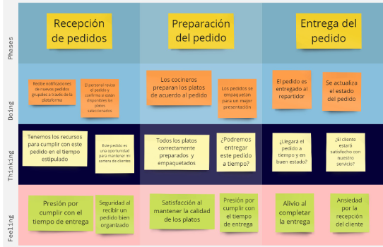
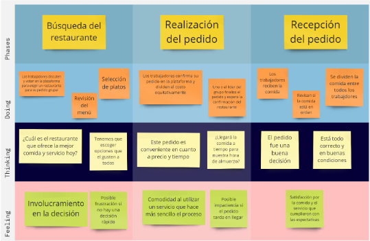
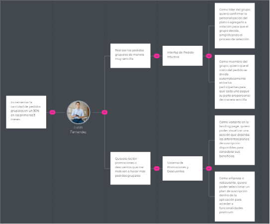
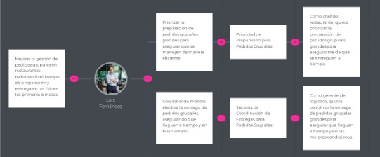

Universidad Peruana de Ciencias Aplicadas

Carrera: Ingeniería de Software

Ciclo: 2024-02

Curso: Desarrollo de Aplicaciones Open Source

Sección: WX51

Profesor: Alberto Wilmer Sanchez Seña

Informe del Trabajo Final - TB1

Startup: Verduritas

Producto: GastroGo

    <h3>Integrantes:</h3>
    <table align="center">
        <tr>
            <th style="text-align:center;">Member</th>
            <th style="text-align:center;">Code</th>
        </tr>
        <tr>
            <td>Abanto Vicente, Edery Renzo</td>
            <td>U201822832</td>
        </tr>
        <tr>
            <td>Cuevas Vera, Jose Angel</td>
            <td>U202214632</td>
        </tr>
        <tr>
            <td>Pedraza Maldonado, Joaquin Andree </td>
            <td>U202218514</td>
        </tr>
        <tr>
            <td>Barrutia Vaez, Ricardo Andree</td>
            <td>U201714765</td>
        </tr>
        <tr>
            <td>Espinoza Inoñan, Fabiola Ximena</td>
            <td>U202214784</td>
        </tr>
    </table>

**Agosto del 2024**

  
---  
# Registro de Versiones del Informe

<table>
        <thead>
            <tr>
                <th>Versión</th>
                <th>Fecha</th>
                <th>Autor</th>
                <th>Descripción de modificaciones</th>
            </tr>
        </thead>
        <tbody>
            <tr>
                <th>1.0</th>
                <td>08/30/2024</td>
                <td>Ricardo</td>
                <td>Se añadió el Startup profile.</td>
            </tr>
              <tr>                
                <th>1.1</th>
                <td>08/30/2024</td>
                <td>Fabiola</td>
                <td>Se añadió el Solution profile.</td>
             </tr>
              <tr>
                <th>1.2</th>
                <td>08/30/2024</td>
                <td>Ricardo</td>
                <td>Se agregó la sección de los competidores.</td>
            </tr> 
             <tr>
                <th>1.3</th>
                <td>08/30/2024</td>
                <td>Fabiola</td>
                <td>Se agregaron la seccion de entrevistas.</td>
            </tr> 
             <tr>
                <th>1.4</th>
                <td>08/30/2024</td>
                <td>Fabiola</td>
                <td>Se agregó el Needfinding.</td>
            </tr>
             <tr>
                <th>1.5</th>
                <td>08/30/2024</td>
                <td>Ricardo</td>
                <td>Se agregó el Ubiquitous Language.</td>
            </tr> 
             <tr>
                <th>1.6</th>
                <td>Fecha</td>
                <td>José</td>
                <td>Se agregó el To-Be Scenario Mapping.</td>
            </tr>
             <tr>
                <th>1.7</th>
                <td>Fecha</td>
                <td>José</td>
                <td>Se agregó las User Stories.</td>
            </tr>
             <tr>
                <th>1.8</th>
                <td>Fecha</td>
                <td>José</td>
                <td>Se agregó el Impact Mapping.</td>
            </tr>
             <tr>
                <th>1.9</th>
                <td>Fecha</td>
                <td>José</td>
                <td>Se agregó el Product Backlog.</td>
            </tr>
            <tr>
                <th>1.10</th>
                <td>Fecha</td>
                <td>Nombre</td>
                <td>Se agregó el Style Guidelines.</td>
            </tr>
            <tr>
                <th>1.11</th>
                <td>Fecha</td>
                <td>Nombre</td>
                <td>Se agregó la Information Architecture.</td>
            </tr>
            <tr>
                <th>1.12</th>
                <td>Fecha</td>
                <td>Nombre</td>
                <td>Se agregó la Landing Page UI Design.</td>
            </tr>
            <tr>
                <th>1.13</th>
                <td>Fecha</td>
                <td>Nombre</td>
                <td>Se agregó la Web Applications UX/UI Design.</td>
            </tr>
            <tr>
                <th>1.14</th>
                <td>Fecha</td>
                <td>Nombre</td>
                <td>Se agregó la Web Applications Prototyping.</td>
            </tr>
            <tr>
                <th>1.15</th>
                <td>Fecha</td>
                <td>Nombre</td>
                <td>Se agregó Domain-Driven Software Architecture.</td>
            </tr>
            <tr>
                <th>1.16</th>
                <td>Fecha</td>
                <td>Nombre</td>
                <td>Se agregó la Software Object-Oriented Design.</td>
            </tr>
            <tr>
                <th>1.17</th>
                <td>Fecha</td>
                <td>Nombre</td>
                <td>Se agregó la Database Design.</td>
            </tr>
             <tr>
                <th>1.18</th>
                <td>Fecha</td>
                <td>Nombre</td>
                <td>Se agregó el Software Configuration Management.</td>
            </tr>
             <tr>
                <th>1.19</th>
                <td>Fecha</td>
                <td>Nombre</td>
                <td>Se agregó el Landing Page, Services & Applications Implementation.</td>
            </tr>
                    </tbody>
</table>

  
---  
# Project Report Collaboration Insights

  
---  
# Student Outcome
El curso contribuye al cumplimiento del Student Outcome ABET: **ABET – EAC - Student Outcome 3**   Criterio: *Capacidad de comunicarse efectivamente con un rango de audiencias.*

En el siguiente cuadro se describe las acciones realizadas y enunciados de conclusiones por parte del grupo, que permiten sustentar el haber alcanzado el logro del ABET – EAC - Student Outcome 3.

| Criterio específico | Acciones realizadas | Conclusiones |  
| - | - | - |  
| Comunica oralmente sus ideas y/o resultados con objetividad a público de diferentes especialidades y niveles jerarquicos, en el marco del desarrollo de un proyecto en ingeniería. | **Apellido Apellido Nombre Nombre**   ***TB1:*** Morbi vel tortor id eros dictum venenatis id ut dui.Mauris quis tellus sed nunc hendrerit vehicula ac id mauris.   ***TP:*** Morbi vel tortor id eros dictum venenatis id ut dui.Mauris quis tellus sed nunc hendrerit vehicula ac id mauris.   ***TB2:*** Morbi vel tortor id eros dictum venenatis id ut dui.Mauris quis tellus sed nunc hendrerit vehicula ac id mauris.   ***TF:*** Morbi vel tortor id eros dictum venenatis id ut dui.Mauris quis tellus sed nunc hendrerit vehicula ac id mauris.    **Apellido Apellido Nombre Nombre**   ***TB1:*** Morbi vel tortor id eros dictum venenatis id ut dui.Mauris quis tellus sed nunc hendrerit vehicula ac id mauris.   ***TP:*** Morbi vel tortor id eros dictum venenatis id ut dui.Mauris quis tellus sed nunc hendrerit vehicula ac id mauris.   ***TB2:*** Morbi vel tortor id eros dictum venenatis id ut dui.Mauris quis tellus sed nunc hendrerit vehicula ac id mauris.   ***TF:*** Morbi vel tortor id eros dictum venenatis id ut dui.Mauris quis tellus sed nunc hendrerit vehicula ac id mauris.    | ***TB1:*** Fusce cursus dolor et nulla suscipit, sit amet ullamcorper nibh vestibulum.    ***TP:*** Fusce cursus dolor et nulla suscipit, sit amet ullamcorper nibh vestibulum.    ***TB2:*** Fusce cursus dolor et nulla suscipit, sit amet ullamcorper nibh vestibulum.    ***TF:*** Fusce cursus dolor et nulla suscipit, sit amet ullamcorper nibh vestibulum. | | Comunica en forma escrita ideas y/o resultados con objetividad a público de diferentes especialidades y niveles jerarquicos, en el marco del desarrollo de un proyecto en ingeniería. | ***Apellido Apellido Nombre Nombre***   ***TB1:*** Cras sed diam suscipit, malesuada ex rutrum, fringilla orci. Vestibulum in nunc quis elit suscipit sollicitudin.   ***TP:*** Cras sed diam suscipit, malesuada ex rutrum, fringilla orci. Vestibulum in nunc quis elit suscipit sollicitudin.   ***TB2:*** Cras sed diam suscipit, malesuada ex rutrum, fringilla orci. Vestibulum in nunc quis elit suscipit sollicitudin.   ***TF:*** Cras sed diam suscipit, malesuada ex rutrum, fringilla orci. Vestibulum in nunc quis elit suscipit sollicitudin.    ***Apellido Apellido Nombre Nombre***   ***TB1:*** Cras sed diam suscipit, malesuada ex rutrum, fringilla orci. Vestibulum in nunc quis elit suscipit sollicitudin.   ***TP:*** Cras sed diam suscipit, malesuada ex rutrum, fringilla orci. Vestibulum in nunc quis elit suscipit sollicitudin.   ***TB2:*** Cras sed diam suscipit, malesuada ex rutrum, fringilla orci. Vestibulum in nunc quis elit suscipit sollicitudin.   ***TF:*** Cras sed diam suscipit, malesuada ex rutrum, fringilla orci. Vestibulum in nunc quis elit suscipit sollicitudin. | ***TB1:*** FEtiam imperdiet quam condimentum velit tempor porttitor.    ***TP:*** FEtiam imperdiet quam condimentum velit tempor porttitor.    ***TB2:*** FEtiam imperdiet quam condimentum velit tempor porttitor.    ***TF:*** FEtiam imperdiet quam condimentum velit tempor porttitor. |  
  
---  
# Contenido
## Tabla de contenidos

### [Capítulo I: Introducción]()
- [1.1. Startup Profile]()
    - [1.1.1 Descripción de la Startup]()
    - [1.1.2 Perfiles de integrantes del equipo]()
- [1.2 Solution Profile]()
    - [1.2.1 Antecedentes y problemática]()
    - [1.2.2 Lean UX Process]()
        - [1.2.2.1. Lean UX Problem Statements]()
        - [1.2.2.2. Lean UX Assumptions]()
        - [1.2.2.3. Lean UX Hypothesis Statements]()
        - [1.2.2.4. Lean UX Canvas]()
- [1.3. Segmentos objetivo]()

### [Capítulo II: Requirements Elicitation & Analysis]()
- [2.1. Competidores]()
    - [2.1.1. Análisis competitivo]()
    - [2.1.2. Estrategias y tácticas frente a competidores]()
- [2.2. Entrevistas]()
    - [2.2.1. Diseño de entrevistas]()
    - [2.2.2. Registro de entrevistas]()
    - [2.2.3. Análisis de entrevistas]()
- [2.3. Needfinding]()
    - [2.3.1. User Personas]()
    - [2.3.2. User Task Matrix]()
    - [2.3.3. User Journey Mapping]()
    - [2.3.4. Empathy Mapping]()
    - [2.3.5. As-is Scenario Mapping]()
- [2.4. Ubiquitous Language]()

### [Capítulo III: Requirements Specification]()
- [3.1. To-Be Scenario Mapping]()
- [3.2. User Stories]()
- [3.3. Impact Mapping]()
- [3.4. Product Backlog]()

### [Capítulo IV: Product Design]()
- [4.1. Style Guidelines]()
    - [4.1.1. General Style Guidelines]()
    - [4.1.2. Web Style Guidelines]()
- [4.2. Information Architecture]()
    - [4.2.1. Organization Systems]()
    - [4.2.2. Labeling Systems]()
    - [4.2.3. SEO Tags and Meta Tags]()
    - [4.2.4. Searching Systems]()
    - [4.2.5. Navigation Systems]()
- [4.3. Landing Page UI Design]()
    - [4.3.1. Landing Page Wireframe]()
    - [4.3.2. Landing Page Mock-up]()
- [4.4. Web Applications UX/UI Design]()
    - [4.4.1. Web Applications Wireframes]()
    - [4.4.2. Web Applications Wireflow Diagrams]()
    - [4.4.3. Web Applications Mock-ups]()
    - [4.4.4. Web Applications User Flow Diagrams]()
- [4.5. Web Applications Prototyping]()
- [4.6. Domain-Driven Software Architecture]()
    - [4.6.1. Software Architecture Context Diagram]()
    - [4.6.2. Software Architecture Container Diagrams]()
    - [4.6.3. Software Architecture Components Diagrams]()
- [4.7. Software Object-Oriented Design]()
    - [4.7.1. Class Diagrams]()
    - [4.7.2. Class Dictionary]()
- [4.8. Database Design]()
    - [4.8.1. Database Diagram]()

### [Capítulo V: Product Implementation, Validation & Deployment]()
- [5.1. Software Configuration Management]()
    - [5.1.1. Software Development Environment Configuration]()
    - [5.1.2. Source Code Management]()
    - [5.1.3. Source Code Style Guide & Conventions]()
    - [5.1.4. Software Deployment Configuration]()
- [5.2. Landing Page, Services & Applications Implementation]()
    - [5.2.1. Sprint 1]()
        - [5.2.1.1. Sprint Planning 1]()
        - [5.2.1.2. Sprint Backlog 1]()
        - [5.2.1.3. Development Evidence for Sprint Review]()
        - [5.2.1.4. Testing Suite Evidence for Sprint Review]()
        - [5.2.1.5. Execution Evidence for Sprint Review]()
        - [5.2.1.6. Services Documentation Evidence for Sprint Review]()
        - [5.2.1.7. Software Deployment Evidence for Sprint Review]()
        - [5.2.1.8. Team Collaboration Insights during Sprint]()
    - [5.2.2. Sprint 2]()
        - [5.2.2.1. Sprint Planning 2]()
        - [5.2.2.2. Sprint Backlog 2]()
        - [5.2.2.3. Development Evidence for Sprint Review]()
        - [5.2.2.4. Testing Suite Evidence for Sprint Review]()
        - [5.2.2.5. Execution Evidence for Sprint Review]()
        - [5.2.2.6. Services Documentation Evidence for Sprint Review]()
        - [5.2.2.7. Software Deployment Evidence for Sprint Review]()
        - [5.2.2.8. Team Collaboration Insights during Sprint]()
    - [5.2.3. Sprint 3]()
        - [5.2.3.1. Sprint Planning 3]()
        - [5.2.3.2. Sprint Backlog 3]()
        - [5.2.3.3. Development Evidence for Sprint Review]()
        - [5.2.3.4. Testing Suite Evidence for Sprint Review]()
        - [5.2.3.5. Execution Evidence for Sprint Review]()
        - [5.2.3.6. Services Documentation Evidence for Sprint Review]()
        - [5.2.3.7. Software Deployment Evidence for Sprint Review]()
        - [5.2.3.8. Team Collaboration Insights during Sprint]()
    - [5.2.4. Sprint 4]()
        - [5.2.4.1. Sprint Planning 4]()
        - [5.2.4.2. Sprint Backlog 4]()
        - [5.2.4.3. Development Evidence for Sprint Review]()
        - [5.2.4.4. Testing Suite Evidence for Sprint Review]()
        - [5.2.4.5. Execution Evidence for Sprint Review]()
        - [5.2.4.6. Services Documentation Evidence for Sprint Review]()
        - [5.2.4.7. Software Deployment Evidence for Sprint Review]()
        - [5.2.4.8. Team Collaboration Insights during Sprint]()
- [5.3. Validation Interviews]()
    - [5.3.1. Diseño de Entrevistas]()
    - [5.3.2. Registro de Entrevistas]()
    - [5.3.3. Evaluaciones según heurísticas]()
- [5.4. Video About-the-Product]()

---  
# Capítulo I: Introducción
## 1.1. Startup Profile
### 1.1.1 Descripción de la Startup
### 1.1.2 Perfiles de integrantes del equipo
## 1.2 Solution Profile
### 1.2.1 Antecedentes y problemática
### 1.2.2 Lean UX Process
#### 1.2.2.1. Lean UX Problem Statements
#### 1.2.2.2. Lean UX Assumptions
#### 1.2.2.3. Lean UX Hypothesis Statements
#### 1.2.2.4. Lean UX Canvas
## 1.3. Segmentos objetivo
# Capítulo II: Requirements Elicitation & Analysis
## 2.1 Competidores
## 2.2. Entrevistas
### 2.2.1. Diseño de entrevistas
### 2.2.2. Registro de entrevistas
### 2.2.3. Análisis de entrevistas
## 2.3. Needfinding
### 2.3.1. User Personas
### 2.3.2. User Task Matrix
### 2.3.3. User Journey Mapping
### 2.3.4. Empathy Mapping
### 2.3.5. As-is Scenario Mapping
## 2.4. Ubiquitous Language
# Capítulo III: Requirements Specification
## 3.1. To-Be Scenario Mapping
## 3.1 To-Be Scenario Mapping

Segmento Objetivo: Restaurantes en Lima Metropolitana que gestionan pedidos grupales con frecuencia.

Segmento Objetivo: Grupos de trabajadores en oficinas que realizan pedidos de almuerzo en conjunto.

## 3.2. User Stories

### Epic 1: Landing Page

| **Epic 1: Landing Page**                                                                                              |
|------------------------------------------------------------------------------------------------------------------------|
| **Cómo** visitante **Quiero** saber información de la aplicación web **Para** ver si me interesa sus funcionalidades |

### Historias de Usuario para Epic 1

| Epic / Story ID | Título                     | Descripción                                                                                     | Criterios de aceptación                                                                                                                               | Relacionado con (Epic ID) |
|-----------------|----------------------------|-------------------------------------------------------------------------------------------------|--------------------------------------------------------------------------------------------------------------------------------------------------------|---------------------------|
| E1 - US001      | Barra de navegación        | **Como** visitante  **Quiero** ver una barra de navegación en la parte superior de la página  **Para** poder acceder fácilmente a las secciones principales del sitio. | **Escenario 1: Visualización de la Barra de Navegación**  **Dado** que el visitante accede a la landing page,  **Cuando** visualiza la parte superior de la página,  **Entonces** debe ver una barra de navegación con enlaces a las secciones: Inicio, Funcionalidades, Cómo Funciona, y Contacto.   **Escenario 2: Redirección de Enlaces**  **Dado** que el visitante hace clic en un enlace de la barra de navegación,  **Cuando** el navegador carga la sección correspondiente,  **Entonces** el visitante debe ser redirigido a la sección correcta sin necesidad de desplazarse manualmente. | 1                         |
| E1 - US002      | Sección de Introducción    | **Como** visitante  **Quiero** leer una breve introducción sobre "Gastro Go"  **Para** entender qué ofrece la aplicación. | **Escenario 1: Contenido de Introducción**  **Dado** que el visitante accede al landing page,  **Cuando** se desplaza hacia la sección Introducción,  **Entonces** debe encontrar un resumen claro y conciso de lo que ofrece “Gastro Go”, incluyendo sus principales características y beneficios.   **Escenario 2: Claridad del Resumen**  **Dado** que el visitante está en la sección de Introducción,  **Cuando** lee el contenido,  **Entonces** debe poder entender de manera rápida y clara los objetivos y ventajas de la aplicación. | 1                         |
| E1 - US003      | Sección de Funcionalidades | **Como** visitante  **Quiero** ver una lista de funcionalidades destacadas de la aplicación  **Para** evaluar si satisface mis necesidades. | **Escenario 1: Lista de Funcionalidades**  **Dado** que el visitante accede a la landing page,  **Cuando** se desplaza a la sección de Funcionalidades,  **Entonces** debe encontrar una lista de características destacadas de la aplicación con descripciones breves de cada una.   **Escenario 2: Comprensión de Funcionalidades**  **Dado** que el visitante está en la sección de Funcionalidades,  **Cuando** lee las descripciones,  **Entonces** debe poder identificar claramente cómo cada funcionalidad puede ser útil para él o su grupo. | 1                         |
| E1 - US004      | Sección de Cómo Funciona   | **Como** visitante  **Quiero** comprender el proceso de uso de la aplicación “Gastro Go”  **Para** saber cómo funciona en la práctica. | **Escenario 1: Proceso de Uso**  **Dado** que el visitante accede al landing page,  **Cuando** se desplaza a la sección de “Cómo Funciona”,  **Entonces** encontrará un paso a paso del proceso de uso de la aplicación, incluyendo diagramas o ejemplos si es necesario.   **Escenario 2: Claridad del Proceso**  **Dado** que el visitante accede al landing page,  **Cuando** se desplaza a la sección de “Cómo Funciona”,  **Cuando** lee el contenido,  **Entonces** debe poder entender cómo iniciar y utilizar la aplicación sin ambigüedades. | 1                         |
| E1 - US005      | Sección de Testimonios     | **Como** visitante  **Quiero** leer testimonios de usuarios actuales  **Para** conocer la experiencia de otras personas con la aplicación. | **Escenario 1: Visualización de Testimonios**  **Dado** que el visitante accede a la landing page,  **Cuando** se desplaza a la sección de Testimonios,  **Entonces** debe encontrar comentarios y valoraciones de usuarios que han utilizado la aplicación, con sus nombres y fotos si están disponibles.   **Escenario 2: Variedad de Opiniones**  **Dado** que el visitante está en la sección de Testimonios,  **Cuando** lee los comentarios,  **Entonces** debe poder ver una variedad de opiniones sobre la aplicación, mostrando diferentes experiencias de usuarios. | 1                         |
| E1 - US006      | Sección de Contacto        | **Como** visitante  **Quiero** encontrar un formulario de contacto  **Para** poder enviar consultas o solicitar más información sobre la aplicación. | **Escenario 1: Formulario de Contacto**  **Dado** que el visitante accede a la landing page,  **Cuando** se desplaza a la sección de Contacto,  **Entonces** debe encontrar un formulario de contacto con campos para nombre, correo electrónico, y mensaje.   **Escenario 2: Confirmación de Envío**  **Dado** que el visitante completa el formulario de contacto,  **Cuando** hace clic en el botón de enviar,  **Entonces** debe recibir un mensaje de confirmación y la consulta debe ser enviada al equipo de soporte de "Gastro Go". | 1                         |
| E1 - US007      | Sección de footer          | **Como** visitante  **Quiero** ver un footer en la página  **Para** poder acceder rápidamente a enlaces importantes, redes sociales, y suscribirme al boletín. | **Escenario 1: Visualización del footer**  **Dado** que el visitante está navegando por la página,  **Cuando** llega al final de la página,  **Entonces** debe ver una sección de footer que incluya enlaces a las redes sociales, contenido relevante del landing page, y una opción de suscripción al boletín.   **Escenario 2: Suscripción al boletín**  **Dado** que el usuario quiere suscribirse al boletín,  **Cuando** ingrese su dirección de correo electrónico y haga clic en el botón de suscripción,  **Entonces** el sistema debe enviar y almacenar el email. | 1                         |
| E1 - US008      | Cambio de idioma           | **Como** visitante  **Quiero** poder cambiar el idioma de la aplicación  **Para** visualizar el contenido en mi idioma preferido. | **Escenario 1: Cambio de idioma en la misma página**  **Dado** que el visitante está navegando en la página,  **Cuando** seleccione una opción de idioma,  **Entonces** el contenido de la página debe cambiar al idioma seleccionado.   **Escenario 2: Persistencia del idioma seleccionado**  **Dado** que el visitante cambia el idioma,  **Cuando** navegue a otras secciones de la página,  **Entonces** el idioma seleccionado debe mantenerse activo en todas las páginas sin necesidad de volver a configurarlo. | 1                         |

### Epic 2: Gestión de cuenta
| **Epic 2: Gestión de cuenta**                                                                                              |
|----------------------------------------------------------------------------------------------------------------------------|
| **Cómo** usuario **Quiero** poder acceder a mi cuenta de manera segura y personalizar mis datos de perfil **Para** hacer uso de sus funcionalidades |

### Historias de Usuario para Epic 2
| **ID**      | **Título**                        | **Historia de Usuario**                                                                                                         | **Escenarios de Prueba**                                                                                                                                                                        | **Prioridad** |
|-------------|----------------------------------|-------------------------------------------------------------------------------------------------------------------------------|------------------------------------------------------------------------------------------------------------------------------------------------------------------------------------------------|---------------|
| E2 - US009  | Registro de usuario               | **Como** nuevo usuario **Quiero** poder registrarme en la plataforma proporcionando mi información personal básica **Para** poder acceder a sus funcionalidades. | **Escenario 1: Validación de Campos** **Dado** que un usuario completa el formulario de registro, **Cuando** proporciona todos los campos obligatorios correctamente, **Entonces** el sistema acepta el registro.  **Escenario 2: Confirmación de Registro** **Dado** que un usuario se registra con éxito, **Cuando** finaliza el proceso, **Entonces** el sistema envía un correo electrónico de confirmación.  **Escenario 3: Registro con Email Existente** **Dado** que un usuario intenta registrarse, **Cuando** utiliza un correo electrónico ya registrado, **Entonces** el sistema muestra un mensaje indicando que la dirección de correo ya está en uso. | 2             |
| E2 - US010  | Inicio de sesión                  | **Como** usuario registrado **Quiero** iniciar sesión utilizando mi dirección de correo electrónico y contraseña **Para** acceder a mi cuenta. | **Escenario 1: Acceso a la Cuenta** **Dado** que un usuario proporciona credenciales válidas, **Cuando** inicia sesión, **Entonces** el sistema permite el acceso a la cuenta.  **Escenario 2: Autenticación Fallida** **Dado** que un usuario proporciona credenciales incorrectas, **Cuando** intenta iniciar sesión, **Entonces** el sistema muestra un mensaje de error.  **Escenario 3: Recordatorio de Contraseña** **Dado** que un usuario intenta iniciar sesión, **Cuando** no recuerda su contraseña, **Entonces** el sistema ofrece una opción para recuperarla. | 2             |
| E2 - US011  | Recuperación de contraseña        | **Como** usuario **Quiero** recuperar mi contraseña en caso de olvidarla **Para** poder restablecer el acceso a mi cuenta. | **Escenario 1: Solicitud de Recuperación** **Dado** que un usuario solicita recuperar su contraseña, **Cuando** proporciona su dirección de correo electrónico, **Entonces** el sistema envía un enlace para restablecer la contraseña.  **Escenario 2: Restablecimiento de Contraseña** **Dado** que un usuario accede al enlace de recuperación, **Cuando** ingresa y confirma la nueva contraseña, **Entonces** el sistema actualiza la contraseña y permite el acceso.  **Escenario 3: Enlace Expirado** **Dado** que un usuario accede al enlace de recuperación, **Cuando** el enlace ha expirado, **Entonces** el sistema muestra un mensaje indicando que la solicitud debe repetirse. | 2             |
| E2 - US012  | Cierre de sesión                  | **Como** usuario **Quiero** poder cerrar sesión en la aplicación **Para** asegurar que mi cuenta permanezca protegida cuando no esté en uso. | **Escenario 1: Confirmación de Cierre de Sesión** **Dado** que un usuario está autenticado, **Cuando** selecciona la opción de cerrar sesión, **Entonces** el sistema lo desconecta y lo redirige a la página de inicio de sesión. | 2             |
| E2 - US013  | Edición de Cuenta                 | **Como** usuario **Quiero** poder editar mis datos personales y de contacto en mi perfil **Para** mantener mi información actualizada. | **Escenario 1: Actualización de Información** **Dado** que un usuario desea actualizar su perfil, **Cuando** edita su información y guarda los cambios, **Entonces** el sistema refleja las actualizaciones en el perfil.  **Escenario 2: Validación de Datos** **Dado** que un usuario actualiza su perfil, **Cuando** los nuevos datos no cumplen con los requisitos, **Entonces** el sistema muestra mensajes de error específicos.  **Escenario 3: Confirmación de Cambios** **Dado** que un usuario guarda los cambios en su perfil, **Cuando** los datos se actualizan con éxito, **Entonces** el sistema muestra un mensaje de confirmación. | 2             |
| E2 - US014  | Guardar Preferencias de Grupo     | **Como** restaurante **Quiero** implementar un sistema que permita a los usuarios guardar las preferencias de grupo **Para** futuras órdenes, para hacer el proceso de pedido más rápido. | **Escenario 1: Opción para Guardar Preferencias** **Dado** que un grupo ha realizado un pedido con preferencias específicas, **Cuando** el grupo finaliza el pedido, **Entonces** el sistema debe ofrecer la opción de guardar esas preferencias para futuros pedidos.  **Escenario 2: Aplicar Preferencias Guardadas** **Dado** que un usuario accede a la sección de pedidos futuros, **Cuando** el usuario elige usar preferencias guardadas, **Entonces** el sistema debe mostrar las preferencias guardadas previamente para que puedan ser aplicadas al nuevo pedido. | 2             |
| E2 - US015  | Notificación de confirmación de pedidos grupales | **Como** restaurante **Quiero** que cada miembro del grupo reciba una notificación de confirmación **Para** que aprecien los detalles del pedido cuando el pedido se confirme. | **Escenario 1: Notificación de Confirmación** **Dado** que un grupo ha realizado un pedido, **Cuando** se confirme el pedido, **Entonces** cada miembro del grupo debe recibir una notificación de confirmación con los detalles del pedido. | 2             |
| E2 - US016  | Sistema de notificaciones y Recordatorios | **Como** restaurante **Quiero** que cada miembro del grupo reciba recordatorios y notificaciones de entrega **Para** asegurarse de que estén al tanto de sus pedidos. | **Escenario 1: Recordatorio de Entrega** **Dado** que se acerca la hora de entrega del pedido, **Cuando** falten 30 minutos para la entrega, **Entonces** cada miembro del grupo debe recibir un recordatorio con la información de entrega actualizada.  **Escenario 2: Notificación Final de Entrega** **Dado** que el pedido está en camino, **Cuando** el pedido esté a punto de llegar, **Entonces** cada miembro del grupo debe recibir una notificación final con la hora estimada de llegada. | 2             |
| E2 - US017  | Encuestas Post-Compra             | **Como** restaurante **Quiero** implementar un sistema de encuestas post-compra que permita a los usuarios compartir su experiencia y recibir recomendaciones para mejorar futuras órdenes **Para** mejorar futuras órdenes. | **Escenario 1: Envío de Encuesta Post-Compra** **Dado** que un pedido ha sido entregado, **Cuando** el pedido se marca como completado, **Entonces** el sistema debe enviar una encuesta al usuario solicitando sus comentarios o valoraciones sobre el pedido.  **Escenario 2: Generación de Informe de Feedback** **Dado** que el usuario ha proporcionado una calificación baja, **Cuando** se envíe la encuesta, **Entonces** el sistema debe generar una notificación al restaurante con el feedback para tomar medidas correctivas. | 2             |

### Epic 3: Selección de Restaurante
| **Epic 3: Selección de Restaurante**                                                                                              |
|----------------------------------------------------------------------------------------------------------------------------|
| **Cómo** grupo de trabajadores **Queremos** elegir fácilmente un restaurante **Para** realizar pedidos grupales de almuerzo. |

### Historias de Usuario para Epic 3
| **ID**      | **Título**                    | **Historia de Usuario**                                                                                                          | **Escenarios de Prueba**                                                                                                                                                                  | **Prioridad** |
|-------------|------------------------------|-------------------------------------------------------------------------------------------------------------------------------|------------------------------------------------------------------------------------------------------------------------------------------------------------------------------------------|---------------|
| E3 - US018  | Búsqueda de Restaurantes     | **Como** usuario **Quiero** poder buscar restaurantes por nombre, categoría o ubicación **Para** encontrar opciones adecuadas para nuestro grupo. | **Escenario 1: Búsqueda por Nombre** **Dado** un usuario en la barra de búsqueda, **Cuando** ingresa el nombre del restaurante, **Entonces** se muestran los resultados relevantes.  **Escenario 2: Búsqueda por Categoría** **Dado** un usuario que selecciona una categoría, **Cuando** realiza la búsqueda, **Entonces** se muestran restaurantes que pertenecen a esa categoría.  **Escenario 3: Búsqueda por Ubicación** **Dado** un usuario que ingresa una ubicación, **Cuando** realiza la búsqueda, **Entonces** se muestran restaurantes cercanos a esa ubicación. | 3             |
| E3 - US019  | Restaurantes Recomendados    | **Como** usuario **Quiero** ver una lista de restaurantes recomendados basados en popularidad y satisfacción del cliente **Para** facilitar la selección. | **Escenario 1: Visualización de Recomendado** **Dado** un usuario en la pantalla de inicio, **Cuando** la página carga, **Entonces** se muestra una lista de restaurantes recomendados.  **Escenario 2: Restaurantes Más Buscados** **Dado** un usuario en la pantalla de inicio, **Cuando** la página carga, **Entonces** se muestra una lista de los restaurantes más buscados.  **Escenario 3: Personalización de Recomendaciones** **Dado** un usuario con historial de pedidos, **Cuando** ingresa a la página de inicio, **Entonces** se muestran recomendaciones personalizadas basadas en pedidos anteriores. | 3             |
| E3 - US020  | Información del Restaurante   | **Como** usuario **Quiero** ver información detallada sobre el restaurante seleccionado, incluyendo horario, dirección, y menú **Para** tomar una decisión informada. | **Escenario 1: Visualización de Datos Generales** **Dado** un usuario que selecciona un restaurante, **Cuando** carga la página del restaurante, **Entonces** se muestra el nombre, dirección, horario de atención y calificación del restaurante.  **Escenario 2: Visualización del Menú** **Dado** un usuario que selecciona un restaurante, **Cuando** carga la página del restaurante, **Entonces** se muestra el menú disponible con precios y descripciones. | 3             |
| E3 - US021  | Selección de Platos           | **Como** usuario **Quiero** poder seleccionar platos del menú del restaurante **Para** hacer un pedido grupal. | **Escenario 1: Selección Individual** **Dado** un usuario que visualiza el menú, **Cuando** selecciona un plato, **Entonces** se añade el plato a su pedido. | 3             |

### Epic 4: Personalización del Menú
| **Epic 4: Personalización del Menú**                                                                                              |
|----------------------------------------------------------------------------------------------------------------------------|
| **Cómo** líder del grupo **Quiero** personalizar los pedidos dentro del grupo **Para** tener opciones que se adapten a nuestras preferencias. |

### Historias de Usuario para Epic 4
| **ID**      | **Título**                          | **Historia de Usuario**                                                                                                         | **Escenarios de Prueba**                                                                                                                                                                | **Prioridad** |
|-------------|------------------------------------|------------------------------------------------------------------------------------------------------------------------------|----------------------------------------------------------------------------------------------------------------------------------------------------------------------------------------|---------------|
| E4 - US022  | Selección de Plato para Personalización | **Como** líder del grupo **Quiero** seleccionar un plato específico del menú **Para** personalizarlo según las preferencias del grupo. | **Escenario 1: Selección del Plato** **Dado** que el líder ha seleccionado un restaurante, **Cuando** accede al menú, **Entonces** puede seleccionar un plato para personalizar.  **Escenario 2: Ver Detalles del Plato** **Dado** que el líder ha seleccionado un plato, **Cuando** accede a la personalización, **Entonces** se muestran las opciones disponibles para personalización. | 4             |
| E4 - US023  | Personalización de Ingredientes      | **Como** líder del grupo **Quiero** personalizar los ingredientes de un plato **Para** ajustarlos a las preferencias del grupo. | **Escenario 1: Añadir o Quitar Ingredientes** **Dado** que el líder está personalizando un plato, **Cuando** selecciona un ingrediente, **Entonces** puede añadirlo o quitarlo según la preferencia.  **Escenario 2: Guardar Personalización** **Dado** que el líder ha personalizado un plato, **Cuando** guarda la personalización, **Entonces** se actualiza la información del plato en el pedido. | 4             |
| E4 - US024  | Confirmar o Agregar a Votación       | **Como** líder del grupo **Quiero** confirmar la personalización del plato o agregarlo a votación **Para** que el grupo decida. | **Escenario 1: Confirmar Pedido** **Dado** que el líder ha personalizado un plato, **Cuando** decide confirmar, **Entonces** el plato se añade al pedido listo para pagar.  **Escenario 2: Agregar a Votación** **Dado** que el líder ha personalizado un plato, **Cuando** decide agregarlo a votación, **Entonces** el plato se guarda en una lista para votación posterior. | 4             |

### Epic 5: Coordinación de Decisión del Pedido
| **Epic 5: Coordinación de Decisión del Pedido**                                                                                              |
|----------------------------------------------------------------------------------------------------------------------------|
| **Cómo** grupo de trabajadores **Queremos** votar o usar sorteos **Para** elegir el restaurante o plato de manera democrática. |

### Historias de Usuario para Epic 5
| **ID**      | **Título**                           | **Historia de Usuario**                                                                                                         | **Escenarios de Prueba**                                                                                                                                                                | **Prioridad** |
|-------------|-------------------------------------|------------------------------------------------------------------------------------------------------------------------------|----------------------------------------------------------------------------------------------------------------------------------------------------------------------------------------|---------------|
| E5 - US025  | Creación Automática de Votación      | **Como** líder del grupo **Quiero** que se cree automáticamente una nueva votación cuando selecciono la opción "Dejarlo a votación" **Para** un plato, para coordinar las decisiones del grupo. | **Escenario 1: Generar Votación** **Dado** que el líder ha personalizado un plato, **Cuando** selecciona la opción "Dejarlo a votación", **Entonces** se crea automáticamente una votación con ese plato.  **Escenario 2: Agregar Platos a Votación Activa** **Dado** que ya existe una votación activa, **Cuando** el líder selecciona otro plato y lo deja a votación, **Entonces** este nuevo plato se agrega a la votación existente. | 5             |
| E5 - US026  | Compartir Código de Votación          | **Como** líder del grupo **Quiero** compartir un código generado **Para** que los miembros del grupo puedan ingresar a la votación y votar por el plato de su elección. | **Escenario 1: Generar Código de Votación** **Dado** que una votación ha sido creada, **Cuando** el líder decide compartirla, **Entonces** se genera un código único para que los miembros del grupo puedan acceder.  **Escenario 2: Participación en la Votación** **Dado** que los miembros del grupo tienen el código de votación, **Cuando** lo ingresan en la plataforma, **Entonces** pueden votar por el plato o restaurante de su preferencia. | 5             |
| E5 - US027  | Resolución de Empates con Sorteo     | **Como** grupo de trabajadores **Quiero** que en caso de empate en la votación, se realice un sorteo **Para** determinar el restaurante o plato ganador, para evitar decisiones inconclusas. | **Escenario 1: Detección de Empate** **Dado** que la votación ha terminado, **Cuando** se detecta un empate entre opciones, **Entonces** se activa el proceso de sorteo.  **Escenario 2: Realización de Sorteo** **Dado** que se ha detectado un empate, **Cuando** se realiza el sorteo, **Entonces** se selecciona aleatoriamente uno de los platos o restaurantes empatados como ganador. | 5             |

### Epic 6: Gestión de Pagos
| **Epic 6: Gestión de Pagos**                                                                                              |
|----------------------------------------------------------------------------------------------------------------------------|
| **Cómo** grupo de trabajadores **Queremos** gestionar y realizar los pagos de manera eficiente y transparente **Para** los pedidos grupales, asegurando que cada miembro contribuya equitativamente. |

### Historias de Usuario para Epic 6
| **ID**      | **Título**                           | **Historia de Usuario**                                                                                                         | **Escenarios de Prueba**                                                                                                                                                                | **Prioridad** |
|-------------|-------------------------------------|------------------------------------------------------------------------------------------------------------------------------|----------------------------------------------------------------------------------------------------------------------------------------------------------------------------------------|---------------|
| E6 - US028  | Dividir el Costo del Pedido          | **Como** miembro del grupo **Quiero** que el costo del pedido se divida automáticamente entre los participantes **Para** que cada uno pague su parte proporcional. | **Escenario 1: Cálculo de Costos Proporcionales** **Dado** que el pedido ha sido finalizado, **Cuando** se confirma el número de participantes, **Entonces** el costo total del pedido se divide automáticamente entre ellos.  **Escenario 2: Manejo de Excepciones** **Dado** que hay un participante que no desea unirse al pago, **Cuando** se excluye, **Entonces** el sistema ajusta automáticamente la distribución del costo entre los demás. | 6             |
| E6 - US029  | Métodos de Pago Diversos             | **Como** miembro del grupo **Quiero** poder elegir entre diferentes métodos de pago (tarjeta de crédito, PayPal, transferencia bancaria) **Para** realizar mi parte del pago. | **Escenario 1: Selección de Método de Pago** **Dado** que el usuario ha decidido realizar el pago, **Cuando** selecciona un método de pago preferido, **Entonces** puede completar la transacción usando ese método.  **Escenario 2: Confirmación de Pago** **Dado** que el pago ha sido procesado, **Cuando** la transacción es exitosa, **Entonces** el usuario recibe una confirmación y el pago se registra en la plataforma. | 6             |
| E6 - US030  | Notificaciones de Pago Pendiente     | **Como** miembro del grupo **Quiero** recibir notificaciones de recordatorio en caso de que mi pago esté pendiente **Para** asegurarme de completar la transacción. | **Escenario 1: Envío de Notificación** **Dado** que el pedido ha sido realizado, **Cuando** un miembro del grupo no ha completado su pago, **Entonces** recibe una notificación de recordatorio.  **Escenario 2: Frecuencia de Notificaciones** **Dado** que el pago sigue pendiente, **Cuando** el plazo se acerca, **Entonces** se incrementa la frecuencia de las notificaciones. | 6             |
| E6 - US031  | Registro y Confirmación de Pagos Grupales | **Como** líder del grupo **Quiero** poder ver un registro de todos los pagos realizados por los miembros del grupo **Para** confirmar que todos han contribuido. | **Escenario 1: Visualización de Pagos** **Dado** que los pagos han sido realizados, **Cuando** el líder consulta el registro, **Entonces** puede ver el estado de los pagos de cada miembro.  **Escenario 2: Confirmación Completa** **Dado** que todos los miembros han completado sus pagos, **Cuando** se verifica el registro, **Entonces** el sistema confirma que el pedido está listo para ser procesado. | 6             |
| E6 - US032  | Opción de Propina Compartida          | **Como** miembro del grupo **Quiero** tener la opción de agregar una propina compartida al total del pedido **Para** recompensar el servicio del restaurante. | **Escenario 1: Selección de Propina** **Dado** que el pedido está siendo finalizado, **Cuando** el grupo decide agregar una propina, **Entonces** el sistema la distribuye proporcionalmente entre los participantes.  **Escenario 2: Confirmación de Propina** **Dado** que la propina ha sido agregada, **Cuando** se completa el pago, **Entonces** el monto total reflejado incluye la propina compartida. | 6             |

### Epic 7: Recomendaciones Personalizadas
| **Epic 7: Recomendaciones Personalizadas**                                                                                       |
|----------------------------------------------------------------------------------------------------------------------------|
| **Cómo** usuario **Quiero** recibir recomendaciones de restaurantes y platos basadas en pedidos anteriores **Para** descubrir opciones que se ajusten a mis preferencias. |

### Historias de Usuario para Epic 7
| **ID**      | **Título**                                      | **Historia de Usuario**                                                                                                          | **Escenarios de Prueba**                                                                                                                                                                          | **Prioridad** |
|-------------|------------------------------------------------|------------------------------------------------------------------------------------------------------------------------------|--------------------------------------------------------------------------------------------------------------------------------------------------------------------------------------------|---------------|
| E7 - US033  | Generación Automática de Recomendaciones       | **Como** usuario **Quiero** que el sistema genere automáticamente recomendaciones de restaurantes y platos basadas en mis pedidos anteriores **Para** facilitar futuras elecciones. | **Escenario 1: Identificación de Preferencias** **Dado** que el usuario ha realizado varios pedidos, **Cuando** vuelve a la página de inicio, **Entonces** el sistema genera recomendaciones basadas en la frecuencia de ciertos tipos de cocina o platos en sus pedidos anteriores.  **Escenario 2: Presentación de Recomendaciones** **Dado** que el sistema ha generado recomendaciones, **Cuando** el usuario accede a la sección de "Recomendaciones", **Entonces** se muestran opciones relevantes vinculadas a sus últimos pedidos. | 7             |
| E7 - US034  | Notificaciones de Recomendaciones               | **Como** usuario **Quiero** recibir notificaciones de nuevas recomendaciones basadas en mis pedidos recientes **Para** estar al tanto de opciones que podrían interesarme. | **Escenario 1: Envío de Notificaciones** **Dado** que el usuario ha realizado un nuevo pedido, **Cuando** el sistema identifica restaurantes o platos relacionados, **Entonces** envía una notificación con las nuevas recomendaciones.  **Escenario 2: Frecuencia de Notificaciones** **Dado** que el usuario tiene configuradas notificaciones, **Cuando** se identifica una nueva recomendación, **Entonces** el sistema envía las notificaciones según la frecuencia establecida (diaria, semanal). | 7             |
| E7 - US035  | Personalización de Recomendaciones en Función de Pedidos Grupales | **Como** líder de grupo **Quiero** recibir recomendaciones de restaurantes y platos basadas en los pedidos grupales anteriores **Para** facilitar futuras decisiones de grupo. | **Escenario 1: Análisis de Pedidos Grupales** **Dado** que el grupo ha realizado pedidos anteriores, **Cuando** el líder consulta la sección de recomendaciones, **Entonces** el sistema sugiere restaurantes y platos que fueron populares en pedidos grupales anteriores.  **Escenario 2: Adaptación a Preferencias del Grupo** **Dado** que el sistema genera recomendaciones, **Cuando** el líder revisa las opciones, **Entonces** se destacan aquellos restaurantes y platos que satisfacen las preferencias colectivas del grupo. | 7             |

### Epic 8: Gestión de Pedidos Grupales
| **Epic 8: Gestión de Pedidos Grupales**                                                                                     |
|----------------------------------------------------------------------------------------------------------------------------|
| **Como** restaurante **Quiero** gestionar pedidos grupales **Para** optimizar la preparación y entrega de grandes pedidos, asegurando la satisfacción del cliente y la eficiencia operativa. |

### Historias de Usuario para Epic 8
| **ID**      | **Título**                                    | **Historia de Usuario**                                                                                                         | **Escenarios de Prueba**                                                                                                                                                                     | **Prioridad** |
|-------------|----------------------------------------------|-------------------------------------------------------------------------------------------------------------------------------|-----------------------------------------------------------------------------------------------------------------------------------------------------------------------------------------|---------------|
| E8 - US036  | Prioridad de Preparación para Pedidos Grupales | **Como** chef del restaurante **Quiero** priorizar la preparación de pedidos grupales grandes **Para** asegurarme de que se entreguen a tiempo. | **Escenario 1: Clasificación por Prioridad** **Dado** que hay múltiples pedidos en cola, **Cuando** el sistema identifica un pedido grupal grande, **Entonces** lo clasifica con alta prioridad en la lista de preparación visible en el panel de gestión en el sidebar.  **Escenario 2: Notificaciones de Prioridad** **Dado** que un pedido grupal se clasifica como prioritario, **Cuando** el chef inicia la preparación, **Entonces** el sistema envía notificaciones al equipo de cocina sobre la prioridad del pedido desde la sección de notificaciones del sidebar. | 8             |
| E8 - US037  | Confirmación de Capacidad de Gestión para Pedidos Grupales | **Como** administrador del restaurante **Quiero** confirmar la capacidad de gestión antes de aceptar un pedido grupal grande **Para** evitar sobrecargar la cocina y asegurar un servicio de calidad. | **Escenario 1: Verificación de Capacidad** **Dado** que un cliente envía un pedido grupal, **Cuando** el sistema recibe el pedido, **Entonces** verifica automáticamente la capacidad actual de la cocina antes de confirmar el pedido, mostrando el estado en el panel de gestión del sidebar.  **Escenario 2: Respuesta al Cliente** **Dado** que el sistema verifica la capacidad, **Cuando** se determina que la cocina puede manejar el pedido, **Entonces** se envía una confirmación al cliente con un tiempo estimado de entrega; si no es posible, se sugiere un tiempo alternativo o se rechaza el pedido, y esta información es accesible desde el sidebar. | 8             |
| E8 - US038  | Coordinación de Entregas para Pedidos Grupales | **Como** gerente de logística **Quiero** coordinar la entrega de pedidos grupales grandes **Para** asegurar que lleguen a tiempo y en las mejores condiciones. | **Escenario 1: Asignación de Conductores** **Dado** que el sistema gestiona un pedido grupal grande, **Cuando** el pedido está listo para entrega, **Entonces** se asigna automáticamente un conductor con capacidad suficiente para manejar el pedido, y esta asignación se muestra en la sección de logística del sidebar.  **Escenario 2: Seguimiento de Entregas** **Dado** que un pedido grupal está en ruta, **Cuando** el pedido está en camino, **Entonces** el gerente de logística puede realizar un seguimiento en tiempo real de la ubicación del conductor y el estado de la entrega desde el panel de seguimiento del sidebar. | 8             |
| E8 - US039  | Gestión de Cambios y Cancelaciones en Pedidos Grupales | **Como** administrador del restaurante **Quiero** gestionar cambios y cancelaciones en pedidos grupales de manera eficiente **Para** minimizar el impacto en la operación del restaurante. | **Escenario 1: Notificaciones de Cambios** **Dado** que un cliente solicita un cambio en un pedido grupal, **Cuando** se realiza el cambio, **Entonces** el sistema notifica automáticamente a la cocina y al equipo de entrega sobre la modificación desde el panel de notificaciones en el sidebar.  **Escenario 2: Políticas de Cancelación** **Dado** que un cliente intenta cancelar un pedido grupal, **Cuando** la cancelación se recibe, **Entonces** el sistema verifica si la cancelación está dentro del tiempo permitido según la política del restaurante y procede a reembolsar o a rechazar la solicitud de acuerdo con las políticas establecidas, y se muestra en el sidebar. | 8             |

### Epic 9: Planes de Suscripción
| **Epic 9: Planes de Suscripción**                                                                                           |
|----------------------------------------------------------------------------------------------------------------------------|
| **Como** empresa o restaurante **Quiero** poder optar por diferentes planes de suscripción dentro de la aplicación **Para** acceder a funcionalidades premium y servicios adicionales. |

### Historias de Usuario para Epic 9
| **ID**      | **Título**                           | **Historia de Usuario**                                                                                                      | **Escenarios de Prueba**                                                                                                                                                                          | **Prioridad** |
|-------------|-------------------------------------|------------------------------------------------------------------------------------------------------------------------------|------------------------------------------------------------------------------------------------------------------------------------------------------------------------------------------------|---------------|
| E9 - US040  | Visualización de Planes de Suscripción | **Como** visitante en la landing page **Quiero** poder visualizar una sección que describa los diferentes planes de suscripción disponibles **Para** que pueda considerar sus beneficios y decidir si suscribirme. | **Escenario 1: Visualización de Planes Disponibles** **Dado** que un visitante accede a la landing page, **Cuando** navega a la sección de planes de suscripción, **Entonces** debe ver una lista clara de los planes disponibles, con sus respectivas descripciones y beneficios.  **Escenario 2: Accesibilidad de Información Detallada** **Dado** que un visitante está en la sección de planes de suscripción, **Cuando** selecciona un plan específico, **Entonces** debe visualizar una página detallada que incluya los precios, beneficios, y una comparación con otros planes. | 9             |
| E9 - US041  | Selección de Plan de Suscripción      | **Como** empresa o restaurante **Quiero** poder seleccionar un plan de suscripción dentro de la aplicación **Para** acceder a funcionalidades premium. | **Escenario 1: Acceso a la Selección de Planes** **Dado** que un usuario registrado accede a su cuenta, **Cuando** el usuario selecciona la opción de suscripción, **Entonces** se muestran todos los planes de suscripción disponibles con una opción para seleccionar y continuar con el proceso de compra.  **Escenario 2: Validación de Requisitos Previos** **Dado** que un usuario registrado intenta seleccionar un plan, **Cuando** el usuario no cumple con los requisitos previos (ej. completar el perfil, seleccionar método de pago), **Entonces** se muestra un mensaje que indica los pasos necesarios antes de continuar con la selección del plan.  **Escenario 3: Confirmación de Selección** **Dado** que un usuario ha seleccionado un plan, **Cuando** el usuario confirma su selección, **Entonces** se le envía una confirmación por correo electrónico y se actualiza su cuenta para reflejar el nuevo estado de suscripción. | 9             |
| E9 - US042  | Renovación de Plan de Suscripción     | **Como** empresa o restaurante **Quiero** poder renovar mi plan de suscripción antes de que expire **Para** evitar la interrupción del servicio. | **Escenario 1: Recordatorio de Renovación** **Dado** que un plan de suscripción está próximo a expirar, **Cuando** faltan 30, 15 y 5 días para la expiración, **Entonces** el sistema envía recordatorios automáticos al correo electrónico del usuario.  **Escenario 2: Proceso de Renovación Simplificado** **Dado** que un usuario desea renovar su suscripción, **Cuando** el usuario accede a la sección de suscripciones en su cuenta, **Entonces** se muestra un botón de "Renovar" junto con las opciones de renovación disponibles (por ejemplo, 1 mes, 6 meses, 1 año).  **Escenario 3: Confirmación de Renovación** **Dado** que un usuario ha seleccionado renovar su plan, **Cuando** el usuario confirma la renovación, **Entonces** se le envía una confirmación por correo electrónico y se extiende la duración de su suscripción sin interrupciones. | 9             |
| E9 - US043  | Cancelación de Plan de Suscripción    | **Como** empresa o restaurante **Quiero** poder cancelar mi plan de suscripción en cualquier momento **Para** evitar cargos futuros. | **Escenario 1: Acceso a la Opción de Cancelación** **Dado** que un usuario desea cancelar su suscripción, **Cuando** el usuario accede a la sección de suscripciones en su cuenta, **Entonces** se muestra una opción de "Cancelar Suscripción" con detalles sobre las implicaciones de la cancelación.  **Escenario 2: Confirmación de Cancelación** **Dado** que un usuario ha solicitado la cancelación, **Cuando** el usuario confirma su decisión, **Entonces** el sistema procesa la cancelación y envía un correo electrónico confirmando la finalización de la suscripción al final del período actual.  **Escenario 3: Suspensión de Servicios Premium** **Dado** que un usuario ha cancelado su suscripción, **Cuando** el período de suscripción actual finaliza, **Entonces** se desactivan automáticamente todas las funcionalidades premium asociadas con el plan cancelado. | 9             |

### Epic 10: Backend API
| **Epic 10: Backend API**                                                                                           |
|--------------------------------------------------------------------------------------------------------------------|
| **Como** developer **Quiero** utilizar un backend API para que los usuarios puedan interactuar con la aplicación **Para** permitir operaciones como la gestión de cuentas, pedidos, personalización de menús, y más. |

### Historias de Usuario para Epic 10
| **ID**      | **Título**                               | **Historia de Usuario**                                                                                                  | **Escenarios de Prueba**                                                                                                                                                                                                                                  | **Prioridad** |
|-------------|-----------------------------------------|----------------------------------------------------------------------------------------------------------------------------|------------------------------------------------------------------------------------------------------------------------------------------------------------------------------------------------------------------------------------------------------------|---------------|
| E10 - US044  | Endpoint para Registro de Usuario       | **Como** developer **Quiero** tener un endpoint para el registro de nuevos usuarios **Para** que los datos de los nuevos usuarios puedan ser enviados y almacenados en el backend. | **Escenario 1: Solicitud de Registro** **Dado** que un nuevo usuario envía una solicitud de registro, **Cuando** se realiza una petición POST al endpoint `/api/register` con los datos del usuario, **Entonces** el sistema debe crear un nuevo usuario y devolver una respuesta de éxito con el ID del nuevo usuario. **HTTP Status:** 201 Created  **Escenario 2: Validación de Datos** **Dado** que los datos de registro se envían al endpoint `/api/register`, **Cuando** los datos son procesados, **Entonces** el sistema debe validar los datos (e.g., formato de correo electrónico, contraseña segura) y devolver errores si los datos no cumplen con los requisitos. **HTTP Status:** 400 Bad Request  **Escenario 3: Manejo de Errores** **Dado** que ocurre un error durante el registro, **Cuando** se detecta un problema (e.g., correo electrónico ya registrado), **Entonces** el sistema debe devolver un mensaje de error adecuado. **HTTP Status:** 409 Conflict | 10            |
| E10 - US045  | Endpoint para Inicio de Sesión          | **Como** developer **Quiero** tener un endpoint para que los usuarios puedan iniciar sesión **Para** obtener un token de autenticación. | **Escenario 1: Solicitud de Inicio de Sesión** **Dado** que un usuario envía una solicitud de inicio de sesión, **Cuando** se realiza una petición POST al endpoint `/api/login` con las credenciales del usuario, **Entonces** el sistema debe autenticar al usuario y devolver un token de autenticación válido. **HTTP Status:** 200 OK  **Escenario 2: Validación de Credenciales** **Dado** que las credenciales de inicio de sesión se envían al endpoint `/api/login`, **Cuando** las credenciales son procesadas, **Entonces** el sistema debe validar las credenciales y devolver un mensaje de error si las credenciales son incorrectas. **HTTP Status:** 401 Unauthorized  **Escenario 3: Expiración del Token** **Dado** que el usuario recibe un token de autenticación, **Cuando** el token está cerca de expirar, **Entonces** el sistema debe permitir la renovación del token mediante una solicitud de actualización de sesión. **HTTP Status:** 200 OK (para renovación de token) | 10            |
| E10 - US046  | Endpoint para Recuperación de Contraseña | **Como** developer **Quiero** tener un endpoint para la recuperación de contraseñas **Para** permitir a los usuarios restablecer sus contraseñas olvidadas. | **Escenario 1: Solicitud de Recuperación** **Dado** que un usuario solicita la recuperación de contraseña, **Cuando** se realiza una petición POST al endpoint `/api/password-recovery` con el correo electrónico del usuario, **Entonces** el sistema debe enviar un correo con un enlace para restablecer la contraseña. **HTTP Status:** 200 OK  **Escenario 2: Restablecimiento de Contraseña** **Dado** que el usuario sigue el enlace para restablecer la contraseña, **Cuando** se realiza una petición POST al endpoint `/api/reset-password` con el nuevo password y el token de recuperación, **Entonces** el sistema debe actualizar la contraseña y confirmar el cambio. **HTTP Status:** 200 OK  **Escenario 3: Expiración del Token de Recuperación** **Dado** que el token de recuperación se envía al usuario, **Cuando** el token está expirado, **Entonces** el sistema debe rechazar la solicitud de restablecimiento y pedir al usuario que solicite un nuevo enlace. **HTTP Status:** 400 Bad Request | 10            |
| E10 - US047  | Endpoint para Creación y Consulta de Pedidos Grupales | **Como** developer **Quiero** tener un endpoint que permita la creación y consulta de pedidos grupales **Para** que los usuarios puedan gestionar sus pedidos grupales de manera eficiente. | **Escenario 1: Creación de Pedido Grupal** **Dado** que un usuario crea un nuevo pedido grupal, **Cuando** se realiza una petición POST al endpoint `/api/group-orders` con los detalles del pedido, **Entonces** el sistema debe crear el pedido y devolver una confirmación con los detalles del pedido. **HTTP Status:** 201 Created  **Escenario 2: Consulta de Pedido Grupal** **Dado** que un usuario consulta un pedido grupal existente, **Cuando** se realiza una petición GET al endpoint `/api/group-orders/{orderId}`, **Entonces** el sistema debe devolver los detalles del pedido con el ID especificado. **HTTP Status:** 200 OK | 10            |
| E10 - US048  | Endpoint para Actualización y Eliminación de Pedidos Grupales | **Como** developer **Quiero** tener un endpoint que permita la actualización y eliminación de pedidos grupales **Para** que los usuarios puedan modificar o eliminar pedidos grupales de manera sencilla y rápida. | **Escenario 1: Actualización de Pedido Grupal** **Dado** que un usuario actualiza un pedido grupal existente, **Cuando** se realiza una petición PUT al endpoint `/api/group-orders/{orderId}` con los nuevos detalles, **Entonces** el sistema debe actualizar el pedido y devolver una confirmación de éxito. **HTTP Status:** 200 OK  **Escenario 2: Eliminación de Pedido Grupal** **Dado** que un usuario elimina un pedido grupal, **Cuando** se realiza una petición DELETE al endpoint `/api/group-orders/{orderId}`, **Entonces** el sistema debe eliminar el pedido y confirmar la eliminación. **HTTP Status:** 200 OK | 10            |
| E10 - US049  | Endpoint para Recomendaciones Personalizadas | **Como** developer **Quiero** tener un endpoint que proporcione recomendaciones personalizadas **Para** que los usuarios puedan recibir sugerencias de restaurantes y platos según sus preferencias. | **Escenario 1: Generación de Recomendaciones** **Dado** que un usuario solicita recomendaciones personalizadas, **Cuando** se realiza una petición GET al endpoint `/api/recommendations`, **Entonces** el sistema debe devolver una lista de restaurantes y platos que se ajusten a las preferencias del usuario. **HTTP Status:** 200 OK  **Escenario 2: Personalización basada en Historial** **Dado** que un usuario tiene un historial de pedidos, **Cuando** se realiza una petición GET al endpoint `/api/recommendations`, **Entonces** el sistema debe personalizar las recomendaciones basadas en el historial de pedidos y preferencias previas del usuario. **HTTP Status:** 200 OK  **Escenario 3: Manejo de Preferencias del Usuario** **Dado** que un usuario actualiza sus preferencias de recomendación, **Cuando** se realiza una petición PUT al endpoint `/api/user-preferences`, **Entonces** el sistema debe ajustar las futuras recomendaciones según las nuevas preferencias. **HTTP Status:** 200 OK | 10            |

## 3.3. Impact Mapping
Grupos de Trabajadores:

 

 

Restaurante:

 

## 3.4. Product Backlog

| **Orden** | **User Story Id** | **Título**                                    | **Descripción**                                                                                               | **Story Points (1 / 2 / 3 / 5 / 8)** |
|-----------|-------------------|-----------------------------------------------|---------------------------------------------------------------------------------------------------------------|-----------------------------------|
| 1         | E1 - US001        | Barra de navegación                          | Como visitante, quiero ver una barra de navegación en la parte superior de la página para poder acceder fácilmente a las secciones principales del sitio. | 3                                 |
| 2         | E1 - US002        | Sección de Introducción                      | Como visitante, quiero leer una breve introducción sobre "Gastro Go" para entender qué ofrece la aplicación. | 2                                 |
| 3         | E1 - US003        | Sección de Funcionalidades                   | Como visitante, quiero ver una lista de funcionalidades destacadas de la aplicación para evaluar si satisface mis necesidades. | 3                                 |
| 4         | E1 - US004        | Sección de Cómo Funciona                     | Como visitante, quiero comprender el proceso de uso de la aplicación “Gastro Go” para saber cómo funciona en la práctica. | 3                                 |
| 5         | E1 - US005        | Sección de Testimonios                       | Como visitante, quiero leer testimonios de usuarios actuales para conocer la experiencia de otras personas con la aplicación. | 2                                 |
| 6         | E1 - US006        | Sección de Contacto                          | Como visitante, quiero encontrar un formulario de contacto para poder enviar consultas o solicitar más información sobre la aplicación. | 2                                 |
| 7         | E2 - US007        | Registro de usuario                          | Como nuevo usuario, quiero poder registrarme en la plataforma proporcionando mi información personal básica para poder acceder a sus funcionalidades. | 5                                 |
| 8         | E2 - US008        | Inicio de sesión                             | Como usuario registrado, quiero iniciar sesión utilizando mi dirección de correo electrónico y contraseña para acceder a mi cuenta. | 3                                 |
| 9         | E2 - US009        | Recuperación de contraseña                   | Como usuario, quiero recuperar mi contraseña en caso de olvidarla para poder restablecer el acceso a mi cuenta. | 3                                 |
| 10        | E2 - US010        | Cierre de sesión                             | Como usuario, quiero poder cerrar sesión en la aplicación para asegurar que mi cuenta permanezca protegida cuando no esté en uso. | 2                                 |
| 11        | E2 - US011        | Edición de Cuenta                            | Como usuario, quiero poder editar mis datos personales y de contacto en mi perfil para mantener mi información actualizada. | 5                                 |
| 12        | E2 - US012        | Guardar Preferencias de Grupo                | Como restaurante, quiero implementar un sistema que permita a los usuarios guardar las preferencias de grupo para futuras órdenes, para hacer el proceso de pedido más rápido. | 8                                 |
| 13        | E2 - US013        | Sistema de notificaciones y Recordatorios    | Como restaurante, quiero desarrollar un sistema de notificaciones y recordatorios para cada miembro del grupo, asegurando que todos estén al tanto de sus pedidos. | 8                                 |
| 14        | E2 - US014        | Encuestas Post-Compra                        | Como restaurante, quiero implementar un sistema de encuestas post-compra que permita a los usuarios compartir su experiencia y recibir recomendaciones para mejorar futuras órdenes. | 5                                 |
| 15        | E3 - US015        | Búsqueda de Restaurantes                     | Como usuario, quiero poder buscar restaurantes por nombre, categoría o ubicación para encontrar opciones adecuadas para nuestro grupo. | 5                                 |
| 16        | E3 - US016        | Restaurantes Recomendados                   | Como usuario, quiero ver una lista de restaurantes recomendados basados en popularidad y satisfacción del cliente para facilitar la selección. | 5                                 |
| 17        | E3 - US017        | Información del Restaurante                  | Como usuario, quiero ver información detallada sobre el restaurante seleccionado, incluyendo horario, dirección, y menú para tomar una decisión informada. | 5                                 |
| 18        | E3 - US018        | Selección de Platos                          | Como usuario, quiero poder seleccionar platos del menú del restaurante para hacer un pedido grupal. | 5                                 |
| 19        | E4 - US019        | Selección de Plato para Personalización      | Como líder del grupo, quiero seleccionar un plato específico del menú para personalizarlo según las preferencias del grupo. | 5                                 |
| 20        | E4 - US020        | Personalización de Ingredientes              | Como líder del grupo, quiero personalizar los ingredientes de un plato para ajustarlos a las preferencias del grupo. | 5                                 || 21        | E4 - US021        | Confirmar o Agregar a Votación               | Como líder del grupo, quiero confirmar la personalización del plato o agregarlo a votación para que el grupo decida. | 3                                 |
| 22        | E5 - US022        | Creación Automática de Votación              | Como líder del grupo, quiero que se cree automáticamente una nueva votación cuando selecciono la opción "Dejarlo a votación" para un plato, para coordinar las decisiones del grupo. | 5                                 |
| 23        | E5 - US023        | Compartir Código de Votación                 | Como líder del grupo, quiero compartir un código generado para que los miembros del grupo puedan ingresar a la votación y votar por el plato de su elección. | 3                                 |
| 24        | E5 - US024        | Resolución de Empates con Sorteo             | Como grupo de trabajadores, quiero que en caso de empate en la votación, se realice un sorteo para determinar el restaurante o plato ganador, para evitar decisiones inconclusas. | 5                                 |
| 25        | E6 - US025        | Dividir el Costo del Pedido                  | Como miembro del grupo, quiero que el costo del pedido se divida automáticamente entre los participantes para que cada uno pague su parte proporcional. | 5                                 |
| 26        | E6 - US026        | Métodos de Pago Diversos                     | Como miembro del grupo, quiero poder elegir entre diferentes métodos de pago (tarjeta de crédito, PayPal, transferencia bancaria) para realizar mi parte del pago. | 5                                 |
| 27        | E6 - US027        | Notificaciones de Pago Pendiente             | Como miembro del grupo, quiero recibir notificaciones de recordatorio en caso de que mi pago esté pendiente para asegurarme de completar la transacción. | 3                                 |
| 28        | E6 - US028        | Registro y Confirmación de Pagos Grupales    | Como líder del grupo, quiero poder ver un registro de todos los pagos realizados por los miembros del grupo para confirmar que todos han contribuido. | 5                                 |
| 29        | E6 - US029        | Opción de Propina Compartida                 | Como miembro del grupo, quiero tener la opción de agregar una propina compartida al total del pedido para recompensar el servicio del restaurante. | 3                                 |
| 30        | E6 - US030        | Generación Automática de Recomendaciones    | Como usuario, quiero que el sistema genere automáticamente recomendaciones de restaurantes y platos basadas en mis pedidos anteriores para facilitar futuras elecciones. | 5                                 |
|31        | E7 - US031        | Notificaciones de Recomendaciones            | Como usuario, quiero recibir notificaciones de nuevas recomendaciones basadas en mis pedidos recientes para estar al tanto de opciones que podrían interesarme. | 3                                 |
| 32        | E7 - US032        | Personalización de Recomendaciones en Función de Pedidos Grupales | Como líder de grupo, quiero recibir recomendaciones de restaurantes y platos basadas en los pedidos grupales anteriores para facilitar futuras decisiones de grupo. | 5                                 |
| 33        | E8 - US033        | Prioridad de Preparación para Pedidos Grupales | Como chef del restaurante, quiero priorizar la preparación de pedidos grupales grandes para asegurarme de que se entreguen a tiempo. | 5                                 |
| 34        | E8 - US034        | Confirmación de Capacidad de Gestión para Pedidos Grupales | Como administrador del restaurante, quiero confirmar la capacidad de gestión antes de aceptar un pedido grupal grande para evitar sobrecargar la cocina y asegurar un servicio de calidad. | 5                                 |
| 35        | E8 - US035        | Coordinación de Entregas para Pedidos Grupales | Como gerente de logística, quiero coordinar la entrega de pedidos grupales grandes para asegurar que lleguen a tiempo y en las mejores condiciones. | 5                                 |
| 36        | E8 - US036        | Gestión de Cambios y Cancelaciones en Pedidos Grupales | Como administrador del restaurante, quiero gestionar cambios y cancelaciones en pedidos grupales de manera eficiente para minimizar el impacto en la operación del restaurante. | 5                                 |
| 37        | E9 - US037        | Visualización de Planes de Suscripción       | Como visitante en la landing page, quiero poder visualizar una sección que describa los diferentes planes de suscripción disponibles para que pueda considerar sus beneficios y decidir si suscribirme. | 3                                 |
| 38        | E9 - US038        | Selección de Plan de Suscripción             | Como empresa o restaurante, quiero poder seleccionar un plan de suscripción dentro de la aplicación para acceder a funcionalidades premium. | 5                                 |
| 39        | E9 - US039        | Renovación de Plan de Suscripción            | Como empresa o restaurante, quiero poder renovar mi plan de suscripción antes de que expire para evitar la interrupción del servicio. | 3                                 |
| 40        | E9 - US040        | Cancelación de Plan de Suscripción           | Como empresa o restaurante, quiero poder cancelar mi plan de suscripción en cualquier momento para evitar cargos futuros. | 3                                 || 41        | E10 - US041       | Endpoint para Registro de Usuario            | Como developer, quiero tener un endpoint para el registro de nuevos usuarios para que los datos de los nuevos usuarios puedan ser enviados y almacenados en el backend. | 5                                 |
| 42        | E10 - US042       | Endpoint para Inicio de Sesión               | Como developer, quiero tener un endpoint para que los usuarios puedan iniciar sesión para obtener un token de autenticación. | 5                                 |
| 43        | E10 - US043       | Endpoint para Recuperación de Contraseña      | Como developer, quiero tener un endpoint para la recuperación de contraseñas para permitir a los usuarios restablecer sus contraseñas olvidadas. | 5                                 |
| 44        | E10 - US044       | Endpoint para Gestión de Pedidos Grupales    | Como developer, quiero tener endpoints para gestionar los pedidos grupales para permitir crear, actualizar, consultar y eliminar pedidos grupales. | 8                                 |
| 45        | E10 - US045       | Endpoint para Recomendaciones Personalizadas | Como developer, quiero tener un endpoint que proporcione recomendaciones personalizadas para que los usuarios puedan recibir sugerencias de restaurantes y platos según sus preferencias. | 5                                 |

# Capítulo IV: Product Design
## 4.1. Style Guidelines
## 4.2. Information Architecture
## 4.3. Landing Page UI Design
## 4.4. Web Applications UX/UI Design
### 4.4.1. Web Applications Wireframes
### 4.4.2. Web Applications Wireflow Diagrams
### 4.4.3. Web Applications Mock-ups
### 4.4.4. Web Applications User Flow Diagrams
## 4.5. Web Applications Prototyping
## 4.6. Domain-Driven Software Architecture
### 4.6.1. Software Architecture Context Diagram
### 4.6.2. Software Architecture Container Diagrams
### 4.6.3. Software Architecture Components Diagrams
## 4.7. Software Object-Oriented Design
### 4.7.1. Class Diagrams
### 4.7.2. Class Dictionary
## 4.8. Database Design
### 4.8.1. Database Diagram
# Capítulo V: Product Implementation, Validation & Deployment
## 5.1. Software Configuration Management
### 5.1.1. Software Development Environment Configuration

### 5.1.2. Source Code Management

### 5.1.3. Source Code Style Guide & Conventions

### 5.1.4. Software Deployment Configuration

## 5.2. Landing Page, Services & Applications Implementation
### 5.2.1. Sprint 1
#### 5.2.1.1. Sprint Planning 1

#### 5.2.1.2. Sprint Backlog 1

#### 5.2.1.3. Development Evidence for Sprint Review

#### 5.2.1.4. Testing Suite Evidence for Sprint Review

#### 5.2.1.5. Execution Evidence for Sprint Review

#### 5.2.1.6. Services Documentation Evidence for Sprint Review

#### 5.2.1.7. Software Deployment Evidence for Sprint Review

#### 5.2.1.8. Team Collaboration Insights during Sprint

# Conclusiones
### Conclusiones y recomendaciones
### Video About-the-Team
  
---  
# Bibliografía
  
---  
# Anexos
