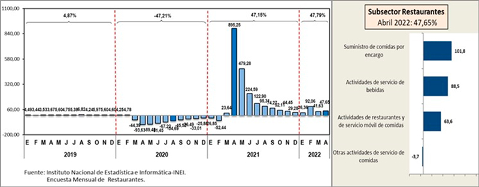

Universidad Peruana de Ciencias Aplicadas

Carrera: Ingeniería de Software

Ciclo: 2024-02

Curso: Desarrollo de Aplicaciones Open Source

Sección: WX51

Profesor: Alberto Wilmer Sanchez Seña

Informe del Trabajo Final - TB1

Startup: Verduritas

Producto: GastroGo

    <h3>Integrantes:</h3>
    <table align="center">
        <tr>
            <th style="text-align:center;">Member</th>
            <th style="text-align:center;">Code</th>
        </tr>
        <tr>
            <td>Abanto Vicente, Edery Renzo</td>
            <td>U201822832</td>
        </tr>
        <tr>
            <td>Cuevas Vera, Jose Angel</td>
            <td>U202214632</td>
        </tr>
        <tr>
            <td>Pedraza Maldonado, Joaquin Andree </td>
            <td>U202218514</td>
        </tr>
        <tr>
            <td>Barrutia Vaez, Ricardo Andree</td>
            <td>U201714765</td>
        </tr>
        <tr>
            <td>Espinoza Inoñan, Fabiola Ximena</td>
            <td>U202214784</td>
        </tr>
    </table>

**Agosto del 2024**

  
---  
# Registro de Versiones del Informe

<table>
        <thead>
            <tr>
                <th>Versión</th>
                <th>Fecha</th>
                <th>Autor</th>
                <th>Descripción de modificaciones</th>
            </tr>
        </thead>
        <tbody>
            <tr>
                <th>1.0</th>
                <td>08/30/2024</td>
                <td>Ricardo</td>
                <td>Se añadió el Startup profile.</td>
            </tr>
              <tr>                
                <th>1.1</th>
                <td>08/30/2024</td>
                <td>Fabiola</td>
                <td>Se añadió el Solution profile.</td>
             </tr>
              <tr>
                <th>1.2</th>
                <td>08/30/2024</td>
                <td>Ricardo</td>
                <td>Se agregó la sección de los competidores.</td>
            </tr> 
             <tr>
                <th>1.3</th>
                <td>08/30/2024</td>
                <td>Fabiola</td>
                <td>Se agregaron la seccion de entrevistas.</td>
            </tr> 
             <tr>
                <th>1.4</th>
                <td>08/30/2024</td>
                <td>Fabiola</td>
                <td>Se agregó el Needfinding.</td>
            </tr>
             <tr>
                <th>1.5</th>
                <td>08/30/2024</td>
                <td>Ricardo</td>
                <td>Se agregó el Ubiquitous Language.</td>
            </tr> 
             <tr>
                <th>1.6</th>
                <td>Fecha</td>
                <td>Nombre</td>
                <td>Se agregó el To-Be Scenario Mapping.</td>
            </tr>
             <tr>
                <th>1.7</th>
                <td>Fecha</td>
                <td>Nombre</td>
                <td>Se agregó las User Stories.</td>
            </tr>
             <tr>
                <th>1.8</th>
                <td>Fecha</td>
                <td>Nombre</td>
                <td>Se agregó el Impact Mapping.</td>
            </tr>
             <tr>
                <th>1.9</th>
                <td>Fecha</td>
                <td>Nombre</td>
                <td>Se agregó el Product Backlog.</td>
            </tr>
            <tr>
                <th>1.10</th>
                <td>Fecha</td>
                <td>Nombre</td>
                <td>Se agregó el Style Guidelines.</td>
            </tr>
            <tr>
                <th>1.11</th>
                <td>Fecha</td>
                <td>Nombre</td>
                <td>Se agregó la Information Architecture.</td>
            </tr>
            <tr>
                <th>1.12</th>
                <td>Fecha</td>
                <td>Nombre</td>
                <td>Se agregó la Landing Page UI Design.</td>
            </tr>
            <tr>
                <th>1.13</th>
                <td>Fecha</td>
                <td>Nombre</td>
                <td>Se agregó la Web Applications UX/UI Design.</td>
            </tr>
            <tr>
                <th>1.14</th>
                <td>Fecha</td>
                <td>Nombre</td>
                <td>Se agregó la Web Applications Prototyping.</td>
            </tr>
            <tr>
                <th>1.15</th>
                <td>Fecha</td>
                <td>Nombre</td>
                <td>Se agregó Domain-Driven Software Architecture.</td>
            </tr>
            <tr>
                <th>1.16</th>
                <td>Fecha</td>
                <td>Nombre</td>
                <td>Se agregó la Software Object-Oriented Design.</td>
            </tr>
            <tr>
                <th>1.17</th>
                <td>Fecha</td>
                <td>Nombre</td>
                <td>Se agregó la Database Design.</td>
            </tr>
             <tr>
                <th>1.18</th>
                <td>Fecha</td>
                <td>Nombre</td>
                <td>Se agregó el Software Configuration Management.</td>
            </tr>
             <tr>
                <th>1.19</th>
                <td>Fecha</td>
                <td>Nombre</td>
                <td>Se agregó el Landing Page, Services & Applications Implementation.</td>
            </tr>
                    </tbody>
</table>

  
---  
# Project Report Collaboration Insights

  
---  
# Student Outcome
El curso contribuye al cumplimiento del Student Outcome ABET: **ABET – EAC - Student Outcome 3**   Criterio: *Capacidad de comunicarse efectivamente con un rango de audiencias.*

En el siguiente cuadro se describe las acciones realizadas y enunciados de conclusiones por parte del grupo, que permiten sustentar el haber alcanzado el logro del ABET – EAC - Student Outcome 3.

| Criterio específico | Acciones realizadas | Conclusiones |  
| - | - | - |  
| Comunica oralmente sus ideas y/o resultados con objetividad a público de diferentes especialidades y niveles jerarquicos, en el marco del desarrollo de un proyecto en ingeniería. | **Apellido Apellido Nombre Nombre**   ***TB1:*** Morbi vel tortor id eros dictum venenatis id ut dui.Mauris quis tellus sed nunc hendrerit vehicula ac id mauris.   ***TP:*** Morbi vel tortor id eros dictum venenatis id ut dui.Mauris quis tellus sed nunc hendrerit vehicula ac id mauris.   ***TB2:*** Morbi vel tortor id eros dictum venenatis id ut dui.Mauris quis tellus sed nunc hendrerit vehicula ac id mauris.   ***TF:*** Morbi vel tortor id eros dictum venenatis id ut dui.Mauris quis tellus sed nunc hendrerit vehicula ac id mauris.    **Apellido Apellido Nombre Nombre**   ***TB1:*** Morbi vel tortor id eros dictum venenatis id ut dui.Mauris quis tellus sed nunc hendrerit vehicula ac id mauris.   ***TP:*** Morbi vel tortor id eros dictum venenatis id ut dui.Mauris quis tellus sed nunc hendrerit vehicula ac id mauris.   ***TB2:*** Morbi vel tortor id eros dictum venenatis id ut dui.Mauris quis tellus sed nunc hendrerit vehicula ac id mauris.   ***TF:*** Morbi vel tortor id eros dictum venenatis id ut dui.Mauris quis tellus sed nunc hendrerit vehicula ac id mauris.    | ***TB1:*** Fusce cursus dolor et nulla suscipit, sit amet ullamcorper nibh vestibulum.    ***TP:*** Fusce cursus dolor et nulla suscipit, sit amet ullamcorper nibh vestibulum.    ***TB2:*** Fusce cursus dolor et nulla suscipit, sit amet ullamcorper nibh vestibulum.    ***TF:*** Fusce cursus dolor et nulla suscipit, sit amet ullamcorper nibh vestibulum. | | Comunica en forma escrita ideas y/o resultados con objetividad a público de diferentes especialidades y niveles jerarquicos, en el marco del desarrollo de un proyecto en ingeniería. | ***Apellido Apellido Nombre Nombre***   ***TB1:*** Cras sed diam suscipit, malesuada ex rutrum, fringilla orci. Vestibulum in nunc quis elit suscipit sollicitudin.   ***TP:*** Cras sed diam suscipit, malesuada ex rutrum, fringilla orci. Vestibulum in nunc quis elit suscipit sollicitudin.   ***TB2:*** Cras sed diam suscipit, malesuada ex rutrum, fringilla orci. Vestibulum in nunc quis elit suscipit sollicitudin.   ***TF:*** Cras sed diam suscipit, malesuada ex rutrum, fringilla orci. Vestibulum in nunc quis elit suscipit sollicitudin.    ***Apellido Apellido Nombre Nombre***   ***TB1:*** Cras sed diam suscipit, malesuada ex rutrum, fringilla orci. Vestibulum in nunc quis elit suscipit sollicitudin.   ***TP:*** Cras sed diam suscipit, malesuada ex rutrum, fringilla orci. Vestibulum in nunc quis elit suscipit sollicitudin.   ***TB2:*** Cras sed diam suscipit, malesuada ex rutrum, fringilla orci. Vestibulum in nunc quis elit suscipit sollicitudin.   ***TF:*** Cras sed diam suscipit, malesuada ex rutrum, fringilla orci. Vestibulum in nunc quis elit suscipit sollicitudin. | ***TB1:*** FEtiam imperdiet quam condimentum velit tempor porttitor.    ***TP:*** FEtiam imperdiet quam condimentum velit tempor porttitor.    ***TB2:*** FEtiam imperdiet quam condimentum velit tempor porttitor.    ***TF:*** FEtiam imperdiet quam condimentum velit tempor porttitor. |  
  
---  
# Contenido
## Tabla de contenidos

### [Capítulo I: Introducción]()
- [1.1. Startup Profile]()
    - [1.1.1 Descripción de la Startup]()
    - [1.1.2 Perfiles de integrantes del equipo]()
- [1.2 Solution Profile]()
    - [1.2.1 Antecedentes y problemática]()
    - [1.2.2 Lean UX Process]()
        - [1.2.2.1. Lean UX Problem Statements]()
        - [1.2.2.2. Lean UX Assumptions]()
        - [1.2.2.3. Lean UX Hypothesis Statements]()
        - [1.2.2.4. Lean UX Canvas]()
- [1.3. Segmentos objetivo]()

### [Capítulo II: Requirements Elicitation & Analysis]()
- [2.1. Competidores]()
    - [2.1.1. Análisis competitivo]()
    - [2.1.2. Estrategias y tácticas frente a competidores]()
- [2.2. Entrevistas]()
    - [2.2.1. Diseño de entrevistas]()
    - [2.2.2. Registro de entrevistas]()
    - [2.2.3. Análisis de entrevistas]()
- [2.3. Needfinding]()
    - [2.3.1. User Personas]()
    - [2.3.2. User Task Matrix]()
    - [2.3.3. User Journey Mapping]()
    - [2.3.4. Empathy Mapping]()
    - [2.3.5. As-is Scenario Mapping]()
- [2.4. Ubiquitous Language]()

### [Capítulo III: Requirements Specification]()
- [3.1. To-Be Scenario Mapping]()
- [3.2. User Stories]()
- [3.3. Impact Mapping]()
- [3.4. Product Backlog]()

### [Capítulo IV: Product Design]()
- [4.1. Style Guidelines]()
    - [4.1.1. General Style Guidelines]()
    - [4.1.2. Web Style Guidelines]()
- [4.2. Information Architecture]()
    - [4.2.1. Organization Systems]()
    - [4.2.2. Labeling Systems]()
    - [4.2.3. SEO Tags and Meta Tags]()
    - [4.2.4. Searching Systems]()
    - [4.2.5. Navigation Systems]()
- [4.3. Landing Page UI Design]()
    - [4.3.1. Landing Page Wireframe]()
    - [4.3.2. Landing Page Mock-up]()
- [4.4. Web Applications UX/UI Design]()
    - [4.4.1. Web Applications Wireframes]()
    - [4.4.2. Web Applications Wireflow Diagrams]()
    - [4.4.3. Web Applications Mock-ups]()
    - [4.4.4. Web Applications User Flow Diagrams]()
- [4.5. Web Applications Prototyping]()
- [4.6. Domain-Driven Software Architecture]()
    - [4.6.1. Software Architecture Context Diagram]()
    - [4.6.2. Software Architecture Container Diagrams]()
    - [4.6.3. Software Architecture Components Diagrams]()
- [4.7. Software Object-Oriented Design]()
    - [4.7.1. Class Diagrams]()
    - [4.7.2. Class Dictionary]()
- [4.8. Database Design]()
    - [4.8.1. Database Diagram]()

### [Capítulo V: Product Implementation, Validation & Deployment]()
- [5.1. Software Configuration Management]()
    - [5.1.1. Software Development Environment Configuration]()
    - [5.1.2. Source Code Management]()
    - [5.1.3. Source Code Style Guide & Conventions]()
    - [5.1.4. Software Deployment Configuration]()
- [5.2. Landing Page, Services & Applications Implementation]()
    - [5.2.1. Sprint 1]()
        - [5.2.1.1. Sprint Planning 1]()
        - [5.2.1.2. Sprint Backlog 1]()
        - [5.2.1.3. Development Evidence for Sprint Review]()
        - [5.2.1.4. Testing Suite Evidence for Sprint Review]()
        - [5.2.1.5. Execution Evidence for Sprint Review]()
        - [5.2.1.6. Services Documentation Evidence for Sprint Review]()
        - [5.2.1.7. Software Deployment Evidence for Sprint Review]()
        - [5.2.1.8. Team Collaboration Insights during Sprint]()
    - [5.2.2. Sprint 2]()
        - [5.2.2.1. Sprint Planning 2]()
        - [5.2.2.2. Sprint Backlog 2]()
        - [5.2.2.3. Development Evidence for Sprint Review]()
        - [5.2.2.4. Testing Suite Evidence for Sprint Review]()
        - [5.2.2.5. Execution Evidence for Sprint Review]()
        - [5.2.2.6. Services Documentation Evidence for Sprint Review]()
        - [5.2.2.7. Software Deployment Evidence for Sprint Review]()
        - [5.2.2.8. Team Collaboration Insights during Sprint]()
    - [5.2.3. Sprint 3]()
        - [5.2.3.1. Sprint Planning 3]()
        - [5.2.3.2. Sprint Backlog 3]()
        - [5.2.3.3. Development Evidence for Sprint Review]()
        - [5.2.3.4. Testing Suite Evidence for Sprint Review]()
        - [5.2.3.5. Execution Evidence for Sprint Review]()
        - [5.2.3.6. Services Documentation Evidence for Sprint Review]()
        - [5.2.3.7. Software Deployment Evidence for Sprint Review]()
        - [5.2.3.8. Team Collaboration Insights during Sprint]()
    - [5.2.4. Sprint 4]()
        - [5.2.4.1. Sprint Planning 4]()
        - [5.2.4.2. Sprint Backlog 4]()
        - [5.2.4.3. Development Evidence for Sprint Review]()
        - [5.2.4.4. Testing Suite Evidence for Sprint Review]()
        - [5.2.4.5. Execution Evidence for Sprint Review]()
        - [5.2.4.6. Services Documentation Evidence for Sprint Review]()
        - [5.2.4.7. Software Deployment Evidence for Sprint Review]()
        - [5.2.4.8. Team Collaboration Insights during Sprint]()
- [5.3. Validation Interviews]()
    - [5.3.1. Diseño de Entrevistas]()
    - [5.3.2. Registro de Entrevistas]()
    - [5.3.3. Evaluaciones según heurísticas]()
- [5.4. Video About-the-Product]()

---  
# Capítulo I: Introducción
## 1.1. Startup Profile
### 1.1.1 Descripción de la Startup
Somos Verduritas, un equipo de estudiantes de la Universidad Peruana de Ciencias Aplicadas (UPC) dedicados a innovar en el ámbito de la alimentación y la tecnología. Nuestra startup, GastroGo, conecta de manera eficiente a restaurantes de Lima Metropolitana con grupos de trabajadores, permitiendo pedidos en cantidad de forma rápida y organizada.

Misión: Facilitar la conexión entre grupos de trabajadores y restaurantes locales para optimizar y simplificar el proceso de pedido de almuerzos en cantidad, apoyando tanto a los empleados como a los restaurantes de Lima Metropolitana.

Visión: Convertirnos en la plataforma líder en la gestión de pedidos grupales de comidas, impulsando la eficiencia y fomentando el crecimiento de la gastronomía local.

### 1.1.2 Perfiles de integrantes del equipo

| Información                                                                                                                                                                                                                                                                                                                                                                                                                                                                                                                                                                                                                                                                                                                                                         | Foto                                                      |
|:--------------------------------------------------------------------------------------------------------------------------------------------------------------------------------------------------------------------------------------------------------------------------------------------------------------------------------------------------------------------------------------------------------------------------------------------------------------------------------------------------------------------------------------------------------------------------------------------------------------------------------------------------------------------------------------------------------------------------------------------------------------------|:----------------------------------------------------------|
| **Ricardo Andree Barrutia**  Código: U201714765  Conocimientos y Habilidades:    Como estudiante de ingeniería de software he adquirido conocimientos de C++, Java y de Ionic. Con respecto a las habilidades más destacables de mi persona, considero que el trabajo en equipo es una de ellas. Además de la capacidad resolutiva a la par que adaptativa ante diversas situaciones.                                                                                                                                                                                                                                                                                                                                                          |  |
| **Joaquín Andreé Pedraza Maldonado**  Código: U202218514  Conocimientos y Habilidades:  Mi nombre es Joaquín Andreé Pedraza Maldonado , tengo 20 años y actualmente me encuentro en 6to ciclo de la carrera de Ingeniería de Software , en la UPC , sede San Miguel. Al terminar mi carrera desearía dedicarme al rubro de desarrollo Web o cyberseguridad .Soy una persona centrada , perseverante , tranquila  , optimista y efectiva.                                                                                                                                                                                                                                                                                                          |   |
| **José Angel Cuevas Vera**  Código: U202214632  Conocimientos y Habilidades:  Mi nombre es José Angel Cuevas Vera y tengo 19 años. Soy estudiante de la carrera de Ingeniería de Software en la Universidad Peruana de Ciencias Aplicadas (UPC). Me considero una persona intuitiva que siempre busca ver el lado positivo de las cosas, pero con los pies bien plantados en la realidad. Tengo conocimientos en el uso de programas de edición como Photoshop y un manejo básico de lenguajes de programación. Siempre busco dar lo mejor de mí para realizar un buen trabajo y estaré pendiente de cualquier responsabilidad para cumplir correctamente con el presente proyecto.                                                               |         |
| **Fabiola Ximena Espinoza Inoñan**  Código: u202214784  Conocimientos y Habilidades:   Mi nombre es Fabiola Espinoza, tengo 20 años. Actualmente estoy cursando el cuarto ciclo en la carrera de Ingeniería de Software en la prestigiosa Universidad Peruana de Ciencias Aplicadas. Me considero una persona responsable, creativa y empática.                                                                                                                                                                                                                                                                                                                                                                                                   |  |
| **Edery Renzo Abanto Vicente**  Código: U201822832  Conocimientos y Habilidades:    Estudiante de Ingeniería de Software con 24 años, 8vo ciclo, apasionado por el desarrollo tecnológico. Mi formación sólida y experiencia en proyectos universitarios me capacitan para enfrentar desafíos en entornos profesionales dinámicos. Comprometido con la excelencia y la innovación, estoy listo para contribuir al mundo del desarrollo de software. Con habilidades avanzadas en C#, MySQL, Flutter, Python, automatización de procesos, mi experiencia se centra en el análisis y diseño de sistemas. Listo para impulsar el desarrollo de aplicaciones eficientes, desde el diseño de base de datos hasta la implementación de servicios clave. |        |

## 1.2 Solution Profile
### 1.2.1 Antecedentes y problemática

Antecedentes: 

Identificamos que la gestión de pedidos grupales se realizaba de manera tradicional, generalmente mediante llamadas telefónicas o visitas personales. Esto representa un desafío significativo para la gestión eficiente de los pedidos, afectando principalmente a los trabajadores, quienes buscan opciones de almuerzo accesibles y convenientes. Al realizarse los pedidos de forma manual, se generan ineficiencias y errores en el proceso, lo que repercute negativamente en la experiencia tanto de los clientes como de los restaurantes.

Problemática:

La problemática radica en la falta de una plataforma especializada que permita a los trabajadores realizar pedidos grupales de manera eficiente, sin generar dificultades en el proceso. Esto incluye demoras en la recepción de los pedidos, errores en las entregas, y una experiencia deficiente para los usuarios. De esta situación surge la necesidad de optimizar y digitalizar estos procesos para mejorar la productividad de los restaurantes y satisfacer las necesidades de los trabajadores.

Para la elaboración de la descripción de los antecedentes y problemática, hemos aplicado la técnica de The 5 ’W’s y 2 ’H’s:

**What**

El problema radica en la dificultad de un grupo de trabajadores de una empresa para realizar pedidos grupales de comida en restaurantes de manera eficiente y organizada.

**When** 

El problema sucede cuando un grupo de trabajadores no llevan almuerzo a sus trabajos y suelen ir a un restaurante, que en reiteradas ocasiones está a su máxima capacidad o tienen mucha demanda. 

**Where**

Se enfoca inicialmente en Lima Metropolitana, abarcando distritos claves donde se concentran grandes cantidades de oficinas y negocios, como San Isidro, Miraflores, Surco, y San Borja. Estos son los lugares donde hay una alta demanda de servicios de alimentación para grupos de trabajadores.

**Who**

Los principales involucrados en esta problemática son los restaurantes de Lima metropolitana y grupo de trabajadores (oficinas, empresas, y más)

**Why**

Existe una necesidad en el mercado para realizar pedidos grupales de comida en restaurantes. Por tal motivo, GastroGo busca solucionar esta problemática y ofrecer beneficios tantos a los restaurantes y trabajadores.

**How** 

GastroGo nace de la necesidad de simplificar la experiencia de pedir comidas grupales. Los trabajadores al enfrentar varias dificultades como: encontrar su plato favorito, disponibilidad en un restaurante y más, encuentran en nuestra plataforma una solución práctica y eficiente.

**How much**

Se estima que en el mercado de pedidos de comida aumentó  un 47% en los últimos años segun la INEI, la actividad en restaurantes aumentó considerablemnte. 

Según el Instituto Nacional de Estadística e Informática (INEI) (2022), en abril de 2022 la actividad de los restaurantes en Lima Metropolitana aumentó un 47,65 %, lo que refleja un crecimiento significativo en la demanda de servicios gastronómicos. Este incremento resalta la oportunidad y necesidad de plataformas como GastroGo, que buscan optimizar y digitalizar los procesos de pedidos grupales para satisfacer tanto a los restaurantes como a los grupos de trabajadores, mejorando así la eficiencia y la experiencia del cliente en un mercado en expansión.   

  

### 1.2.2 Lean UX Process
#### 1.2.2.1. Lean UX Problem Statements

**Problem Statement 1:**

El estado actual del proceso de gestión de pedidos en restaurantes de Lima Metropolitana se ha centrado principalmente en métodos manuales y dependientes de llamadas telefónicas o aplicaciones genéricas de delivery, lo que presenta desafíos significativos, especialmente en la gestión de pedidos grupales. Los servicios existentes no logran abordar la eficiencia en la gestión de pedidos grupales, resultando en retrasos, errores frecuentes y alta insatisfacción del cliente. Nuestro servicio abordará esta brecha mediante el desarrollo de una plataforma especializada, GastroGo, que permitirá a los restaurantes manejar pedidos grupales de manera más eficiente, reduciendo los errores y mejorando la satisfacción del cliente. Nuestro enfoque inicial será restaurantes en Lima Metropolitana que gestionan pedidos grupales regularmente. Sabremos que hemos tenido éxito cuando veamos una reducción significativa en los errores de pedidos y un aumento en la satisfacción del cliente, así como en la adopción de la plataforma por parte de los restaurantes

**Problem Statement 2:**

El estado actual del proceso de pedidos grupales para trabajadores en Lima Metropolitana,  se ha centrado principalmente en métodos manuales y sistemas no optimizados, lo que dificulta la coordinación eficiente y precisa de los pedidos grupales.Los servicios existentes no logran abordar la falta de una solución integral que simplifique el proceso de pedido, eliminando demoras, errores en las entregas y problemas en la coordinación.Nuestro servicio abordará esta brecha mediante el desarrollo de GastroGo, una plataforma que facilita la gestión de pedidos grupales para trabajadores, ofreciendo una experiencia simplificada y precisa que asegura rapidez y conveniencia para los trabajadores.Nuestro enfoque inicial será grupos de trabajadores de diversas empresas que requieran realizar pedidos de almuerzo en conjunto.Sabremos que hemos tenido éxito cuando veamos una reducción significativa en los tiempos de procesamiento de pedidos, una disminución en los errores de entrega y una mayor satisfacción general entre los trabajadores que utilizan la plataforma.

#### 1.2.2.2. Lean UX Assumptions

**Business Assumptions:**

**Creo que mis usuarios necesitan** una plataforma que les permita gestionar pedidos grupales de manera eficiente y confiable asimismo les permita optimizar su flujo de trabajo al recibir y procesar múltiples pedidos al mismo tiempo.

**Estas necesidades se pueden resolver** mediante el desarrollo de una plataforma especializada en la gestión de pedidos grupales. Para los restaurantes, esta plataforma debe contar con funcionalidades que automaticen y simplifiquen la recepción y gestión de múltiples pedidos, reduciendo la carga operativa, minimizando errores y acelerando la entrega.

**Mis clientes iniciales son** los restaurantes en Lima Metropolitana que actualmente gestionan pedidos grupales con regularidad, así como los grupos de trabajadores de empresas que suelen realizar pedidos de almuerzo en conjunto. Estos clientes valorarán la simplicidad y confiabilidad durante el proceso de hacer pedidos.

**El valor #1 que un cliente requiere de mi servicio es** la eficiencia en la realización de pedidos, minimización de errores en la entrega, y la conveniencia para realizar pedidos conjuntos.

**El cliente también puede obtener estos beneficios adicionales:**

Adicionalmente, los clientes podrán beneficiarse de una plataforma que ofrece una experiencia de usuario mejorada, permitiéndoles realizar sus pedidos de manera sencilla y rápida. A su vez, los restaurantes experimentan una mayor fidelización de sus clientes al poder brindarles una mejor experiencia.

**Voy a adquirir a mis clientes a través de** una estrategia de marketing digital enfocada y segmentada. Colaboraremos con restaurantes locales para integrarnos en sus procesos de pedidos, ofreciendo pruebas gratuitas de nuestra plataforma. Además, promocionamos nuestro servicio mediante campañas de publicidad en redes sociales y plataformas profesionales.

**Haré dinero a través de** un modelo de suscripción, adaptado a cada segmento objetivo, que ofrecerá funcionalidades adicionales y personalizadas.

**Mi competencia de mercado serán** aplicaciones o servicios que brindan menús o planes de alimentación personalizados, como Manzana Verde, LifeSum y KnowEats, los cuales ofrecen opciones para pedir comida adaptadas a necesidades específicas de nutrición.

**Los venceremos debido a que** nuestra propuesta se diferencia al ofrecer un modelo de suscripción que proporciona acceso a una amplia variedad de menús saludables de diversos restaurantes afiliados, combinando esta oferta con una experiencia de usuario simplificada.

**Mis mayores riesgos de producto son** la posible resistencia de los restaurantes a adoptar una tecnología que implicaría cambiar sus procesos y la posibilidad de que los grupos de trabajadores no adopten la plataforma debido a su preferencia por aplicaciones de delivery existentes.

**Resolveremos esto mediante** un proceso de desarrollo que incluya un diseño previo detallado de la aplicación, basado en las necesidades y deficiencias identificadas en las entrevistas realizadas. Esto nos permitirá comprender la situación actual y evaluar el nivel de satisfacción con nuestra propuesta.

**Sabremos que hemos tenido éxito cuando uno de estos cambios en el comportamiento de nuestro cliente:**

- Observemos un aumento significativo en la cantidad de pedidos grupales gestionados a través de la plataforma por parte de los restaurantes, lo que indicará que los establecimientos están adoptando y utilizando activamente el sistema
- Notemos una reducción en la tasa de errores en la gestión de pedidos y una mejora en la velocidad de entrega, señalando que la plataforma está mejorando la eficiencia operativa.
- Cuando los trabajadores usen la plataforma con frecuencia, su satisfacción con el servicio ha aumentado, lo que demuestra que consideran la solución valiosa y útil para sus pedidos grupales.

**Qué otras suposiciones tenemos que, de probarse falsas, pueden causar que nuestro proyecto fracase:**

- Los restaurantes y grupo de trabajadores estarán dispuestos a cambiar sus procesos actuales y adoptar nuestra tecnología dejando de lado los métodos tradicionales.
- Suponer que el mercado está listo para adoptar una nueva solución tecnológica para pedidos grupales
- Creer que los grupos de trabajadores valorarán una plataforma especializada para pedidos grupales.

**User Assumptions:**

**¿Quiénes serán nuestros usuarios?**

Nuestros usuarios principales son:

- Restaurantes locales en Lima Metropolitana que gestionan pedidos grupales con frecuencia.

- Grupos de trabajadores en oficinas y empresas que realizan pedidos de almuerzo en conjunto.

**¿Dónde encaja nuestro producto en su vida o trabajo?**

Para los restaurantes: GastroGo encaja en el flujo de trabajo al integrar una herramienta digital que facilita la recepción y gestión de pedidos grupales, mejorando la eficiencia operativa.

Para los grupos de trabajadores: La plataforma encaja en su rutina diaria al ofrecer una solución simplificada y conveniente para coordinar y realizar pedidos de almuerzo de manera organizada y sin complicaciones.

**¿Qué problemas tiene nuestro producto y cómo se pueden resolver?**

Problemas:

- Los usuarios podrían tener preocupaciones sobre la seguridad y privacidad de sus datos en la plataforma.
- Los trabajadores y restaurantes podrían no percibir un valor significativo en la plataforma.
- Los usuarios pueden encontrar complicado integrar la plataforma  en sus rutinas

Soluciones:

- Desarrollar una interfaz intuitiva y fácil de usar, y proporcionar tutoriales y soporte para ayudar a los usuarios a integrar la plataforma.
- Realizar estudios de caso y presentar datos que muestran cómo la plataforma mejora la eficiencia y la experiencia en comparación con los métodos tradicionales
- Implementar diversidad  de medidas de seguridad y comunicar claramente estas medidas a los usuarios.

**¿Cómo y cuándo es usado nuestro producto?**

Nuestro producto, GastroGo, es utilizado por los restaurantes para recibir y gestionar pedidos grupales, integrándose en sus sistemas de operaciones diarias para optimizar el manejo de grandes volúmenes de pedidos.

Los restaurantes usan la plataforma principalmente durante las horas de almuerzo, cuando los grupos de trabajadores realizan pedidos en masa para sus comidas.

Además, el producto también se usa en cualquier momento del día en que los restaurantes reciben y procesan estos pedidos, asegurando una gestión eficiente y organizada del flujo de trabajo en distintos horarios.

**¿Qué características son importantes?**

- Interfaz intuitiva y fácil de navegar, que permita a los trabajadores realizar y coordinar pedidos grupales sin complicaciones.
- Sistema de gestión de pedidos fácil de usar, que permita a los restaurantes recibir y procesar pedidos grupales de manera eficiente.
- Funcionalidades para automatizar la recepción y el procesamiento de pedidos, reduciendo el riesgo de errores y mejorando la rapidez en el manejo de grandes volúmenes.
- Funcionalidades para visualizar menús y precios de manera clara, ayudando a tomar decisiones informadas.

**¿Cómo debe verse y comportarse nuestro producto?**

- La interfaz de usuario (UI) de nuestra plataforma debe ser moderna y clara, con un diseño que facilite la navegación y destaque por su simplicidad y eficiencia.
- La experiencia de usuario (UX) debe priorizar la fluidez y rapidez en la interacción, asegurando que los procesos de pedido y gestión se realicen sin complicaciones.
- El comportamiento de la plataforma debe ser óptimo y eficiente, garantizando una experiencia de usuario efectiva y satisfactoria al realizar pedidos.

**Features:**

- Desde una cuenta con el rol de restaurante, la plataforma debe ser compatible con diversos sistemas de pago, facilitando la integración con los procesos operativos del restaurante. Esto garantizará una sincronización precisa de los pedidos y una integración total.

- Desde una cuenta con el rol de restaurante, la plataforma debe permitir la gestión eficiente de pedidos grupales, mediante funcionalidades para automatizar la recepción y procesamiento de pedidos.

- Desde una cuenta con el rol de trabajador, la plataforma debe ofrecer una interfaz intuitiva y fácil de navegar, que permita la creación y coordinación de pedidos grupales de manera rápida y sin complicaciones.

- Desde una cuenta con el rol de trabajador, la plataforma debe permitir la visualización de menús y precios de los restaurantes, facilitando la selección de opciones adecuadas para los pedidos grupales.

- Desde una cuenta con el rol de trabajador, la plataforma debe incluir notificaciones y confirmaciones de pedidos en tiempo real, manteniendo a los usuarios informados sobre el estado de sus pedidos.

#### 1.2.2.3. Lean UX Hypothesis Statements

**Creemos que** los restaurantes de Lima metropolitana estarán interesados en GastroGo porque les permite recibir pedidos en cantidad de manera rápida y organizada.

**Sabremos que** los restaurantes encuentran valor en la plataforma cuando al menos el 70% de los restaurantes están registrados y utilizan regularmente la plataforma para gestionar sus pedidos.

**Creemos que** al implementar un plan promocional (descuentos, cupones, promociones) por realizar pedidos con frecuencia obtendremos la atención de los usuarios. 

**Sabremos que** el plan promocional es efectivo cuando los usuarios que hayan ganado algún descuento, realicen un pedido adicional en su compra.  

**Creemos que** la interfaz de GastroGo debe ser amigable y fácil de usar, va a mejorar la experiencia del usuario al realizar sus pedidos.

**Sabremos que** la experiencia del usuario es satisfactoria cuando al menos un 85% de usuarios hayan completado sus pedidos sin necesidad de alguna ayuda o soporte adicional.

#### 1.2.2.4. Lean UX Canvas

| **1. Business Problems**                                                                                                                                                                                                                                                                         | **5. Solution Ideas**                                                                                                                                                                                                                                                                                                                                                             | **2. Business Outcome**                                                                                                                                                                                                              |
|---------------------------------------------------------------------------------------------------------------------------------------------------------------------------------------------------------------------------------------------------------------------------------------------------|------------------------------------------------------------------------------------------------------------------------------------------------------------------------------------------------------------------------------------------------------------------------------------------------------------------------------------------------------------------------------------|-------------------------------------------------------------------------------------------------------------------------------------------------------------------------------------------------------------------------------------|
| Grupo de trabajadores de pequeñas y medianas empresas enfrentan el desafío de no contar con una plataforma especializada que facilite los procesos para realizar pedidos de comida de forma grupal debido a los servicios de reparto tradicional.     Esto resulta en dificultades para llevar a cabo una gestión eficiente de pedidos en grupo, el problema se agrava cuando los restaurantes no tienen la capacidad tecnológica para manejar grandes volúmenes de pedidos de manera rápida y efectiva, lo que resulta en pérdida de clientes e ingresos. | Una aplicación web responsiva que permita a los usuarios trabajadores realizar pedidos grupales sin dificultades.     Desde una cuenta con el rol de restaurante, la plataforma debe ser compatible con diversos sistemas de pago, facilitando la integración con los procesos operativos del restaurante. Esto garantizará una sincronización precisa de los pedidos y una integración total.     Desde una cuenta con el rol de trabajador, la plataforma debe ofrecer una interfaz intuitiva y fácil de navegar, que permita la creación y coordinación de pedidos grupales de manera rápida y sin complicaciones.     Desde una cuenta con el rol de trabajador, la plataforma debe permitir la visualización de menús y precios de los restaurantes, facilitando la selección de opciones adecuadas para los pedidos grupales.     Desde una cuenta con el rol de trabajador, la plataforma debe incluir notificaciones y confirmaciones de pedidos en tiempo real, manteniendo a los usuarios informados sobre el estado de sus pedidos. | Tendremos mayor satisfacción del cliente al simplificar los pedidos de comida, mejorando la experiencia del cliente.     Aumentar la productividad de pedidos masivos para restaurantes.     Incremento de ventas y conexión efectiva entre restaurantes y grupos de trabajadores, personalizando un plan promocional (descuentos, cupones, promociones, ofertas). |

| **3. User**                                                                                                                                                                                                                                                                                       | **4. User Outcome & Benefit**                                                                                                                                                                                                                                                                                                                   |
|---------------------------------------------------------------------------------------------------------------------------------------------------------------------------------------------------------------------------------------------------------------------------------------------------|------------------------------------------------------------------------------------------------------------------------------------------------------------------------------------------------------------------------------------------------------------------------------------------------------------------------------------------------------------------------------------|
| Grupos de trabajadores en entornos laborales que desean simplificar la organización de pedidos de comida en grupo.     Diversos establecimientos de comida buscan incrementar sus ventas al recibir y gestionar pedidos en cantidad de manera eficiente, especialmente durante las horas de almuerzo.                                 | Ahorro de tiempo:   Los usuarios podrán realizar pedidos grupales de manera rápida y sencilla, evitando largas colas, no disponibilidad y problemas en los restaurantes.     Experiencia de pedido simplificada:   GastroGo, la plataforma que organiza los pedidos, reduciendo la complejidad y errores comunes en los pedidos grupales.     Facilidad de uso:   Una interfaz intuitiva y fácil de manejar que hace que ordenar pedidos en grupo sea una experiencia sin errores.     Mejor integración con el equipo:   Facilita la unión entre colegas al simplificar el proceso de ordenar juntos, mejorando la experiencia colectiva durante las horas de comida. |

| **6. Hypothesis**                                                                                                                                                                                                                                                                                  | **7. What is the most important thing we need to learn first?**                                                                                                                                                                                                                                      | **8. What is the least amount of work we need to do to learn the next most important thing?**                                                                                                                                                                       |
|---------------------------------------------------------------------------------------------------------------------------------------------------------------------------------------------------------------------------------------------------------------------------------------------------|------------------------------------------------------------------------------------------------------------------------------------------------------------------------------------------------------------------------------------------------------------------------------------------------------------------------------------------------------------------------------------|--------------------------------------------------------------------------------------------------------------------------------------------------------------------------------------------------------------------------------------------------------------------|
| Creemos que los restaurantes de Lima metropolitana estarán interesados en GastroGo porque les permite recibir pedidos en cantidad de manera rápida y organizada.     Creemos que al implementar un plan promocional (descuentos, cupones, promociones) por realizar pedidos con frecuencia obtendremos la atención de los usuarios.     Creemos que la interfaz de GastroGo debe ser amigable y fácil de usar, va a mejorar la experiencia del usuario al realizar sus pedidos. | Entender las necesidades de nuestros usuarios para poder resolver sus problemas.     Conocer los precios que manejan los productos y/o servicios ya existentes en el mercado para analizarlos y establecer un precio altamente competitivo y accesible para los usuarios.     Tener conocimientos sólidos en el diseño y desarrollo de aplicaciones web con un framework escalable y robusto.     Conocer detalladamente la gestión de los restaurantes y la atención a su público objetivo. | El enfoque más eficiente para obtener información de primera mano para nuestro proyecto, es realizar entrevistas a los dos segmentos objetivos.     Investigar los precios que se manejan en el mercado para servicios similares.     Practicar las habilidades técnicas de desarrollo en C# y otros lenguajes de programación para que la solución de software desarrollada se convierta en una experiencia única para nuestros clientes. |

## 1.3. Segmentos objetivo

Para nuestro proyecto GastroGo se ha establecido dos segmentos objetivos:

Restaurantes de Lima Metropolitana:

Diversos establecimientos de comida buscan incrementar sus ventas al recibir y gestionar pedidos en cantidad de manera eficiente, especialmente durante las horas de almuerzo. Estos restaurantes requieren de herramientas para optimizar el proceso de pedidos grupales y acceder a clientes recurrentes.

Grupo de trabajadores:

Equipos de trabajadores en entornos laborales que desean simplificar la organización de pedidos de comida en grupo. Buscan una plataforma fácil de usar que les permita realizar pedidos colectivos de manera rápida y eficiente, con la posibilidad de obtener beneficios adicionales como descuentos o recompensas.

# Capítulo II: Requirements Elicitation & Analysis
## 2.1 Competidores
## 2.2. Entrevistas
### 2.2.1. Diseño de entrevistas
### 2.2.2. Registro de entrevistas
### 2.2.3. Análisis de entrevistas
## 2.3. Needfinding
### 2.3.1. User Personas
### 2.3.2. User Task Matrix
### 2.3.3. User Journey Mapping
### 2.3.4. Empathy Mapping
### 2.3.5. As-is Scenario Mapping
## 2.4. Ubiquitous Language
# Capítulo III: Requirements Specification
## 3.1. To-Be Scenario Mapping
## 3.2. User Stories
## 3.3. Impact Mapping
## 3.4. Product Backlog
# Capítulo IV: Product Design
## 4.1. Style Guidelines
## 4.2. Information Architecture
## 4.3. Landing Page UI Design
## 4.4. Web Applications UX/UI Design
### 4.4.1. Web Applications Wireframes
### 4.4.2. Web Applications Wireflow Diagrams
### 4.4.3. Web Applications Mock-ups
### 4.4.4. Web Applications User Flow Diagrams
## 4.5. Web Applications Prototyping
## 4.6. Domain-Driven Software Architecture
### 4.6.1. Software Architecture Context Diagram
### 4.6.2. Software Architecture Container Diagrams
### 4.6.3. Software Architecture Components Diagrams
## 4.7. Software Object-Oriented Design
### 4.7.1. Class Diagrams
### 4.7.2. Class Dictionary
## 4.8. Database Design
### 4.8.1. Database Diagram
# Capítulo V: Product Implementation, Validation & Deployment
## 5.1. Software Configuration Management
### 5.1.1. Software Development Environment Configuration

### 5.1.2. Source Code Management

### 5.1.3. Source Code Style Guide & Conventions

### 5.1.4. Software Deployment Configuration

## 5.2. Landing Page, Services & Applications Implementation
### 5.2.1. Sprint 1
#### 5.2.1.1. Sprint Planning 1

#### 5.2.1.2. Sprint Backlog 1

#### 5.2.1.3. Development Evidence for Sprint Review

#### 5.2.1.4. Testing Suite Evidence for Sprint Review

#### 5.2.1.5. Execution Evidence for Sprint Review

#### 5.2.1.6. Services Documentation Evidence for Sprint Review

#### 5.2.1.7. Software Deployment Evidence for Sprint Review

#### 5.2.1.8. Team Collaboration Insights during Sprint

# Conclusiones
### Conclusiones y recomendaciones
### Video About-the-Team
  
---  
# Bibliografía
  
---  
# Anexos
