<div align="center">


Universidad Peruana de Ciencias Aplicadas

Carrera: Ingeniería de Software

Ciclo: 2024-02

Curso: Desarrollo de Aplicaciones Open Source

Sección: WX51

Profesor: Alberto Wilmer Sanchez Seña

Informe del Trabajo Final - TB1

Startup: Verduritas

Producto: GastroGo


| Member                                | Code       |
|---------------------------------------|------------|
| Abanto Vicente, Edery Renzo         | U201822832 |
| Barrutia Vaez, Ricardo Andree       | U201714765 |
| Cuevas Vera, Jose Angel        | U202214632 |
| Espinoza Inoñan, Fabiola Ximena     | U202214784 |
| Pedraza Maldonado, Joaquin Andree          | U202218514 |


</div>

<div align="center">

**Agosto del 2024**
</div>
  
---  
# Registro de Versiones del Informe


| Versión | Fecha      | Autor   | Descripción de modificaciones         |
|---------|------------|---------|---------------------------------------|
| 1.0     | 25/08/2024 | Abanto Vicente, Edery Renzo  <br>	Barrutia Vaez, Ricardo Andree	<br> Cuevas Vera, Jose Angel	<br> Espinoza Inoñan, Fabiola Ximena	<br> Pedraza Maldonado, Joaquin Andree | Capítulo I <br> Capítulo II <br> Capítulo III <br> Capítulo IV <br> Capítulo V       |


<br><br>
---  
# Project Report Collaboration Insights

Link del repositorio del reporte del TB1: https://github.com/UPC-PRE-SI729-2402-WX51-G1-Verduritas/GastroGo-Report

Para el presente informe, se llevaron a cabo reuniones y se distribuyeron los puntos a elaborar para la entrega actual, correspondientes a los Capítulos I hasta el Capítulo V: Sprint 1. Quedando de la siguiente manera:

**Imágen de las Contribuciones del equipo:**


**Imágen de las Contribuciones:**


**Imágen de los Commits:**


**Imágen de las Contribuciones:**


**Imágen de los Commits:**


**Imágen de las Contribuciones:**


**Imágen de los Commits:**


**Imágen de las Contribuciones:**


**Imágen de los Commits:**


**Imágen de las Contribuciones:**


**Imágen de los Commits:**


  
---  
# Student Outcome
El curso contribuye al cumplimiento del Student Outcome ABET: **ABET – EAC - Student Outcome 5** <br> Criterio: *Capacidad de comunicarse efectivamente con un rango de audiencias.*

En el siguiente cuadro se describe las acciones realizadas y enunciados de conclusiones por parte del grupo, que permiten sustentar el haber alcanzado el logro del ABET – EAC - Student Outcome 5.

| **Criterio específico** | **Acciones realizadas** | **Conclusiones** |
|-------------------------|--------------------------|-------------------|
| Trabaja en equipo para proporcionar liderazgo en forma conjunta | ***TB1:*** <br> **Abanto Vicente, Edery Renzo** <br> Para esta TB1 realicé documentación descriptiva fácilmente entendible para el grupo y comenté posibles mejoras, además de crear y modificar constantemente los diagramas de baja fidelidad. <br><br> **Barrutia Vaez, Ricardo Andree** <br> Mi participación en el desarrollo de la TB1 incluyó principalmente la creación del Lean UX, el análisis de la competencia, la realización de entrevistas, así como el diseño del empathy map y el journey map. Además, contribuí en el capítulo V del documento. En cuanto a la landing page, trabajé en la implementación de la barra de navegación, la sección de introducción, y añadí la opción para cambiar de idioma. <br><br> **Cuevas Vera, Jose Angel** <br> Para desarrollar esta TB1, realicé la parte del To-Be scenario mapping, las user stories, los impact mappings y el product backlog, detallando cómo los usuarios interactuarán con el sistema en el futuro y cómo estas interacciones contribuirán a alcanzar los objetivos del proyecto. <br><br> **Espinoza Inoñan, Fabiola Ximena** <br> Realicé la investigación para obtener información de primera mano a través de las entrevistas y la documentación de software. Esto permitió conocer mejor a nuestro público objetivo y establecer estrategias frente a nuevos competidores para potenciar nuestra startup. También desarrollé una parte de la landing page, incluyendo "About Us" y "Why Us". <br><br> **Pedraza Maldonado, Joaquin Andree** <br> Para esta TB1, realicé el diagrama de clases, los diagramas de arquitectura del software, y modifiqué los mockups junto con sus flujos de usuarios. Además, elaboré la sección de características de la landing page. <br><br> | En conclusión, en la realización de la TB1, el equipo trabajó de manera coordinada para cubrir todos los aspectos del proyecto. Se abordaron diversas áreas, desde la investigación y el análisis hasta el diseño y desarrollo. Cada miembro del equipo aportó en diferentes áreas, contribuyendo al desarrollo de la landing page y a la creación de elementos clave como mapas de empatía, escenarios futuros, y funcionalidades específicas. El trabajo conjunto permitió un avance organizado y eficiente, cumpliendo con los objetivos establecidos y asegurando un resultado cohesivo y bien estructurado. |
| Crea un entorno colaborativo e inclusivo, establece metas, planifica tareas y cumple objetivos | ***TB1:*** <br> **Abanto Vicente, Edery Renzo** <br> Para esta TB1 agregué descripciones generales para un mejor planteamiento del problema e investigué posibles enfoques de trabajo, además de diseñar muchos de los wireframes y mockups. <br><br> **Barrutia Vaez, Ricardo Andree** <br> Durante el proceso de desarrollo de la TB1, se llevaron a cabo numerosas sesiones de coordinación con el propósito de optimizar la planificación y la ejecución del trabajo. Estas reuniones permitieron definir claramente los objetivos y repartir las tareas de manera equitativa entre los integrantes del equipo, facilitando la revisión constante del progreso. Gracias a esta organización, las tareas fueron completadas de acuerdo a lo estimado, garantizando un avance fluido y eficiente del proyecto. Además, se realizaron ajustes cuando fue necesario para mantener el ritmo adecuado. <br><br> **Cuevas Vera, Jose Angel** <br> Para desarrollar la TB1, organizamos y celebramos una serie de reuniones clave. Estas sesiones fueron fundamentales para definir claramente nuestros objetivos y distribuir las tareas entre los miembros del equipo. Gracias a una gestión efectiva, logramos completar todas las tareas asignadas dentro del plazo estipulado. <br><br> **Espinoza Inoñan, Fabiola Ximena** <br> Se realizaron reuniones junto con todos los miembros del equipo y nos ayudamos entre nosotros para lograr cumplir con nuestro objetivo. También se designaron tareas para avanzar con el proyecto. <br><br> **Pedraza Maldonado, Joaquin Andree** <br> Para este TB1, al realizar el diagrama de clases, la arquitectura del software y la modificación de los mockups, tuve que analizar y plantear una manera en la cual la información fuera clara y concisa para el entendimiento de nuestros segmentos objetivos. <br><br> | En conclusión, en la realización de la TB1, el equipo abordó el proyecto de manera estructurada y colaborativa. Se realizaron descripciones generales para clarificar el problema y se investigaron diferentes enfoques de trabajo, desarrollando wireframes y mockups. A través de una serie de reuniones coordinadas, se definieron objetivos claros y se distribuyeron tareas equitativamente entre los miembros del equipo, lo que facilitó una planificación efectiva y un avance continuo. La gestión eficiente permitió completar las tareas dentro de los plazos establecidos, con ajustes realizados cuando fue necesario para mantener el ritmo del proyecto. Además, se diseñaron diagramas y se modificaron elementos visuales para asegurar una presentación clara y comprensible de la información. Este enfoque integral y organizado permitió una ejecución fluida del proyecto, cumpliendo con los objetivos y asegurando una solución cohesiva y bien documentada. |

---  
# Contenido
## Tabla de contenidos

### [Capítulo I: Introducción]()
- [1.1. Startup Profile]()
    - [1.1.1 Descripción de la Startup]()
    - [1.1.2 Perfiles de integrantes del equipo]()
- [1.2 Solution Profile]()
    - [1.2.1 Antecedentes y problemática]()
    - [1.2.2 Lean UX Process]()
        - [1.2.2.1. Lean UX Problem Statements]()
        - [1.2.2.2. Lean UX Assumptions]()
        - [1.2.2.3. Lean UX Hypothesis Statements]()
        - [1.2.2.4. Lean UX Canvas]()
- [1.3. Segmentos objetivo]()

### [Capítulo II: Requirements Elicitation & Analysis]()
- [2.1. Competidores]()
    - [2.1.1. Análisis competitivo]()
    - [2.1.2. Estrategias y tácticas frente a competidores]()
- [2.2. Entrevistas]()
    - [2.2.1. Diseño de entrevistas]()
    - [2.2.2. Registro de entrevistas]()
    - [2.2.3. Análisis de entrevistas]()
- [2.3. Needfinding]()
    - [2.3.1. User Personas]()
    - [2.3.2. User Task Matrix]()
    - [2.3.3. User Journey Mapping]()
    - [2.3.4. Empathy Mapping]()
    - [2.3.5. As-is Scenario Mapping]()
- [2.4. Ubiquitous Language]()

### [Capítulo III: Requirements Specification]()
- [3.1. To-Be Scenario Mapping]()
- [3.2. User Stories]()
- [3.3. Impact Mapping]()
- [3.4. Product Backlog]()


### [Capítulo IV: Product Design]()
- [4.1. Style Guidelines]()
    - [4.1.1. General Style Guidelines]()
    - [4.1.2. Web Style Guidelines]()
- [4.2. Information Architecture]()
    - [4.2.1. Organization Systems]()
    - [4.2.2. Labeling Systems]()
    - [4.2.3. SEO Tags and Meta Tags]()
    - [4.2.4. Searching Systems]()
    - [4.2.5. Navigation Systems]()
- [4.3. Landing Page UI Design]()
    - [4.3.1. Landing Page Wireframe]()
    - [4.3.2. Landing Page Mock-up]()
- [4.4. Web Applications UX/UI Design]()
    - [4.4.1. Web Applications Wireframes]()
    - [4.4.2. Web Applications Wireflow Diagrams]()
    - [4.4.3. Web Applications Mock-ups]()
    - [4.4.4. Web Applications User Flow Diagrams]()
- [4.5. Web Applications Prototyping]()
- [4.6. Domain-Driven Software Architecture]()
    - [4.6.1. Software Architecture Context Diagram]()
    - [4.6.2. Software Architecture Container Diagrams]()
    - [4.6.3. Software Architecture Components Diagrams]()
- [4.7. Software Object-Oriented Design]()
    - [4.7.1. Class Diagrams]()
    - [4.7.2. Class Dictionary]()
- [4.8. Database Design]()
    - [4.8.1. Database Diagram]()


### [Capítulo V: Product Implementation, Validation & Deployment]()
- [5.1. Software Configuration Management]()
    - [5.1.1. Software Development Environment Configuration]()
    - [5.1.2. Source Code Management]()
    - [5.1.3. Source Code Style Guide & Conventions]()
    - [5.1.4. Software Deployment Configuration]()
- [5.2. Landing Page, Services & Applications Implementation]()
    - [5.2.1. Sprint 1]()
        - [5.2.1.1. Sprint Planning 1]()
        - [5.2.1.2. Sprint Backlog 1]()
        - [5.2.1.3. Development Evidence for Sprint Review]()
        - [5.2.1.4. Testing Suite Evidence for Sprint Review]()
        - [5.2.1.5. Execution Evidence for Sprint Review]()
        - [5.2.1.6. Services Documentation Evidence for Sprint Review]()
        - [5.2.1.7. Software Deployment Evidence for Sprint Review]()
        - [5.2.1.8. Team Collaboration Insights during Sprint]()
    - [5.2.2. Sprint 2]()
        - [5.2.2.1. Sprint Planning 2]()
        - [5.2.2.2. Sprint Backlog 2]()
        - [5.2.2.3. Development Evidence for Sprint Review]()
        - [5.2.2.4. Testing Suite Evidence for Sprint Review]()
        - [5.2.2.5. Execution Evidence for Sprint Review]()
        - [5.2.2.6. Services Documentation Evidence for Sprint Review]()
        - [5.2.2.7. Software Deployment Evidence for Sprint Review]()
        - [5.2.2.8. Team Collaboration Insights during Sprint]()
    - [5.2.3. Sprint 3]()
        - [5.2.3.1. Sprint Planning 3]()
        - [5.2.3.2. Sprint Backlog 3]()
        - [5.2.3.3. Development Evidence for Sprint Review]()
        - [5.2.3.4. Testing Suite Evidence for Sprint Review]()
        - [5.2.3.5. Execution Evidence for Sprint Review]()
        - [5.2.3.6. Services Documentation Evidence for Sprint Review]()
        - [5.2.3.7. Software Deployment Evidence for Sprint Review]()
        - [5.2.3.8. Team Collaboration Insights during Sprint]()
    - [5.2.4. Sprint 4]()
        - [5.2.4.1. Sprint Planning 4]()
        - [5.2.4.2. Sprint Backlog 4]()
        - [5.2.4.3. Development Evidence for Sprint Review]()
        - [5.2.4.4. Testing Suite Evidence for Sprint Review]()
        - [5.2.4.5. Execution Evidence for Sprint Review]()
        - [5.2.4.6. Services Documentation Evidence for Sprint Review]()
        - [5.2.4.7. Software Deployment Evidence for Sprint Review]()
        - [5.2.4.8. Team Collaboration Insights during Sprint]()
- [5.3. Validation Interviews]()
    - [5.3.1. Diseño de Entrevistas]()
    - [5.3.2. Registro de Entrevistas]()
    - [5.3.3. Evaluaciones según heurísticas]()
- [5.4. Video About-the-Product]()

---  
# Capítulo I: Introducción
## 1.1. Startup Profile
### 1.1.1 Descripción de la Startup
Somos Verduritas, un equipo de estudiantes de la Universidad Peruana de Ciencias Aplicadas (UPC) dedicados a innovar en el ámbito de la alimentación y la tecnología. Nuestra startup, GastroGo, conecta de manera eficiente a restaurantes de Lima Metropolitana con grupos de trabajadores, permitiendo pedidos en cantidad de forma rápida y organizada.

Misión: Facilitar la conexión entre grupos de trabajadores y restaurantes locales para optimizar y simplificar el proceso de pedido de almuerzos en cantidad, apoyando tanto a los empleados como a los restaurantes de Lima Metropolitana.

Visión: Convertirnos en la plataforma líder en la gestión de pedidos grupales de comidas, impulsando la eficiencia y fomentando el crecimiento de la gastronomía local.

### 1.1.2 Perfiles de integrantes del equipo

| Información                                                                                                                                                                                                                                                                                                                                                                                                                                                                                                                                                                                                                                                                                                                                                         | Foto                                                      |
|:--------------------------------------------------------------------------------------------------------------------------------------------------------------------------------------------------------------------------------------------------------------------------------------------------------------------------------------------------------------------------------------------------------------------------------------------------------------------------------------------------------------------------------------------------------------------------------------------------------------------------------------------------------------------------------------------------------------------------------------------------------------------|:----------------------------------------------------------|
| **Ricardo Andree Barrutia**<br><br>Código: U201714765<br><br>Conocimientos y Habilidades: <br> <br>Como estudiante de ingeniería de software he adquirido conocimientos de C++, Java y de Ionic. Con respecto a las habilidades más destacables de mi persona, considero que el trabajo en equipo es una de ellas. Además de la capacidad resolutiva a la par que adaptativa ante diversas situaciones.<br>                                                                                                                                                                                                                                                                                                                                                         |  |
| **Joaquín Andreé Pedraza Maldonado**<br><br>Código: U202218514<br><br>Conocimientos y Habilidades:<br><br>Mi nombre es Joaquín Andreé Pedraza Maldonado , tengo 20 años y actualmente me encuentro en 6to ciclo de la carrera de Ingeniería de Software , en la UPC , sede San Miguel. Al terminar mi carrera desearía dedicarme al rubro de desarrollo Web o cyberseguridad .Soy una persona centrada , perseverante , tranquila  , optimista y efectiva.                                                                                                                                                                                                                                                                                                          |   |
| **José Angel Cuevas Vera**<br><br>Código: U202214632<br><br>Conocimientos y Habilidades:<br><br>Mi nombre es José Angel Cuevas Vera y tengo 19 años. Soy estudiante de la carrera de Ingeniería de Software en la Universidad Peruana de Ciencias Aplicadas (UPC). Me considero una persona intuitiva que siempre busca ver el lado positivo de las cosas, pero con los pies bien plantados en la realidad. Tengo conocimientos en el uso de programas de edición como Photoshop y un manejo básico de lenguajes de programación. Siempre busco dar lo mejor de mí para realizar un buen trabajo y estaré pendiente de cualquier responsabilidad para cumplir correctamente con el presente proyecto.                                                               |         |
| **Fabiola Ximena Espinoza Inoñan**<br><br>Código: u202214784<br><br>Conocimientos y Habilidades: <br><br>Mi nombre es Fabiola Espinoza, tengo 20 años. Actualmente estoy cursando el cuarto ciclo en la carrera de Ingeniería de Software en la prestigiosa Universidad Peruana de Ciencias Aplicadas. Me considero una persona responsable, creativa y empática.                                                                                                                                                                                                                                                                                                                                                                                                   |  |
| **Edery Renzo Abanto Vicente**<br><br>Código: U201822832<br><br>Conocimientos y Habilidades:  <br><br>Estudiante de Ingeniería de Software con 24 años, 8vo ciclo, apasionado por el desarrollo tecnológico. Mi formación sólida y experiencia en proyectos universitarios me capacitan para enfrentar desafíos en entornos profesionales dinámicos. Comprometido con la excelencia y la innovación, estoy listo para contribuir al mundo del desarrollo de software. Con habilidades avanzadas en C#, MySQL, Flutter, Python, automatización de procesos, mi experiencia se centra en el análisis y diseño de sistemas. Listo para impulsar el desarrollo de aplicaciones eficientes, desde el diseño de base de datos hasta la implementación de servicios clave. |        |


## 1.2 Solution Profile
### 1.2.1 Antecedentes y problemática

Antecedentes: 

Identificamos que la gestión de pedidos grupales se realizaba de manera tradicional, generalmente mediante llamadas telefónicas o visitas personales. Esto representa un desafío significativo para la gestión eficiente de los pedidos, afectando principalmente a los trabajadores, quienes buscan opciones de almuerzo accesibles y convenientes. Al realizarse los pedidos de forma manual, se generan ineficiencias y errores en el proceso, lo que repercute negativamente en la experiencia tanto de los clientes como de los restaurantes.

Problemática:

La problemática radica en la falta de una plataforma especializada que permita a los trabajadores realizar pedidos grupales de manera eficiente, sin generar dificultades en el proceso. Esto incluye demoras en la recepción de los pedidos, errores en las entregas, y una experiencia deficiente para los usuarios. De esta situación surge la necesidad de optimizar y digitalizar estos procesos para mejorar la productividad de los restaurantes y satisfacer las necesidades de los trabajadores.

Para la elaboración de la descripción de los antecedentes y problemática, hemos aplicado la técnica de The 5 ’W’s y 2 ’H’s:

**What**

El problema radica en la dificultad de un grupo de trabajadores de una empresa para realizar pedidos grupales de comida en restaurantes de manera eficiente y organizada.

**When** 

El problema sucede cuando un grupo de trabajadores no llevan almuerzo a sus trabajos y suelen ir a un restaurante, que en reiteradas ocasiones está a su máxima capacidad o tienen mucha demanda. 

**Where**

Se enfoca inicialmente en Lima Metropolitana, abarcando distritos claves donde se concentran grandes cantidades de oficinas y negocios, como San Isidro, Miraflores, Surco, y San Borja. Estos son los lugares donde hay una alta demanda de servicios de alimentación para grupos de trabajadores.

**Who**

Los principales involucrados en esta problemática son los restaurantes de Lima metropolitana y grupo de trabajadores (oficinas, empresas, y más)

**Why**

Existe una necesidad en el mercado para realizar pedidos grupales de comida en restaurantes. Por tal motivo, GastroGo busca solucionar esta problemática y ofrecer beneficios tantos a los restaurantes y trabajadores.

**How** 

GastroGo nace de la necesidad de simplificar la experiencia de pedir comidas grupales. Los trabajadores al enfrentar varias dificultades como: encontrar su plato favorito, disponibilidad en un restaurante y más, encuentran en nuestra plataforma una solución práctica y eficiente.

**How much**

Se estima que en el mercado de pedidos de comida aumentó  un 47% en los últimos años segun la INEI, la actividad en restaurantes aumentó considerablemnte. 


Según el Instituto Nacional de Estadística e Informática (INEI) (2022), en abril de 2022 la actividad de los restaurantes en Lima Metropolitana aumentó un 47,65 %, lo que refleja un crecimiento significativo en la demanda de servicios gastronómicos. Este incremento resalta la oportunidad y necesidad de plataformas como GastroGo, que buscan optimizar y digitalizar los procesos de pedidos grupales para satisfacer tanto a los restaurantes como a los grupos de trabajadores, mejorando así la eficiencia y la experiencia del cliente en un mercado en expansión. <br><br>


### 1.2.2 Lean UX Process
#### 1.2.2.1. Lean UX Problem Statements

**Problem Statement 1:**

El estado actual del proceso de gestión de pedidos en restaurantes de Lima Metropolitana se ha centrado principalmente en métodos manuales y dependientes de llamadas telefónicas o aplicaciones genéricas de delivery, lo que presenta desafíos significativos, especialmente en la gestión de pedidos grupales. Los servicios existentes no logran abordar la eficiencia en la gestión de pedidos grupales, resultando en retrasos, errores frecuentes y alta insatisfacción del cliente. Nuestro servicio abordará esta brecha mediante el desarrollo de una plataforma especializada, GastroGo, que permitirá a los restaurantes manejar pedidos grupales de manera más eficiente, reduciendo los errores y mejorando la satisfacción del cliente. Nuestro enfoque inicial será restaurantes en Lima Metropolitana que gestionan pedidos grupales regularmente. Sabremos que hemos tenido éxito cuando veamos una reducción significativa en los errores de pedidos y un aumento en la satisfacción del cliente, así como en la adopción de la plataforma por parte de los restaurantes


**Problem Statement 2:**

El estado actual del proceso de pedidos grupales para trabajadores en Lima Metropolitana,  se ha centrado principalmente en métodos manuales y sistemas no optimizados, lo que dificulta la coordinación eficiente y precisa de los pedidos grupales.Los servicios existentes no logran abordar la falta de una solución integral que simplifique el proceso de pedido, eliminando demoras, errores en las entregas y problemas en la coordinación.Nuestro servicio abordará esta brecha mediante el desarrollo de GastroGo, una plataforma que facilita la gestión de pedidos grupales para trabajadores, ofreciendo una experiencia simplificada y precisa que asegura rapidez y conveniencia para los trabajadores.Nuestro enfoque inicial será grupos de trabajadores de diversas empresas que requieran realizar pedidos de almuerzo en conjunto.Sabremos que hemos tenido éxito cuando veamos una reducción significativa en los tiempos de procesamiento de pedidos, una disminución en los errores de entrega y una mayor satisfacción general entre los trabajadores que utilizan la plataforma.

#### 1.2.2.2. Lean UX Assumptions

**Business Assumptions:**

**Creo que mis usuarios necesitan** una plataforma que les permita gestionar pedidos grupales de manera eficiente y confiable asimismo les permita optimizar su flujo de trabajo al recibir y procesar múltiples pedidos al mismo tiempo.

**Estas necesidades se pueden resolver** mediante el desarrollo de una plataforma especializada en la gestión de pedidos grupales. Para los restaurantes, esta plataforma debe contar con funcionalidades que automaticen y simplifiquen la recepción y gestión de múltiples pedidos, reduciendo la carga operativa, minimizando errores y acelerando la entrega.

**Mis clientes iniciales son** los restaurantes en Lima Metropolitana que actualmente gestionan pedidos grupales con regularidad, así como los grupos de trabajadores de empresas que suelen realizar pedidos de almuerzo en conjunto. Estos clientes valorarán la simplicidad y confiabilidad durante el proceso de hacer pedidos.

**El valor #1 que un cliente requiere de mi servicio es** la eficiencia en la realización de pedidos, minimización de errores en la entrega, y la conveniencia para realizar pedidos conjuntos.

**El cliente también puede obtener estos beneficios adicionales:**

Adicionalmente, los clientes podrán beneficiarse de una plataforma que ofrece una experiencia de usuario mejorada, permitiéndoles realizar sus pedidos de manera sencilla y rápida. A su vez, los restaurantes experimentan una mayor fidelización de sus clientes al poder brindarles una mejor experiencia.

**Voy a adquirir a mis clientes a través de** una estrategia de marketing digital enfocada y segmentada. Colaboraremos con restaurantes locales para integrarnos en sus procesos de pedidos, ofreciendo pruebas gratuitas de nuestra plataforma. Además, promocionamos nuestro servicio mediante campañas de publicidad en redes sociales y plataformas profesionales.

**Haré dinero a través de** un modelo de suscripción, adaptado a cada segmento objetivo, que ofrecerá funcionalidades adicionales y personalizadas.

**Mi competencia de mercado serán** aplicaciones o servicios que brindan menús o planes de alimentación personalizados, como Manzana Verde, LifeSum y KnowEats, los cuales ofrecen opciones para pedir comida adaptadas a necesidades específicas de nutrición.

**Los venceremos debido a que** nuestra propuesta se diferencia al ofrecer un modelo de suscripción que proporciona acceso a una amplia variedad de menús saludables de diversos restaurantes afiliados, combinando esta oferta con una experiencia de usuario simplificada.

**Mis mayores riesgos de producto son** la posible resistencia de los restaurantes a adoptar una tecnología que implicaría cambiar sus procesos y la posibilidad de que los grupos de trabajadores no adopten la plataforma debido a su preferencia por aplicaciones de delivery existentes.

**Resolveremos esto mediante** un proceso de desarrollo que incluya un diseño previo detallado de la aplicación, basado en las necesidades y deficiencias identificadas en las entrevistas realizadas. Esto nos permitirá comprender la situación actual y evaluar el nivel de satisfacción con nuestra propuesta.

**Sabremos que hemos tenido éxito cuando uno de estos cambios en el comportamiento de nuestro cliente:**

- Observemos un aumento significativo en la cantidad de pedidos grupales gestionados a través de la plataforma por parte de los restaurantes, lo que indicará que los establecimientos están adoptando y utilizando activamente el sistema
- Notemos una reducción en la tasa de errores en la gestión de pedidos y una mejora en la velocidad de entrega, señalando que la plataforma está mejorando la eficiencia operativa.
- Cuando los trabajadores usen la plataforma con frecuencia, su satisfacción con el servicio ha aumentado, lo que demuestra que consideran la solución valiosa y útil para sus pedidos grupales.

**Qué otras suposiciones tenemos que, de probarse falsas, pueden causar que nuestro proyecto fracase:**

- Los restaurantes y grupo de trabajadores estarán dispuestos a cambiar sus procesos actuales y adoptar nuestra tecnología dejando de lado los métodos tradicionales.
- Suponer que el mercado está listo para adoptar una nueva solución tecnológica para pedidos grupales
- Creer que los grupos de trabajadores valorarán una plataforma especializada para pedidos grupales.

**User Assumptions:**

**¿Quiénes serán nuestros usuarios?**

Nuestros usuarios principales son:

- Restaurantes locales en Lima Metropolitana que gestionan pedidos grupales con frecuencia.

- Grupos de trabajadores en oficinas y empresas que realizan pedidos de almuerzo en conjunto.

**¿Dónde encaja nuestro producto en su vida o trabajo?**

Para los restaurantes: GastroGo encaja en el flujo de trabajo al integrar una herramienta digital que facilita la recepción y gestión de pedidos grupales, mejorando la eficiencia operativa.

Para los grupos de trabajadores: La plataforma encaja en su rutina diaria al ofrecer una solución simplificada y conveniente para coordinar y realizar pedidos de almuerzo de manera organizada y sin complicaciones.

**¿Qué problemas tiene nuestro producto y cómo se pueden resolver?**

Problemas:

- Los usuarios podrían tener preocupaciones sobre la seguridad y privacidad de sus datos en la plataforma.
- Los trabajadores y restaurantes podrían no percibir un valor significativo en la plataforma.
- Los usuarios pueden encontrar complicado integrar la plataforma  en sus rutinas

Soluciones:

- Desarrollar una interfaz intuitiva y fácil de usar, y proporcionar tutoriales y soporte para ayudar a los usuarios a integrar la plataforma.
- Realizar estudios de caso y presentar datos que muestran cómo la plataforma mejora la eficiencia y la experiencia en comparación con los métodos tradicionales
- Implementar diversidad  de medidas de seguridad y comunicar claramente estas medidas a los usuarios.

**¿Cómo y cuándo es usado nuestro producto?**

Nuestro producto, GastroGo, es utilizado por los restaurantes para recibir y gestionar pedidos grupales, integrándose en sus sistemas de operaciones diarias para optimizar el manejo de grandes volúmenes de pedidos.

Los restaurantes usan la plataforma principalmente durante las horas de almuerzo, cuando los grupos de trabajadores realizan pedidos en masa para sus comidas.

Además, el producto también se usa en cualquier momento del día en que los restaurantes reciben y procesan estos pedidos, asegurando una gestión eficiente y organizada del flujo de trabajo en distintos horarios.

**¿Qué características son importantes?**

- Interfaz intuitiva y fácil de navegar, que permita a los trabajadores realizar y coordinar pedidos grupales sin complicaciones.
- Sistema de gestión de pedidos fácil de usar, que permita a los restaurantes recibir y procesar pedidos grupales de manera eficiente.
- Funcionalidades para automatizar la recepción y el procesamiento de pedidos, reduciendo el riesgo de errores y mejorando la rapidez en el manejo de grandes volúmenes.
- Funcionalidades para visualizar menús y precios de manera clara, ayudando a tomar decisiones informadas.

**¿Cómo debe verse y comportarse nuestro producto?**

- La interfaz de usuario (UI) de nuestra plataforma debe ser moderna y clara, con un diseño que facilite la navegación y destaque por su simplicidad y eficiencia.
- La experiencia de usuario (UX) debe priorizar la fluidez y rapidez en la interacción, asegurando que los procesos de pedido y gestión se realicen sin complicaciones.
- El comportamiento de la plataforma debe ser óptimo y eficiente, garantizando una experiencia de usuario efectiva y satisfactoria al realizar pedidos.

**Features:**

- Desde una cuenta con el rol de restaurante, la plataforma debe ser compatible con diversos sistemas de pago, facilitando la integración con los procesos operativos del restaurante. Esto garantizará una sincronización precisa de los pedidos y una integración total.

- Desde una cuenta con el rol de restaurante, la plataforma debe permitir la gestión eficiente de pedidos grupales, mediante funcionalidades para automatizar la recepción y procesamiento de pedidos.

- Desde una cuenta con el rol de trabajador, la plataforma debe ofrecer una interfaz intuitiva y fácil de navegar, que permita la creación y coordinación de pedidos grupales de manera rápida y sin complicaciones.

- Desde una cuenta con el rol de trabajador, la plataforma debe permitir la visualización de menús y precios de los restaurantes, facilitando la selección de opciones adecuadas para los pedidos grupales.

- Desde una cuenta con el rol de trabajador, la plataforma debe incluir notificaciones y confirmaciones de pedidos en tiempo real, manteniendo a los usuarios informados sobre el estado de sus pedidos.


#### 1.2.2.3. Lean UX Hypothesis Statements

**Creemos que** los restaurantes de Lima metropolitana estarán interesados en GastroGo porque les permite recibir pedidos en cantidad de manera rápida y organizada.

**Sabremos que** los restaurantes encuentran valor en la plataforma cuando al menos el 70% de los restaurantes están registrados y utilizan regularmente la plataforma para gestionar sus pedidos.

**Creemos que** al implementar un plan promocional (descuentos, cupones, promociones) por realizar pedidos con frecuencia obtendremos la atención de los usuarios. 

**Sabremos que** el plan promocional es efectivo cuando los usuarios que hayan ganado algún descuento, realicen un pedido adicional en su compra.  

**Creemos que** la interfaz de GastroGo debe ser amigable y fácil de usar, va a mejorar la experiencia del usuario al realizar sus pedidos.

**Sabremos que** la experiencia del usuario es satisfactoria cuando al menos un 85% de usuarios hayan completado sus pedidos sin necesidad de alguna ayuda o soporte adicional.


#### 1.2.2.4. Lean UX Canvas

| **1. Business Problems**                                                                                                                                                                                                                                                                         | **5. Solution Ideas**                                                                                                                                                                                                                                                                                                                                                             | **2. Business Outcome**                                                                                                                                                                                                              |
|---------------------------------------------------------------------------------------------------------------------------------------------------------------------------------------------------------------------------------------------------------------------------------------------------|------------------------------------------------------------------------------------------------------------------------------------------------------------------------------------------------------------------------------------------------------------------------------------------------------------------------------------------------------------------------------------|-------------------------------------------------------------------------------------------------------------------------------------------------------------------------------------------------------------------------------------|
| Grupo de trabajadores de pequeñas y medianas empresas enfrentan el desafío de no contar con una plataforma especializada que facilite los procesos para realizar pedidos de comida de forma grupal debido a los servicios de reparto tradicional. <br> <br> Esto resulta en dificultades para llevar a cabo una gestión eficiente de pedidos en grupo, el problema se agrava cuando los restaurantes no tienen la capacidad tecnológica para manejar grandes volúmenes de pedidos de manera rápida y efectiva, lo que resulta en pérdida de clientes e ingresos. | Una aplicación web responsiva que permita a los usuarios trabajadores realizar pedidos grupales sin dificultades. <br> <br> Desde una cuenta con el rol de restaurante, la plataforma debe ser compatible con diversos sistemas de pago, facilitando la integración con los procesos operativos del restaurante. Esto garantizará una sincronización precisa de los pedidos y una integración total. <br> <br> Desde una cuenta con el rol de trabajador, la plataforma debe ofrecer una interfaz intuitiva y fácil de navegar, que permita la creación y coordinación de pedidos grupales de manera rápida y sin complicaciones. <br> <br> Desde una cuenta con el rol de trabajador, la plataforma debe permitir la visualización de menús y precios de los restaurantes, facilitando la selección de opciones adecuadas para los pedidos grupales. <br> <br> Desde una cuenta con el rol de trabajador, la plataforma debe incluir notificaciones y confirmaciones de pedidos en tiempo real, manteniendo a los usuarios informados sobre el estado de sus pedidos. | Tendremos mayor satisfacción del cliente al simplificar los pedidos de comida, mejorando la experiencia del cliente. <br> <br> Aumentar la productividad de pedidos masivos para restaurantes. <br> <br> Incremento de ventas y conexión efectiva entre restaurantes y grupos de trabajadores, personalizando un plan promocional (descuentos, cupones, promociones, ofertas). |

| **3. User**                                                                                                                                                                                                                                                                                       | **4. User Outcome & Benefit**                                                                                                                                                                                                                                                                                                                   |
|---------------------------------------------------------------------------------------------------------------------------------------------------------------------------------------------------------------------------------------------------------------------------------------------------|------------------------------------------------------------------------------------------------------------------------------------------------------------------------------------------------------------------------------------------------------------------------------------------------------------------------------------------------------------------------------------|
| Grupos de trabajadores en entornos laborales que desean simplificar la organización de pedidos de comida en grupo. <br> <br> Diversos establecimientos de comida buscan incrementar sus ventas al recibir y gestionar pedidos en cantidad de manera eficiente, especialmente durante las horas de almuerzo.                                 | Ahorro de tiempo: <br> Los usuarios podrán realizar pedidos grupales de manera rápida y sencilla, evitando largas colas, no disponibilidad y problemas en los restaurantes. <br> <br> Experiencia de pedido simplificada: <br> GastroGo, la plataforma que organiza los pedidos, reduciendo la complejidad y errores comunes en los pedidos grupales. <br> <br> Facilidad de uso: <br> Una interfaz intuitiva y fácil de manejar que hace que ordenar pedidos en grupo sea una experiencia sin errores. <br> <br> Mejor integración con el equipo: <br> Facilita la unión entre colegas al simplificar el proceso de ordenar juntos, mejorando la experiencia colectiva durante las horas de comida. |

| **6. Hypothesis**                                                                                                                                                                                                                                                                                  | **7. What is the most important thing we need to learn first?**                                                                                                                                                                                                                                      | **8. What is the least amount of work we need to do to learn the next most important thing?**                                                                                                                                                                       |
|---------------------------------------------------------------------------------------------------------------------------------------------------------------------------------------------------------------------------------------------------------------------------------------------------|------------------------------------------------------------------------------------------------------------------------------------------------------------------------------------------------------------------------------------------------------------------------------------------------------------------------------------------------------------------------------------|--------------------------------------------------------------------------------------------------------------------------------------------------------------------------------------------------------------------------------------------------------------------|
| Creemos que los restaurantes de Lima metropolitana estarán interesados en GastroGo porque les permite recibir pedidos en cantidad de manera rápida y organizada. <br> <br> Creemos que al implementar un plan promocional (descuentos, cupones, promociones) por realizar pedidos con frecuencia obtendremos la atención de los usuarios. <br> <br> Creemos que la interfaz de GastroGo debe ser amigable y fácil de usar, va a mejorar la experiencia del usuario al realizar sus pedidos. | Entender las necesidades de nuestros usuarios para poder resolver sus problemas. <br> <br> Conocer los precios que manejan los productos y/o servicios ya existentes en el mercado para analizarlos y establecer un precio altamente competitivo y accesible para los usuarios. <br> <br> Tener conocimientos sólidos en el diseño y desarrollo de aplicaciones web con un framework escalable y robusto. <br> <br> Conocer detalladamente la gestión de los restaurantes y la atención a su público objetivo. | El enfoque más eficiente para obtener información de primera mano para nuestro proyecto, es realizar entrevistas a los dos segmentos objetivos. <br> <br> Investigar los precios que se manejan en el mercado para servicios similares. <br> <br> Practicar las habilidades técnicas de desarrollo en C# y otros lenguajes de programación para que la solución de software desarrollada se convierta en una experiencia única para nuestros clientes. |


## 1.3. Segmentos objetivo

Para nuestro proyecto GastroGo se ha establecido dos segmentos objetivos:

Restaurantes de Lima Metropolitana:

Diversos establecimientos de comida buscan incrementar sus ventas al recibir y gestionar pedidos en cantidad de manera eficiente, especialmente durante las horas de almuerzo. Estos restaurantes requieren de herramientas para optimizar el proceso de pedidos grupales y acceder a clientes recurrentes.

Grupo de trabajadores:

Equipos de trabajadores en entornos laborales que desean simplificar la organización de pedidos de comida en grupo. Buscan una plataforma fácil de usar que les permita realizar pedidos colectivos de manera rápida y eficiente, con la posibilidad de obtener beneficios adicionales como descuentos o recompensas.  En este segmento, hay dos tipos de roles: líder y miembro del grupo. 

- Líder del grupo: Es quien escoge el restaurante de preferencia y realiza las ordenes.
- Miembro del grupo: Es quien visualiza los detalles del pedido que se realizó, recibe notificaciones y más.


# Capítulo II: Requirements Elicitation & Analysis
## 2.1 Competidores

Entender el entorno competitivo es crucial para el éxito de cualquier negocio. En esta parte, analizaremos detalladamente quiénes son nuestros competidores, tanto directos como indirectos, y examinaremos las estrategias que utilizan, así como sus fortalezas y debilidades.

## 2.1.1. Analisis competitivo
El análisis competitivo se enfoca en estudiar detalladamente a nuestros competidores para reconocer sus puntos fuertes, débiles, oportunidades y amenazas. Este proceso nos permitirá entender mejor nuestra posición en el mercado y formular estrategias más efectivas.

### Competitive Analysis Landscape

| | **Escriba en el recuadro la pregunta que busca responder o el objetivo de este análisis.** |
|-------------------------------------------|-------------------------------------------------------------------------------------------|
| **¿Por qué llevar a cabo este análisis?**| Este análisis se llevó a cabo para comprender el mercado y tomar decisiones estratégicas informadas. |

---


|   |   | **GastroGo** | **Manzana Verde** | **PedidosYa** | **KnowEats** |
|---|---|--------------|-------------------|---------------|--------------|
| **Nombre y Logo** | |  |  |  |  |
| **Perfil** | **Overview** | Es una aplicación que facilita la realización de pedidos grupales para restaurantes y trabajadores.  Las características a destacar son una interfaz intuitiva y fácil de usar, gestión eficiente de pedidos que automatiza el proceso y minimiza errores, visualización clara de menús y precios para facilitar la selección de opciones. | Manzana Verde es una aplicación que brinda la posibilidad de ordenar diferentes platos saludables para cumplir uno de sus tres objetivos: bajar de peso, mantenerse saludable, y aumentar la masa corporal. | PedidosYa es una aplicación que permite a los usuarios realizar pedidos de comida de una amplia variedad de restaurantes, con la conveniencia de recibir sus pedidos directamente en su puerta.  La aplicación se destaca por su facilidad de uso, opciones de pago flexibles y seguimiento en tiempo real del estado del pedido. | KnowEats es una aplicación que permite ordenar comida saludable para evitar cocinar durante la semana y poder mantener una dieta equilibrada.  Además, permite almacenar la comida en la refrigeradora para que sus usuarios se puedan organizar de la manera que estos consideren. |
| **Ventaja competitiva** | **¿Qué valor ofrece a los clientes?** | Ofrecemos una solución optimizada que automatiza y simplifica el proceso, reduciendo errores y mejorando la eficiencia tanto para los usuarios como para los restaurantes durante la realización de pedidos grupales. | Su capacidad para ofrecer planes de alimentación personalizados que ayudan a los clientes a alcanzar objetivos específicos de salud.  Además de la facilidad de acceder a comidas saludables y equilibradas. | La capacidad de ofrecer a los clientes una amplia variedad de opciones gastronómicas con entrega rápida y eficiente.  Además de la flexibilidad en los métodos de pago. | Brindan un sistema de “cook and chill”, con el que su comida envasada puede almacenarse en la nevera durante el lapso de una semana, logrando que sus clientes puedan organizar las comidas de la semana. |
| **Perfil de Marketing** | **Mercado objetivo** | Grupos de trabajadores que realicen pedidos grupales y restaurantes. | Personas en búsqueda de mejores hábitos alimenticios pidiendo a domicilio. | Personas que buscan conveniencia y variedad en la comida, solicitando entregas a domicilio de una amplia gama de restaurantes. | Personas con poco tiempo para cocinar y que no puedan cocinar saludable. |
| **Perfil de Marketing** | **Estrategias de marketing** | GastroGo se publicita con anuncios en Google Ads y Instagram.  Además, produce contenido relevante para su mercado objetivo, como artículos sobre tendencias gastronómicas, estudios de caso y guías para la gestión eficiente de pedidos grupales en sus redes sociales. | Manzana Verde utiliza anuncios en Google Ads y redes sociales como Facebook e Instagram.  También emplea marketing por correo electrónico para enviar a sus clientes ofertas especiales y novedades sobre sus planes de alimentación y servicios. | PedidosYa utiliza anuncios en Google Ads y en redes sociales como Facebook e Instagram.  Además, emplea marketing por correo electrónico para mantener a los clientes informados sobre promociones y actualizaciones. | KnowEats utiliza anuncios en Google Ads y redes sociales como Facebook e Instagram para promover sus servicios.  También implementa marketing por correo electrónico para mantener a los clientes informados sobre nuevos menús, ofertas y actualizaciones sobre la plataforma. |
| **Perfil de Producto** | **Productos & Servicios** | Gestión de pedidos grupales (Facilita la creación, modificación y confirmación de pedidos grupales).  Permite pagos individuales o grupales dentro de la plataforma.  Proporciona acceso a menús actualizados de los restaurantes afiliados, permitiendo seleccionar opciones basadas en disponibilidad.  Guarda registros de pedidos anteriores para facilitar la repetición de pedidos similares en el futuro. | Ofrece planes de alimentación semanal o mensual ajustados a las necesidades nutricionales de cada usuario.  Servicio de entrega diaria de comidas frescas, directamente a la ubicación del usuario.  Permite a los usuarios gestionar sus suscripciones de comidas, con la opción de pausar, cancelar o modificar los pedidos. | Facilita la entrega de comida desde una amplia variedad de restaurantes.  Proporciona actualizaciones minuto a minuto sobre el estado del pedido.  Ofrece un motor de búsqueda que permite filtrar restaurantes por tipo de cocina, precio, ubicación, y tiempo de entrega. | Proporciona informes sobre los patrones de alimentación del usuario, ayudando a mantener un estilo de vida saludable.  Sugiere opciones de comida basadas en las preferencias y hábitos alimenticios del usuario. |
| **Precios & Costos** | | Ofrecen planes de suscripción para cubrir los gastos de gestión y los precios suelen variar según las cantidades, tipo de restaurante y ubicación. | Ofrecen planes de alimentación personalizados que varían según la cantidad de días y la complejidad de las comidas.  Los rangos de precios suelen estar entre S/ 15 a S/ 25 por comida, dependiendo del plan y las opciones seleccionadas. | Suelen tener precios que varían entre S/ 20 y S/ 60 por comida, dependiendo de las cantidades, tipo de restaurante y la ubicación. | Ofrecer menús balanceados para empresas y oficinas, generalmente tiene precios que oscilan entre 4,50 € y 7,50 € por comida.  Estos precios pueden variar dependiendo de la cantidad de personas, las especificaciones del menú, y los paquetes personalizados. |
| **Canales de distribución (Web y/o Móvil)** | | Aplicación Web | Aplicación Web y Aplicación Móvil. | Aplicación Web y Aplicación Móvil. | Aplicación Web |
| **Análisis SWOT** | **Fortalezas** | Aplicación Web moderna e interfaz amigable.  Automatización en la recepción y procesamiento de pedidos.  Acceso a una amplia variedad de menús y restaurantes. | Disponen de aplicación móvil para sus usuarios.  Proporciona variedad de menús saludables según objetivos del usuario. | Amplia red de restaurantes y opciones gastronómicas.  Diversas opciones de pago.  Promociones y descuentos frecuentes. | Menús equilibrados y adaptados a necesidades específicas de salud.  Planes flexibles de suscripción.  Opciones de menú variado. |
| **Análisis SWOT** | **Debilidades** | Dependencia de la adopción por parte de restaurantes.  Desafíos en la integración con sistemas existentes en restaurantes.  Resistencia a cambiar métodos tradicionales. | Falta de opciones para comidas no saludables, lo que puede limitar las preferencias de algunos usuarios.  Escasa interacción o soporte personalizado, que puede limitar la capacidad de resolver problemas o ajustar planes. | Las tarifas del servicio pueden aumentar el costo del pedido.  Dependencia de la calidad de los restaurantes asociados. | Menús “personalizados” para necesidades dietéticas muy específicas.  Costos relativamente altos en comparación a preparar la comida por tu cuenta. |
| **Análisis SWOT** | **Oportunidades** | Incrementar nuestro alcance y satisfacción al cliente mediante la aplicación móvil para ofrecer una experiencia de usuario más accesible y conveniente.  Implementar funciones de integración con sistemas de pago móvil para facilitar transacciones.  Implementación de tecnologías como inteligencia artificial para mejorar la recomendación de restaurantes y la gestión de pedidos. | Ampliación de la oferta de menús para incluir más opciones regionales y personalizadas. | Alianzas con restaurantes exclusivos, ofreciendo opciones premium que atraigan a más usuarios. | Innovación en la logística de distribución para mejorar la eficiencia y reducir costos. |
| **Análisis SWOT** | **Amenazas** | Dependencia de la aceptación del mercado y de los hábitos de compra de los grupos de trabajadores y restaurantes.  Problemas de escalabilidad al expandir la plataforma a nuevas áreas o grandes volúmenes de pedidos. | Variaciones en la demanda que pueden afectar la estabilidad financiera del servicio.  Competencia con otras aplicaciones de alimentos que ofrecen servicios similares. | Competencia intensa con otras aplicaciones de entrega de comida y restaurantes locales.  Posible saturación del mercado. | Cambios en las regulaciones de seguridad alimentaria y normativas locales que podrían afectar la operación. |


## 2.1.2. Estrategias y tácticas frente a competidores

Entre las principales estrategias y tácticas que ejecutaremos como startup son las siguientes: 

- Aprovechar nuestra principal ventaja del precio que es competitivo a comparación de la competencia que buscar adquirir la mayor cantidad de clientes.Una vez realizado esto, realizaremos encuestas de satisfacción con nuestro clientes con el fin de escuchar cómo se sienten usando nuestro software y si resuelve sus necesidades, además, si creen que les hace falta o le gustaría contar como herramienta. De este modo, podremos ir agregando constantemente nuevas características que buscan nuestros usuarios y, al fin y al cabo, potencian nuestra marca.


- Como startup podremos desarrollar alianzas estratégicas con restaurantes locales, ofreciendo exclusividad en ciertas áreas, lo que no solo llamará la atención a nuevos posibles usuarios y restaurantes. Al utilizar tácticas como promociones exclusivas para grupos de usuarios y la gamificación de la experiencia del usuario, podría aumentar su visibilidad y establecer un lugar en el mercado, asegurando una ventaja competitiva frente a nuestros competidores.

  
## 2.2. Entrevistas 
Las entrevistas son fundamentales porque nos permiten conocer mejor a nuestro público objetivo, estas deben tener una estructura clara y concisa, preguntas específicas para que cumplan su objetivo que es la recolección de datos e información de los entrevistados.

### 2.2.1. Diseño de entrevistas  
**A. Preguntas para Grupo de Trabajadores**

**i) Preguntas Introductorias**

1. ¿Cuál es su nombre completo? ¿Qué edad tiene? ¿En qué distrito resides actualmente?
2. ¿Cuál es su ocupación?

**ii) Preguntas sobre Personalidad**

3. ¿Cuáles son tus hobbies o pasatiempos favoritos?
4. ¿Te consideras una persona introvertida o extrovertida?
5. ¿Te consideras una persona más analítica o creativa cuando realizas algún tipo de trabajo? ¿Tiendes a ser más racional o emocional en tu enfoque?
6. ¿Qué dispositivos tecnológicos y sistemas operativos prefieres usar para tu día a día? ¿Cuáles son las redes sociales que utilizas con mayor frecuencia para estudio, trabajo y ocio?
7. ¿Cuál es el navegador web que usas habitualmente?

**iii) Preguntas Principales**

8. ¿Qué tan importante es para ti, elegir dónde almorzar durante tu jornada laboral?
9. ¿Prefieres llevar tu almuerzo de casa, comprarlo cerca de tu lugar de trabajo o pedirlo para entrega? ¿Por qué?
10. ¿Con qué frecuencia sueles hacer pedidos grupales (junto a colegas) para almorzar en el trabajo?
11. ¿Qué aspectos son importantes para ti, al elegir un restaurante para pedir comida (por ejemplo, precio, calidad, rapidez, opciones saludables, variedad)?

**iv) Preguntas Específicas**

12. ¿Has presentado dificultades al coordinar pedidos grupales de comida en tu lugar de trabajo?
    - De ser el caso: Coméntanos, ¿cuáles han sido y cómo las has manejado?
13. Si existiera una plataforma que facilitara los pedidos grupales y ofreciera menús seleccionados de restaurantes locales, ¿la utilizarías? ¿Por qué?
14. ¿Cuánto estarías dispuesto a pagar por un servicio que te permita realizar pedidos grupales de manera rápida y organizada?
15. ¿Qué tipo de funciones te gustaría que tuviera una aplicación de este tipo (por ejemplo, recomendaciones personalizadas, seguimiento de pedidos, pagos compartidos)?

**B. Preguntas para Restaurantes**

**i) Preguntas Introductorias**

1. ¿Cuál es su nombre completo? ¿Qué edad tiene? ¿Y cuál es su cargo dentro del restaurante?
2. ¿En qué distrito se encuentra ubicado su restaurante?

**ii) Preguntas sobre Personalidad**

3. ¿Cuáles son tus hobbies o pasatiempos favoritos?
4. ¿Te consideras una persona introvertida o extrovertida?
5. ¿Te consideras una persona más analítica o creativa cuando realizas algún tipo de trabajo? ¿Tiendes a ser más racional o emocional en tu enfoque?
6. ¿Qué dispositivos tecnológicos y sistemas operativos prefieres usar para tu día a día? ¿Cuáles son las redes sociales que utilizas con mayor frecuencia para estudio, trabajo y ocio?
7. ¿Cuál es el navegador web que usas habitualmente?

**iii) Preguntas Principales**

8. ¿Cuál es el tipo de cliente que más frecuenta su restaurante (por ejemplo, familias, trabajadores, estudiantes)?
9. ¿Qué tan importante es para el restaurante atraer a clientes durante el horario de almuerzo?
10. ¿Prefieren ofrecer menús fijos o permiten a los clientes personalizar sus pedidos? ¿Por qué?
11. ¿Cómo maneja actualmente su restaurante los pedidos en grupo? ¿Utilizan alguna plataforma específica?

**iv) Preguntas Específicas**

12. ¿Cuáles son los principales problemas que enfrenta al recibir y coordinar pedidos grupales?
13. Si existiera una plataforma que le conectara con grupos de trabajadores para pedidos grupales, ¿le interesaría participar? ¿Por qué?
14. ¿Cómo cree que una herramienta que realice pedidos grupales podría ayudar a optimizar la operación de su restaurante durante las horas pico?
15. ¿Estaría dispuesto a ofrecer descuentos o menús especiales a través de una plataforma que le garantice un volumen significativo de pedidos?

    
### 2.2.2. Registro de entrevistas

**Segmento grupo de trabajadores**

**Entrevista #01: Jonathan Berrocal (22 años - Villa Maria del Triunfo) - 25 de agosto del 2024**


[GastroGo - Registro de Entrevistas.mp4](https://upcedupe-my.sharepoint.com/:v:/g/personal/u201714765_upc_edu_pe/EWIpimdxe6ZHoMD_xHk62dQBUgZ6DXhQhyfx2nwDKM6IQg?e=Z6ZJw4&nav=eyJyZWZlcnJhbEluZm8iOnsicmVmZXJyYWxBcHAiOiJTdHJlYW1XZWJBcHAiLCJyZWZlcnJhbFZpZXciOiJTaGFyZURpYWxvZy1MaW5rIiwicmVmZXJyYWxBcHBQbGF0Zm9ybSI6IldlYiIsInJlZmVycmFsTW9kZSI6InZpZXcifSwicGxheWJhY2tPcHRpb25zIjp7fX0%3D) (Comienzo 00:00:00 Fin - 00:05:48)

Jonathan Berrocal en la actualidad es un estudiante de séptimo ciclo de la carrera de ingeniería de sistemas de información en la universidad de ciencias aplicadas. Asimismo se encuentra realizando prácticas en la empresa Diners Club.

En cuanto a sus preferencias personales y estilo de vida, Jonathan nos comenta que es una persona introvertida. Sus principales pasatiempos actualmente son jugar al fútbol y escuchar música. Además, se considera una persona analítica en lo que respecta al trabajo y, en términos de enfoque, se define como muy racional.

Jonathan nos compartió sus preferencias tecnológicas: utiliza una laptop con sistema operativo Windows y un dispositivo móvil con sistema operativo Android. Su navegador de preferencia es Google Chrome.
Finalmente, en cuanto a redes sociales, Jonathan utiliza frecuentemente LinkedIn, Facebook e Instagram.

Jonathan nos ha compartido sus experiencia a la hora de realizar pedidos grupales en la empresa que actualmente está trabajando que es Diners Club.

Con respecto a la importancia de elegir dónde almorzar durante la jornada laboral, Jonathan considera que es bastante importante. Él ve el almuerzo como un momento clave para descansar y desestresarse del trabajo. Prefiere comprar su comida cerca de su lugar de trabajo o pedirla, ya que esto le resulta más fácil y menos estresante que preparar su comida en la mañana.

En cuanto a sus preferencias para el almuerzo, Jonathan prefiere comprarlo cerca de su lugar de trabajo o pedirlo para entrega. Esto se debe a que le resulta más conveniente en lugar de llevar su almuerzo desde casa, ya que le evita tener que planificar y cocinar con antelación.

Jonathan realiza pedidos grupales con sus colegas de vez en cuando, cuando hay un antojo común o cuando deciden hacer un pedido conjunto. La frecuencia de estos pedidos varía según las necesidades del grupo.

Al elegir un restaurante, Jonathan considera que la calidad de la comida y la rapidez del servicio son aspectos importantes. También valora el precio y la variedad de platos disponibles para evitar la repetitividad en las opciones.

Jonathan ha enfrentado dificultades al coordinar pedidos grupales debido a las diferentes preferencias de sus colegas. Para manejar estas situaciones, utilizan votaciones o sorteos en plataformas en línea para tomar decisiones de manera dinámica.

Jonathan estaría interesado en una plataforma que facilitara los pedidos grupales y ofreciera menús seleccionados de restaurantes locales. Esto le parecería útil, ya que simplificará la organización y ahorraría tiempo en la toma de decisiones.

Estaría dispuesto a pagar una pequeña tarifa adicional por un servicio que permitiera realizar pedidos grupales de manera rápida y organizada, siempre que el proceso sea más sencillo y eficiente.

Por último, le gustaría que la aplicación de pedidos grupales ofreciera recomendaciones personalizadas basadas en pedidos anteriores, opciones para compartir el costo de manera equitativa y seguimiento en tiempo real de los pedidos


**Entrevista #02: Raul Sulca Ynoñan (29 años - Comas) - 29 de agosto del 2024**


[GastroGo - Registro de Entrevistas.mp4](https://upcedupe-my.sharepoint.com/:v:/g/personal/u201714765_upc_edu_pe/EWIpimdxe6ZHoMD_xHk62dQBUgZ6DXhQhyfx2nwDKM6IQg?e=3mAPA9&nav=eyJyZWZlcnJhbEluZm8iOnsicmVmZXJyYWxBcHAiOiJTdHJlYW1XZWJBcHAiLCJyZWZlcnJhbFZpZXciOiJTaGFyZURpYWxvZy1MaW5rIiwicmVmZXJyYWxBcHBQbGF0Zm9ybSI6IldlYiIsInJlZmVycmFsTW9kZSI6InZpZXcifSwicGxheWJhY2tPcHRpb25zIjp7InN0YXJ0VGltZUluU2Vjb25kcyI6MzQ4Ljc5fX0%3D)  (Comienzo 00:05:48 - Fin 00:13:02)


Raul Sulca nos comentó que estudió en la Universidad Nacional Mayor de San Marcos, y actualmente es Ingeniero Agromono. Asimismo, se encuentra trabajando en SGS del Perú S.A.C. en el distrito del Callao.

En cuanto a sus preferencias personales y estilo de vida, Raul nos comenta que es una persona extrovertida. Sus principales pasatiempos actualmente son viajar  y bailar salsa. Además, se considera una persona analítica en lo que respecta a su trabajo y, en términos de enfoque, se define como una persona muy racional.

Raul nos compartió sus preferencias tecnológicas: utiliza una laptop con sistema operativo Windows y un dispositivo móvil con sistema operativo Android. Su navegador de preferencia es Google Chrome. Finalmente, en cuanto a redes sociales, Raul utiliza frecuentemente Facebook, Instagram y TikTok.

Raul nos ha compartido su experiencia a la hora de realizar pedidos grupales en la empresa donde actualmente labora. La importancia de elegir donde almorzar durante su jornada laboral es primordial. Prefiere comer en el comedor de la empresa y en algunos casos, comprar su comida por su lugar de trabajo o pedirla, ya que le resulta más fácil, ya que el lugar donde trabaja es zona industrial.

Raul realiza pedidos grupales con sus colegas de vez en cuando, usualmente cuando hay un antojo común o cuando deciden hacer un pedido en conjunto. Las necesidades varían según las preferencias del grupo.

Al elegir un restaurante, Raul considera la rapidez y la calidad de la comida, él elige estas dos opciones porque el tiempo de comida es limitado y prefiere que al realizar un pedido, llegue rápido y que la calidad sea buena.

Raul ha enfrentado dificultades al recibir sus pedidos, nos comenta que al momento de recibirlo, el pedido que hizo llega incompleto o no llega lo que pidió, y tiene que cancelar el pedido o lo acepta para evitar más complicaciones.

Raul estaría interesado en una plataforma que facilitara los pedidos grupales y ofreciera menús con mayor variedad y evitar los errores en las entregas. Le parece útil, ya que le ahorrará tiempo y evitará más complicaciones.

También nos comenta que estaría dispuesto a pagar una pequeña tarifa adicional por un servicio que le permita gestionar  de manera rápida sus pedidos, y que sea rápido y al mismo tiempo la comida sea de calidad.

Por último, le gustaría que la aplicación de pedido grupales sea amigable con el usuario, fácil de manejar al momento de realizar pedidos y que no tenga caídas en el sistema.

**Entrevista #03: Daniel Vazquez (25 años - San Juan de Lurigancho) - 28 de agosto del 2024**

[GastroGo - Registro de Entrevistas.mp4](https://upcedupe-my.sharepoint.com/:v:/g/personal/u201714765_upc_edu_pe/EWIpimdxe6ZHoMD_xHk62dQBUgZ6DXhQhyfx2nwDKM6IQg?e=pkLHZB&nav=eyJyZWZlcnJhbEluZm8iOnsicmVmZXJyYWxBcHAiOiJTdHJlYW1XZWJBcHAiLCJyZWZlcnJhbFZpZXciOiJTaGFyZURpYWxvZy1MaW5rIiwicmVmZXJyYWxBcHBQbGF0Zm9ybSI6IldlYiIsInJlZmVycmFsTW9kZSI6InZpZXcifSwicGxheWJhY2tPcHRpb25zIjp7InN0YXJ0VGltZUluU2Vjb25kcyI6NzgyLjYyfX0%3D)  (Comienzo 00:13:02 - Fin 00:23:01)


Daniel Vasquez nos comenta que es bachiller de Derecho de la Universidad Nacional Pedro Ruiz Gallo de Chiclayo. Asimismo, se encuentra trabajando en la Corte Superior de Lima.

En cuanto a sus preferencias personales y estilo de vida, Daniel nos comenta que es una persona extrovertida. Sus principales pasatiempos actualmente son bailar y ver videos de stand comedy. Además, utiliza redes sociales como Facebook , instagram y TikTok para buscar alguna información extra o mantenerse al día. Además, se considera una persona analítica en lo que respecta a su trabajo y, en términos de enfoque, se define como una persona muy racional.


En cuanto a su uso de tecnología, prefiere dispositivos como un smart watch, celular con sistema operativo Android, y una laptop y tablet con Windows, ya que este sistema operativo es el que utiliza en su trabajo y se siente más cómodo con él. Su navegador de preferencia es Google Chrome.

Daniel considera importante la elección del lugar donde almuerza durante su jornada laboral, prefiriendo opciones que le mantengan activo, sean cómodas y de buena calidad. Aunque le incomoda llevar almuerzo de casa porque debe calentarlo y la comida se enfría, suele comprar su comida cerca de su trabajo o pedirla para entrega.

En cuanto a pedidos grupales, los realiza junto a sus colegas principalmente cuando tienen antojos durante la hora de almuerzo. Al elegir un restaurante, valora especialmente la calidad y rapidez del servicio para poder disfrutar su comida con tranquilidad. Sin embargo, ha enfrentado dificultades al coordinar estos pedidos, como retrasos en la entrega y complicaciones con el pago entre los colegas.

Daniel estaría interesado en una plataforma que facilite la gestión de pedidos grupales, incluyendo menús seleccionados de restaurantes locales. Considera que un servicio eficiente que compense calidad y rapidez sería algo por lo que estaría dispuesto a pagar. Le gustaría que la aplicación incluya funciones como pagos compartidos para evitar malentendidos y la posibilidad de añadir extras al pedido.


**Segmento de Restaurantes**

**Entrevista #04: Juan Esteban Espinoza (56 años - La Molina) 26 de agosto del 2024**


[GastroGo - Registro de Entrevistas.mp4](https://upcedupe-my.sharepoint.com/:v:/g/personal/u201714765_upc_edu_pe/EWIpimdxe6ZHoMD_xHk62dQBUgZ6DXhQhyfx2nwDKM6IQg?e=7h4rjj&nav=eyJyZWZlcnJhbEluZm8iOnsicmVmZXJyYWxBcHAiOiJTdHJlYW1XZWJBcHAiLCJyZWZlcnJhbFZpZXciOiJTaGFyZURpYWxvZy1MaW5rIiwicmVmZXJyYWxBcHBQbGF0Zm9ybSI6IldlYiIsInJlZmVycmFsTW9kZSI6InZpZXcifSwicGxheWJhY2tPcHRpb25zIjp7InN0YXJ0VGltZUluU2Vjb25kcyI6MTM4Mi41OX19)  (Comienzo 00:23:02 - Fin 00:30:01)

Juan Esteban Espinoza es actualmente gerente general y cuenta con 56 años. Dirige dos restaurantes ubicados en los distritos de Mala y Surco, siendo este último de reciente apertura. El restaurante en Mala atrae principalmente a familias, mientras que en Surco se enfoca en parejas y clientes individuales.

En cuanto a sus preferencias personales, Juan Esteban se describe como una persona extrovertida. Disfruta del fútbol y de andar en moto en su tiempo libre. En su trabajo, se considera tanto analítico como creativo, con una tendencia más hacia lo racional en su enfoque.

Juan Esteban utiliza una variedad de dispositivos tecnológicos en su día a día, incluyendo sistemas operativos Windows, iOS en su iPad, y macOS en su Mac. Sus redes sociales de preferencia son WhatsApp, Instagram, TikTok y Facebook. Para su trabajo, suele usar Office 365, especialmente Excel y PowerPoint. Navega en internet principalmente usando Chrome y Edge.

Juan Esteban considera que el horario de almuerzo es crucial para su restaurante, especialmente en el local de Surco, donde busca incrementar la rotación en este horario debido a que la marca está más asociada con desayunos. Esto hace que  los almuerzos sean un objetivo importante para él.

A nivel operativo, Juan Esteban prefiere ofrecer menús fijos en lugar de platos a la carta, ya que esto permite una mayor eficiencia en la cocina. Debido a que considera eficaz el sistema de mise en place el cual logra una preparación rápida y consistente de los pedidos, lo cual es esencial durante las horas pico.

En cuanto a la gestión de pedidos grupales, Juan Esteban menciona que uno de los mayores desafíos es coordinar las especificaciones detalladas de los clientes, que pueden complicar la operación. Actualmente, utiliza la plataforma Infores para ingresar y coordinar los pedidos en cocina, lo que permite cierta personalización, pero a menudo resulta en una carga operacional debido a la variabilidad de los pedidos.

Juan Esteban estaría interesado en una herramienta tecnológica que le permita anticipar los pedidos grupales con mayor antelación, lo que le permitiría optimizar la producción en la cocina y mejorar el servicio durante las horas pico. Además, considera que una plataforma que ofrezca la posibilidad de gestionar pedidos grupales de manera eficiente sería de gran ayuda para reducir los tiempos de espera y mejorar la satisfacción del cliente. También estaría dispuesto a ofrecer descuentos o menús especiales a través de una plataforma que le garantice un volumen significativo de pedidos, siempre y cuando se puedan manejar las personalizaciones de manera eficiente.

**Entrevista #05: Zaid Arauco (47 años - Miraflores) - 26 de agosto del 2024**

[GastroGo - Registro de Entrevistas.mp4](https://upcedupe-my.sharepoint.com/:v:/g/personal/u201714765_upc_edu_pe/EWIpimdxe6ZHoMD_xHk62dQBUgZ6DXhQhyfx2nwDKM6IQg?e=nJtWhl&nav=eyJyZWZlcnJhbEluZm8iOnsicmVmZXJyYWxBcHAiOiJTdHJlYW1XZWJBcHAiLCJyZWZlcnJhbFZpZXciOiJTaGFyZURpYWxvZy1MaW5rIiwicmVmZXJyYWxBcHBQbGF0Zm9ybSI6IldlYiIsInJlZmVycmFsTW9kZSI6InZpZXcifSwicGxheWJhY2tPcHRpb25zIjp7InN0YXJ0VGltZUluU2Vjb25kcyI6MTgwMS45NH19)  (Comienzo 00:30:02 - Fin 00:39:42)


Zaid Arauco es la Gerente General de un restaurante ubicado en Miraflores. Tiene 47 años y se dedica a gestionar las operaciones diarias del restaurante, asegurando que todo funcione de manera óptima.

En cuanto a su estilo de vida, Zaid es una persona extrovertida que disfruta de ir al cine y hacer deporte en su tiempo libre. Se considera persona analítica y tiende a ser racional en su enfoque hacia el trabajo. Zaid prefiere usar dispositivos con sistema operativo Windows y trabaja con Office 365. Su navegador de preferencia es Firefox.

Zaid nos compartió sus experiencias y desafíos al manejar los pedidos grupales en su restaurante. En cuanto al perfil de sus clientes, identifica tres grupos principales: oficinistas que buscan un lugar conveniente para almorzar, turistas que desean probar la comida peruana y clientes locales que acuden específicamente para disfrutar de su oferta gastronómica.

Respecto a la importancia del horario de almuerzo, Zaid considera que es el servicio más relevante para su restaurante. A pesar de ofrecer un menú fijo diario para los oficinistas, el negocio principal está en los pedidos a la carta, donde el margen de ganancia es mayor.

En cuanto a la gestión de pedidos grupales, Zaid menciona que su restaurante, que tiene capacidad para 20 personas, suele pedir a los grupos que reserven con anticipación y que elijan platos de la carta antes de llegar, lo que les ayuda a organizarse mejor. A menudo, los grupos optan por pedir entradas para compartir antes de seleccionar su plato principal. Además, cuando los grupos piden cuentas individuales, el restaurante las gestiona usando los nombres de los clientes para facilitar el cobro al final.

Zaid menciona que uno de los problemas más comunes al manejar pedidos grupales es la división de la cuenta, lo que puede llevar tiempo. Además, cuando cada persona pide un plato diferente, puede generar demoras en la cocina. A pesar de estas dificultades, considera que las plataformas que facilitan reservas grupales, como WeRoad, son beneficiosas, ya que aseguran un flujo constante de clientes y permiten al restaurante planificar mejor sus compras y producción.

Finalmente, Zaid menciona que, aunque las plataformas de delivery como Rappi cobran comisiones altas (alrededor del 25% del valor de la venta), las alianzas con plataformas de reservas grupales pueden ser más viables, ya que implican menores costos y aseguran una demanda previsible.


**#06: Martín Zuñiga (48 años - Victoria) - 29 de agosto de 2024**


[GastroGo - Registro de Entrevistas.mp4](https://upcedupe-my.sharepoint.com/:v:/g/personal/u201714765_upc_edu_pe/EWIpimdxe6ZHoMD_xHk62dQBUgZ6DXhQhyfx2nwDKM6IQg?e=8chJ9M&nav=eyJyZWZlcnJhbEluZm8iOnsicmVmZXJyYWxBcHAiOiJTdHJlYW1XZWJBcHAiLCJyZWZlcnJhbFZpZXciOiJTaGFyZURpYWxvZy1MaW5rIiwicmVmZXJyYWxBcHBQbGF0Zm9ybSI6IldlYiIsInJlZmVycmFsTW9kZSI6InZpZXcifSwicGxheWJhY2tPcHRpb25zIjp7InN0YXJ0VGltZUluU2Vjb25kcyI6MjM4My4wNH19)  (Comienzo 00:39:42 - Fin 00:43:49)

Martín Zuñiga es el dueño y cocinero principal de un restaurante ubicado en La Victoria. Lleva 10 años al frente del negocio, y su experiencia en el rubro le ha permitido conocer a fondo las necesidades y preferencias de sus clientes.

En cuanto a sus preferencias personales y estilo de vida, Martín nos comenta que es una persona más bien introvertida, que disfruta de la tranquilidad que le ofrecen sus pasatiempos. Entre sus principales hobbies, destaca la lectura y la cocina experimental, actividades que lo relajan y le permiten seguir innovando en su restaurante. Aunque reconoce que tiene un lado creativo por su pasión por la cocina, se considera una persona analítica en lo que respecta al manejo del negocio. En su enfoque, tiende a ser racional, valorando la eficiencia y la precisión en las operaciones diarias del restaurante.

Martín nos compartió sus preferencias utilizando una computadora portátil con sistema operativo Windows y un smartphone con sistema operativo Android. Su navegador de preferencia es Google Chrome, por su  compatibilidad con las plataformas que utiliza. Finalmente, en cuanto a redes sociales, Martín prefiere LinkedIn para temas profesionales, y usa Facebook para mantener contacto con su comunidad local y promocionar su restaurante.

En cuanto al tipo de clientes que frecuentan su restaurante, Martín nos comenta que atienden a una gran variedad de clientes. Debido a la ubicación, reciben principalmente a trabajadores de empresas, personal de bancos, y un gran número de taxistas. Para Martín, la fidelidad del cliente es lo más importante; atraer nuevos clientes es solo una parte del desafío, pero lograr que regresen de manera constante es la verdadera prueba.

El restaurante ofrece un menú fijo que varía entre cuatro opciones: uno de 12 soles, otro de 15, uno de 18 y otro de 20 soles, con platos variados diariamente. Aunque no permiten personalizar los pedidos, la variedad y calidad de sus platos ha sido clave para mantener satisfechos a sus clientes. Además, el servicio rápido es una prioridad, especialmente durante el horario de almuerzo, cuando la mayoría de sus clientes disponen de solo una hora para comer.

Actualmente, el restaurante no maneja reservas y opera según la llegada de clientes. Sin embargo, para Martín, es crucial que el servicio sea eficiente y rápido, especialmente entre la 1 pm y 2 pm, que es cuando reciben la mayor afluencia de clientes.

Martín reconoce que coordinar pedidos grupales puede ser un desafío, sobretodo por la necesidad de mantener la rapidez en el servicio durante las horas pico. Aun así, estaría interesado en utilizar una plataforma que le conectara con grupos de trabajadores para pedidos grupales. Según lo que nos comenta, una plataforma que busque clientes y los dirija a su restaurante sería un gran apoyo, permitiéndole concentrarse en lo que mejor hace: atender a los clientes de la mejor manera.

Finalmente, Martín estaría dispuesto a ofrecer descuentos o menús especiales a través de una plataforma que le garantizara un volumen significativo de pedidos. Considera que una herramienta de este tipo podría optimizar significativamente las operaciones del restaurante durante las horas pico, mejorando tanto la eficiencia como la satisfacción del cliente.


### 2.2.3. Análisis de entrevistas

**Análisis para el segmento de Grupo de Trabajadores:**

- El 100% de los entrevistados utilizan una laptop con sistema operativo Windows y un dispositivo móvil con Android.


- El 100% coincide en la preferencia por Google Chrome como su navegador web principal. Esto sugiere una inclinación hacia sistemas operativos y navegadores ampliamente reconocidos por su compatibilidad y eficiencia en entornos laborales y académicos.


- El 100% de los entrevistados se consideran analíticos y racionales en su enfoque laboral.


- El 100% de los entrevistados consideran importante elegir dónde almorzar durante la jornada laboral, destacando que este momento es clave para descansar y desconectar del trabajo.


- El 100% de los entrevistados han experimentado dificultades al coordinar pedidos grupales.


- El 100% de los entrevistados estarían interesados en una plataforma que facilite la gestión de pedidos grupales, con un 100% dispuesto a pagar una tarifa adicional siempre que el servicio sea eficiente, rápido y de calidad.


- El 100% de los entrevistados destacan la importancia de tener opciones de pago compartido para evitar malentendidos, mientras que el 66% valora la inclusión de recomendaciones personalizadas y seguimiento en tiempo real de los pedidos.


- El 66% de los problemas más comunes son los retrasos en la entrega.


- El 66% de las complicaciones al gestionar los pagos compartidos.


- El 66% de los entrevistados se describen como personas extrovertidas, con intereses en actividades sociales como bailar o viajar.


- El 66% prefiere comprar su comida cerca del trabajo o pedirla para entrega, evitando llevar su propio almuerzo.


- El 66% de los entrevistados utilizan frecuentemente Facebook e Instagram, mientras que el 33% adicional también usa TikTok.


- LinkedIn es mencionada por el 33% de los entrevistados, destacando su uso en un contexto más profesional.


- El 33% se identifica como introvertido, prefiriendo actividades más individuales como jugar fútbol o escuchar música.


**Análisis para el segmento de Restaurantes:**

- El 100% de los entrevistados son propietarios o gerentes generales de restaurantes y tienen una gran experiencia en el manejo de las operaciones diarias de sus negocios.


- El 100% de los entrevistados indicaron tener un estilo de vida activo. Sus pasatiempos varían desde actividades deportivas como el fútbol hasta la lectura y el cine.


- El 100% de los entrevistados se consideran personas analíticas, aunque reconocen la importancia de la creatividad en la gestión de sus restaurantes.


- El 100% de los entrevistados utiliza dispositivos con sistema operativo Windows, y también emplean otros dispositivos como iPads y smartphones con sistemas operativos iOS o Android.


- El 100% de los entrevistados opina que el horario de almuerzo es crucial para el éxito de su restaurante. Aunque los clientes principales varían entre oficinistas, familias y trabajadores, todos coinciden en que atraer y mantener la fidelidad de los clientes durante este periodo es esencial.


- El 100% de los entrevistados prefieren ofrecer menús fijos en lugar de personalizar los pedidos. Esto se debe a que les permite una mayor eficiencia operativa, especialmente durante las horas pico.


- El 100% de los entrevistados ha enfrentado desafíos al manejar pedidos grupales. Estos incluyen la coordinación de especificaciones detalladas, la división de cuentas, y la necesidad de mantener un servicio rápido y eficiente.


- El 100% de los entrevistados estaría interesado en utilizar una plataforma que facilite la gestión de pedidos grupales. Consideran que una herramienta de este tipo les permitiría anticipar la demanda, optimizar la producción en la cocina y mejorar la satisfacción del cliente.


- El 100% de los entrevistados estaría dispuesto a ofrecer descuentos o menús especiales a través de una plataforma que garantice un volumen significativo de pedidos. Sin embargo, destacan la importancia de manejar las personalizaciones de manera eficiente para no comprometer la calidad del servicio.


- El 66% de los entrevistados se describen como personas extrovertidas. Disfrutan de interactuar con sus clientes y valoran la importancia de la comunicación abierta en sus negocios.


- El 66% de los entrevistados utilizan Office 365 para su trabajo diario, destacando el uso de Excel y PowerPoint.


- El 66% de los entrevistados estarían dispuestos a ofrecer descuentos o menús especiales a través de una plataforma que garantice un volumen significativo de pedidos, siempre y cuando se puedan manejar las personalizaciones de manera eficiente.


- El 33% de los entrevistados utiliza herramientas tecnológicas específicas para la gestión de pedidos. En este caso, la plataforma Infores fue mencionada por uno de los entrevistados como una solución útil, aunque con algunas limitaciones operativas.


## 2.3. Needfinding

En esta sección se presentarán los artefactos resultantes del proceso de análisis de la información recolectada de los segmentos objetivos. Aquí se incluyen secciones para User Personas, User Task Matrix, User Journey Maps, Empathy Mapping y As-is Scenario Mapping.

### 2.3.1. User Personas
En esta sección, mostramos perfiles ficticios que representan a los segmentos de usuarios identificados y entrevistados. Incluimos detalles sobre su demografía, personalidad, motivaciones, preferencias, objetivos, desafíos y comportamientos, además de cómo interactúan con productos similares. Estos datos se basan en las entrevistas realizadas y se han organizado utilizando la herramienta UXPressia.

**User Persona: Grupo de Trabajadores**

  


**User Persona: Restaurantes**

  


### 2.3.2. User Task Matrix

La User Task Matrix nos permite descomponer las actividades y tareas que nuestros usuarios llevan a cabo al utilizar nuestra startup. Al clasificar estas tareas según su frecuencia e importancia para los usuarios, podemos priorizar nuestros recursos en desarrollo y diseño para optimizar su experiencia.

| User task                                       | Lucas Fernández<br>Trabajador | Carlos López<br>Gerente de Restaurante |
|-------------------------------------------------|-------------------------------|---------------------------------------|
|                                                 | Frecuencia | Importante            | Frecuencia | Importante            |
| Realizar pedidos grupales a restaurantes        | Often      | High                  | Often      | Medium                |
| Recibir confirmación de pedido                  | Always     | High                  | Always     | High                  |
| Coordinar con compañeros para elegir opciones   | Sometimes  | Medium                | Never      | Low                   |
| Resolver problemas con pedidos (errores, retrasos) | Sometimes  | Medium                | Always     | High                  |
| Recibir notificaciones sobre el estado del pedido | Always     | High                  | Always     | High                  |
| Gestionar y actualizar la disponibilidad del menú | Never      | Low                   | Always     | High                  |
| Consultar menús y precios de restaurantes       | Always     | High                  | Often      | High                  |
| Realizar seguimiento de la satisfacción del cliente | Never      | Medium                | Often      | High                  |
| Revisar feedback y sugerencias de usuarios      | Sometimes  | Medium                | Often      | High                  |
| Integrar el sistema de pedidos con el sistema de pago | Never      | Low                   | Often      | High                  |

Sobre el Task Matrix podemos identificar las tareas de mayor frecuencia e importancia, así como las diferencias y coincidencias entre los grupos de usuarios: trabajadores y dueños de restaurante

**Trabajadores**

Tareas con mayor frecuencia:

- Recibir confirmación de pedido: La frecuencia "Always" indica que esta tarea es fundamental para el grupo de trabajadores. Es esencial para confirmar que el pedido ha sido recibido y procesado por el restaurante.

- Recibir notificaciones sobre el estado del pedido: También tiene una frecuencia "Always", lo que sugiere que el grupo de trabajador necesita estar al tanto del estado del pedido en todo momento para coordinar con el grupo.

Tareas con mayor importancia:

- Recibir confirmación de pedido: Es crucial para asegurar que el pedido se ha realizado correctamente y el trabajador está al tanto de su estado.

- Resolver problemas con pedidos (errores, retrasos): Aunque ocurre con menor frecuencia (Sometimes), su alta importancia radica en la necesidad de solucionar problemas rápidamente para evitar impactos negativos en la experiencia del usuario.

**Dueños de Restaurante**

Tareas con mayor frecuencia:

- Recibir confirmación de pedido: La frecuencia "Always" indica que es una tarea esencial para la gestión de pedidos en el restaurante.
- Recibir notificaciones sobre el estado del pedido: También tiene una frecuencia "Always", mostrando que el dueño del restaurante necesita estar informado sobre el progreso del pedido para mantener la calidad del servicio.

Tareas con mayor importancia:

- Recibir confirmación de pedido: La alta importancia de esta tarea refleja la necesidad de confirmar que el pedido ha sido recibido y está en proceso.

- Gestionar y actualizar la disponibilidad del menú: Tiene una frecuencia "Always" y es crucial para asegurar que los menús estén actualizados y reflejan la disponibilidad actual de los productos.

**Diferencias Clave**

- Frecuencia:
  - Los trabajadores realizan tareas relacionadas con la coordinación del grupo y la resolución de problemas con menor frecuencia, mientras que las tareas de recepción de pedidos y notificaciones tienen una frecuencia constante.

  - Los dueños de restaurante se enfocan más en la gestión y actualización del menú con una frecuencia constante, además de recibir confirmaciones y notificaciones sobre pedidos.

- Importancia:

  - Para los trabajadores, la resolución de problemas y la confirmación de pedidos son de alta importancia debido a la necesidad de asegurar que el pedido sea procesado y los problemas sean resueltos.

  - Para los dueños de restaurante, la gestión del menú y la confirmación de pedidos son fundamentales, ya que impactan directamente en la eficiencia operativa y la satisfacción del cliente.

Ambos grupos de usuarios comparten tareas relacionadas con la confirmación de pedidos y el seguimiento del estado del pedido, reflejando su importancia en el proceso de manejo de pedidos. Sin embargo, el enfoque de cada grupo varía: los trabajadores se centran más en la resolución de problemas y la coordinación con su grupo, mientras que los dueños de restaurante gestionan la disponibilidad del menú y las operaciones del restaurante.


### 2.3.3. User Journey Mapping

En esta sección, analizaremos el recorrido del usuario al realizar un pedido grupal 
a través de nuestra plataforma. Desde el momento en que un “líder de equipo" crea un pedido en representación de su grupo de trabajo, hasta que la orden es entregada en el lugar de trabajo, veremos como la aplicación facilita la conexión entre los trabajadores y restaurantes, optimizando así el proceso de gestión de alimentos. 


User Journey Mapping: Grupo de trabajadores

  

User Journey Mapping: Restaurantes

  


### 2.3.4. Empathy Mapping

En esta sección se presenta el Empathy Mapping, una herramienta para crear un perfil detallado de los user personas y desarrollar una comprensión profunda de su perspectiva y experiencia. Para cada user persona, se incluyen cinco elementos clave: lo que el usuario ve, lo que el usuario escucha, lo que el usuario dice, lo que el usuario hace y lo que el usuario siente. Además, se incluyen los pains y gains identificados en base a las preguntas: ¿Qué le preocupa? Y ¿Qué puede ayudar a resolver sus problemas? ¿Qué puede convencerlo de que somos la alternativa correcta? ¿Qué dice? Los mapas de empatía se han desarrollado con la herramienta UXPressia.

Empathy Mapping: Grupo de trabajadores


Empathy Mapping: Restaurantes


### 2.3.5. As-is Scenario Mapping

En esta sección se presentan los As-is Scenario mapping para ambos segmentos objetivos donde se va a identificar y comprender los puntos contacto entre usuarios y el software de gestión de alimentos o comida. Para la elaboración de esta actividad se ha utilizado la herramienta Miro.

As-is Scenario Mapping: Grupo de Trabajadores


**Positive Points:**

Buscar soluciones para gestionar pedidos grupales de almuerzo: 
- Los usuarios están buscando una plataforma que les ayude a organizar de manera eficiente los pedidos grupales de almuerzo. GastroGo se presenta como una solución ideal que responde a esta necesidad, permitiendo a los usuarios gestionar fácilmente los pedidos, horarios y preferencias del grupo.

Optimismo y Confianza en que la plataforma funcionará como se espera:
- Los usuarios sienten optimismo y confianza al usar GastroGo, especialmente después de completar con éxito los primeros pedidos. La plataforma ofrece una experiencia de usuario intuitiva y responde bien a las necesidades de personalización y gestión.

Satisfacción y tranquilidad por la buena experiencia:

- Después de usar la plataforma, los usuarios experimentan un alto nivel de satisfacción y tranquilidad al saber que pueden confiar en GastroGo para sus necesidades de pedidos grupales. La facilidad de uso y la puntualidad en las entregas refuerzan esta percepción positiva.


**Negative Points:**

Dificultad al usar la plataforma o un pedido incorrecto:

- Algunos usuarios pueden enfrentar dificultades técnicas o confusión al usar la plataforma, lo que puede llevar a frustraciones. Además, si ocurre un error en un pedido (por ejemplo, una comida incorrecta o un retraso en la entrega), esto puede disminuir la confianza en la plataforma.

Molestia porque la experiencia no fue la esperada:

- Si la experiencia con GastroGo no cumple con las expectativas, ya sea por problemas técnicos, errores en los pedidos o falta de respuesta del soporte, los usuarios pueden sentirse molestos o decepcionados, lo que puede afectar su disposición a seguir usando la plataforma.

**Blank Points:**

Personalizar los pedidos para cada miembro del grupo: 

- Aprender más de como los restaurantes ofrecen este servicio, para nosotros como startup poder aprender y cumplir las expectativas de los usuarios.

As-is Scenario Mapping: Restaurantes


**Positive Points:**

Explorar nuevas tecnologías para mejorar la eficiencia:

- Los usuarios están abiertos a adoptar nuevas herramientas tecnológicas, como GastroGo, para mejorar la gestión de pedidos grupales en sus restaurantes.

Confianza en una integración sencilla:

- Los usuarios expresan confianza en que el proceso de integración de GastroGo será sencillo, especialmente si se proporciona soporte adecuado.

Satisfacción al mejorar la gestión y experiencia del cliente:

- Después de utilizar GastroGo, hay una satisfacción general en la mejora de la gestión de pedidos grupales y en la experiencia del cliente.

**Negative Points:**

Preocupación por la inversión y beneficios:

- Existe incertidumbre entre los usuarios sobre si la inversión en GastroGo se justificará con los beneficios que ofrece.

Frustración si la plataforma no cumple con las expectativas:

- Si la experiencia de uso de GastroGo no cumple con las expectativas, ya sea por problemas en la funcionalidad o en la gestión de pedidos, los usuarios podrían sentirse frustrados.

Incertidumbre por posibles complicaciones durante la integración:

- Algunos usuarios tienen dudas ante la posibilidad de enfrentar problemas técnicos o complicaciones durante el proceso de integración. Esto podría llevar a una percepción negativa si no se ofrece un soporte técnico eficaz.

**Blank Points:**

Explorar herramientas actuales:

- Algunos usuarios sienten la necesidad de explorar las herramientas disponibles en el mercado para determinar si GastroGo es la mejor opción.

Procesos de personalización y adaptación a necesidades específicas:

- Los usuarios tienen interés en saber cómo pueden personalizar la plataforma para ajustarse a las necesidades específicas de su restaurante.

Evaluación de la experiencia post-uso:

- Después del uso inicial de GastroGo, los usuarios buscan evaluar el impacto de la plataforma en las ventas y la eficiencia operativa.


## 2.4. Ubiquitous Language

El Ubiquitous Language ayudará a asegurar que todo el equipo de desarrollo, los stakeholders, y los usuarios finales comprendan claramente los términos utilizados dentro de la plataforma GastroGo, promoviendo una comunicación clara y efectiva.


**Group Order (Pedido Grupal):**

Definición: Pedido realizado en conjunto por varios miembros de un grupo o equipo de trabajo a través de la plataforma GastroGo. Incluye la selección individual de menús y la personalización de cada pedido, que luego se consolida para ser procesado y entregado a una dirección específica.


**Meal Preferences (Preferencias de Comida):**

Definición: Las opciones personalizadas de cada usuario dentro de un pedido grupal, que pueden incluir restricciones dietéticas, preferencias de sabor, tamaños de porción, etc. Estas preferencias son almacenadas por la plataforma para facilitar pedidos futuros.

**Order Confirmation (Confirmación de Pedido):**

Definición: Mensaje o notificación que se envía a todos los miembros de un grupo de trabajo una vez que el pedido grupal ha sido procesado y confirmado por el restaurante asociado.

**Order Management (Gestión de Pedidos):**

Definición: El proceso completo de organizar, personalizar, y finalizar un pedido grupal dentro de GastroGo, desde la selección de platos hasta la confirmación y seguimiento de la entrega.


**Bulk Order (Pedido en Cantidad):**

Definición: Pedido de una gran cantidad de comidas a ser entregadas a un grupo de trabajadores, usualmente con un descuento o promoción especial por volumen.

**Workplace Delivery (Entrega en el Lugar de Trabajo):**

Definición: El servicio de entrega directa de pedidos de comida al lugar de trabajo de los empleados, garantizando que las comidas lleguen frescas y a tiempo para el almuerzo o la cena.

**Order Tracking (Seguimiento de Pedido):**

Definición: La funcionalidad que permite a los trabajadores y administradores de la plataforma monitorizar en tiempo real el estado de su pedido, desde la preparación hasta la entrega.

**Catering Service (Servicio de Catering):**

Definición: Un servicio especial ofrecido por restaurantes asociados para eventos o reuniones corporativas, que incluye la entrega de grandes cantidades de comida en una sola ocasión, con opciones de servicio adicional como montaje y atención.

**Delivery Slot (Franja Horaria de Entrega):**

Definición: El intervalo de tiempo durante el cual un restaurante asociado se compromete a entregar los pedidos a una ubicación específica. Los trabajadores pueden seleccionar la franja horaria que mejor se ajuste a sus horarios laborales.

**Restaurant Partner (Restaurante Asociado):**

Definición: Un restaurante que ha firmado un acuerdo con GastroGo para ofrecer sus servicios de comida a través de la plataforma. Los restaurantes asociados gestionan los menús, precios y tiempos de entrega.


# Capítulo III: Requirements Specification
## 3.1. To-Be Scenario Mapping
## 3.1 To-Be Scenario Mapping

Segmento Objetivo: Restaurantes en Lima Metropolitana que gestionan pedidos grupales con frecuencia.


Segmento Objetivo: Grupos de trabajadores en oficinas que realizan pedidos de almuerzo en conjunto.


## 3.2. User Stories

### Epic 1: Landing Page

| **Epic 1: Landing Page**                                                                                              |
|------------------------------------------------------------------------------------------------------------------------|
| **Cómo** visitante<br>**Quiero** saber información de la aplicación web<br>**Para** ver si me interesa sus funcionalidades |


### Historias de Usuario para Epic 1

| Epic / Story ID | Título                     | Descripción                                                                                     | Criterios de aceptación                                                                                                                               | Relacionado con (Epic ID) |
|-----------------|----------------------------|-------------------------------------------------------------------------------------------------|--------------------------------------------------------------------------------------------------------------------------------------------------------|---------------------------|
| E1 - US001      | Barra de navegación        | **Como** visitante<br> **Quiero** ver una barra de navegación en la parte superior de la página<br> **Para** poder acceder fácilmente a las secciones principales del sitio. | **Escenario 1: Visualización de la Barra de Navegación**<br> **Dado** que el visitante accede a la landing page,<br> **Cuando** visualiza la parte superior de la página,<br> **Entonces** debe ver una barra de navegación con enlaces a las secciones: Inicio, Funcionalidades, Cómo Funciona, y Contacto.<br><br> **Escenario 2: Redirección de Enlaces**<br> **Dado** que el visitante hace clic en un enlace de la barra de navegación,<br> **Cuando** el navegador carga la sección correspondiente,<br> **Entonces** el visitante debe ser redirigido a la sección correcta sin necesidad de desplazarse manualmente. | 1                         |
| E1 - US002      | Sección de Introducción    | **Como** visitante<br> **Quiero** leer una breve introducción sobre "Gastro Go"<br> **Para** entender qué ofrece la aplicación. | **Escenario 1: Contenido de Introducción**<br> **Dado** que el visitante accede al landing page,<br> **Cuando** se desplaza hacia la sección Introducción,<br> **Entonces** debe encontrar un resumen claro y conciso de lo que ofrece “Gastro Go”, incluyendo sus principales características y beneficios.<br><br> **Escenario 2: Claridad del Resumen**<br> **Dado** que el visitante está en la sección de Introducción,<br> **Cuando** lee el contenido,<br> **Entonces** debe poder entender de manera rápida y clara los objetivos y ventajas de la aplicación. | 1                         |
| E1 - US003      | Sección de Funcionalidades | **Como** visitante<br> **Quiero** ver una lista de funcionalidades destacadas de la aplicación<br> **Para** evaluar si satisface mis necesidades. | **Escenario 1: Lista de Funcionalidades**<br> **Dado** que el visitante accede a la landing page,<br> **Cuando** se desplaza a la sección de Funcionalidades,<br> **Entonces** debe encontrar una lista de características destacadas de la aplicación con descripciones breves de cada una.<br><br> **Escenario 2: Comprensión de Funcionalidades**<br> **Dado** que el visitante está en la sección de Funcionalidades,<br> **Cuando** lee las descripciones,<br> **Entonces** debe poder identificar claramente cómo cada funcionalidad puede ser útil para él o su grupo. | 1                         |
| E1 - US004      | Sección de Cómo Funciona   | **Como** visitante<br> **Quiero** comprender el proceso de uso de la aplicación “Gastro Go”<br> **Para** saber cómo funciona en la práctica. | **Escenario 1: Proceso de Uso**<br> **Dado** que el visitante accede al landing page,<br> **Cuando** se desplaza a la sección de “Cómo Funciona”,<br> **Entonces** encontrará un paso a paso del proceso de uso de la aplicación, incluyendo diagramas o ejemplos si es necesario.<br><br> **Escenario 2: Claridad del Proceso**<br> **Dado** que el visitante accede al landing page,<br> **Cuando** se desplaza a la sección de “Cómo Funciona”,<br> **Cuando** lee el contenido,<br> **Entonces** debe poder entender cómo iniciar y utilizar la aplicación sin ambigüedades. | 1                         |
| E1 - US005      | Sección de Testimonios     | **Como** visitante<br> **Quiero** leer testimonios de usuarios actuales<br> **Para** conocer la experiencia de otras personas con la aplicación. | **Escenario 1: Visualización de Testimonios**<br> **Dado** que el visitante accede a la landing page,<br> **Cuando** se desplaza a la sección de Testimonios,<br> **Entonces** debe encontrar comentarios y valoraciones de usuarios que han utilizado la aplicación, con sus nombres y fotos si están disponibles.<br><br> **Escenario 2: Variedad de Opiniones**<br> **Dado** que el visitante está en la sección de Testimonios,<br> **Cuando** lee los comentarios,<br> **Entonces** debe poder ver una variedad de opiniones sobre la aplicación, mostrando diferentes experiencias de usuarios. | 1                         |
| E1 - US006      | Sección de Contacto        | **Como** visitante<br> **Quiero** encontrar un formulario de contacto<br> **Para** poder enviar consultas o solicitar más información sobre la aplicación. | **Escenario 1: Formulario de Contacto**<br> **Dado** que el visitante accede a la landing page,<br> **Cuando** se desplaza a la sección de Contacto,<br> **Entonces** debe encontrar un formulario de contacto con campos para nombre, correo electrónico, y mensaje.<br><br> **Escenario 2: Confirmación de Envío**<br> **Dado** que el visitante completa el formulario de contacto,<br> **Cuando** hace clic en el botón de enviar,<br> **Entonces** debe recibir un mensaje de confirmación y la consulta debe ser enviada al equipo de soporte de "Gastro Go". | 1                         |
| E1 - US007      | Sección de footer          | **Como** visitante<br> **Quiero** ver un footer en la página<br> **Para** poder acceder rápidamente a enlaces importantes, redes sociales, y suscribirme al boletín. | **Escenario 1: Visualización del footer**<br> **Dado** que el visitante está navegando por la página,<br> **Cuando** llega al final de la página,<br> **Entonces** debe ver una sección de footer que incluya enlaces a las redes sociales, contenido relevante del landing page, y una opción de suscripción al boletín.<br><br> **Escenario 2: Suscripción al boletín**<br> **Dado** que el usuario quiere suscribirse al boletín,<br> **Cuando** ingrese su dirección de correo electrónico y haga clic en el botón de suscripción,<br> **Entonces** el sistema debe enviar y almacenar el email. | 1                         |
| E1 - US008      | Cambio de idioma           | **Como** visitante<br> **Quiero** poder cambiar el idioma de la aplicación<br> **Para** visualizar el contenido en mi idioma preferido. | **Escenario 1: Cambio de idioma en la misma página**<br> **Dado** que el visitante está navegando en la página,<br> **Cuando** seleccione una opción de idioma,<br> **Entonces** el contenido de la página debe cambiar al idioma seleccionado.<br><br> **Escenario 2: Persistencia del idioma seleccionado**<br> **Dado** que el visitante cambia el idioma,<br> **Cuando** navegue a otras secciones de la página,<br> **Entonces** el idioma seleccionado debe mantenerse activo en todas las páginas sin necesidad de volver a configurarlo. | 1                         |


### Epic 2: Gestión de cuenta
| **Epic 2: Gestión de cuenta**                                                                                              |
|----------------------------------------------------------------------------------------------------------------------------|
| **Cómo** usuario<br>**Quiero** poder acceder a mi cuenta de manera segura y personalizar mis datos de perfil<br>**Para** hacer uso de sus funcionalidades |

### Historias de Usuario para Epic 2
| **ID**      | **Título**                        | **Historia de Usuario**                                                                                                         | **Escenarios de Prueba**                                                                                                                                                                        | **Prioridad** |
|-------------|----------------------------------|-------------------------------------------------------------------------------------------------------------------------------|------------------------------------------------------------------------------------------------------------------------------------------------------------------------------------------------|---------------|
| E2 - US009  | Registro de usuario               | **Como** nuevo usuario<br>**Quiero** poder registrarme en la plataforma proporcionando mi información personal básica<br>**Para** poder acceder a sus funcionalidades. | **Escenario 1: Validación de Campos**<br>**Dado** que un usuario completa el formulario de registro,<br>**Cuando** proporciona todos los campos obligatorios correctamente,<br>**Entonces** el sistema acepta el registro.<br><br>**Escenario 2: Confirmación de Registro**<br>**Dado** que un usuario se registra con éxito,<br>**Cuando** finaliza el proceso,<br>**Entonces** el sistema envía un correo electrónico de confirmación.<br><br>**Escenario 3: Registro con Email Existente**<br>**Dado** que un usuario intenta registrarse,<br>**Cuando** utiliza un correo electrónico ya registrado,<br>**Entonces** el sistema muestra un mensaje indicando que la dirección de correo ya está en uso. | 2             |
| E2 - US010  | Inicio de sesión                  | **Como** usuario registrado<br>**Quiero** iniciar sesión utilizando mi dirección de correo electrónico y contraseña<br>**Para** acceder a mi cuenta. | **Escenario 1: Acceso a la Cuenta**<br>**Dado** que un usuario proporciona credenciales válidas,<br>**Cuando** inicia sesión,<br>**Entonces** el sistema permite el acceso a la cuenta.<br><br>**Escenario 2: Autenticación Fallida**<br>**Dado** que un usuario proporciona credenciales incorrectas,<br>**Cuando** intenta iniciar sesión,<br>**Entonces** el sistema muestra un mensaje de error.<br><br>**Escenario 3: Recordatorio de Contraseña**<br>**Dado** que un usuario intenta iniciar sesión,<br>**Cuando** no recuerda su contraseña,<br>**Entonces** el sistema ofrece una opción para recuperarla. | 2             |
| E2 - US011  | Recuperación de contraseña        | **Como** usuario<br>**Quiero** recuperar mi contraseña en caso de olvidarla<br>**Para** poder restablecer el acceso a mi cuenta. | **Escenario 1: Solicitud de Recuperación**<br>**Dado** que un usuario solicita recuperar su contraseña,<br>**Cuando** proporciona su dirección de correo electrónico,<br>**Entonces** el sistema envía un enlace para restablecer la contraseña.<br><br>**Escenario 2: Restablecimiento de Contraseña**<br>**Dado** que un usuario accede al enlace de recuperación,<br>**Cuando** ingresa y confirma la nueva contraseña,<br>**Entonces** el sistema actualiza la contraseña y permite el acceso.<br><br>**Escenario 3: Enlace Expirado**<br>**Dado** que un usuario accede al enlace de recuperación,<br>**Cuando** el enlace ha expirado,<br>**Entonces** el sistema muestra un mensaje indicando que la solicitud debe repetirse. | 2             |
| E2 - US012  | Cierre de sesión                  | **Como** usuario<br>**Quiero** poder cerrar sesión en la aplicación<br>**Para** asegurar que mi cuenta permanezca protegida cuando no esté en uso. | **Escenario 1: Confirmación de Cierre de Sesión**<br>**Dado** que un usuario está autenticado,<br>**Cuando** selecciona la opción de cerrar sesión,<br>**Entonces** el sistema lo desconecta y lo redirige a la página de inicio de sesión. | 2             |
| E2 - US013  | Edición de Cuenta                 | **Como** usuario<br>**Quiero** poder editar mis datos personales y de contacto en mi perfil<br>**Para** mantener mi información actualizada. | **Escenario 1: Actualización de Información**<br>**Dado** que un usuario desea actualizar su perfil,<br>**Cuando** edita su información y guarda los cambios,<br>**Entonces** el sistema refleja las actualizaciones en el perfil.<br><br>**Escenario 2: Validación de Datos**<br>**Dado** que un usuario actualiza su perfil,<br>**Cuando** los nuevos datos no cumplen con los requisitos,<br>**Entonces** el sistema muestra mensajes de error específicos.<br><br>**Escenario 3: Confirmación de Cambios**<br>**Dado** que un usuario guarda los cambios en su perfil,<br>**Cuando** los datos se actualizan con éxito,<br>**Entonces** el sistema muestra un mensaje de confirmación. | 2             |
| E2 - US014  | Guardar Preferencias de Grupo     | **Como** restaurante<br>**Quiero** implementar un sistema que permita a los usuarios guardar las preferencias de grupo<br>**Para** futuras órdenes, para hacer el proceso de pedido más rápido. | **Escenario 1: Opción para Guardar Preferencias**<br>**Dado** que un grupo ha realizado un pedido con preferencias específicas,<br>**Cuando** el grupo finaliza el pedido,<br>**Entonces** el sistema debe ofrecer la opción de guardar esas preferencias para futuros pedidos.<br><br>**Escenario 2: Aplicar Preferencias Guardadas**<br>**Dado** que un usuario accede a la sección de pedidos futuros,<br>**Cuando** el usuario elige usar preferencias guardadas,<br>**Entonces** el sistema debe mostrar las preferencias guardadas previamente para que puedan ser aplicadas al nuevo pedido. | 2             |
| E2 - US015  | Notificación de confirmación de pedidos grupales | **Como** restaurante<br>**Quiero** que cada miembro del grupo reciba una notificación de confirmación<br>**Para** que aprecien los detalles del pedido cuando el pedido se confirme. | **Escenario 1: Notificación de Confirmación**<br>**Dado** que un grupo ha realizado un pedido,<br>**Cuando** se confirme el pedido,<br>**Entonces** cada miembro del grupo debe recibir una notificación de confirmación con los detalles del pedido. | 2             |
| E2 - US016  | Sistema de notificaciones y Recordatorios | **Como** restaurante<br>**Quiero** que cada miembro del grupo reciba recordatorios y notificaciones de entrega<br>**Para** asegurarse de que estén al tanto de sus pedidos. | **Escenario 1: Recordatorio de Entrega**<br>**Dado** que se acerca la hora de entrega del pedido,<br>**Cuando** falten 30 minutos para la entrega,<br>**Entonces** cada miembro del grupo debe recibir un recordatorio con la información de entrega actualizada.<br><br>**Escenario 2: Notificación Final de Entrega**<br>**Dado** que el pedido está en camino,<br>**Cuando** el pedido esté a punto de llegar,<br>**Entonces** cada miembro del grupo debe recibir una notificación final con la hora estimada de llegada. | 2             |
| E2 - US017  | Encuestas Post-Compra             | **Como** restaurante<br>**Quiero** implementar un sistema de encuestas post-compra que permita a los usuarios compartir su experiencia y recibir recomendaciones para mejorar futuras órdenes<br>**Para** mejorar futuras órdenes. | **Escenario 1: Envío de Encuesta Post-Compra**<br>**Dado** que un pedido ha sido entregado,<br>**Cuando** el pedido se marca como completado,<br>**Entonces** el sistema debe enviar una encuesta al usuario solicitando sus comentarios o valoraciones sobre el pedido.<br><br>**Escenario 2: Generación de Informe de Feedback**<br>**Dado** que el usuario ha proporcionado una calificación baja,<br>**Cuando** se envíe la encuesta,<br>**Entonces** el sistema debe generar una notificación al restaurante con el feedback para tomar medidas correctivas. | 2             |


### Epic 3: Selección de Restaurante
| **Epic 3: Selección de Restaurante**                                                                                              |
|----------------------------------------------------------------------------------------------------------------------------|
| **Cómo** grupo de trabajadores<br>**Queremos** elegir fácilmente un restaurante<br>**Para** realizar pedidos grupales de almuerzo. |

### Historias de Usuario para Epic 3
| **ID**      | **Título**                    | **Historia de Usuario**                                                                                                          | **Escenarios de Prueba**                                                                                                                                                                  | **Prioridad** |
|-------------|------------------------------|-------------------------------------------------------------------------------------------------------------------------------|------------------------------------------------------------------------------------------------------------------------------------------------------------------------------------------|---------------|
| E3 - US018  | Búsqueda de Restaurantes     | **Como** usuario<br>**Quiero** poder buscar restaurantes por nombre, categoría o ubicación<br>**Para** encontrar opciones adecuadas para nuestro grupo. | **Escenario 1: Búsqueda por Nombre**<br>**Dado** un usuario en la barra de búsqueda,<br>**Cuando** ingresa el nombre del restaurante,<br>**Entonces** se muestran los resultados relevantes.<br><br>**Escenario 2: Búsqueda por Categoría**<br>**Dado** un usuario que selecciona una categoría,<br>**Cuando** realiza la búsqueda,<br>**Entonces** se muestran restaurantes que pertenecen a esa categoría.<br><br>**Escenario 3: Búsqueda por Ubicación**<br>**Dado** un usuario que ingresa una ubicación,<br>**Cuando** realiza la búsqueda,<br>**Entonces** se muestran restaurantes cercanos a esa ubicación. | 3             |
| E3 - US019  | Restaurantes Recomendados    | **Como** usuario<br>**Quiero** ver una lista de restaurantes recomendados basados en popularidad y satisfacción del cliente<br>**Para** facilitar la selección. | **Escenario 1: Visualización de Recomendado**<br>**Dado** un usuario en la pantalla de inicio,<br>**Cuando** la página carga,<br>**Entonces** se muestra una lista de restaurantes recomendados.<br><br>**Escenario 2: Restaurantes Más Buscados**<br>**Dado** un usuario en la pantalla de inicio,<br>**Cuando** la página carga,<br>**Entonces** se muestra una lista de los restaurantes más buscados.<br><br>**Escenario 3: Personalización de Recomendaciones**<br>**Dado** un usuario con historial de pedidos,<br>**Cuando** ingresa a la página de inicio,<br>**Entonces** se muestran recomendaciones personalizadas basadas en pedidos anteriores. | 3             |
| E3 - US020  | Información del Restaurante   | **Como** usuario<br>**Quiero** ver información detallada sobre el restaurante seleccionado, incluyendo horario, dirección, y menú<br>**Para** tomar una decisión informada. | **Escenario 1: Visualización de Datos Generales**<br>**Dado** un usuario que selecciona un restaurante,<br>**Cuando** carga la página del restaurante,<br>**Entonces** se muestra el nombre, dirección, horario de atención y calificación del restaurante.<br><br>**Escenario 2: Visualización del Menú**<br>**Dado** un usuario que selecciona un restaurante,<br>**Cuando** carga la página del restaurante,<br>**Entonces** se muestra el menú disponible con precios y descripciones. | 3             |
| E3 - US021  | Selección de Platos           | **Como** usuario<br>**Quiero** poder seleccionar platos del menú del restaurante<br>**Para** hacer un pedido grupal. | **Escenario 1: Selección Individual**<br>**Dado** un usuario que visualiza el menú,<br>**Cuando** selecciona un plato,<br>**Entonces** se añade el plato a su pedido. | 3             |

### Epic 4: Personalización del Menú
| **Epic 4: Personalización del Menú**                                                                                              |
|----------------------------------------------------------------------------------------------------------------------------|
| **Cómo** trabajador-líder del grupo<br>**Quiero** personalizar los pedidos dentro del grupo<br>**Para** tener opciones que se adapten a nuestras preferencias. |

### Historias de Usuario para Epic 4
| **ID**      | **Título**                          | **Historia de Usuario**                                                                                                         | **Escenarios de Prueba**                                                                                                                                                                | **Prioridad** |
|-------------|------------------------------------|------------------------------------------------------------------------------------------------------------------------------|----------------------------------------------------------------------------------------------------------------------------------------------------------------------------------------|---------------|
| E4 - US022  | Selección de Plato para Personalización | **Como** trabajador-líder del grupo<br>**Quiero** seleccionar un plato específico del menú<br>**Para** personalizarlo según las preferencias del grupo. | **Escenario 1: Selección del Plato**<br>**Dado** que el líder ha seleccionado un restaurante,<br>**Cuando** accede al menú,<br>**Entonces** puede seleccionar un plato para personalizar.<br><br>**Escenario 2: Ver Detalles del Plato**<br>**Dado** que el líder ha seleccionado un plato,<br>**Cuando** accede a la personalización,<br>**Entonces** se muestran las opciones disponibles para personalización. | 4             |
| E4 - US023  | Personalización de Ingredientes      | **Como** trabajador-líder del grupo<br>**Quiero** personalizar los ingredientes de un plato<br>**Para** ajustarlos a las preferencias del grupo. | **Escenario 1: Añadir o Quitar Ingredientes**<br>**Dado** que el líder está personalizando un plato,<br>**Cuando** selecciona un ingrediente,<br>**Entonces** puede añadirlo o quitarlo según la preferencia.<br><br>**Escenario 2: Guardar Personalización**<br>**Dado** que el líder ha personalizado un plato,<br>**Cuando** guarda la personalización,<br>**Entonces** se actualiza la información del plato en el pedido. | 4             |
| E4 - US024  | Confirmar o Agregar a Votación       | **Como** trabajador-líder del grupo<br>**Quiero** confirmar la personalización del plato o agregarlo a votación<br>**Para** que el grupo decida. | **Escenario 1: Confirmar Pedido**<br>**Dado** que el líder ha personalizado un plato,<br>**Cuando** decide confirmar,<br>**Entonces** el plato se añade al pedido listo para pagar.<br><br>**Escenario 2: Agregar a Votación**<br>**Dado** que el líder ha personalizado un plato,<br>**Cuando** decide agregarlo a votación,<br>**Entonces** el plato se guarda en una lista para votación posterior. | 4             |


### Epic 5: Coordinación de Decisión del Pedido
| **Epic 5: Coordinación de Decisión del Pedido**                                                                                              |
|----------------------------------------------------------------------------------------------------------------------------|
| **Cómo** grupo de trabajadores<br>**Queremos** votar o usar sorteos<br>**Para** elegir el restaurante o plato de manera democrática. |

### Historias de Usuario para Epic 5
| **ID**      | **Título**                           | **Historia de Usuario**                                                                                                         | **Escenarios de Prueba**                                                                                                                                                                | **Prioridad** |
|-------------|-------------------------------------|------------------------------------------------------------------------------------------------------------------------------|----------------------------------------------------------------------------------------------------------------------------------------------------------------------------------------|---------------|
| E5 - US025  | Creación Automática de Votación      | **Como** trabajador-líder del grupo<br>**Quiero** que se cree automáticamente una nueva votación cuando selecciono la opción "Dejarlo a votación"<br>**Para** un plato, para coordinar las decisiones del grupo. | **Escenario 1: Generar Votación**<br>**Dado** que el líder ha personalizado un plato,<br>**Cuando** selecciona la opción "Dejarlo a votación",<br>**Entonces** se crea automáticamente una votación con ese plato.<br><br>**Escenario 2: Agregar Platos a Votación Activa**<br>**Dado** que ya existe una votación activa,<br>**Cuando** el líder selecciona otro plato y lo deja a votación,<br>**Entonces** este nuevo plato se agrega a la votación existente. | 5             |
| E5 - US026  | Compartir Código de Votación          | **Como** trabajador-líder del grupo<br>**Quiero** compartir un código generado<br>**Para** que los miembros del grupo puedan ingresar a la votación y votar por el plato de su elección. | **Escenario 1: Generar Código de Votación**<br>**Dado** que una votación ha sido creada,<br>**Cuando** el líder decide compartirla,<br>**Entonces** se genera un código único para que los miembros del grupo puedan acceder.<br><br>**Escenario 2: Participación en la Votación**<br>**Dado** que los miembros del grupo tienen el código de votación,<br>**Cuando** lo ingresan en la plataforma,<br>**Entonces** pueden votar por el plato o restaurante de su preferencia. | 5             |
| E5 - US027  | Resolución de Empates con Sorteo     | **Como** grupo de trabajadores<br>**Quiero** que en caso de empate en la votación, se realice un sorteo<br>**Para** determinar el restaurante o plato ganador, para evitar decisiones inconclusas. | **Escenario 1: Detección de Empate**<br>**Dado** que la votación ha terminado,<br>**Cuando** se detecta un empate entre opciones,<br>**Entonces** se activa el proceso de sorteo.<br><br>**Escenario 2: Realización de Sorteo**<br>**Dado** que se ha detectado un empate,<br>**Cuando** se realiza el sorteo,<br>**Entonces** se selecciona aleatoriamente uno de los platos o restaurantes empatados como ganador. | 5             |


### Epic 6: Gestión de Pagos
| **Epic 6: Gestión de Pagos**                                                                                              |
|----------------------------------------------------------------------------------------------------------------------------|
| **Cómo** grupo de trabajadores<br>**Queremos** gestionar y realizar los pagos de manera eficiente y transparente<br>**Para** los pedidos grupales, asegurando que cada miembro contribuya equitativamente. |

### Historias de Usuario para Epic 6
| **ID**      | **Título**                           | **Historia de Usuario**                                                                                                         | **Escenarios de Prueba**                                                                                                                                                                | **Prioridad** |
|-------------|-------------------------------------|------------------------------------------------------------------------------------------------------------------------------|----------------------------------------------------------------------------------------------------------------------------------------------------------------------------------------|---------------|
| E6 - US028  | Dividir el Costo del Pedido          | **Como** trabajador-miembro del grupo<br>**Quiero** que el costo del pedido se divida automáticamente entre los participantes<br>**Para** que cada uno pague su parte proporcional. | **Escenario 1: Cálculo de Costos Proporcionales**<br>**Dado** que el pedido ha sido finalizado,<br>**Cuando** se confirma el número de participantes,<br>**Entonces** el costo total del pedido se divide automáticamente entre ellos.<br><br>**Escenario 2: Manejo de Excepciones**<br>**Dado** que hay un participante que no desea unirse al pago,<br>**Cuando** se excluye,<br>**Entonces** el sistema ajusta automáticamente la distribución del costo entre los demás. | 6             |
| E6 - US029  | Métodos de Pago Diversos             | **Como** trabajador-miembro del grupo<br>**Quiero** poder elegir entre diferentes métodos de pago (tarjeta de crédito, PayPal, transferencia bancaria)<br>**Para** realizar mi parte del pago. | **Escenario 1: Selección de Método de Pago**<br>**Dado** que el usuario ha decidido realizar el pago,<br>**Cuando** selecciona un método de pago preferido,<br>**Entonces** puede completar la transacción usando ese método.<br><br>**Escenario 2: Confirmación de Pago**<br>**Dado** que el pago ha sido procesado,<br>**Cuando** la transacción es exitosa,<br>**Entonces** el usuario recibe una confirmación y el pago se registra en la plataforma. | 6             |
| E6 - US030  | Notificaciones de Pago Pendiente     | **Como** trabajador-miembro del grupo<br>**Quiero** recibir notificaciones de recordatorio en caso de que mi pago esté pendiente<br>**Para** asegurarme de completar la transacción. | **Escenario 1: Envío de Notificación**<br>**Dado** que el pedido ha sido realizado,<br>**Cuando** un miembro del grupo no ha completado su pago,<br>**Entonces** recibe una notificación de recordatorio.<br><br>**Escenario 2: Frecuencia de Notificaciones**<br>**Dado** que el pago sigue pendiente,<br>**Cuando** el plazo se acerca,<br>**Entonces** se incrementa la frecuencia de las notificaciones. | 6             |
| E6 - US031  | Registro y Confirmación de Pagos Grupales | **Como** trabajador-líder del grupo<br>**Quiero** poder ver un registro de todos los pagos realizados por los miembros del grupo<br>**Para** confirmar que todos han contribuido. | **Escenario 1: Visualización de Pagos**<br>**Dado** que los pagos han sido realizados,<br>**Cuando** el líder consulta el registro,<br>**Entonces** puede ver el estado de los pagos de cada miembro.<br><br>**Escenario 2: Confirmación Completa**<br>**Dado** que todos los miembros han completado sus pagos,<br>**Cuando** se verifica el registro,<br>**Entonces** el sistema confirma que el pedido está listo para ser procesado. | 6             |
| E6 - US032  | Opción de Propina Compartida          | **Como** trabajador-miembro del grupo<br>**Quiero** tener la opción de agregar una propina compartida al total del pedido<br>**Para** recompensar el servicio del restaurante. | **Escenario 1: Selección de Propina**<br>**Dado** que el pedido está siendo finalizado,<br>**Cuando** el grupo decide agregar una propina,<br>**Entonces** el sistema la distribuye proporcionalmente entre los participantes.<br><br>**Escenario 2: Confirmación de Propina**<br>**Dado** que la propina ha sido agregada,<br>**Cuando** se completa el pago,<br>**Entonces** el monto total reflejado incluye la propina compartida. | 6             |


### Epic 7: Recomendaciones Personalizadas
| **Epic 7: Recomendaciones Personalizadas**                                                                                       |
|----------------------------------------------------------------------------------------------------------------------------|
| **Cómo** usuario<br>**Quiero** recibir recomendaciones de restaurantes y platos basadas en pedidos anteriores<br>**Para** descubrir opciones que se ajusten a mis preferencias. |

### Historias de Usuario para Epic 7
| **ID**      | **Título**                                      | **Historia de Usuario**                                                                                                          | **Escenarios de Prueba**                                                                                                                                                                          | **Prioridad** |
|-------------|------------------------------------------------|------------------------------------------------------------------------------------------------------------------------------|--------------------------------------------------------------------------------------------------------------------------------------------------------------------------------------------|---------------|
| E7 - US033  | Generación Automática de Recomendaciones       | **Como** usuario<br>**Quiero** que el sistema genere automáticamente recomendaciones de restaurantes y platos basadas en mis pedidos anteriores<br>**Para** facilitar futuras elecciones. | **Escenario 1: Identificación de Preferencias**<br>**Dado** que el usuario ha realizado varios pedidos,<br>**Cuando** vuelve a la página de inicio,<br>**Entonces** el sistema genera recomendaciones basadas en la frecuencia de ciertos tipos de cocina o platos en sus pedidos anteriores.<br><br>**Escenario 2: Presentación de Recomendaciones**<br>**Dado** que el sistema ha generado recomendaciones,<br>**Cuando** el usuario accede a la sección de "Recomendaciones",<br>**Entonces** se muestran opciones relevantes vinculadas a sus últimos pedidos. | 7             |
| E7 - US034  | Notificaciones de Recomendaciones               | **Como** usuario<br>**Quiero** recibir notificaciones de nuevas recomendaciones basadas en mis pedidos recientes<br>**Para** estar al tanto de opciones que podrían interesarme. | **Escenario 1: Envío de Notificaciones**<br>**Dado** que el usuario ha realizado un nuevo pedido,<br>**Cuando** el sistema identifica restaurantes o platos relacionados,<br>**Entonces** envía una notificación con las nuevas recomendaciones.<br><br>**Escenario 2: Frecuencia de Notificaciones**<br>**Dado** que el usuario tiene configuradas notificaciones,<br>**Cuando** se identifica una nueva recomendación,<br>**Entonces** el sistema envía las notificaciones según la frecuencia establecida (diaria, semanal). | 7             |
| E7 - US035  | Personalización de Recomendaciones en Función de Pedidos Grupales | **Como** trabajador-líder de grupo<br>**Quiero** recibir recomendaciones de restaurantes y platos basadas en los pedidos grupales anteriores<br>**Para** facilitar futuras decisiones de grupo. | **Escenario 1: Análisis de Pedidos Grupales**<br>**Dado** que el grupo ha realizado pedidos anteriores,<br>**Cuando** el líder consulta la sección de recomendaciones,<br>**Entonces** el sistema sugiere restaurantes y platos que fueron populares en pedidos grupales anteriores.<br><br>**Escenario 2: Adaptación a Preferencias del Grupo**<br>**Dado** que el sistema genera recomendaciones,<br>**Cuando** el líder revisa las opciones,<br>**Entonces** se destacan aquellos restaurantes y platos que satisfacen las preferencias colectivas del grupo. | 7             |


### Epic 8: Gestión de Pedidos Grupales
| **Epic 8: Gestión de Pedidos Grupales**                                                                                     |
|----------------------------------------------------------------------------------------------------------------------------|
| **Como** restaurante<br>**Quiero** gestionar pedidos grupales<br>**Para** optimizar la preparación y entrega de grandes pedidos, asegurando la satisfacción del cliente y la eficiencia operativa. |

### Historias de Usuario para Epic 8
| **ID**      | **Título**                                    | **Historia de Usuario**                                                                                                         | **Escenarios de Prueba**                                                                                                                                                                     | **Prioridad** |
|-------------|----------------------------------------------|-------------------------------------------------------------------------------------------------------------------------------|-----------------------------------------------------------------------------------------------------------------------------------------------------------------------------------------|---------------|
| E8 - US036  | Prioridad de Preparación para Pedidos Grupales | **Como** chef del restaurante<br>**Quiero** priorizar la preparación de pedidos grupales grandes<br>**Para** asegurarme de que se entreguen a tiempo. | **Escenario 1: Clasificación por Prioridad**<br>**Dado** que hay múltiples pedidos en cola,<br>**Cuando** el sistema identifica un pedido grupal grande,<br>**Entonces** lo clasifica con alta prioridad en la lista de preparación visible en el panel de gestión en el sidebar.<br><br>**Escenario 2: Notificaciones de Prioridad**<br>**Dado** que un pedido grupal se clasifica como prioritario,<br>**Cuando** el chef inicia la preparación,<br>**Entonces** el sistema envía notificaciones al equipo de cocina sobre la prioridad del pedido desde la sección de notificaciones del sidebar. | 8             |
| E8 - US037  | Confirmación de Capacidad de Gestión para Pedidos Grupales | **Como** administrador del restaurante<br>**Quiero** confirmar la capacidad de gestión antes de aceptar un pedido grupal grande<br>**Para** evitar sobrecargar la cocina y asegurar un servicio de calidad. | **Escenario 1: Verificación de Capacidad**<br>**Dado** que un cliente envía un pedido grupal,<br>**Cuando** el sistema recibe el pedido,<br>**Entonces** verifica automáticamente la capacidad actual de la cocina antes de confirmar el pedido, mostrando el estado en el panel de gestión del sidebar.<br><br>**Escenario 2: Respuesta al Cliente**<br>**Dado** que el sistema verifica la capacidad,<br>**Cuando** se determina que la cocina puede manejar el pedido,<br>**Entonces** se envía una confirmación al cliente con un tiempo estimado de entrega; si no es posible, se sugiere un tiempo alternativo o se rechaza el pedido, y esta información es accesible desde el sidebar. | 8             |
| E8 - US038  | Coordinación de Entregas para Pedidos Grupales | **Como** gerente de logística del restaurante<br>**Quiero** coordinar la entrega de pedidos grupales grandes<br>**Para** asegurar que lleguen a tiempo y en las mejores condiciones. | **Escenario 1: Asignación de Conductores**<br>**Dado** que el sistema gestiona un pedido grupal grande,<br>**Cuando** el pedido está listo para entrega,<br>**Entonces** se asigna automáticamente un conductor con capacidad suficiente para manejar el pedido, y esta asignación se muestra en la sección de logística del sidebar.<br><br>**Escenario 2: Seguimiento de Entregas**<br>**Dado** que un pedido grupal está en ruta,<br>**Cuando** el pedido está en camino,<br>**Entonces** el gerente de logística puede realizar un seguimiento en tiempo real de la ubicación del conductor y el estado de la entrega desde el panel de seguimiento del sidebar. | 8             |
| E8 - US039  | Gestión de Cambios y Cancelaciones en Pedidos Grupales | **Como** administrador del restaurante<br>**Quiero** gestionar cambios y cancelaciones en pedidos grupales de manera eficiente<br>**Para** minimizar el impacto en la operación del restaurante. | **Escenario 1: Notificaciones de Cambios**<br>**Dado** que un cliente solicita un cambio en un pedido grupal,<br>**Cuando** se realiza el cambio,<br>**Entonces** el sistema notifica automáticamente a la cocina y al equipo de entrega sobre la modificación desde el panel de notificaciones en el sidebar.<br><br>**Escenario 2: Políticas de Cancelación**<br>**Dado** que un cliente intenta cancelar un pedido grupal,<br>**Cuando** la cancelación se recibe,<br>**Entonces** el sistema verifica si la cancelación está dentro del tiempo permitido según la política del restaurante y procede a reembolsar o a rechazar la solicitud de acuerdo con las políticas establecidas, y se muestra en el sidebar. | 8             |


### Epic 9: Planes de Suscripción
| **Epic 9: Planes de Suscripción**                                                                                           |
|----------------------------------------------------------------------------------------------------------------------------|
| **Como** empresa o restaurante<br>**Quiero** poder optar por diferentes planes de suscripción dentro de la aplicación<br>**Para** acceder a funcionalidades premium y servicios adicionales. |

### Historias de Usuario para Epic 9
| **ID**      | **Título**                           | **Historia de Usuario**                                                                                                      | **Escenarios de Prueba**                                                                                                                                                                          | **Prioridad** |
|-------------|-------------------------------------|------------------------------------------------------------------------------------------------------------------------------|------------------------------------------------------------------------------------------------------------------------------------------------------------------------------------------------|---------------|
| E9 - US040  | Visualización de Planes de Suscripción | **Como** visitante en la landing page<br>**Quiero** poder visualizar una sección que describa los diferentes planes de suscripción disponibles<br>**Para** que pueda considerar sus beneficios y decidir si suscribirme. | **Escenario 1: Visualización de Planes Disponibles**<br>**Dado** que un visitante accede a la landing page,<br>**Cuando** navega a la sección de planes de suscripción,<br>**Entonces** debe ver una lista clara de los planes disponibles, con sus respectivas descripciones y beneficios.<br><br>**Escenario 2: Accesibilidad de Información Detallada**<br>**Dado** que un visitante está en la sección de planes de suscripción,<br>**Cuando** selecciona un plan específico,<br>**Entonces** debe visualizar una página detallada que incluya los precios, beneficios, y una comparación con otros planes. | 9             |
| E9 - US041  | Selección de Plan de Suscripción      | **Como** empresa o restaurante<br>**Quiero** poder seleccionar un plan de suscripción dentro de la aplicación<br>**Para** acceder a funcionalidades premium. | **Escenario 1: Acceso a la Selección de Planes**<br>**Dado** que un usuario registrado accede a su cuenta,<br>**Cuando** el usuario selecciona la opción de suscripción,<br>**Entonces** se muestran todos los planes de suscripción disponibles con una opción para seleccionar y continuar con el proceso de compra.<br><br>**Escenario 2: Validación de Requisitos Previos**<br>**Dado** que un usuario registrado intenta seleccionar un plan,<br>**Cuando** el usuario no cumple con los requisitos previos (ej. completar el perfil, seleccionar método de pago),<br>**Entonces** se muestra un mensaje que indica los pasos necesarios antes de continuar con la selección del plan.<br><br>**Escenario 3: Confirmación de Selección**<br>**Dado** que un usuario ha seleccionado un plan,<br>**Cuando** el usuario confirma su selección,<br>**Entonces** se le envía una confirmación por correo electrónico y se actualiza su cuenta para reflejar el nuevo estado de suscripción. | 9             |
| E9 - US042  | Renovación de Plan de Suscripción     | **Como** empresa o restaurante<br>**Quiero** poder renovar mi plan de suscripción antes de que expire<br>**Para** evitar la interrupción del servicio. | **Escenario 1: Recordatorio de Renovación**<br>**Dado** que un plan de suscripción está próximo a expirar,<br>**Cuando** faltan 30, 15 y 5 días para la expiración,<br>**Entonces** el sistema envía recordatorios automáticos al correo electrónico del usuario.<br><br>**Escenario 2: Proceso de Renovación Simplificado**<br>**Dado** que un usuario desea renovar su suscripción,<br>**Cuando** el usuario accede a la sección de suscripciones en su cuenta,<br>**Entonces** se muestra un botón de "Renovar" junto con las opciones de renovación disponibles (por ejemplo, 1 mes, 6 meses, 1 año).<br><br>**Escenario 3: Confirmación de Renovación**<br>**Dado** que un usuario ha seleccionado renovar su plan,<br>**Cuando** el usuario confirma la renovación,<br>**Entonces** se le envía una confirmación por correo electrónico y se extiende la duración de su suscripción sin interrupciones. | 9             |
| E9 - US043  | Cancelación de Plan de Suscripción    | **Como** empresa o restaurante<br>**Quiero** poder cancelar mi plan de suscripción en cualquier momento<br>**Para** evitar cargos futuros. | **Escenario 1: Acceso a la Opción de Cancelación**<br>**Dado** que un usuario desea cancelar su suscripción,<br>**Cuando** el usuario accede a la sección de suscripciones en su cuenta,<br>**Entonces** se muestra una opción de "Cancelar Suscripción" con detalles sobre las implicaciones de la cancelación.<br><br>**Escenario 2: Confirmación de Cancelación**<br>**Dado** que un usuario ha solicitado la cancelación,<br>**Cuando** el usuario confirma su decisión,<br>**Entonces** el sistema procesa la cancelación y envía un correo electrónico confirmando la finalización de la suscripción al final del período actual.<br><br>**Escenario 3: Suspensión de Servicios Premium**<br>**Dado** que un usuario ha cancelado su suscripción,<br>**Cuando** el período de suscripción actual finaliza,<br>**Entonces** se desactivan automáticamente todas las funcionalidades premium asociadas con el plan cancelado. | 9             |


### Epic 10: Backend API
| **Epic 10: Backend API**                                                                                           |
|--------------------------------------------------------------------------------------------------------------------|
| **Como** developer<br>**Quiero** utilizar un backend API para que los usuarios puedan interactuar con la aplicación<br>**Para** permitir operaciones como la gestión de cuentas, pedidos, personalización de menús, y más. |

### Historias de Usuario para Epic 10
| **ID**      | **Título**                               | **Historia de Usuario**                                                                                                  | **Escenarios de Prueba**                                                                                                                                                                                                                                  | **Prioridad** |
|-------------|-----------------------------------------|----------------------------------------------------------------------------------------------------------------------------|------------------------------------------------------------------------------------------------------------------------------------------------------------------------------------------------------------------------------------------------------------|---------------|
| E10 - US044  | Endpoint para Registro de Usuario       | **Como** developer<br>**Quiero** tener un endpoint para el registro de nuevos usuarios<br>**Para** que los datos de los nuevos usuarios puedan ser enviados y almacenados en el backend. | **Escenario 1: Solicitud de Registro**<br>**Dado** que un nuevo usuario envía una solicitud de registro,<br>**Cuando** se realiza una petición POST al endpoint `/api/register` con los datos del usuario,<br>**Entonces** el sistema debe crear un nuevo usuario y devolver una respuesta de éxito con el ID del nuevo usuario.<br>**HTTP Status:** 201 Created<br><br>**Escenario 2: Validación de Datos**<br>**Dado** que los datos de registro se envían al endpoint `/api/register`,<br>**Cuando** los datos son procesados,<br>**Entonces** el sistema debe validar los datos (e.g., formato de correo electrónico, contraseña segura) y devolver errores si los datos no cumplen con los requisitos.<br>**HTTP Status:** 400 Bad Request<br><br>**Escenario 3: Manejo de Errores**<br>**Dado** que ocurre un error durante el registro,<br>**Cuando** se detecta un problema (e.g., correo electrónico ya registrado),<br>**Entonces** el sistema debe devolver un mensaje de error adecuado.<br>**HTTP Status:** 409 Conflict | 10            |
| E10 - US045  | Endpoint para Inicio de Sesión          | **Como** developer<br>**Quiero** tener un endpoint para que los usuarios puedan iniciar sesión<br>**Para** obtener un token de autenticación. | **Escenario 1: Solicitud de Inicio de Sesión**<br>**Dado** que un usuario envía una solicitud de inicio de sesión,<br>**Cuando** se realiza una petición POST al endpoint `/api/login` con las credenciales del usuario,<br>**Entonces** el sistema debe autenticar al usuario y devolver un token de autenticación válido.<br>**HTTP Status:** 200 OK<br><br>**Escenario 2: Validación de Credenciales**<br>**Dado** que las credenciales de inicio de sesión se envían al endpoint `/api/login`,<br>**Cuando** las credenciales son procesadas,<br>**Entonces** el sistema debe validar las credenciales y devolver un mensaje de error si las credenciales son incorrectas.<br>**HTTP Status:** 401 Unauthorized<br><br>**Escenario 3: Expiración del Token**<br>**Dado** que el usuario recibe un token de autenticación,<br>**Cuando** el token está cerca de expirar,<br>**Entonces** el sistema debe permitir la renovación del token mediante una solicitud de actualización de sesión.<br>**HTTP Status:** 200 OK (para renovación de token) | 10            |
| E10 - US046  | Endpoint para Recuperación de Contraseña | **Como** developer<br>**Quiero** tener un endpoint para la recuperación de contraseñas<br>**Para** permitir a los usuarios restablecer sus contraseñas olvidadas. | **Escenario 1: Solicitud de Recuperación**<br>**Dado** que un usuario solicita la recuperación de contraseña,<br>**Cuando** se realiza una petición POST al endpoint `/api/password-recovery` con el correo electrónico del usuario,<br>**Entonces** el sistema debe enviar un correo con un enlace para restablecer la contraseña.<br>**HTTP Status:** 200 OK<br><br>**Escenario 2: Restablecimiento de Contraseña**<br>**Dado** que el usuario sigue el enlace para restablecer la contraseña,<br>**Cuando** se realiza una petición POST al endpoint `/api/reset-password` con el nuevo password y el token de recuperación,<br>**Entonces** el sistema debe actualizar la contraseña y confirmar el cambio.<br>**HTTP Status:** 200 OK<br><br>**Escenario 3: Expiración del Token de Recuperación**<br>**Dado** que el token de recuperación se envía al usuario,<br>**Cuando** el token está expirado,<br>**Entonces** el sistema debe rechazar la solicitud de restablecimiento y pedir al usuario que solicite un nuevo enlace.<br>**HTTP Status:** 400 Bad Request | 10            |
| E10 - US047  | Endpoint para Creación y Consulta de Pedidos Grupales | **Como** developer<br>**Quiero** tener un endpoint que permita la creación y consulta de pedidos grupales<br>**Para** que los usuarios puedan gestionar sus pedidos grupales de manera eficiente. | **Escenario 1: Creación de Pedido Grupal**<br>**Dado** que un usuario crea un nuevo pedido grupal,<br>**Cuando** se realiza una petición POST al endpoint `/api/group-orders` con los detalles del pedido,<br>**Entonces** el sistema debe crear el pedido y devolver una confirmación con los detalles del pedido.<br>**HTTP Status:** 201 Created<br><br>**Escenario 2: Consulta de Pedido Grupal**<br>**Dado** que un usuario consulta un pedido grupal existente,<br>**Cuando** se realiza una petición GET al endpoint `/api/group-orders/{orderId}`,<br>**Entonces** el sistema debe devolver los detalles del pedido con el ID especificado.<br>**HTTP Status:** 200 OK | 10            |
| E10 - US048  | Endpoint para Actualización y Eliminación de Pedidos Grupales | **Como** developer<br>**Quiero** tener un endpoint que permita la actualización y eliminación de pedidos grupales<br>**Para** que los usuarios puedan modificar o eliminar pedidos grupales de manera sencilla y rápida. | **Escenario 1: Actualización de Pedido Grupal**<br>**Dado** que un usuario actualiza un pedido grupal existente,<br>**Cuando** se realiza una petición PUT al endpoint `/api/group-orders/{orderId}` con los nuevos detalles,<br>**Entonces** el sistema debe actualizar el pedido y devolver una confirmación de éxito.<br>**HTTP Status:** 200 OK<br><br>**Escenario 2: Eliminación de Pedido Grupal**<br>**Dado** que un usuario elimina un pedido grupal,<br>**Cuando** se realiza una petición DELETE al endpoint `/api/group-orders/{orderId}`,<br>**Entonces** el sistema debe eliminar el pedido y confirmar la eliminación.<br>**HTTP Status:** 200 OK | 10            |
| E10 - US049  | Endpoint para Recomendaciones Personalizadas | **Como** developer<br>**Quiero** tener un endpoint que proporcione recomendaciones personalizadas<br>**Para** que los usuarios puedan recibir sugerencias de restaurantes y platos según sus preferencias. | **Escenario 1: Generación de Recomendaciones**<br>**Dado** que un usuario solicita recomendaciones personalizadas,<br>**Cuando** se realiza una petición GET al endpoint `/api/recommendations`,<br>**Entonces** el sistema debe devolver una lista de restaurantes y platos que se ajusten a las preferencias del usuario.<br>**HTTP Status:** 200 OK<br><br>**Escenario 2: Personalización basada en Historial**<br>**Dado** que un usuario tiene un historial de pedidos,<br>**Cuando** se realiza una petición GET al endpoint `/api/recommendations`,<br>**Entonces** el sistema debe personalizar las recomendaciones basadas en el historial de pedidos y preferencias previas del usuario.<br>**HTTP Status:** 200 OK<br><br>**Escenario 3: Manejo de Preferencias del Usuario**<br>**Dado** que un usuario actualiza sus preferencias de recomendación,<br>**Cuando** se realiza una petición PUT al endpoint `/api/user-preferences`,<br>**Entonces** el sistema debe ajustar las futuras recomendaciones según las nuevas preferencias.<br>**HTTP Status:** 200 OK | 10            |


## 3.3. Impact Mapping
Grupos de Trabajadores:

 

 


Restaurante:

 

## 3.4. Product Backlog


| **#Orden** | **User Story Id** | **Título**                                         | **Descripción**                                                                                                                                                                                                                                     | **Story Points (1 / 2 / 3 / 5)** |
|------------|--------------------|----------------------------------------------------|-----------------------------------------------------------------------------------------------------------------------------------------------------------------------------------------------------------------------------------------------------|---------------------------------|
| 1          | E1 - US001         | Barra de navegación                                | **Como** visitante<br>**Quiero** ver una barra de navegación en la parte superior de la página<br>**Para** poder acceder fácilmente a las secciones principales del sitio.                                                                         | 1                               |
| 2          | E1 - US002         | Sección de introducción                            | **Como** visitante<br>**Quiero** leer una breve introducción sobre "Gastro Go"<br>**Para** entender qué ofrece la aplicación.                                                                                                                     | 1                               |
| 3          | E1 - US003         | Sección de funcionalidades                         | **Como** visitante<br>**Quiero** ver una lista de funcionalidades destacadas de la aplicación<br>**Para** evaluar si satisface mis necesidades.                                                                                                      | 1                               |
| 4          | E1 - US004         | Sección de cómo funciona                           | **Como** visitante<br>**Quiero** comprender el proceso de uso de la aplicación “Gastro Go”<br>**Para** saber cómo funciona en la práctica.                                                                                                           | 1                               |
| 5          | E1 - US005         | Sección de testimonios                             | **Como** visitante<br>**Quiero** leer testimonios de usuarios actuales<br>**Para** conocer la experiencia de otras personas con la aplicación.                                                                                                        | 1                               |
| 6          | E1 - US006         | Sección de contacto                                | **Como** visitante<br>**Quiero** encontrar un formulario de contacto<br>**Para** poder enviar consultas o solicitar más información sobre la aplicación.                                                                                             | 1                               |
| 7          | E1 - US007         | Sección de footer                                 | **Como** visitante<br>**Quiero** ver un footer en la página<br>**Para** poder acceder rápidamente a enlaces importantes, redes sociales, y suscribirme al boletín.                                                                                 | 1                               |
| 8          | E1 - US008         | Cambio de idioma                                  | **Como** visitante<br>**Quiero** poder cambiar el idioma de la aplicación<br>**Para** visualizar el contenido en mi idioma preferido.                                                                                                                | 1                               |
| 9          | E2 - US009         | Registro de usuario                               | **Como** nuevo usuario<br>**Quiero** poder registrarme en la plataforma proporcionando mi información personal básica<br>**Para** poder acceder a sus funcionalidades.                                                                             | 5                               |
| 10         | E2 - US010         | Inicio de sesión                                  | **Como** usuario registrado<br>**Quiero** iniciar sesión utilizando mi dirección de correo electrónico y contraseña<br>**Para** acceder a mi cuenta.                                                                                             | 3                               |
| 11         | E2 - US011         | Recuperación de contraseña                        | **Como** usuario<br>**Quiero** recuperar mi contraseña en caso de olvidarla<br>**Para** poder restablecer el acceso a mi cuenta.                                                                                                                     | 3                               |
| 12         | E2 - US012         | Cierre de sesión                                  | **Como** usuario<br>**Quiero** poder cerrar sesión en la aplicación<br>**Para** asegurar que mi cuenta permanezca protegida cuando no esté en uso.                                                                                                 | 2                               |
| 13         | E2 - US013         | Edición de cuenta                                 | **Como** usuario<br>**Quiero** poder editar mis datos personales y de contacto en mi perfil<br>**Para** mantener mi información actualizada.                                                                                                        | 5                               |
| 14         | E2 - US014         | Guardar preferencias de grupo                      | **Como** restaurante<br>**Quiero** implementar un sistema que permita a los usuarios guardar las preferencias de grupo<br>**Para** futuras órdenes, para hacer el proceso de pedido más rápido.                                                        | 5                               |
| 15         | E2 - US015         | Notificación de confirmación de pedido grupal      | **Como** restaurante<br>**Quiero** que cada miembro del grupo reciba una notificación de confirmación<br>**Para** que aprecien los detalles del pedido cuando el pedido se confirme.                                                                 | 3                               |
| 16         | E2 - US016         | Implementar recordatorios de entrega para pedidos grupales | **Como** restaurante<br>**Quiero** que cada miembro del grupo reciba recordatorios y notificaciones de entrega<br>**Para** asegurarse de que estén al tanto de sus pedidos.                                                                         | 5                               |
| 17         | E2 - US017         | Encuestas Post-Compra                             | **Como** restaurante<br>**Quiero** implementar un sistema de encuestas post-compra que permita a los usuarios compartir su experiencia y recibir recomendaciones para mejorar futuras órdenes<br>**Para** mejorar futuras órdenes.         | 5                               |
| 18         | E3 - US018         | Búsqueda de restaurantes                          | **Como** usuario<br>**Quiero** poder buscar restaurantes por nombre, categoría o ubicación<br>**Para** encontrar opciones adecuadas para nuestro grupo.                                                                                              | 5                               |
| 19         | E3 - US019         | Restaurantes recomendados                         | **Como** usuario<br>**Quiero** ver una lista de restaurantes recomendados basados en popularidad y satisfacción del cliente<br>**Para** facilitar la selección.                                                                                      | 5                               |
| 20         | E3 - US020         | Información del restaurante                       | **Como** usuario<br>**Quiero** ver información detallada sobre el restaurante seleccionado, incluyendo horario, dirección, y menú<br>**Para** tomar una decisión informada.                                                                       | 5                               |
| 21         | E3 - US021         | Selección de platos                               | **Como** usuario<br>**Quiero** poder seleccionar platos del menú del restaurante<br>**Para** hacer un pedido grupal.                                                                                                                               | 5                               |
| 22         | E4 - US022         | Selección de plato para personalización           | **Como** líder del grupo<br>**Quiero** seleccionar un plato específico del menú<br>**Para** personalizarlo según las preferencias del grupo.                                                                                                          | 5                               |
| 23         | E4 - US023         | Personalización de ingredientes                    | **Como** líder del grupo<br>**Quiero** personalizar los ingredientes de un plato<br>**Para** ajustarlos a las preferencias del grupo.                                                                                                                | 5                               |
| 24         | E4 - US024         | Confirmar o agregar a votación                    | **Como** líder del grupo<br>**Quiero** confirmar la personalización del plato o agregarlo a votación<br>**Para** que el grupo decida.                                                                                                                | 3                               |
| 25         | E5 - US025         | Creación automática de votación                   | **Como** líder del grupo<br>**Quiero** que se cree automáticamente una nueva votación cuando selecciono la opción "Dejarlo a votación" para un plato<br>**Para** coordinar las decisiones del grupo.                                               | 5                               |
| 26         | E5 - US026         | Compartir código de votación                       | **Como** líder del grupo<br>**Quiero** compartir un código generado<br>**Para** que los miembros del grupo puedan ingresar a la votación y votar por el plato de su elección.                                                                         | 3                               |
| 27         | E5 - US027         | Resolución de empates con sorteo                  | **Como** grupo de trabajadores<br>**Quiero** que en caso de empate en la votación, se realice un sorteo<br>**Para** determinar el restaurante o plato ganador, para evitar decisiones inconclusas.                                                 | 5                               |
| 28         | E6 - US028         | Dividir el costo del pedido                        | **Como** miembro del grupo<br>**Quiero** que el costo del pedido se divida automáticamente entre los participantes<br>**Para** que cada uno pague su parte proporcional.                                                                          | 5                               |
| 29         | E6 - US029         | Métodos de pago diversos                           | **Como** miembro del grupo<br>**Quiero** poder elegir entre diferentes métodos de pago (tarjeta de crédito, PayPal, transferencia bancaria)<br>**Para** realizar mi parte del pago.                                                                  | 5                               |
| 30         | E6 - US030         | Notificaciones de pago pendiente                   | **Como** miembro del grupo<br>**Quiero** recibir notificaciones de recordatorio en caso de que mi pago esté pendiente<br>**Para** asegurarme de completar la transacción.                                                                           | 3                               |
| 31         | E6 - US031         | Registro y confirmación de pagos grupales          | **Como** líder del grupo<br>**Quiero** poder ver un registro de todos los pagos realizados por los miembros del grupo<br>**Para** confirmar que todos han contribuido.                                                                           | 5                               |
| 32         | E6 - US032         | Opción de propina compartida                       | **Como** miembro del grupo<br>**Quiero** tener la opción de agregar una propina compartida<br>**Para** mostrar aprecio por el servicio.      
| 33     | E6 - US033    | Generación automática de recomendaciones           | **Como** usuario<br>**Quiero** que el sistema genere automáticamente recomendaciones de restaurantes y platos basadas en mis pedidos anteriores<br>**Para** facilitar futuras elecciones.                                | 5                            |
| 34     | E7 - US034    | Notificaciones de recomendaciones                  | **Como** usuario<br>**Quiero** recibir notificaciones de nuevas recomendaciones basadas en mis pedidos recientes<br>**Para** estar al tanto de opciones que podrían interesarme.                                           | 3                            |
| 35     | E7 - US035    | Personalización de recomendaciones en función de pedidos grupales | **Como** líder de grupo<br>**Quiero** recibir recomendaciones de restaurantes y platos basadas en los pedidos grupales anteriores<br>**Para** facilitar futuras decisiones de grupo.                                       | 5                            |
| 36     | E8 - US036    | Prioridad de preparación para pedidos grupales      | **Como** chef del restaurante<br>**Quiero** priorizar la preparación de pedidos grupales grandes<br>**Para** asegurarme de que se entreguen a tiempo.                                                                           | 5                            |
| 37     | E8 - US037    | Confirmación de capacidad de gestión para pedidos grupales | **Como** administrador del restaurante<br>**Quiero** confirmar la capacidad de gestión antes de aceptar un pedido grupal grande<br>**Para** evitar sobrecargar la cocina y asegurar un servicio de calidad.                | 5                            |
| 38     | E8 - US038    | Coordinación de entregas para pedidos grupales     | **Como** gerente de logística<br>**Quiero** coordinar la entrega de pedidos grupales grandes<br>**Para** asegurar que lleguen a tiempo y en las mejores condiciones.                                                        | 5                            |
| 39     | E8 - US039    | Gestión de cambios y cancelaciones en pedidos grupales | **Como** administrador del restaurante<br>**Quiero** gestionar cambios y cancelaciones en pedidos grupales de manera eficiente<br>**Para** minimizar el impacto en la operación del restaurante.                             | 5                            |
| 40     | E9 - US040    | Visualización de planes de suscripción              | **Como** visitante en la landing page<br>**Quiero** poder visualizar una sección que describa los diferentes planes de suscripción disponibles<br>**Para** que pueda considerar sus beneficios y decidir si suscribirme. | 3                            |
| 41     | E9 - US041    | Selección de plan de suscripción                    | **Como** empresa o restaurante<br>**Quiero** poder seleccionar un plan de suscripción dentro de la aplicación<br>**Para** acceder a funcionalidades premium.                                                                     | 5                            |
| 42     | E9 - US042    | Renovación de plan de suscripción                   | **Como** empresa o restaurante<br>**Quiero** poder renovar mi plan de suscripción antes de que expire<br>**Para** evitar la interrupción del servicio.                                                                           | 3                            |
| 43     | E9 - US043    | Cancelación de plan de suscripción                  | **Como** empresa o restaurante<br>**Quiero** poder cancelar mi plan de suscripción en cualquier momento<br>**Para** evitar cargos futuros.                                                                                   | 3                            |
| 44     | E10 - US044   | Endpoint para registro de usuario                   | **Como** developer<br>**Quiero** tener un endpoint para el registro de nuevos usuarios<br>**Para** que los datos de los nuevos usuarios puedan ser enviados y almacenados en el backend.                                  | 5                            |
| 45     | E10 - US045   | Endpoint para inicio de sesión                      | **Como** developer<br>**Quiero** tener un endpoint para que los usuarios puedan iniciar sesión<br>**Para** obtener un token de autenticación.                                                                                  | 5                            |
| 46     | E10 - US046   | Endpoint para recuperación de contraseña            | **Como** developer<br>**Quiero** tener un endpoint para la recuperación de contraseñas<br>**Para** permitir a los usuarios restablecer sus contraseñas olvidadas.                                                              | 5                            |
| 47     | E10 - US047   | Endpoint para la creación y consulta de pedidos grupales | **Como** developer<br>**Quiero** tener un endpoint que permita la creación y consulta de pedidos grupales<br>**Para** que los usuarios puedan gestionar sus pedidos grupales de manera eficiente.                           | 3                            |
| 48     | E10 - US048   | Endpoint para la actualización y eliminación de pedidos grupales | **Como** developer<br>**Quiero** tener un endpoint que permita la actualización y eliminación de pedidos grupales<br>**Para** que los usuarios puedan modificar o eliminar pedidos grupales de manera sencilla y rápida. | 3                            |
| 49     | E10 - US049   | Endpoint para recomendaciones personalizadas       | **Como** developer<br>**Quiero** tener un endpoint que proporcione recomendaciones personalizadas<br>**Para** que los usuarios puedan recibir sugerencias de restaurantes y platos según sus preferencias.                    | 5                            |


# Capítulo IV: Product Design

Este capítulo se plantea en el proceso de diseño de los productos digitales que brinda Verduritas. Asimismo, se enfocará en el diseño visual y la arquitectura de la información con la que se alinearán los productos para crear interfaces de usuario (UI) y experiencias de usuario (UX) efectivas.
## 4.1. Style Guidelines

En este segmento, se detallarán las guías de estilo específicas para la landing page y aplicación web. Esto será esencial para mantener coherencia en la apariencia visual de los elementos presentes en nuestros productos.

### 4.1.1. General Style Guidelines

**Branding**:

*Brand Overview*
GastroGo es una plataforma diseñada para simplificar el procedo de pedidos de almuerzos (comúnmente conocido como menús) para distintos grupos de trabajadores dentro de empresas. Nuestro objetivo es ofrecer al usuario una experiencia fluida para los restaurantes asociados y a los empleados de distintas empresas de la capital. Nos aseguramos que de los empleados puedan obtener un almuerzo de su agrado y facilidad al momento de pedir y recibir. Asimismo, nos enfocamos en brindar a los restaurantes la oportunidad de expandir su clientela en el rubro.

*Brand Name*
GastroGo utiliza "Gastro" (abreviatura de la palabra gastronomía) y "Go" (ir en la traducción al español) para transmitir la idea de la aplicación de manera rápida. Tener la abreviación de gastronomía indica, inmediatamente, que la aplicación está enfocada en alimentos. Asimismo, se tiene en cuenta el "go" porque esta palabra suele estar relacionada con movilidad y rapidez. Es por ello que el nombre es fácil de entender desde la perspectiva del usuario, sabrá instantáneamente que el producto es sobre pedidos de comida. Al ser un nombre llamativo, permitirá que captemos la atención de un amplio número de usuarios interesados en encontrar una solución rápida de comida.

A continuación, se mostrará el logo:


Se utilizó el nombre completo de la aplicación debido a que es corta y fácil de recordar. También, el uso de un tenedor como imagen central representa los pedidos de comida que se pueden realizar. Incluimos unas líneas que parten del punto central a distintos círculos, esto representa que la conexión que permite GastroGo, de los restaurantes a varios grupos de empleados con la necesidad de recibir su comida para la hora del almuerzo.

**Typography:**

Se utilizó la fuente Roboto debido a su facilidad al momento de leer. Roboto es una fuente bastante utilizada en la mayoría de aplicaciones debido a la legibilidad que presenta. Para utilizarla, tuvimos en cuento el tamaño de letra para los cuatro niveles necesarios para nuestros productos que son los encabezados, cuerpo de texto, botones y enlaces.

 <br>

*Typescale recuperado de: https://m2.material.io/design/typography/the-type-system.html*

**Colors:**

Para poder escoger los colores representativos de la aplicación, decidimos basarnos en los efectos que puede producir en los usuarios al momento de verlo. En este caso, se utilizaron los colores azul y naranja, de ahí partimos para crear la paleta de colores. La razón para escoger el azul es porque representa seguridad y es bastante popular en varias aplicaciones reconocidas. Además, es un color calmado, permite que el usuario se sienta cómodo al momento de navegar. Asimismo, decidimos agregar el color naranja como color secundario debido a la calidez que emite al usuario. La razón por la cuál se escogió el naranja es porque es más llamativo, por ello es que preferimos colocarlo en los call to action. Enlace a la paleta: https://www.figma.com/design/960VZNosb8riMpUJHtW4UR/OpenSource?node-id=0-1&t=SCpQeKPmjP50AJMN-1 

 <br>

*Color Palette recuperado de: https://material.io/design/color/the-color-system.html#color-theme-creation*

 <br>

**Spacing:**

El spacing a considerar para mantener el contenido entendible será:
* Button padding: 16 px (vertical), 26 px (vertical)
* Input fields: 40 px (altura), 20 px (espacio entre campos)
* Margin entre secciones: 60 px
* Height entre textos: 30 px

**Dimensions:**

Se prefirió utilizar un tono amigable y cercano, sin dejar de lado el respeto a los usuarios. GastroGo busca ser concisa en la comunicación, buscamos persuadir a los usuarios sin necesidad de ser muy serios, ya que esto podría causar un poco de incomodidad a los potenciales clientes.

### 4.1.2. Web Style Guidelines

Se creó una guía específica a seguir para los productos a presentar. Esto incluye los componentes a utilizar en la página web. Tenemos en cuenta la paleta de colores mencionadas con anterioridad. De esta forma, buscamos llamar la atención de los usuarios, esto permite que puedan navegar los productos con más interés. 

Enlace al esquema: https://www.figma.com/design/960VZNosb8riMpUJHtW4UR/OpenSource?node-id=0-1&t=SCpQeKPmjP50AJMN-1 

 <br>

## 4.2. Information Architecture

En este segmento se explicará la organización escogida para el producto, las etiquetas y la forma de navegación dentro de la plataforma, de esta forma garantiza una experiencia amigable para los usuarios y facilidad de encontrar la información que deseen.

### 4.1.2. Organization Systems.

**Visual Organization**

Se decidió utilizar la jerarquía visual para organizar la información del contenido en los productos, de esta forma, el usuario podría discernir lo que tiene más relevancia. Es por ello que el tamaño de texto varía dependiendo de la importancia de cada oración presente. Por ejemplo, se escogió para los encabezados importantes entre los tamaños 48px - 40px, para los subtítulos 32px - 24px y para los párrafos 16px - 14px. También, se consideró la organización secuencial, para guiar al usuario al momento de realizar el pago de su suscripción en la aplicación web.

**Categorization Schemes**

Para la categorización, se escogieron tres esquemas:

- **Alfabético**

La información de los restaurantes, cuando se presente los recuadros de cada uno para los trabajadores, se organizará alfabéticamente. Esto permite que la información esté más ordenada y sea cómodo para el cliente.

- **Cronológico**

La información de los pedidos para cada restaurante será de manera cronológica, el primer pedido que reciban, será puesto en la parte superior de la lista y, consecuentemente, seguirán los nuevos pedido. Así, mantendremos un orden justo para realizar los almuerzos acorde a el orden de llegada.

- **Audiencia**

Acorde a los segmentos objetivos que tenemos: restaurantes dispuestos a presentar sus negocios en la aplicación y los grupos de trabajadores, hemos decidido que cada uno vea su respectiva información, porque esta varía debido a que sus metas con la aplicación son distintas. De esta forma, evitamos confusiones al momento de presentar sus respectivos beneficios.

 ### 4.2.2. Labeling Systems.

Para etiquetar los ciertos botones y funcionalidades presentes en la aplicación web decidimos buscar una opción que permita al usuario intuir que implica cada uno. Es por ello que hemos escogido los que están presentes en Angular (https://material.angular.io/components/icon/overview) para la aplicación web debido a que son fáciles de entender y están relacionadas a lo que representan las funcionalidades. En el caso de la landing page, solo vamos a utilizar íconos para las redes sociales (Instagram, Facebook, X, etc.) disponibles para que se contacten con nosotros.

### 4.2.3. SEO Tags and Meta Tags

Hemos utilizado palabras claves para optimizar nuestros SEO Tags y Meta Tags para los motores de búsqueda, así mejoraremos la visibilidad de nuestra página y aplicación web.

**Landing Page**

```
<meta charset="UTF-8">
<meta name="viewport" content="width=device-width, initial-scale=1.0> // for mobile
<title>GastroGo - Corporate ordering platform</title>
<meta name="description" content="Discover the best local restaurants at the palm of your hand and order a good meal for you and your team with GastroGo!">
<meta name="keywords" content="local restaurants, online ordering, food delivery, GastroGo>
<meta name="author" content="DevDynasty">
```

**Web Application**

```
<meta charset="UTF-8">
<meta name="viewport" content="width=device-width, initial-scale=1.0> // for mobile
<title>GastroGo - Corporate ordering platform</title>
<meta name="description" content="Order your dishes, manage your orders, track deliveries and explore all the restaurants available with GastroGo! Start now!">
<meta name="keywords" content="local restaurants, online ordering, food delivery, order tracking, GastroGo">
<meta name="author" content="DevDynasty">
```

Explicación:

- charset UTF-8: codificación de caracteres que se utilizarán en la landing page y aplicación web
- meta name="viewport" content="width=device-width, initial-scale=1.0: Este la línea de código es para que ambos productos se adapten al dispositivo que el cliente utilice.
- GastroGo - Corporate ordering platform: Este es el título de nuestra página, aparecerá en la pestaña y por ello será más fácil reconocer nuestro producto.
- meta name="description" content="Order your dishes, manage your orders, track deliveries and explore all the restaurants available with GastroGo! Start now!: Esta descripción breve es para que, en los motores de búsqueda, pueda mostrar de qué trata la página de manera resumida y clara.
- meta name="keywords" content="local restaurants, online ordering, food delivery, order tracking, GastroGo": Estas palabras claves permiten que los motores de búsqueda permitan relacionar nuestra página con búsquedas relevantes.
- meta name="author" content="DevDynasty": Esta línea es para indicar quién es el autor que, en este caso, somos nosotros los desarrolladores.

### 4.2.4. Searching Systems

Para el sistema de búsqueda interno, en la aplicación web, se implementarán distintos filtros para mejorar la experiencia del usuario:

- En el caso de los grupos de trabajadores que estén buscando una comida en específico, podrán utilizar filtros para determinar el tipo de almuerzo que busquen. Por ejemplo: comida vegetariana, sin gluten, dietético, etc.
- No solo sería en términos de comida, también al momento de buscar los restaurantes con más estrellas.
- También tendrán la opción de buscar restaurantes que ellos ya sepan, de esta forma, es más accesible la información de cada local.

### 4.2.5 Navigation Systems

Para la navegación se crearán menús principales que sean claros para facilitar el proceso a los usuarios de ambos segmentos. Dependiendo del usuario, se determinará el menú y tendrá botones para acceder a las distintas funcionalidades presentes en la aplicación.

## 4.3. Landing Page UI Design

En esta sección mostraremos el proceso de diseño para nuestra landing page, desde los wireframes hasta los mock-ups. Hemos tenido en cuenta las reglas determinadas en la guía de estilo para mantener la coherencia visual en la página y que sea fácil de relacionar con la aplicación web.

### 4.3.1. Landing Page Wireframe

En esta sección se presentarán los wireframes de la landing page. Estos wireframes son esquemas de baja fidelidad que muestran la estructura de la página, sin tener en cuenta la paleta de colores ni las imágenes que se utilizarán. 

Enlace al Figma: https://www.figma.com/design/960VZNosb8riMpUJHtW4UR/OpenSource?node-id=1-3&t=SCpQeKPmjP50AJMN-1 

Para Desktop Browser:


Para Mobile Browser:


### 4.3.2 Landing Page Mock Up
En esta sección se presentarán los mock-ups de la landing page. Estos mock-ups son esquemas de alta fidelidad que muestran la estructura de la página, todas las guías de estilo indicadas en las secciones anteriores están presentes en estos esquemas.

Enlace al Figma: https://www.figma.com/design/960VZNosb8riMpUJHtW4UR/OpenSource?node-id=1-3&t=cbyL7czsaZGGdrXc-1


Para Desktop Browser:

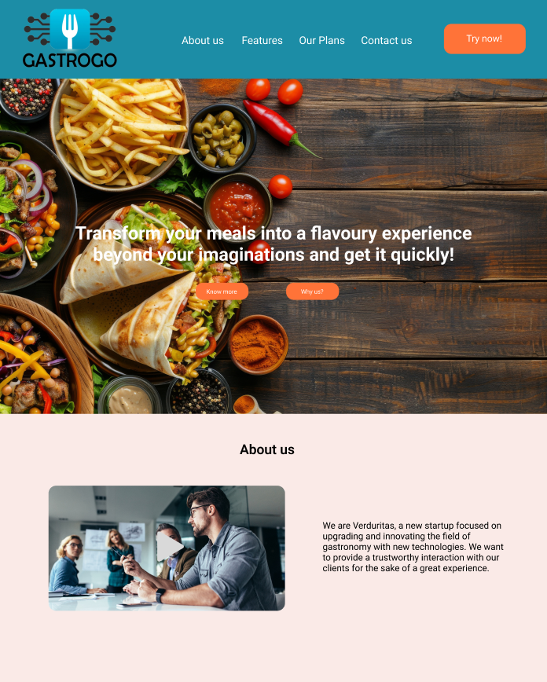

Para Mobile Browser:


## 4.4. Web Applications UX/UI Design

En este segmento se presentará el proceso de diseño de la aplicación web, desde los wireframes hasta los mock-ups. Se tuvo en cuenta las guías de estilo y arquitectura de información previamente explicadas para mantener una apropiada coherencia visual con la landing page.

### 4.4.1. Web Applications Wireframes

En esta sección se presentarán los wireframes de la aplicación web. Estos son los esquemas de baja fidelidad, un blueprint para saber cómo vamos a estructurar la aplicación web antes de continuar con las guías de estilo e imágenes.

Iniciar Sesión


Pago de membresía


Recuperar Contraseña


Determinar el tipo de usuario (Grupo de Trabajadores o Restaurantes)

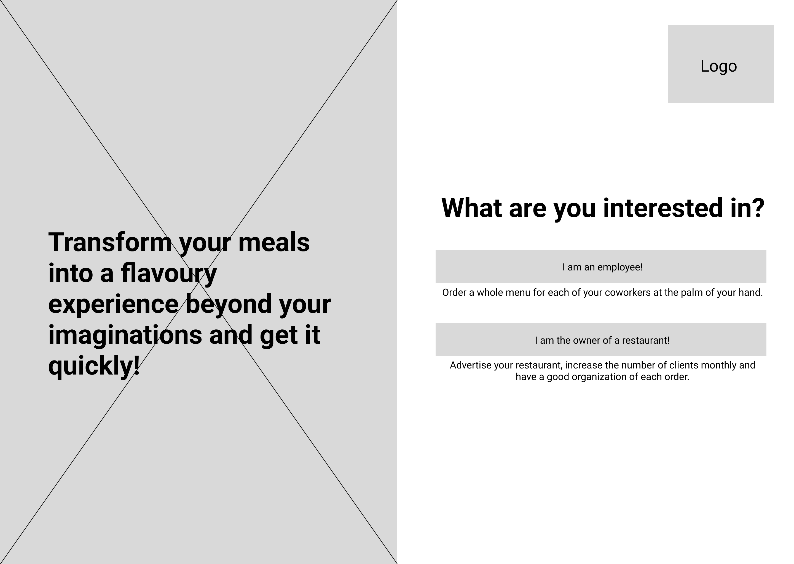

Explicación de Planes


Ingreso de información para el tipo de usuario


Pantalla principal para segmento de grupo de trabajadores


Detalles de cada restaurante para los trabajadores


Ordenar una comida y añadir notas para el restaurante


Pantalla de órdenes realizadas por el grupo de trabajadores


Pantalla de actividades grupales para los trabajadores y pago equitativo de cuenta


Perfil del trabajador y su respectiva suscripción


Pantalla de notificaciones para los trabajadores


Pantalla principal para segmento de restaurantes (incluye órdenes recientes y su reputación en la página web)


Pantalla de órdenes y detalles del restaurante


Pantalla para crear menús y visualizar el detalle de cada uno


Perfil del restaurante y su respectiva suscripción


Pantalla de notificaciones para los restaurantes


### 4.4.2. Web Applications Wireflow Diagrams

En esta sección se presentarán los wireflow diagrams, que son diagramas que muestran la navegación de la aplicación web. Estos diagramas nos permitirán dar una noción de cómo será la experiencia del usuario al navegar por la aplicación web.

Grupo de Trabajadores:

User Goal: Como líder de grupo de trabajadores, quiero poder iniciar sesión, unirme a GastroGo, recuperar mi contraseña y tener la posibilidad de tener una suscripción para ingresar a la aplicación web.


User Goal: Como líder de grupo de trabajadores, quiero ordenar comida, poder mandar una nota que mencione lo que no se desea en el pedido para tener una buena experiencia dentro de la aplicación y disfrutar mi merienda.


User Goal: Como líder de grupo de trabajadores, quiero poder cancelar una orden en caso no la necesite o prefiera otro restaurante y se le avise al restaurante inmediatamente para evitar incomodidades en la comida.

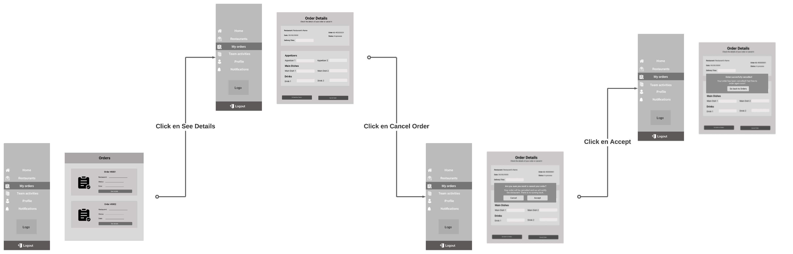


User Goal: Como líder de grupo de trabajadores, quiero tener un método de pago para realizar la compra de pedidos para tener los beneficios de la plataforma acorde al plan escogido.


Restaurantes:

User Goal: Como dueño de un restaurante, quiero poder iniciar sesión, unirme a GastroGo, recuperar mi contraseña y pagar la suscripción para ingresar a la aplicación web.


User Goal: Como dueño de un restaurante, quiero añadir los distintos menús que tenemos disponibles y ver los detalles de los que ya estén agregados para poder generar más clientela para mi negocio y aumentar nuestras ganancias.


User Goal: Como dueño de un restaurante, quiero revisar las órdenes y denegar algunas en caso sobrepase la capacidad del equipo de cocina para preservar la calidad de las órdenes y mantener una buena experiencia para el usuario.


### 4.4.3. Web Applications Mock-ups
En esta sección se presentan los mock-ups de la aplicación web. Es decir, a base de los wireframes vistos anteriormente se ha creado una esquematización de alta fidelidad, acorde a las guías de estilo, arquitectura de la información y componentes mencionados en secciones anteriores.

Enlace al Figma: https://www.figma.com/design/960VZNosb8riMpUJHtW4UR/OpenSource?node-id=1-2&t=cbyL7czsaZGGdrXc-1 


Detalles de cada restaurante para los trabajadores


Ordenar una comida y añadir notas para el restaurante


Pantalla de órdenes realizadas por el grupo de trabajadores


Pantalla de órdenes y detalles del restaurante


Pantalla para crear menús y visualizar el detalle de cada uno

### 4.4.4. Web Applications User Flow Diagrams

En esta sección se mostrarán los posibles caminos que puede seguir el usuario (happy path y unhappy path) al momento de navegar por la aplicación web. De esta forma, se podrá tener una base de cómo los usuarios navegarán en la aplicación.

Grupo de Trabajadores:

User Goal: Como líder de grupo de trabajadores, quiero poder iniciar sesión, unirme a GastroGo, recuperar mi contraseña y tener la posibilidad de tener una suscripción para ingresar a la aplicación web.


User Goal: Como líder de grupo de trabajadores, quiero ordenar comida, poder mandar una nota que mencione lo que no se desea en el pedido para tener una buena experiencia dentro de la aplicación y disfrutar mi merienda.


User Goal: Como líder de grupo de trabajadores, quiero poder cancelar una orden en caso no la necesite o prefiera otro restaurante y se le avise al restaurante inmediatamente para evitar incomodidades en la comida.


User Goal: Como líder de grupo de trabajadores, quiero tener un método de pago para realizar la compra de pedidos para tener los beneficios de la plataforma acorde al plan escogido.


Restaurantes:

User Goal: Como dueño de un restaurante, quiero poder iniciar sesión, unirme a GastroGo, recuperar mi contraseña y pagar la suscripción para ingresar a la aplicación web.


User Goal: Como dueño de un restaurante, quiero añadir los distintos menús que tenemos disponibles y ver los detalles de los que ya estén agregados para poder generar más clientela para mi negocio y aumentar nuestras ganancias.


User Goal: Como dueño de un restaurante, quiero revisar las órdenes y denegar algunas en caso sobrepase la capacidad del equipo de cocina para preservar la calidad de las órdenes y mantener una buena experiencia para el usuario.


## 4.5. Web Applications Prototyping

En este punto se demostrará el funcionamiento de nuestra aplicación web mediante un prototipo interactivo explicado. De esta forma, obtenemos una guía de lo que esperamos lograr con la aplicación y una noción tangible de su futuro funcionamiento.

Enlace de la explicación del prototipo: [**Web Application**](https://upcedupe-my.sharepoint.com/:v:/g/personal/u201714765_upc_edu_pe/EYhnox1X-wdBqr_LFFwrxS4BJPj_L2JvTeW_dxuLVBFfrA?e=vQ35aZ&nav=eyJyZWZlcnJhbEluZm8iOnsicmVmZXJyYWxBcHAiOiJTdHJlYW1XZWJBcHAiLCJyZWZlcnJhbFZpZXciOiJTaGFyZURpYWxvZy1MaW5rIiwicmVmZXJyYWxBcHBQbGF0Zm9ybSI6IldlYiIsInJlZmVycmFsTW9kZSI6InZpZXcifX0%3D)


## 4.6. Domain-Driven Software Architecture
### 4.6.1. Software Architecture Context Diagram
Context diagram:

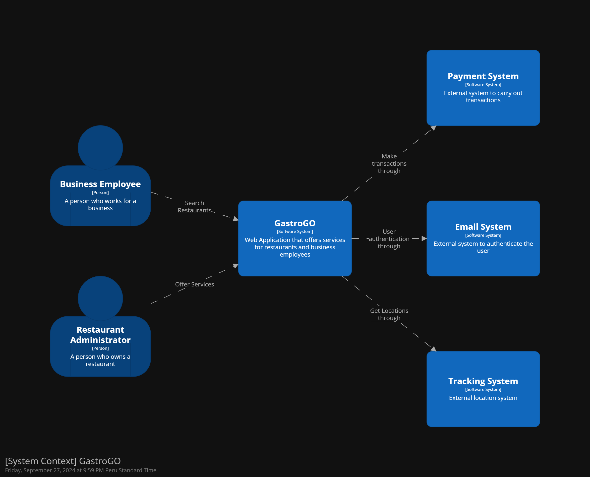

### 4.6.2. Software Architecture Container Diagrams
Container diagram:


### 4.6.3. Software Architecture Components Diagrams
Restaurant diagram:


User diagram:


Payment diagram:

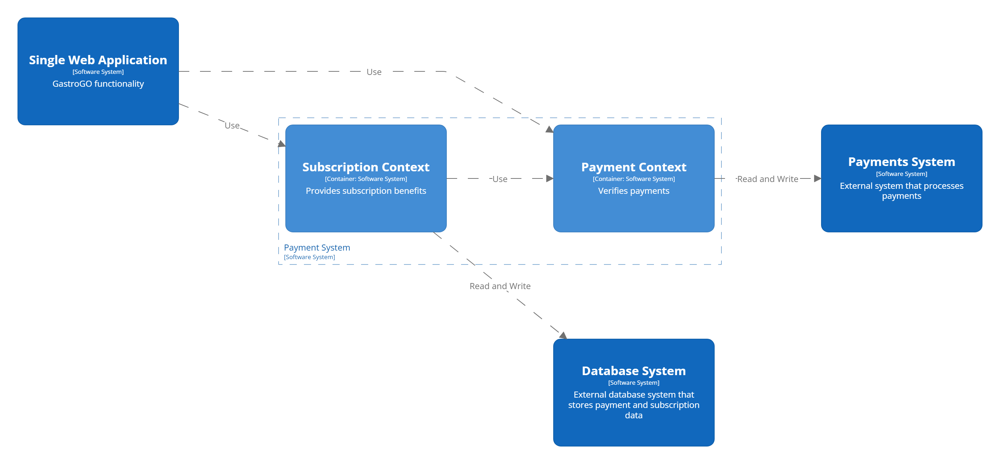


Authentication diagram:

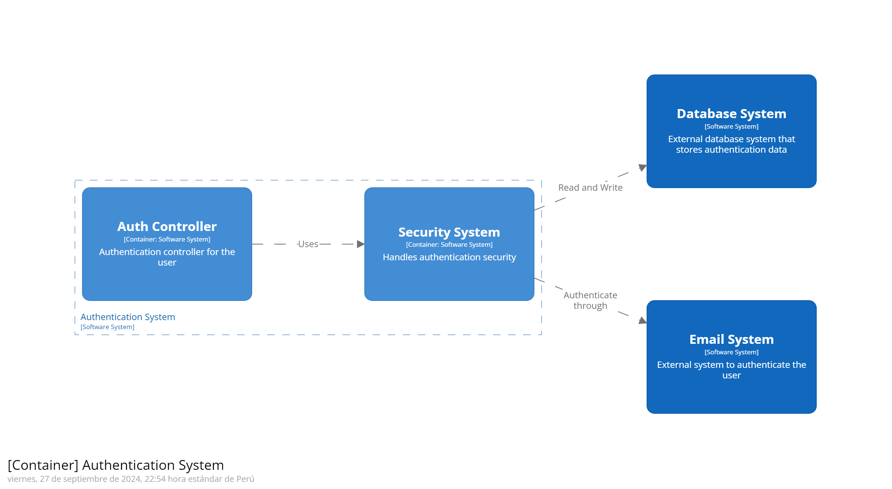

## 4.7. Software Object-Oriented Design
### 4.7.1. Class Diagrams

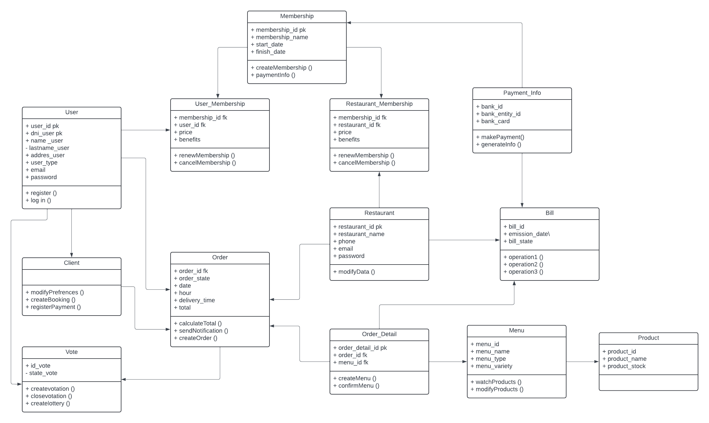

### 4.7.2. Class Dictionary

- Menu: Contiene los atributos menuID, name, description, price, category y una lista de menuItems. Los métodos asociados permiten agregar (addItem), remover (removeItem) y actualizar (updateItem) elementos del menú. Está relacionado con la clase MenuItem, ya que cada menú contiene múltiples elementos.

- MenuItem: Se define con los atributos itemID, name, description y price. Aunque no tiene métodos específicos, se relaciona con las clases Menu y OrderItem, ya que un elemento de menú puede formar parte de un pedido y también estar listado dentro de un menú.

- Order: La clase pedido tiene atributos como orderID, orderDate, status, totalAmount y una lista de orderItems. Los métodos asociados incluyen calculateTotal para calcular el total del pedido, updateStatus para cambiar su estado, y addOrderItem o removeOrderItem para gestionar los elementos en el pedido. Está relacionado con las clases OrderItem, Restaurant, Sales y User.

- OrderItem: Los atributos de esta clase son orderItemID, quantity, price y menuItem. Tiene el método calculateSubtotal, que permite calcular el subtotal del elemento en el pedido. Se vincula tanto con la clase Order como con la clase MenuItem, ya que un elemento de pedido hace referencia a un elemento específico del menú.

- Restaurant: Esta clase incluye los atributos name, description, address y openHours. Los métodos le permiten actualizar la disponibilidad (updateAvailability) y la descripción del restaurante (updateDescription). Está relacionado con RestaurantDetails, que ofrece más información sobre el restaurante.

- RestaurantDetails: Los atributos son rating, reviews, dishes y workSchedules. Tiene un único método, updateWorkSchedule, que actualiza los horarios de trabajo. Esta clase está vinculada a la clase Restaurant, proporcionando detalles adicionales que complementan la información del restaurante.

- Suscription: Los atributos de esta clase son id, price, type y status. No tiene métodos asociados explícitamente, pero está vinculada con las clases Delivery y User, lo que indica que los usuarios pueden tener una suscripción y los servicios de entrega pueden estar asociados a esta.

- Sales: Contiene los atributos saleID, saleDate y totalAmount. Los métodos permiten registrar una venta (recordSale), eliminar una venta (removeSale) y obtener una lista de ventas (getSales). Se relaciona con la clase Order, ya que cada venta está asociada con un pedido.

- Service: Esta clase tiene atributos como StatusService, description, DateStart, DateEnd y price. Los métodos incluyen initService para iniciar un servicio, endService para finalizarlo, cancelService para cancelarlo y changeStatus para cambiar el estado del servicio. Está vinculada a las clases Order y Worker, indicando que los servicios pueden estar relacionados con pedidos y trabajadores.

- Delivery: Sus atributos son license, car y subscription, indicando los detalles del vehículo y la suscripción asociada al servicio de entrega. Aunque no tiene métodos explícitos, está relacionada con la clase Suscription, lo que sugiere que las entregas pueden depender del tipo de suscripción del usuario.

- User: Incluye los atributos id, name, password, username, orderList, email y role. Los métodos son login para iniciar sesión, logout para cerrar sesión y checkOrders para revisar los pedidos del usuario. Está vinculada con la clase Order, ya que los usuarios pueden realizar y gestionar pedidos.

- PaymentMethod: Esta clase tiene los atributos paymentID, amount y paymentDate. Su método principal es processPayment, que permite procesar un pago. Está relacionada con las clases Sales, Order y Customer, indicando que los métodos de pago están asociados a ventas y pedidos específicos.

- Notification: Sus atributos incluyen id, price, type y status. No tiene métodos explícitos y no está vinculada específicamente con otras clases en el diagrama, aunque parece ser una entidad utilizada para gestionar notificaciones del sistema.

- Worker: Los atributos de esta clase son position, y los métodos son manageOrder para gestionar pedidos y manageReservation para gestionar reservas. Está vinculada con las clases Order y Reservation, lo que sugiere que los trabajadores pueden administrar tanto pedidos como reservas dentro del sistema.

- Customer: Incluye los atributos paymentMethod y reservationList. Los métodos asociados son placeOrder para hacer un pedido, makeReservation para realizar una reserva y cancelReservation para cancelar una reserva. Está relacionada con las clases Order y Reservation, lo que indica que los clientes pueden hacer pedidos y reservas.

- Controlador: Tiene los atributos service, orderList y users. Los métodos incluyen manageOrder para gestionar pedidos, assignOrderToWorker para asignar pedidos a trabajadores y manageMenus para gestionar los menús. Está vinculado con las clases Order, Service y Worker, lo que indica que este controlador gestiona el flujo general de los pedidos, servicios y asignación de trabajadores.

## 4.8. Database Design
### 4.8.1. Database Diagram
Database diagram:


# Capítulo V: Product Implementation, Validation & Deployment
## 5.1. Software Configuration Management
### 5.1.1. Software Development Environment Configuration

Este apartado tiene como objetivo proporcionar una descripción detallada de los productos de software utilizados en el proyecto, así como de su configuración y despliegue. Al documentar estos aspectos, se busca facilitar la colaboración de los desarrolladores actuales y futuros, asegurando que puedan comprender y manejar eficientemente el ciclo de vida del software, desde el desarrollo hasta la implementación.

**Project Management:**


- Trello: Se utilizó Trello para organizar y hacer un seguimiento de las tareas del proyecto. Esta herramienta permite visualizar el progreso de cada actividad, asignar responsabilidades y gestionar el flujo de trabajo del equipo. 

- Google Meet: Google Meet fue utilizado para llevar a cabo reuniones virtuales entre los miembros del equipo. Esta plataforma permite realizar videollamadas con opciones de compartir pantalla y grabar las sesiones. 


**Requirements Management:**


Trello: En el manejo de los requerimientos se utilizó Trello, una herramienta que facilita la colaboración en equipo para gestionar el backlog. Trello proporciona una vista cómoda y estructurada de las tareas pendientes, permitiendo que todos los miembros del equipo puedan priorizar y enfocarse en los objetivos comunes. Además, ofrece la flexibilidad de organizar y reorganizar las tareas según las necesidades del proyecto. Su uso es gratuito y solo requiere que los usuarios se registren para aprovechar todas sus funcionalidades.

**Product UX/UI Desing**

- UXPressia: Utilizada para la creación de User Personas, User Journey Maps y Empathy Maps, esta herramienta se destaca por sus plantillas prediseñadas que simplifican el desarrollo de estos artefactos. Además, es una plataforma colaborativa y gratuita, accesible para todos los navegadores tras un sencillo registro.

- Miro: Se empleó para la construcción y mapeo de escenarios como el As-is mapping, sirviendo a los objetivos de ambos segmentos definidos. Su capacidad para facilitar el trabajo colaborativo lo convierte en una herramienta valiosa para el desarrollo de estrategias visuales.

- Figma: Esta herramienta fue fundamental en la creación de wireframes y prototipos de aplicaciones móviles, permitiendo un enfoque colaborativo en tiempo real. Figma es accesible de manera gratuita al registrarse, lo que la hace una opción popular para equipos de diseño que buscan eficiencia y versatilidad.


**Software Development**

Landing Page:
- El landing page fue desarrollado empleando HTML5, CSS3 y JavaScript. HTML5 se encargó de la estructura básica del contenido, mientras que CSS3 se utilizó para estilizar la página, asegurando un diseño visual atractivo y coherente. JavaScript, por su parte, agregó interactividad, permitiendo funcionalidades dinámicas que mejoraron la experiencia del usuario. Estas tecnologías combinadas permitieron la creación de un landing page funcional y estéticamente agradable.


**IDE's de desarrollo**
Visual Studio Code : https://code.visualstudio.com/.es 
- Es un IDE muy adaptable que ofrece una experiencia de desarrollo optimizada y personalizable. Dispone de una extensa selección de extensiones que permiten ampliar sus capacidades.

Webstorm: https://www.jetbrains.com/webstorm/

- Es un entorno de desarrollo integrado enfocado en proyectos web, que proporciona numerosas herramientas y características diseñadas para la creación de aplicaciones web actuales. Su compatibilidad con tecnologías como JavaScript, HTML y CSS lo hace una opción sólida para desarrolladores web.


**Software testing**

Para las pruebas de software de la landing page, se utilizaron las herramientas de desarrollador de los navegadores web más populares, como Google Chrome (https://www.google.com/chrome/), Microsoft Edge (https://www.microsoft.com/en-us/edge), y Mozilla Firefox (https://www.mozilla.org/en-US/firefox/browsers/). Estos navegadores ofrecen aplicaciones tanto para escritorio como para dispositivos móviles, todas completamente gratuitas.

**Project Deployment**

Github Page: https://pages.github.com/

Para llevar a cabo el deployment de la landing page, se utilizó Github Pages, un servicio gratuito que permite alojar sitios web estáticos directamente desde un repositorio de Github. Esta plataforma es ideal para proyectos de desarrollo web que no requieren un servidor backend, ya que ofrece una forma sencilla y rápida de publicar contenido en línea.

Netlify: https://www.netlify.com/

Para llevar a cabo el deployment del front-end, se procedió a vincular el repositorio de Github con el servicio de Vercel. De este modo, el despliegue de la página será de manera óptima.


**Software Documentation**

- Google Drive: Fue utilizado como plataforma central para almacenar y compartir documentos y presentaciones, facilitando la colaboración en tiempo real. Herramientas complementarias como Google Docs permitieron la creación y edición colaborativa de informes y presentaciones, optimizando la entrega de documentación de alta calidad.

- Lucidchart: Esta herramienta resultó clave para el desarrollo de wireflows, user flows y diagramas UML, ofreciendo una interfaz intuitiva que permite a los usuarios crear diagramas y procesos secuenciales de forma rápida y eficiente. Lucidchart es accesible desde cualquier navegador y solo requiere una cuenta registrada, lo que la convierte en una opción versátil para el diseño de flujos y diagramas técnicos.

- Structurizr: Se empleó para la creación de diagramas C4, que son fundamentales en la visualización de la arquitectura de software. La herramienta permite una creación rápida y precisa de diagramas utilizando una sintaxis parecida a la de un lenguaje de programación. Su accesibilidad a través de un registro en la web la hace una opción robusta para arquitectos de software que buscan una herramienta especializada.


### 5.1.2. Source Code Management

Para gestionar y organizar los distintos cambios en el proyecto, se utilizó una organización en GitHub, lo que facilitó el control de versiones y la colaboración en el código fuente.

- [**Organización en GitHub**](https://github.com/UPC-PRE-SI729-2402-WX51-G1-Verduritas)

- [**Landing Page Repository**](https://github.com/UPC-PRE-SI729-2402-WX51-G1-Verduritas/GastroGo-Landing-Page)

- [**Report Repository**](https://github.com/UPC-PRE-SI729-2402-WX51-G1-Verduritas/GastroGo-Report)
  
- [**Acceptance Test**](https://github.com/UPC-PRE-SI729-2402-WX51-G1-Verduritas/acceptance-test)


Con el fin de optimizar el manejo de ramas y la implementación de modificaciones en el código, se adoptó la metodología GitFlow. Este enfoque estructuró el desarrollo en dos ramas principales:


- **Main:** Destinada a albergar las versiones oficiales de nuestro software, es decir, aquellas que están listas para ser implementadas en producción.


- **Develop:** Esta rama funciona como el entorno de integración, donde se unifican las funcionalidades en desarrollo. Una vez que el código en esta rama alcanza la estabilidad y es aprobado por el equipo, se fusiona en la rama de lanzamiento.


Esta rama es la rama principal donde se integran todas las características. Cuando se completa un feature de un capítulo, se debe fusionar con el 'develop'.


**Ramas auxiliares**

- **Feature:** Se usa para desarrollar nuevas funcionalidades o mejoras a partir de la rama develop y luego integrarlas con ella al finalizar el trabajo. Estas ramas permiten trabajar en el código sin comprometer la estabilidad de la rama principal, 'develop', y facilitan la revisión y gestión de las características antes de su integración.

Para las ramas `'features'`, hemos adoptado la siguiente convención de nombres: `'feature/feature-name'`.

Donde:

- Feature: Es el nombre de la rama.

- Feature-name: Es el nombre de la características que se están por desarrollar

Donde:

**type:** Especifica el tipo de cambio introducido en el commit. Los tipos mas comunes son:

- `feat`: Implementación de una nueva característica
- `fix`: Corrección de errores
- `chore`: Tareas de mantenimiento
- `docs`: Actualización de la documentación

**scope:** (opcional) Identifica el área del código que ha sido modificada. 

**description:** Proporciona una breve descripción del cambio realizado.


Ejemplo Report:
- Se crea una rama de `'feature/chapter-1'` a partir de la rama develop

- Se trabaja en la rama de `'feature/chapter-1'`

- Se hace un merge de la rama de `'feature/chapter-1'` a la rama develop

Ejemplo Landing Page:

- `'feature/html-structure'`. Indicando la sección a implementar.


### 5.1.3. Source Code Style Guide & Conventions


Para el diseño y construcción de la landing page, utilizamos HTML y CSS, siguiendo las recomendaciones de style guide de Google para HTML/CSS. Esta guía nos orienta en cómo escribir código de manera eficiente y estandarizada. Algunas de las prácticas que adoptamos incluyen:

- Declarar el tipo de documento para asegurar que los navegadores interpreten correctamente el código.

- Escribir los elementos HTML en minúsculas (por ejemplo, `<p>`, `<h1>`, `<section>`, `<header>`) para mantener la consistencia y legibilidad.

- Declarar entre comillas los atributos de los elementos HTML, como en `'<p class="nombre"></p>`, para evitar errores de interpretación.

- Especificar atributos esenciales como `alt`, `width`, y `height` en las imágenes, mejorando tanto la accesibilidad como el rendimiento de la página.

- Mantener las líneas de código concisas, evitando que sean demasiado largas, lo que facilita la lectura y el mantenimiento del código.

- Incluir siempre el elemento `<title>` en la cabecera del documento para definir el título de la página web.

- Emplear metaetiquetas (meta tags) al inicio del documento para establecer la codificación de caracteres, la descripción y otras configuraciones esenciales que mejoran la indexación y visualización de la página.

En cuanto al uso de JavaScript, seguimos las pautas de style guide de Google para JavaScript, asegurando un código limpio y bien estructurado. Algunas de las convenciones que aplicamos son:

- Nombrar variables y funciones utilizando el estilo camelCase, como en `numberArray`, para mejorar la claridad del código.

- Utilizar comillas simples `(')` para definir cadenas de texto, en línea con las mejores prácticas recomendadas.

- Finalizar cada sentencia con un punto y coma `(;)` para evitar posibles errores de ejecución.

- Preferir el uso de `let` y `const` en lugar de `var` para la declaración de variables, garantizando una mejor gestión del alcance de las variables.

Para el uso del lenguaje Gherkin en nuestro proyecto, adoptaremos las prácticas recomendadas en el artículo "Make your Gherkin Specifications More Readable", con el objetivo de asegurar que las especificaciones sean claras y comprensibles para todo el equipo de desarrollo y futuros miembros del equipo. Los archivos generados estarán en formato .feature, lo que facilita su identificación y manejo.
Para obterner información adicional sobre un mejor uso del Gherkin, revisar el siguiente enlace : https://specflow.org/gherkin/gherkin-conventions-for-readable-specifications/

A continuación, se destacan algunas de las convenciones que seguiremos:

- Redacción en un lenguaje sencillo y accesible: Las especificaciones se escribirán en un lenguaje que sea fácil de entender por todos los miembros del equipo, independientemente de su experiencia técnica.

- Uso de las palabras clave `Given`, `When`, `Then`, y `And`: Estas palabras estructuran los pasos de los escenarios, lo que facilita la comprensión y la coherencia en la descripción de las pruebas.

- Empleo de verbos en forma finita: Se utilizarán verbos claros y directos para describir las acciones en los escenarios, asegurando precisión y claridad.

- Eliminación de redundancias: Evitaremos repeticiones innecesarias en la descripción de los pasos del escenario, garantizando que cada paso sea conciso y directo.

- Consistencia en el formato y estilo: Mantendremos un formato y estilo uniforme en todas las especificaciones, lo que facilita la lectura y el mantenimiento del conjunto de pruebas.

Estas convenciones no solo mejorarán la legibilidad de nuestras especificaciones, sino que también facilitarán la colaboración entre los diferentes miembros del equipo, asegurando que todos comprendan y sigan las mismas directrices.


### 5.1.4. Software Deployment Configuration
En esta sección explicaremos el proceso de despliegue de nuestra página de aterrizaje utilizando el servicio automatizado de GitHub Pages. A continuación, se detallarán los pasos requeridos para alcanzar el despliegue.
  
- Debemos asegurarnos de tener un repositorio con la landing page a desplegar.

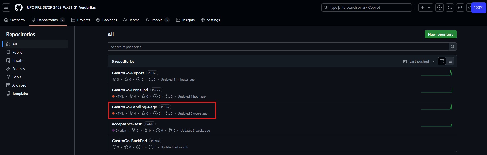

-   Accedemos a nuestro repositorio y debemos de añadir el html, css y js segun corresponda.


- Debemos ingresar al apartado de configuracion de nuestro repositorio.

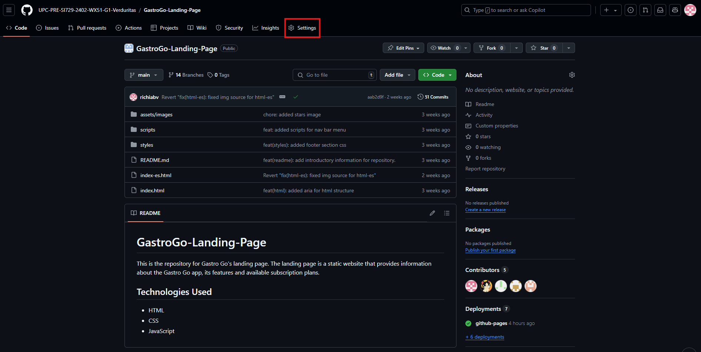

- Dentro de la configuracion debemos seleccionar el apartado de GitHub Pages.


- Una vez dentro de GitHub Pages debemos seleccionar la branch que deseamos desplegar y presionar el boton de save para que empieze a desplegarse.


- Una vez final el build podremos visualizar el enlace con el que podremos visualizar nuestra landing page desplegada.


## 5.2. Landing Page, Services & Applications Implementation
### 5.2.1. Sprint 1


#### 5.2.1.1. Sprint Planning 1

| **Sprint #**                    | Sprint 1                                                                 |
|---------------------------------|---------------------------------------------------------------------------|
| **Sprint Planning Date**        | 20/08/2024                                                                |
| **Time**                        | 22:00 PM                                                                  |
| **Location**                    | Google Meet                                                               |
| **Prepared By**                 | Ricardo Barrutia                                                               |
| **Attendees**                   | Ricardo Barrutia, Edery Abanto, Jose Cuevas, Fabiola Espinoza, Joaquin Pedraza       |
| **Sprint Review Summary**       | En esta entrega, no hay un Sprint anterior, por lo tanto, no hay resúmen del Sprint. |
| **Sprint Retrospective Summary**| En esta entrega, no hay un Sprint anterior, por lo tanto, no hay resúmen del Sprint. |
| **Sprint Goal**                 | En este sprint se tiene como objetivo el desarrollo de la landing page y el despliegue de la misma. Además, durante las diversas reuniones del equipo se determinó el contenido y diseño de la landing page, el cual fue implementado en Figma. Una vez concluido el sprint, la landing debe estar desplegada en GitHub Pages y los usuarios podrán acceder a la misma a través del link. |
| **Sprint Velocity**             |    8                                                                       |
| **Sum of Story Points**         | 8 Story points                                                              |

#### 5.2.1.2. Sprint Backlog 1


| **#Orden** | **User Story Id** | **Título**                                         | **Descripción**                                                                                                                                                                                                                                     | **Story Points (1 / 2 / 3 / 5)** |
|------------|--------------------|----------------------------------------------------|-----------------------------------------------------------------------------------------------------------------------------------------------------------------------------------------------------------------------------------------------------|---------------------------------|
| 1          | E1 - US001         | Barra de navegación                                | **Como** visitante<br>**Quiero** ver una barra de navegación en la parte superior de la página<br>**Para** poder acceder fácilmente a las secciones principales del sitio.                                                                         | 1                               |
| 2          | E1 - US002         | Sección de introducción                            | **Como** visitante<br>**Quiero** leer una breve introducción sobre "Gastro Go"<br>**Para** entender qué ofrece la aplicación.                                                                                                                     | 1                               |
| 3          | E1 - US003         | Sección de funcionalidades                         | **Como** visitante<br>**Quiero** ver una lista de funcionalidades destacadas de la aplicación<br>**Para** evaluar si satisface mis necesidades.                                                                                                      | 1                               |
| 4          | E1 - US004         | Sección de cómo funciona                           | **Como** visitante<br>**Quiero** comprender el proceso de uso de la aplicación “Gastro Go”<br>**Para** saber cómo funciona en la práctica.                                                                                                           | 1                               |
| 5          | E1 - US005         | Sección de testimonios                             | **Como** visitante<br>**Quiero** leer testimonios de usuarios actuales<br>**Para** conocer la experiencia de otras personas con la aplicación.                                                                                                        | 1                               |
| 6          | E1 - US006         | Sección de contacto                                | **Como** visitante<br>**Quiero** encontrar un formulario de contacto<br>**Para** poder enviar consultas o solicitar más información sobre la aplicación.                                                                                             | 1                               |
| 7          | E1 - US007         | Sección de footer                                 | **Como** visitante<br>**Quiero** ver un footer en la página<br>**Para** poder acceder rápidamente a enlaces importantes, redes sociales, y suscribirme al boletín.                                                                                 | 1                               |
| 8          | E1 - US008         | Cambio de idioma                                  | **Como** visitante<br>**Quiero** poder cambiar el idioma de la aplicación<br>**Para** visualizar el contenido en mi idioma preferido.                                                                                                                | 1                               |

#### 5.2.1.3. Development Evidence for Sprint Review

| **Repository** | **Branch**           | **Commit Id**                              | **Commit Message**                                          | **Committed on (Date)** |
|----------------|----------------------|--------------------------------------------|-------------------------------------------------------------|-------------------------|
|GastroGo-Landing-Page| develop              | d601ff9579fe58a7fcfe6645c3b6a1aa6d6cc220   | Initial commit                                             | 30/08/2024              |
|GastroGo-Landing-Page                | develop              | a9547ff52f913db19f386567626132c0e19cfcb2   | feat(readme): add introductory information for repository.   | 06/09/2024              |
|GastroGo-Landing-Page                | develop              | 60c22dd66c176a7d01d5d3a1f133eb78538b153d   | feat(images): add images for favicon.                       | 06/09/2024              |
|GastroGo-Landing-Page                | develop              | 71b80efe8234afead54fff99c5a1c7c4115f63b3   | feat(styles): add styles.css for the index.html stylesheet. | 06/09/2024              |
|GastroGo-Landing-Page                | develop              | 330d71d00cec4757c304a8bac42f343a9d25a6c8   | feat(index): add base of index.html for other branches.     | 06/09/2024              |
|GastroGo-Landing-Page                | feature/navbar       | 5d0da1f0c2e5c59f8887f311182b458b87916829   | feat(html): added nav bar html structure.                   | 06/09/2024              |
|GastroGo-Landing-Page                | feature/navbar       | c6cdaa2e3ef8f2945d25abd92075e82137778c20   | feat(styles): added css for nav bar                         | 06/09/2024              |
|GastroGo-Landing-Page                | feature/navbar       | 5c620cbeff0a7340087ce00ffe69fab9624e06fa   | chore: added logo gastrogo                                  | 06/09/2024              |
|GastroGo-Landing-Page                | feature/navbar       | c6a03ba1d6909b0380c977233d8c889853fbfb7a  | feat: added scripts for nav bar menu                        | 06/09/2024              |
|GastroGo-Landing-Page                | feature/introduction | e53740842f95bf2bc6e3f9af723957d3f60f3618   | feat(styles): added introduction css                        | 06/09/2024              |
|GastroGo-Landing-Page                | feature/introduction | a63dcf88e0434471004f9e2fc6949c71beef83fe   | feat(html): added html introduction section                 | 06/09/2024              |
|GastroGo-Landing-Page                | feature/introduction | 6d1c4ea8ce1ee60d81722e8093c0bee140a4081f   | chores: added introduction image                           | 06/09/2024              |
|GastroGo-Landing-Page                | feature/language     | 586af10b92c0dbd1a91bdaf5b22e0db22bcdcb79   | feat: added bar for language switch                         | 06/09/2024              |
|GastroGo-Landing-Page                | feature/language     | 133e0897df475de8d0c36a731cc6e3947bafcd90   | feat(css): added bar language css                           | 06/09/2024              |
|GastroGo-Landing-Page                | feature/about-us     | 5c26b87a430cd3de68633dd8c8fdaf79fffd9d03   | feat(html): added abouts us html structure                  | 06/09/2024              |
|GastroGo-Landing-Page                | feature/about-us     | edca0bb2c804513cf6157b252c0c870ccf1fb8bc   | feat(styles): added about us css                            | 06/09/2024              |
|GastroGo-Landing-Page                | feature/why-us       | 158de2b53aec0a7d85c41c20feec483affb73166   | feat(html): added why-us html structure                     | 06/09/2024              |
|GastroGo-Landing-Page                | feature/why-us       | ccfd68415b6924552a2bb4159f3e80e9c1facb20   | feat(styles): added why-us structure                       | 06/09/2024              |
|GastroGo-Landing-Page                | feature/features     | 4efe37be67aee31a603333eec80c88da54c7d257   | Update index.html                                           | 06/09/2024              |
|GastroGo-Landing-Page                | feature/features     | 07c51066d3cf5b6a4479f6e1a44fafe32a414714   | feat(styles): added features section css                    | 06/09/2024              |
|GastroGo-Landing-Page                | feature/features     | 73991d3701ab3c53633ec45f8dc2df62ff3fda04   | chore: added images features section                        | 06/09/2024              |
|GastroGo-Landing-Page                | feature/how-it-works | f9805a7ff47e40155ec8ba05f1ae7a91eed4cfb1   | chore: added images how it works section                    | 06/09/2024              |
|GastroGo-Landing-Page                | feature/how-it-works | 26a5fe1e1d6f6cebcd1642b1c276fb58eebdc697   | feat(html): added how it works section html                 | 06/09/2024              |
|GastroGo-Landing-Page                | feature/how-it-works | 5b485e93310b8edb730de036ebb951816d87a045   | feat(styles): added how it works section css                | 06/09/2024              |
|GastroGo-Landing-Page                | feature/experience   | 82de489cbc993334a0fb8ae18c73dfa281ee73af   | chore: added image experience1 seccion                      | 06/09/2024              |
|GastroGo-Landing-Page                | feature/experience   | 031b52d4a2ebba4850665ab970d35f0df84a0e2e   | chore: added image experience2 seccion                      | 06/09/2024              |
|GastroGo-Landing-Page                | feature/experience   | bd4831b4ad851fd003b46104f278aa87520a921f   | feat(styles): added experience section css                  | 06/09/2024              |
|GastroGo-Landing-Page                | feature/experience   | fbfd478dcb5f481fdc9cd019f8d8e9053c1f1b0c   | feat(html): added experience section html                  | 06/09/2024              |
|GastroGo-Landing-Page                | feature/plans        | 9d3f30764ddf050cf5a3c1e53d099de4860aa92b   | chore: added image plans1 section                           | 06/09/2024              |
|GastroGo-Landing-Page                | feature/plans        | 55650309d28ca1c815ebfa54848c7d7804e3ec1f   | chore: added image plans2 section                           | 06/09/2024              |
|GastroGo-Landing-Page                | feature/plans        | 855fe7ea8e4d7f43d63a67eadcbb755577bafa02   | chore: added image plans3 section                           | 06/09/2024              |
|GastroGo-Landing-Page                | feature/plans        | 6161f2e597c3aae131d578d0bec0b50afd3d6124   | feat(styles): added plans section css                           | 06/09/2024              |
|GastroGo-Landing-Page                | feature/plans        | def9a44e85d18c91b305091a48f36d7b297be580   | feat(html): added plans section html                          | 06/09/2024              |
|GastroGo-Landing-Page                | feature/contact-us   | b64dfac6840a319c07d620259ba04b0265c77ccd   | chore: added images contact-us                          | 06/09/2024              |
|GastroGo-Landing-Page                | feature/contact-us   | ab86926dc6c2ea6dcbb64bd43b4431e9e77992db   | feat(styles): added contact-us section css                         | 06/09/2024              |
|GastroGo-Landing-Page                | feature/contact-us   | a3e97f7a850053341300cf2050aed0254b0cc6e1   | feat(html): added contact-us section html                         | 06/09/2024              |
|GastroGo-Landing-Page                | feature/footer       | 4f83ae92f8ff72f64b77b843cac686b6d09add25   | chore: added footer images                      | 06/09/2024              |
|GastroGo-Landing-Page                | feature/footer       | cb337ae09fc9ccfd5b9e9f991f10922bbe4ca181   | feat(html): added footer section html                      | 06/09/2024              |
|GastroGo-Landing-Page                | feature/footer       | e1107f6c07937a0339e5b11309ad6ab7f18b2322   | feat(styles): added footer section css                     | 06/09/2024              |


#### 5.2.1.4. Testing Suite Evidence for Sprint Review
En este sprint, se ha completado el desarrollo de la landing page. Para su despliegue, se emplearon varias herramientas clave, entre ellas:

#### 5.2.1.5. Execution Evidence for Sprint Review

En esta entrega, el equipo Verduritas logró implementar la landing page, la cual presenta distintas secciones que ofrecen información esencial para los usuarios. Estas secciones están diseñadas para explicar quiénes somos, qué nos diferencia, cómo funciona nuestra plataforma, y brindar una visión general de la experiencia, los planes disponibles y un espacio para contactarnos. Con este enfoque, se busca proporcionar una experiencia clara y completa para los visitantes.

Enlace a la landing page desplegada: [GastroGo Landing Page](https://upc-pre-si729-2402-wx51-g1-verduritas.github.io/GastroGo-Landing-Page/)


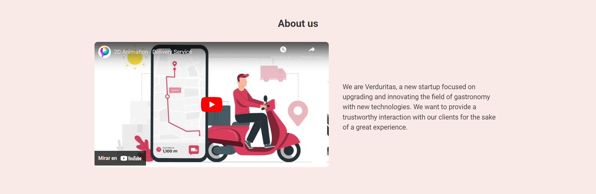


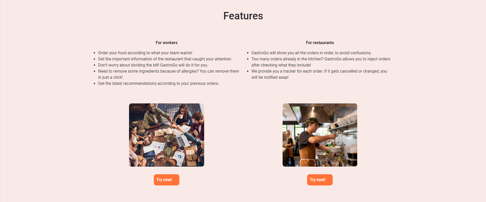


#### 5.2.1.6. Services Documentation Evidence for Sprint Review

Durante el sprint 1, se centró en el desarrollo de la landing page como primera tarea prioritaria. Dado que el enfoque principal fue establecer la estructura y diseño inicial de la página, no se integraron ni utilizaron servicios web en esta etapa. La implementación de servicios web se considerará en sprints futuros, una vez que la landing page esté completamente desplegada.

#### 5.2.1.7. Software Deployment Evidence for Sprint Review

- Git: Utilizado como sistema de control de versiones, facilitó la colaboración efectiva entre los miembros del equipo durante el proceso de desarrollo.
- GitFlow: Implementado como metodología de trabajo, permitió organizar y gestionar de manera eficiente los aportes de cada integrante, garantizando un flujo continuo en el progreso del proyecto.
- GitHub: Plataforma esencial para el trabajo colaborativo, donde se gestionaron y almacenaron todas las versiones del proyecto, asegurando un control adecuado de los cambios.
- GitHub Pages: Utilizado para desplegar la landing de forma rápida y sencilla, permitiendo que la aplicación esté disponible públicamente desde un repositorio de GitHub.


#### 5.2.1.8. Team Collaboration Insights during Sprint

El equipo trabajó en el desarrollo de la landing page utilizando ramas de cada feature, lo que permitió mejorar, actualizar y realizar modificaciones de manera más organizada. El uso de estas ramas facilita la integración y revisión antes de fusionarlas con la rama principal (main), asegurando que no se introduzcan errores. A continuación, se muestra el network graph y  code frecuency mediante la plataforma GitHub:

Network graph:


<br>

Code frecuency:


### 5.2.2. Sprint 2


#### 5.2.2.1. Sprint Planning 2
| **Sprint #**                    | Sprint 2                                                                                                                                                                                                                                                                                                         |
|---------------------------------|------------------------------------------------------------------------------------------------------------------------------------------------------------------------------------------------------------------------------------------------------------------------------------------------------------------|
| **Sprint Planning Date**        | 21/09/2024                                                                                                                                                                                                                                                                                                       |
| **Time**                        | 22:00 PM                                                                                                                                                                                                                                                                                                         |
| **Location**                    | Google Meet                                                                                                                                                                                                                                                                                                      |
| **Prepared By**                 | Ricardo Barrutia                                                                                                                                                                                                                                                                                                 |
| **Attendees**                   | Ricardo Barrutia, Edery Abanto, Fabiola Espinoza, Joaquin Pedraza                                                                                                                                                                                                                                   |
| **Sprint Review Summary**       | Se desplego la Landing Page de GastroGo en  y se empezo con el desarrollo del Front-End de la aplicación web.                                                                                                                                                                                                    |
| **Sprint Retrospective Summary**| Se evaluó la posibilidad de mostrar los call to action de forma personalizada para cada segmento de audiencia. Se inició el desarrollo del Front End de GastroGo, priorizando la creación de componentes enfocados en el segmento de trabajadores.                                                               |
| **Sprint Goal**                 | En este sprint, el objetivo es desarrollar las páginas principales de la aplicación web y realizar su despliegue. A lo largo de las diversas reuniones del equipo, se asignó el contenido a cada integrante para el front end. Al finalizar el sprint, la Web Application debe estar desplegada en GitHub Pages. |
| **Sprint Velocity**             | 35                                                                                                                                                                                                                                                                                                               |
| **Sum of Story Points**         | 43  Story Points                                                                                                                                                                                                                                                                                                             |


#### 5.2.2.2. Sprint Backlog 2

| **User Story**                           | **Work-item/Task**             | **Description**                                                                 | **Estimation (Hours)** | **Assigned To** | **Status**               |
|------------------------------------------|--------------------------------|---------------------------------------------------------------------------------|------------------------|-----------------|--------------------------|
| E2 - US013 Edición de cuenta            | W014 Save group preferences    | Permitir la edición de datos personales y de contacto en el perfil.             | 3                      | Edery           | Done                     |
| E2 - US014 Guardar preferencias de grupo| W013 Account editing           | Implementar un sistema para guardar preferencias de grupo para futuras órdenes. | 3                      | Joaquin         | Done                     |
| E2 - US017 Encuestas Post-Compra| W017 Post-purchase surveys     | Crear un sistema de encuestas post-compra para mejorar futuras órdenes.         | 4                      | Ricardo         | Done                     |
| E3 - US018 Búsqueda de restaurantes| W018 Restaurant search         | Habilitar la búsqueda de restaurantes por nombre, categoría o ubicación.                                                                                | 3                      | Fabiola         | Done                     |
| E3 - US019 Restaurantes recomendados| W019 Recommended restaurants   | Mostrar una lista de restaurantes recomendados por popularidad y satisfacción.                                                                                | 4                      | Ricardo         | Done                     |
|E3 - US020 Información del restaurante              | W020 Restaurant information    | Proporcionar información detallada de los restaurantes seleccionados.                                                                                | 3                      | Edery           | Done                     |
|E4 - US024 Confirmar o agregar a votación                 | W024 Confirm or add to vote    | Confirmar o agregar platos personalizados a la votación del grupo.                                                                                | 4                      | Fabiola         | Done                     |
|E5 - US025 Creación automática de votación                   | W025 Automatic vote creation   | Crear automáticamente votaciones para la elección de platos.                                                                                | 3                      | Joaquin         | Done                     |
|E5 - US026 Compartir código de votación         | W026 Share voting code         | Generar y compartir un código para participar en la votación.                                                                                | 3                      | Ricardo         | Done                     |
|E5 - US027 Resolución de empates con sorteo         | W027 Tie resolution by lottery | Resolver empates en votaciones mediante un sorteo.                                                                                | 3                      | Edery           | Done                     |
|E6 - US028 Dividir el costo del pedido         | W028 Split the order cost      | Dividir automáticamente el costo del pedido entre los participantes.                                                                                | 4                      | Joaquin         | Done                     |
|E6 - US029 Métodos de pago diversos         | W029 Diverse payment methods                               | Permitir múltiples métodos de pago (tarjeta, PayPal, etc.).                                                                                | 3                      | Ricardo         | Done                     |
|E6 - US031 Registro y confirmación de pagos grupales         | W031 Group payment registration and confirmation                               | Registrar y confirmar los pagos grupales realizados.                                                                                | 5                      | Ricardo         | Done                     |
|E6 - US032 Opción de propina compartida         | W032 Shared tip option                               | Habilitar la opción de agregar una propina compartida.                                                                                | 3                      | Ricardo         | Done                     |
|E6 - US033 Generación automática de recomendaciones         | W033 Automatic recommendation generation                               | Generar recomendaciones automáticas basadas en pedidos anteriores.                                                                                | 3                      | Fabiola         | Done                     |


#### 5.2.2.3. Development Evidence for Sprint Review 2
| **Repository** | **Branch** | **Commit Id**                                               | **Commit Message**                                                      | **Committed on (Date)** |
|----------------|------------|-------------------------------------------------------------|-------------------------------------------------------------------------|-------------------------|
|GastroGo-FrontEnd| develop    | initial commit                                              |  930f9b40b621421497a6f43efd4eef39899b14ae                                                         | 27/09/2024              |
|GastroGo-FrontEnd               |develop            | chore: added material design                                |   b3029af23cd62c564bac21bba5235b86ffcd7501                                        | 27/09/2024              |
|GastroGo-FrontEnd               |develop            | chore: added dependencies for ngx-translate                 |     6e9e0a774231b595093203fd6dde25ef8121bbe1                                      | 27/09/2024              |
|GastroGo-FrontEnd               |develop            | chore: clear app.component                                  |  ca69e281e096cd62cded1b56b2089421a7d13cd1                                         | 27/09/2024              |
|GastroGo-FrontEnd               |develop            | feat(sidenav-bar): added sidenav-bar component              |   8cecb8942695af1188382bc45a9e03b43ae0fc63                                        | 27/09/2024              |
|GastroGo-FrontEnd               |develop            | feat(sidenav-bar): added sidenav-bar to app.component.html  |   004adf8a79086a907102a261d41185062d912e66                                        | 27/09/2024              |
|GastroGo-FrontEnd               |develop            |  feat(sidenav-bar): added app.component css for sidenav-bar                                                           | c2164ad5266d7db73f1cb48e5391a4d3d9490134                                          | 27/09/2024              |
|GastroGo-FrontEnd               |develop            |  chore: added routes for side-navigator-bar                                                           |  9db69d22fecd23d5962426696d84a577eb8388b6                                         | 27/09/2024              |
|GastroGo-FrontEnd               |develop            |   feat(sidenav-bar): added sidenav-bar css                                                          |   7529483380fb810741c7328c96785f6c923a0ce5                                        | 27/09/2024              |
|GastroGo-FrontEnd               |develop            |   chore: added src/assets route                                                          |   e02d0319880613bb4a13d058ab75e6effd7a3cea                                        | 27/09/2024              |
|GastroGo-FrontEnd               |develop            |   feat(home.component): created home.component                                                         |  a0d1db4cb594baac7a34505b3888aef9ea2b863c                                          | 27/09/2024              |
|GastroGo-FrontEnd               |develop            |    feat(home.component): added html for home page                                                        | 4facb547c4f908c7adf39aa17c27a97c333dd473                                           | 27/09/2024              |
|GastroGo-FrontEnd               |develop            |    feat(home.component.css): added css for home page                                                        |  64a54e5d1a2de90f05d20f2c0455d566bb6e6d3b                                          | 27/09/2024              |
|GastroGo-FrontEnd               |develop            |  feat(my-order): added my-order component                                                          | 87e711d3200b93fb4dc8b27826b0fe735013a440                                           | 27/09/2024              |
|GastroGo-FrontEnd               |develop            |   feat(my-order): added css for order.component.css                                                         |  c246fec0b8a5c30b20637bb886c101622f01addd                                          | 27/09/2024              |
|GastroGo-FrontEnd               |develop            |   feat(rol-section): created rol-section-component                                                         | d6996e3792b0a86aff5b490f42d434a11af60971                                           | 27/09/2024              |
|GastroGo-FrontEnd               |develop            |  feat(rol-section): created rol-section-component html                                                          |  34c7ed50a7f25985f4c6bee117c968b2fa649f1e                                          | 27/09/2024              |
|GastroGo-FrontEnd               |develop            |  feat(rol-section): created rol-section-component css                                                          | 0d4c2106dd85f273459cf99025847b180f71b31c                                           | 27/09/2024              |
|GastroGo-FrontEnd               |develop            |   feat(profile): created profile page                                                         |  5a4574d8604e0cba51cf8a5c4d865eaacaf4dfab                                          | 27/09/2024              |
|GastroGo-FrontEnd               |develop            |    feat(restaurant): created restaurant page                                                        |   f048ae9f75c43e3f2c809bb7daed7096e8d6f6fc                                         | 27/09/2024              |
|GastroGo-FrontEnd               |develop            |    chore: added route-view for restaurant page                                                        |   c3adbe02b390ab3b5683ebe63f82625468711033                                         | 27/09/2024              |


#### 5.2.2.4. Testing Suite Evidence for Sprint Review 2
En este sprint, se ha completado el desarrollo de la landing page. Para su despliegue, se emplearon varias herramientas clave, entre ellas:

| **Repository** | **Branch** | **Commit Id**                              | **Commit Message**                                         | **Committed on (Date)** |
|----------------|------------|--------------------------------------------|--------------------------------------------------------------------------------------|-------------------------|
|acceptance-test| develop    | 55eb1646d73316ec2929ffafa95af8dfcef3adc5   | Initial commit                                                                        | 12/09/2024               |
|acceptnace-test| develop    | 9a399e19e898f0dd693654c70be3bd1fe67ea40e   | feat(readme): added description readme                                                                       | 12/09/2024               |
|acceptnace-test| develop    | 4b738eb74073aacbdcf2d3a37eabdaf21040c5a5   | chore: added epic 1 acceptance test                                                                     | 12/09/2024               |
|acceptnace-test| develop    | 06c167e00c191b77c03da4aa7cb13fab0d86c9d7   | chore: added epic 2 acceptance test                                                                       | 12/09/2024               |
|acceptnace-test| develop    | 62b806ee10782f3b6e3125964aaefd0ff552652c   | chore: added epic 3 acceptance test                                                                       | 12/09/2024               |
|acceptnace-test| develop    | 3ca6c4208a62a6b5ffa6d6dffe8d4f088918af5d   | chore: added epic 4 acceptance test                                                                      | 12/09/2024               |
|acceptnace-test| develop    | 2e7a6166e776f0d2f6d97368d384457e7bde7ca7   | chore: added epic 5 acceptance test                                                                        | 12/09/2024               |
|acceptnace-test| develop    | 5846374f45b976d826580c0855565212811be5e8   | chore: added epic 6 acceptance test                                                                       | 12/09/2024               |
|acceptnace-test| develop    | b41662bc5609e8d7bb84b24b99910ab621001c09   | chore: added epic 7 acceptance test                                                                       | 12/09/2024               |
|acceptnace-test| develop    | 64d26478f1b9e23cf51c31a56dbd17e63c4ad283   | chore: added epic 8 acceptance test                                                                       | 12/09/2024               |
|acceptnace-test| develop    | 9520021ae13032e410798dd06dbde7252b5d8d0f   | chore: added epic 9 acceptance test                                                                       | 12/09/2024               |
|acceptnace-test| develop    | 568eb409dc3fbf273ab11fcbf42f88b7ae9662ca   | chore: added epic 10 acceptance test                                                                       | 12/09/2024               |

#### 5.2.2.5. Execution Evidence for Sprint Review 2

En esta entrega, el equipo Verduritas logró implementar la landing page, la cual presenta distintas secciones que ofrecen información esencial para los usuarios. Estas secciones están diseñadas para explicar quiénes somos, qué nos diferencia, cómo funciona nuestra plataforma, y brindar una visión general de la experiencia, los planes disponibles y un espacio para contactarnos. Con este enfoque, se busca proporcionar una experiencia clara y completa para los visitantes.

Enlace del Frontend: [GastroGo Frontend](https://gastrogo-verduritas.netlify.app)


#### 5.2.2.6. Services Documentation Evidence for Sprint Review 2

Para el desarrollo de la plataforma, específicamente en la parte del Frontend, utilizamos lo siguiente:

Webstorm (IDE de desarrollo): Usamos Webstorm como nuestro entorno de desarrollo integrado para trabajar en el Frontend.

Angular (Framework): Optamos por Angular como el framework principal para el desarrollo.

GitHub: Nuestro repositorio del Frontend está alojado en GitHub, lo que facilita la colaboración y el seguimiento de los cambios en el código.

#### 5.2.2.7. Software Deployment Evidence for Sprint Review 2

El Execution Evidence para la revisión del sprint está orientado a documentar y presentar evidencia sobre el desarrollo logrado a lo largo del sprint, prestando especial atención al progreso en la landing page. Estas pruebas son esenciales para demostrar cómo se han cumplido los objetivos establecidos y qué partes del trabajo están terminadas, asegurando que se corresponden con las expectativas del cliente.

- Git: Utilizado como sistema de control de versiones, facilitó la colaboración efectiva entre los miembros del equipo durante el proceso de desarrollo.

- GitFlow: Implementado como metodología de trabajo, permitió organizar y gestionar de manera eficiente los aportes de cada integrante, garantizando un flujo continuo en el progreso del proyecto.

- GitHub: Plataforma esencial para el trabajo colaborativo, donde se gestionaron y almacenaron todas las versiones del proyecto, asegurando un control adecuado de los cambios.


#### 5.2.1.8. Team Collaboration Insights during Sprint 2

El equipo trabajó en el desarrollo de la landing page utilizando ramas de cada feature, lo que permitió mejorar, actualizar y realizar modificaciones de manera más organizada. El uso de estas ramas facilita la integración y revisión antes de fusionarlas con la rama principal (main), asegurando que no se introduzcan errores. A continuación, se muestra el network graph y  code frecuency mediante la plataforma GitHub:

Network graph:


Code frecuency:


# Conclusiones

### Conclusiones y recomendaciones

El progreso del proyecto ha logrado alcanzar los objetivos establecidos al inicio, que incluyen tanto la contextualización del problema y su solución como el desarrollo y lanzamiento de la primera versión de la landing page y la implementación de funcionalidades clave. Cada miembro del equipo participó activamente en las diferentes etapas del proyecto.

Uno de los aprendizajes más importantes ha sido el valor de la comunicación y la colaboración entre los miembros del equipo. Además, las herramientas de colaboración, como GitHub y Figma, desempeñaron un papel esencial en la coordinación del trabajo, facilitando una gestión eficaz del código y una visualización clara del diseño de la landing page. Aprendimos que el uso adecuado de estas herramientas mejora la organización, planificación y eficiencia del trabajo en equipo.

### Video About-the-Team
  
---  
# Bibliografía

- Altametrics. (n.d.). Common challenges in restaurant operations and supply chain management. Altametrics. <br>https://altametrics.com/topics/common-challenges-in-restaurant-operations-and-supply-chain-management/ 

- Picker Express. (n.d.). Logística en restaurantes. Picker Express. <br>https://www.pickerexpress.com/blog/logistica-en-restaurantes 

- Universidad Científica del Sur. (2021). Análisis de la cadena de suministro en restaurantes de Lima Metropolitana (Tesis de licenciatura). Repositorio Institucional de la Universidad Científica del Sur.<br> https://repositorio.cientifica.edu.pe/handle/20.500.12805/728 

- Built In. (2023). How Cheetah and Choco are transforming the food supply chain. Built In.<br> https://builtin.com/articles/food-supply-chain-cheetah-choco 

- Euromonitor International. (2023). Limited-service restaurants in Peru. Euromonitor International. <br>https://www.euromonitor.com/limited-service-restaurants-in-peru/report 

---  
# Anexos
-  [**Organización de Github**]( https://github.com/UPC-PRE-SI729-2402-WX51-G1-Verduritas)
-  [**Report Repository**](https://github.com/UPC-PRE-SI729-2402-WX51-G1-Verduritas/GastroGo-Report)
- [**Acceptance Test**](https://github.com/UPC-PRE-SI729-2402-WX51-G1-Verduritas/acceptance-test)
-  [**Landing Page**](https://github.com/UPC-PRE-SI729-2402-WX51-G1-Verduritas/GastroGo-Landing-Page)
- [**Front End**](https://github.com/UPC-PRE-SI729-2402-WX51-G1-Verduritas/GastroGo-FrontEnd)

- Videos de Exposiciones:
- TB1: [upc-pre-202401-si729-wx51-verduritas-expo-tb1.mp4](https://upcedupe-my.sharepoint.com/:v:/g/personal/u201714765_upc_edu_pe/EXxL52cQz7tMgtQ3JJSryDYBB4yl3rAXfIEsLBUWp-Icwg?e=cegRN9&nav=eyJyZWZlcnJhbEluZm8iOnsicmVmZXJyYWxBcHAiOiJTdHJlYW1XZWJBcHAiLCJyZWZlcnJhbFZpZXciOiJTaGFyZURpYWxvZy1MaW5rIiwicmVmZXJyYWxBcHBQbGF0Zm9ybSI6IldlYiIsInJlZmVycmFsTW9kZSI6InZpZXcifX0%3D)
- [**Web Applications Prototyping**](https://upcedupe-my.sharepoint.com/:v:/g/personal/u201714765_upc_edu_pe/EYhnox1X-wdBqr_LFFwrxS4BJPj_L2JvTeW_dxuLVBFfrA?e=vQ35aZ&nav=eyJyZWZlcnJhbEluZm8iOnsicmVmZXJyYWxBcHAiOiJTdHJlYW1XZWJBcHAiLCJyZWZlcnJhbFZpZXciOiJTaGFyZURpYWxvZy1MaW5rIiwicmVmZXJyYWxBcHBQbGF0Zm9ybSI6IldlYiIsInJlZmVycmFsTW9kZSI6InZpZXcifX0%3D )
- Needfinding: [**upc-pre-202402-si729-wx51-verduritas-needfinding-sprint-1.mp4**](https://upcedupe-my.sharepoint.com/:v:/g/personal/u201714765_upc_edu_pe/EZ80d-4uHTVKuQRdGAb47hMBjv6m3FXksZM6ieafoOaeLA?e=QO9QOa&nav=eyJyZWZlcnJhbEluZm8iOnsicmVmZXJyYWxBcHAiOiJTdHJlYW1XZWJBcHAiLCJyZWZlcnJhbFZpZXciOiJTaGFyZURpYWxvZy1MaW5rIiwicmVmZXJyYWxBcHBQbGF0Zm9ybSI6IldlYiIsInJlZmVycmFsTW9kZSI6InZpZXcifX0%3D)
