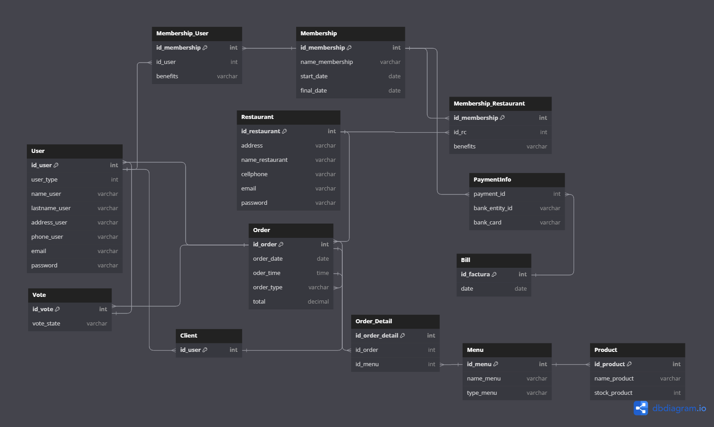

Universidad Peruana de Ciencias Aplicadas

Carrera: Ingeniería de Software

Ciclo: 2024-02

Curso: Desarrollo de Aplicaciones Open Source

Sección: WX51

Profesor: Alberto Wilmer Sanchez Seña

Informe del Trabajo Final - TB1

Startup: Verduritas

Producto: GastroGo

| Member                                | Code       |
|---------------------------------------|------------|
| Abanto Vicente, Edery Renzo         | U201822832 |
| Barrutia Vaez, Ricardo Andree       | U201714765 |
| Cuevas Vera, Jose Angel        | U202214632 |
| Espinoza Inoñan, Fabiola Ximena     | U202214784 |
| Pedraza Maldonado, Joaquin Andree          | U202218514 |

**Agosto del 2024**

  
---  
# Registro de Versiones del Informe

| Versión | Fecha      | Autor   | Descripción de modificaciones         |
|---------|------------|---------|---------------------------------------|
| 1.0     | 25/08/2024 | Abanto Vicente, Edery Renzo   	Barrutia Vaez, Ricardo Andree	  Cuevas Vera, Jose Angel	  Espinoza Inoñan, Fabiola Ximena	  Pedraza Maldonado, Joaquin Andree | Capítulo I   Capítulo II   Capítulo III   Capítulo IV   Capítulo V       |

  
---  
# Project Report Collaboration Insights

  
---  
# Student Outcome
El curso contribuye al cumplimiento del Student Outcome ABET: **ABET – EAC - Student Outcome 5**   Criterio: *Capacidad de comunicarse efectivamente con un rango de audiencias.*

En el siguiente cuadro se describe las acciones realizadas y enunciados de conclusiones por parte del grupo, que permiten sustentar el haber alcanzado el logro del ABET – EAC - Student Outcome 5.

| **Criterio específico** | **Acciones realizadas** | **Conclusiones** |
|-------------------------|--------------------------|-------------------|
| Trabaja en equipo para proporcionar liderazgo en forma conjunta | ***TB1:***   **Abanto Vicente, Edery Renzo**   Para esta TB1 realicé documentación descriptiva fácilmente entendible para el grupo y comenté posibles mejoras, además de crear y modificar constantemente los diagramas de baja fidelidad.    **Barrutia Vaez, Ricardo Andree**   Mi participación en el desarrollo de la TB1 incluyó principalmente la creación del Lean UX, el análisis de la competencia, la realización de entrevistas, así como el diseño del empathy map y el journey map. Además, contribuí en el capítulo V del documento. En cuanto a la landing page, trabajé en la implementación de la barra de navegación, la sección de introducción, y añadí la opción para cambiar de idioma.    **Cuevas Vera, Jose Angel**   Para desarrollar esta TB1, realicé la parte del To-Be scenario mapping, las user stories, los impact mappings y el product backlog, detallando cómo los usuarios interactuarán con el sistema en el futuro y cómo estas interacciones contribuirán a alcanzar los objetivos del proyecto.    **Espinoza Inoñan, Fabiola Ximena**   Realicé la investigación para obtener información de primera mano a través de las entrevistas y la documentación de software. Esto permitió conocer mejor a nuestro público objetivo y establecer estrategias frente a nuevos competidores para potenciar nuestra startup. También desarrollé una parte de la landing page, incluyendo "About Us" y "Why Us".    **Pedraza Maldonado, Joaquin Andree**   Para esta TB1, realicé el diagrama de clases, los diagramas de arquitectura del software, y modifiqué los mockups junto con sus flujos de usuarios. Además, elaboré la sección de características de la landing page.    | En conclusión, en la realización de la TB1, el equipo trabajó de manera coordinada para cubrir todos los aspectos del proyecto. Se abordaron diversas áreas, desde la investigación y el análisis hasta el diseño y desarrollo. Cada miembro del equipo aportó en diferentes áreas, contribuyendo al desarrollo de la landing page y a la creación de elementos clave como mapas de empatía, escenarios futuros, y funcionalidades específicas. El trabajo conjunto permitió un avance organizado y eficiente, cumpliendo con los objetivos establecidos y asegurando un resultado cohesivo y bien estructurado. |
| Crea un entorno colaborativo e inclusivo, establece metas, planifica tareas y cumple objetivos | ***TB1:***   **Abanto Vicente, Edery Renzo**   Para esta TB1 agregué descripciones generales para un mejor planteamiento del problema e investigué posibles enfoques de trabajo, además de diseñar muchos de los wireframes y mockups.    **Barrutia Vaez, Ricardo Andree**   Durante el proceso de desarrollo de la TB1, se llevaron a cabo numerosas sesiones de coordinación con el propósito de optimizar la planificación y la ejecución del trabajo. Estas reuniones permitieron definir claramente los objetivos y repartir las tareas de manera equitativa entre los integrantes del equipo, facilitando la revisión constante del progreso. Gracias a esta organización, las tareas fueron completadas de acuerdo a lo estimado, garantizando un avance fluido y eficiente del proyecto. Además, se realizaron ajustes cuando fue necesario para mantener el ritmo adecuado.    **Cuevas Vera, Jose Angel**   Para desarrollar la TB1, organizamos y celebramos una serie de reuniones clave. Estas sesiones fueron fundamentales para definir claramente nuestros objetivos y distribuir las tareas entre los miembros del equipo. Gracias a una gestión efectiva, logramos completar todas las tareas asignadas dentro del plazo estipulado.    **Espinoza Inoñan, Fabiola Ximena**   Se realizaron reuniones junto con todos los miembros del equipo y nos ayudamos entre nosotros para lograr cumplir con nuestro objetivo. También se designaron tareas para avanzar con el proyecto.    **Pedraza Maldonado, Joaquin Andree**   Para este TB1, al realizar el diagrama de clases, la arquitectura del software y la modificación de los mockups, tuve que analizar y plantear una manera en la cual la información fuera clara y concisa para el entendimiento de nuestros segmentos objetivos.    | En conclusión, en la realización de la TB1, el equipo abordó el proyecto de manera estructurada y colaborativa. Se realizaron descripciones generales para clarificar el problema y se investigaron diferentes enfoques de trabajo, desarrollando wireframes y mockups. A través de una serie de reuniones coordinadas, se definieron objetivos claros y se distribuyeron tareas equitativamente entre los miembros del equipo, lo que facilitó una planificación efectiva y un avance continuo. La gestión eficiente permitió completar las tareas dentro de los plazos establecidos, con ajustes realizados cuando fue necesario para mantener el ritmo del proyecto. Además, se diseñaron diagramas y se modificaron elementos visuales para asegurar una presentación clara y comprensible de la información. Este enfoque integral y organizado permitió una ejecución fluida del proyecto, cumpliendo con los objetivos y asegurando una solución cohesiva y bien documentada. |

---  
# Contenido
## Tabla de contenidos

### [Capítulo I: Introducción]()
- [1.1. Startup Profile]()
    - [1.1.1 Descripción de la Startup]()
    - [1.1.2 Perfiles de integrantes del equipo]()
- [1.2 Solution Profile]()
    - [1.2.1 Antecedentes y problemática]()
    - [1.2.2 Lean UX Process]()
        - [1.2.2.1. Lean UX Problem Statements]()
        - [1.2.2.2. Lean UX Assumptions]()
        - [1.2.2.3. Lean UX Hypothesis Statements]()
        - [1.2.2.4. Lean UX Canvas]()
- [1.3. Segmentos objetivo]()

### [Capítulo II: Requirements Elicitation & Analysis]()
- [2.1. Competidores]()
    - [2.1.1. Análisis competitivo]()
    - [2.1.2. Estrategias y tácticas frente a competidores]()
- [2.2. Entrevistas]()
    - [2.2.1. Diseño de entrevistas]()
    - [2.2.2. Registro de entrevistas]()
    - [2.2.3. Análisis de entrevistas]()
- [2.3. Needfinding]()
    - [2.3.1. User Personas]()
    - [2.3.2. User Task Matrix]()
    - [2.3.3. User Journey Mapping]()
    - [2.3.4. Empathy Mapping]()
    - [2.3.5. As-is Scenario Mapping]()
- [2.4. Ubiquitous Language]()

### [Capítulo III: Requirements Specification]()
- [3.1. To-Be Scenario Mapping]()
- [3.2. User Stories]()
- [3.3. Impact Mapping]()
- [3.4. Product Backlog]()

### [Capítulo IV: Product Design]()
- [4.1. Style Guidelines]()
    - [4.1.1. General Style Guidelines]()
    - [4.1.2. Web Style Guidelines]()
- [4.2. Information Architecture]()
    - [4.2.1. Organization Systems]()
    - [4.2.2. Labeling Systems]()
    - [4.2.3. SEO Tags and Meta Tags]()
    - [4.2.4. Searching Systems]()
    - [4.2.5. Navigation Systems]()
- [4.3. Landing Page UI Design]()
    - [4.3.1. Landing Page Wireframe]()
    - [4.3.2. Landing Page Mock-up]()
- [4.4. Web Applications UX/UI Design]()
    - [4.4.1. Web Applications Wireframes]()
    - [4.4.2. Web Applications Wireflow Diagrams]()
    - [4.4.3. Web Applications Mock-ups]()
    - [4.4.4. Web Applications User Flow Diagrams]()
- [4.5. Web Applications Prototyping]()
- [4.6. Domain-Driven Software Architecture]()
    - [4.6.1. Software Architecture Context Diagram]()
    - [4.6.2. Software Architecture Container Diagrams]()
    - [4.6.3. Software Architecture Components Diagrams]()
- [4.7. Software Object-Oriented Design]()
    - [4.7.1. Class Diagrams]()
    - [4.7.2. Class Dictionary]()
- [4.8. Database Design]()
    - [4.8.1. Database Diagram]()

### [Capítulo V: Product Implementation, Validation & Deployment]()
- [5.1. Software Configuration Management]()
    - [5.1.1. Software Development Environment Configuration]()
    - [5.1.2. Source Code Management]()
    - [5.1.3. Source Code Style Guide & Conventions]()
    - [5.1.4. Software Deployment Configuration]()
- [5.2. Landing Page, Services & Applications Implementation]()
    - [5.2.1. Sprint 1]()
        - [5.2.1.1. Sprint Planning 1]()
        - [5.2.1.2. Sprint Backlog 1]()
        - [5.2.1.3. Development Evidence for Sprint Review]()
        - [5.2.1.4. Testing Suite Evidence for Sprint Review]()
        - [5.2.1.5. Execution Evidence for Sprint Review]()
        - [5.2.1.6. Services Documentation Evidence for Sprint Review]()
        - [5.2.1.7. Software Deployment Evidence for Sprint Review]()
        - [5.2.1.8. Team Collaboration Insights during Sprint]()
    - [5.2.2. Sprint 2]()
        - [5.2.2.1. Sprint Planning 2]()
        - [5.2.2.2. Sprint Backlog 2]()
        - [5.2.2.3. Development Evidence for Sprint Review]()
        - [5.2.2.4. Testing Suite Evidence for Sprint Review]()
        - [5.2.2.5. Execution Evidence for Sprint Review]()
        - [5.2.2.6. Services Documentation Evidence for Sprint Review]()
        - [5.2.2.7. Software Deployment Evidence for Sprint Review]()
        - [5.2.2.8. Team Collaboration Insights during Sprint]()
    - [5.2.3. Sprint 3]()
        - [5.2.3.1. Sprint Planning 3]()
        - [5.2.3.2. Sprint Backlog 3]()
        - [5.2.3.3. Development Evidence for Sprint Review]()
        - [5.2.3.4. Testing Suite Evidence for Sprint Review]()
        - [5.2.3.5. Execution Evidence for Sprint Review]()
        - [5.2.3.6. Services Documentation Evidence for Sprint Review]()
        - [5.2.3.7. Software Deployment Evidence for Sprint Review]()
        - [5.2.3.8. Team Collaboration Insights during Sprint]()
    - [5.2.4. Sprint 4]()
        - [5.2.4.1. Sprint Planning 4]()
        - [5.2.4.2. Sprint Backlog 4]()
        - [5.2.4.3. Development Evidence for Sprint Review]()
        - [5.2.4.4. Testing Suite Evidence for Sprint Review]()
        - [5.2.4.5. Execution Evidence for Sprint Review]()
        - [5.2.4.6. Services Documentation Evidence for Sprint Review]()
        - [5.2.4.7. Software Deployment Evidence for Sprint Review]()
        - [5.2.4.8. Team Collaboration Insights during Sprint]()
- [5.3. Validation Interviews]()
    - [5.3.1. Diseño de Entrevistas]()
    - [5.3.2. Registro de Entrevistas]()
    - [5.3.3. Evaluaciones según heurísticas]()
- [5.4. Video About-the-Product]()

---  
# Capítulo I: Introducción
## 1.1. Startup Profile
### 1.1.1 Descripción de la Startup
### 1.1.2 Perfiles de integrantes del equipo
## 1.2 Solution Profile
### 1.2.1 Antecedentes y problemática
### 1.2.2 Lean UX Process
#### 1.2.2.1. Lean UX Problem Statements
#### 1.2.2.2. Lean UX Assumptions
#### 1.2.2.3. Lean UX Hypothesis Statements
#### 1.2.2.4. Lean UX Canvas
## 1.3. Segmentos objetivo
# Capítulo II: Requirements Elicitation & Analysis
## 2.1 Competidores
## 2.2. Entrevistas
### 2.2.1. Diseño de entrevistas
### 2.2.2. Registro de entrevistas
### 2.2.3. Análisis de entrevistas
## 2.3. Needfinding
### 2.3.1. User Personas
### 2.3.2. User Task Matrix
### 2.3.3. User Journey Mapping
### 2.3.4. Empathy Mapping
### 2.3.5. As-is Scenario Mapping
## 2.4. Ubiquitous Language
# Capítulo III: Requirements Specification
## 3.1. To-Be Scenario Mapping
## 3.2. User Stories
## 3.3. Impact Mapping
## 3.4. Product Backlog
# Capítulo IV: Product Design

Este capítulo se plantea en el proceso de diseño de los productos digitales que brinda DevDynasty. Asimismo, se enfocará en el diseño visual y la arquitectura de la información con la que se alinearán los productos para crear interfaces de usuario (UI) y experiencias de usuario (UX) efectivas.

## 4.1. Style Guidelines

En este segmento, se detallarán las guías de estilo específicas para la landing page y aplicación web. Esto será esencial para mantener coherencia en la apariencia visual de los elementos presentes en nuestros productos.

## 4.1.1. General Style Guidelines

**Branding:**

*Brand Overview* GastroGo es una plataforma diseñada para simplificar el procedo de pedidos de almuerzos (comúnmente conocido como menús) para distintos grupos de trabajadores dentro de empresas. Nuestro objetivo es ofrecer al usuario una experiencia fluida para los restaurantes asociados y a los empleados de distintas empresas de la capital. Nos aseguramos que de los empleados puedan obtener un almuerzo de su agrado y facilidad al momento de pedir y recibir. Asimismo, nos enfocamos en brindar a los restaurantes la oportunidad de expandir su clientela en el rubro.

*Brand Name* GastroGo utiliza "Gastro" (abreviatura de la palabra gastronomía) y "Go" (ir en la traducción al español) para transmitir la idea de la aplicación de manera rápida. Tener la abreviación de gastronomía indica, inmediatamente, que la aplicación está enfocada en alimentos. Asimismo, se tiene en cuenta el "go" porque esta palabra suele estar relacionada con movilidad y rapidez. Es por ello que el nombre es fácil de entender desde la perspectiva del usuario, sabrá instantáneamente que el producto es sobre pedidos de comida. Al ser un nombre llamativo, permitirá que captemos la atención de un amplio número de usuarios interesados en encontrar una solución rápida de comida.

A continuación, se mostrará el logo:

Se utilizó el nombre completo de la aplicación debido a que es corta y fácil de recordar. También, el uso de un tenedor como imagen central representa los pedidos de comida que se pueden realizar. Incluimos unas líneas que parten del punto central a distintos círculos, esto representa que la conexión que permite GastroGo, de los restaurantes a varios grupos de empleados con la necesidad de recibir su comida para la hora del almuerzo.

**Typography:**

Se utilizó la fuente Roboto debido a su facilidad al momento de leer. Roboto es una fuente bastante utilizada en la mayoría de aplicaciones debido a la legibilidad que presenta. Para utilizarla, tuvimos en cuento el tamaño de letra para los cuatro niveles necesarios para nuestros productos que son los encabezados, cuerpo de texto, botones y enlaces.

*Typescale recuperado de*: https://m2.material.io/design/typography/the-type-system.html 

**Colors:**

Para poder escoger los colores representativos de la aplicación, decidimos basarnos en los efectos que puede producir en los usuarios al momento de verlo. En este caso, se utilizaron los colores azul y naranja, de ahí partimos para crear la paleta de colores. La razón para escoger el azul es porque representa seguridad y es bastante popular en varias aplicaciones reconocidas. Además, es un color calmado, permite que el usuario se sienta cómodo al momento de navegar. Asimismo, decidimos agregar el color naranja como color secundario debido a la calidez que emite al usuario. La razón por la cuál se escogió el naranja es porque es más llamativo, por ello es que preferimos colocarlo en los call to action. 

Enlace a la paleta: https://www.figma.com/design/960VZNosb8riMpUJHtW4UR/OpenSource?node-id=0-1&t=SCpQeKPmjP50AJMN-1 

*Color Palette recuperado de*: https://material.io/design/color/the-color-system.html#color-theme-creation

**Spacing:**

El spacing a considerar para mantener el contenido entendible será:

- Button padding: 16 px (vertical), 26 px (vertical)
- Input fields: 40 px (altura), 20 px (espacio entre campos)
- Margin entre secciones: 60 px
- Height entre textos: 30 px

**Dimensions:**

Se prefirió utilizar un tono amigable y cercano, sin dejar de lado el respeto a los usuarios. GastroGo busca ser concisa en la comunicación, buscamos persuadir a los usuarios sin necesidad de ser muy serios, ya que esto podría causar un poco de incomodidad a los potenciales clientes.

## 4.1.2. Web Style Guidelines

Se creó una guía específica a seguir para los productos a presentar. Esto incluye los componentes a utilizar en la página web. Tenemos en cuenta la paleta de colores mencionadas con anterioridad. De esta forma, buscamos llamar la atención de los usuarios, esto permite que puedan navegar los productos con más interés. 

Enlace al esquema: https://www.figma.com/design/960VZNosb8riMpUJHtW4UR/OpenSource?node-id=0-1&t=SCpQeKPmjP50AJMN-1 

## 4.2. Information Architecture

En este segmento se explicará la organización escogida para el producto, las etiquetas y la forma de navegación dentro de la plataforma, de esta forma garantiza una experiencia amigable para los usuarios y facilidad de encontrar la información que deseen.

## 4.1.2. Organization Systems.

**Visual Organization**

Se decidió utilizar la jerarquía visual para organizar la información del contenido en los productos, de esta forma, el usuario podría discernir lo que tiene más relevancia. Es por ello que el tamaño de texto varía dependiendo de la importancia de cada oración presente. Por ejemplo, se escogió para los encabezados importantes entre los tamaños 48px - 40px, para los subtítulos 32px - 24px y para los párrafos 16px - 14px. También, se consideró la organización secuencial, para guiar al usuario al momento de realizar el pago de su suscripción en la aplicación web.

**Categorization Schemes**

Para la categorización, se escogieron tres esquemas:

- **Alfabético**

La información de los restaurantes, cuando se presente los recuadros de cada uno para los trabajadores, se organizará alfabéticamente. Esto permite que la información esté más ordenada y sea cómodo para el cliente.

- **Cronológico**

La información de los pedidos para cada restaurante será de manera cronológica, el primer pedido que reciban, será puesto en la parte superior de la lista y, consecuentemente, seguirán los nuevos pedido. Así, mantendremos un orden justo para realizar los almuerzos acorde a el orden de llegada.

- **Audiencia**

Acorde a los segmentos objetivos que tenemos: restaurantes dispuestos a presentar sus negocios en la aplicación y los grupos de trabajadores, hemos decidido que cada uno vea su respectiva información, porque esta varía debido a que sus metas con la aplicación son distintas. De esta forma, evitamos confusiones al momento de presentar sus respectivos beneficios.

 ## 4.2.2. Labeling Systems.

Para etiquetar los ciertos botones y funcionalidades presentes en la aplicación web decidimos buscar una opción que permita al usuario intuir que implica cada uno. Es por ello que hemos escogido los que están presentes en Angular (https://material.angular.io/components/icon/overview) para la aplicación web debido a que son fáciles de entender y están relacionadas a lo que representan las funcionalidades. En el caso de la landing page, solo vamos a utilizar íconos para las redes sociales (Instagram, Facebook, X, etc.) disponibles para que se contacten con nosotros.

## 4.2.3. SEO Tags and Meta Tags

Hemos utilizado palabras claves para optimizar nuestros SEO Tags y Meta Tags para los motores de búsqueda, así mejoraremos la visibilidad de nuestra página y aplicación web.

**Landing Page**

**Web Application**

Explicación:

- charset UTF-8: codificación de caracteres que se utilizarán en la landing page y aplicación web
- meta name="viewport" content="width=device-width, initial-scale=1.0: Este la línea de código es para que ambos productos se adapten al dispositivo que el cliente utilice.
- GastroGo - Corporate ordering platform: Este es el título de nuestra página, aparecerá en la pestaña y por ello será más fácil reconocer nuestro producto.
- meta name="description" content="Order your dishes, manage your orders, track deliveries and explore all the restaurants available with GastroGo! Start now!: Esta descripción breve es para que, en los motores de búsqueda, pueda mostrar de qué trata la página de manera resumida y clara.
- meta name="keywords" content="local restaurants, online ordering, food delivery, order tracking, GastroGo": Estas palabras claves permiten que los motores de búsqueda permitan relacionar nuestra página con búsquedas relevantes.
- meta name="author" content="DevDynasty": Esta línea es para indicar quién es el autor que, en este caso, somos nosotros los desarrolladores.

## 4.2.4. Searching Systems

Para el sistema de búsqueda interno, en la aplicación web, se implementarán distintos filtros para mejorar la experiencia del usuario:

- En el caso de los grupos de trabajadores que estén buscando una comida en específico, podrán utilizar filtros para determinar el tipo de almuerzo que busquen. Por ejemplo: comida vegetariana, sin gluten, dietético, etc.
- No solo sería en términos de comida, también al momento de buscar los restaurantes con más estrellas.
- También tendrán la opción de buscar restaurantes que ellos ya sepan, de esta forma, es más accesible la información de cada local.

## 4.2.5 Navigation Systems

Para la navegación se crearán menús principales que sean claros para facilitar el proceso a los usuarios de ambos segmentos. Dependiendo del usuario, se determinará el menú y tendrá botones para acceder a las distintas funcionalidades presentes en la aplicación.

## 4.3. Landing Page UI Design

En esta sección mostraremos el proceso de diseño para nuestra landing page, desde los wireframes hasta los mock-ups. Hemos tenido en cuenta las reglas determinadas en la guía de estilo para mantener la coherencia visual en la página y que sea fácil de relacionar con la aplicación web.

## 4.3.1. Landing Page Wireframe

En esta sección se presentarán los wireframes de la landing page. Estos wireframes son esquemas de baja fidelidad que muestran la estructura de la página, sin tener en cuenta la paleta de colores ni las imágenes que se utilizarán. 

Enlace al Figma: https://www.figma.com/design/960VZNosb8riMpUJHtW4UR/OpenSource?node-id=1-3&t=SCpQeKPmjP50AJMN-1 

Para Desktop Browser:

Para Mobile Browser:

## 4.3.2 Landing Page Mock Up
En esta sección se presentarán los mock-ups de la landing page. Estos mock-ups son esquemas de alta fidelidad que muestran la estructura de la página, todas las guías de estilo indicadas en las secciones anteriores están presentes en estos esquemas.

Enlace al Figma: https://www.figma.com/design/960VZNosb8riMpUJHtW4UR/OpenSource?node-id=1-3&t=cbyL7czsaZGGdrXc-1

Para Desktop Browser:

Para Mobile Browser:

## 4.4. Web Applications UX/UI Design

En este segmento se presentará el proceso de diseño de la aplicación web, desde los wireframes hasta los mock-ups. Se tuvo en cuenta las guías de estilo y arquitectura de información previamente explicadas para mantener una apropiada coherencia visual con la landing page.

### 4.4.1. Web Applications Wireframes

En esta sección se presentarán los wireframes de la aplicación web. Estos son los esquemas de baja fidelidad, un blueprint para saber cómo vamos a estructurar la aplicación web antes de continuar con las guías de estilo e imágenes.

Iniciar Sesión

Pago de membresía

Recuperar Contraseña

Determinar el tipo de usuario (Grupo de Trabajadores o Restaurantes)

Explicación de Planes

Ingreso de información para el tipo de usuario

Pantalla principal para segmento de grupo de trabajadores

Detalles de cada restaurante para los trabajadores

Ordenar una comida y añadir notas para el restaurante

Pantalla de órdenes realizadas por el grupo de trabajadores

Pantalla de actividades grupales para los trabajadores y pago equitativo de cuenta

Perfil del trabajador y su respectiva suscripción

Pantalla de notificaciones para los trabajadores

Pantalla principal para segmento de restaurantes (incluye órdenes recientes y su reputación en la página web)

Pantalla de órdenes y detalles del restaurante

Pantalla para crear menús y visualizar el detalle de cada uno

Perfil del restaurante y su respectiva suscripción

Pantalla de notificaciones para los restaurantes

### 4.4.2. Web Applications Wireflow Diagrams

En esta sección se presentarán los wireflow diagrams, que son diagramas que muestran la navegación de la aplicación web. Estos diagramas nos permitirán dar una noción de cómo será la experiencia del usuario al navegar por la aplicación web.

**Grupo de Trabajadores:**

User Goal: Como líder de grupo de trabajadores, quiero poder iniciar sesión, unirme a GastroGo, recuperar mi contraseña y tener la posibilidad de tener una suscripción para ingresar a la aplicación web.

User Goal: Como líder de grupo de trabajadores, quiero ordenar comida, poder mandar una nota que mencione lo que no se desea en el pedido para tener una buena experiencia dentro de la aplicación y disfrutar mi merienda.

User Goal: Como líder de grupo de trabajadores, quiero poder cancelar una orden en caso no la necesite o prefiera otro restaurante y se le avise al restaurante inmediatamente para evitar incomodidades en la comida.

User Goal: Como líder de grupo de trabajadores, quiero tener un método de pago para realizar la compra de pedidos para tener los beneficios de la plataforma acorde al plan escogido.

**Restaurantes:**

User Goal: Como dueño de un restaurante, quiero poder iniciar sesión, unirme a GastroGo, recuperar mi contraseña y pagar la suscripción para ingresar a la aplicación web.

User Goal: Como dueño de un restaurante, quiero añadir los distintos menús que tenemos disponibles y ver los detalles de los que ya estén agregados para poder generar más clientela para mi negocio y aumentar nuestras ganancias.

User Goal: Como dueño de un restaurante, quiero revisar las órdenes y denegar algunas en caso sobrepase la capacidad del equipo de cocina para preservar la calidad de las órdenes y mantener una buena experiencia para el usuario.

### 4.4.3. Web Applications Mock-ups
En esta sección se presentan los mock-ups de la aplicación web. Es decir, a base de los wireframes vistos anteriormente se ha creado una esquematización de alta fidelidad, acorde a las guías de estilo, arquitectura de la información y componentes mencionados en secciones anteriores.

Enlace al Figma: https://www.figma.com/design/960VZNosb8riMpUJHtW4UR/OpenSource?node-id=1-2&t=cbyL7czsaZGGdrXc-1 

Detalles de cada restaurante para los trabajadores

Ordenar una comida y añadir notas para el restaurante

Pantalla de órdenes realizadas por el grupo de trabajadores

Pantalla de órdenes y detalles del restaurante

Pantalla para crear menús y visualizar el detalle de cada uno

### 4.4.4. Web Applications User Flow Diagrams

En esta sección se mostrarán los posibles caminos que puede seguir el usuario (happy path y unhappy path) al momento de navegar por la aplicación web. De esta forma, se podrá tener una base de cómo los usuarios navegarán en la aplicación.

Grupo de Trabajadores:

User Goal: Como líder de grupo de trabajadores, quiero poder iniciar sesión, unirme a GastroGo, recuperar mi contraseña y tener la posibilidad de tener una suscripción para ingresar a la aplicación web.

User Goal: Como líder de grupo de trabajadores, quiero ordenar comida, poder mandar una nota que mencione lo que no se desea en el pedido para tener una buena experiencia dentro de la aplicación y disfrutar mi merienda.

User Goal: Como líder de grupo de trabajadores, quiero poder cancelar una orden en caso no la necesite o prefiera otro restaurante y se le avise al restaurante inmediatamente para evitar incomodidades en la comida.

User Goal: Como líder de grupo de trabajadores, quiero tener un método de pago para realizar la compra de pedidos para tener los beneficios de la plataforma acorde al plan escogido.

Restaurantes:

User Goal: Como dueño de un restaurante, quiero poder iniciar sesión, unirme a GastroGo, recuperar mi contraseña y pagar la suscripción para ingresar a la aplicación web.

User Goal: Como dueño de un restaurante, quiero añadir los distintos menús que tenemos disponibles y ver los detalles de los que ya estén agregados para poder generar más clientela para mi negocio y aumentar nuestras ganancias.

User Goal: Como dueño de un restaurante, quiero revisar las órdenes y denegar algunas en caso sobrepase la capacidad del equipo de cocina para preservar la calidad de las órdenes y mantener una buena experiencia para el usuario.

## 4.5. Web Applications Prototyping
## 4.6. Domain-Driven Software Architecture
### 4.6.1. Software Architecture Context Diagram
Context diagram:

### 4.6.2. Software Architecture Container Diagrams
Container diagram:

### 4.6.3. Software Architecture Components Diagrams

Tracking component diagram:

Sales component diagram:

Payment component diagram:

Authentication component diagram: 

## 4.7. Software Object-Oriented Design
### 4.7.1. Class Diagrams

### 4.7.2. Class Dictionary
## 4.8. Database Design
### 4.8.1. Database Diagram

Database diagram:

# Capítulo V: Product Implementation, Validation & Deployment
## 5.1. Software Configuration Management
### 5.1.1. Software Development Environment Configuration

### 5.1.2. Source Code Management

### 5.1.3. Source Code Style Guide & Conventions

### 5.1.4. Software Deployment Configuration

## 5.2. Landing Page, Services & Applications Implementation
### 5.2.1. Sprint 1
#### 5.2.1.1. Sprint Planning 1

#### 5.2.1.2. Sprint Backlog 1

#### 5.2.1.3. Development Evidence for Sprint Review

#### 5.2.1.4. Testing Suite Evidence for Sprint Review

#### 5.2.1.5. Execution Evidence for Sprint Review

#### 5.2.1.6. Services Documentation Evidence for Sprint Review

#### 5.2.1.7. Software Deployment Evidence for Sprint Review

#### 5.2.1.8. Team Collaboration Insights during Sprint

# Conclusiones

### Conclusiones y recomendaciones
El progreso del proyecto ha logrado alcanzar los objetivos establecidos al inicio, que incluyen tanto la contextualización del problema y su solución como el desarrollo y lanzamiento de la primera versión de la landing page y la implementación de funcionalidades clave. Cada miembro del equipo participó activamente en las diferentes etapas del proyecto.

Uno de los aprendizajes más importantes ha sido el valor de la comunicación y la colaboración entre los miembros del equipo. Además, las herramientas de colaboración, como GitHub y Figma, desempeñaron un papel esencial en la coordinación del trabajo, facilitando una gestión eficaz del código y una visualización clara del diseño de la landing page. Aprendimos que el uso adecuado de estas herramientas mejora la organización, planificación y eficiencia del trabajo en equipo.

### Video About-the-Team
  
---  
# Bibliografía
  
---  
# Anexos
- Enlace de la Organización de Github: https://github.com/UPC-PRE-SI729-2402-WX51-G1-Verduritas
- Videos de Exposiciones:
- TB1:
