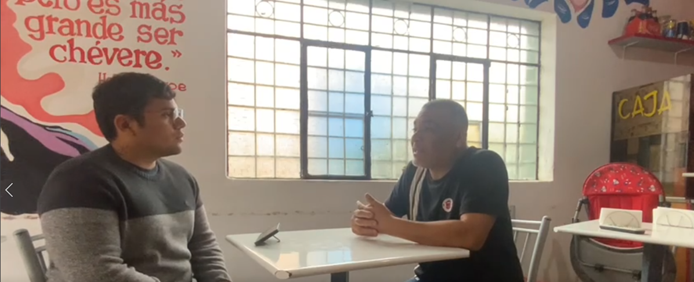

Universidad Peruana de Ciencias Aplicadas

Carrera: Ingeniería de Software

Ciclo: 2024-02

Curso: Desarrollo de Aplicaciones Open Source

Sección: WX51

Profesor: Alberto Wilmer Sanchez Seña

Informe del Trabajo Final - TB1

Startup: Verduritas

Producto: GastroGo

| Member                                | Code       |
|---------------------------------------|------------|
| Abanto Vicente, Edery Renzo         | U201822832 |
| Barrutia Vaez, Ricardo Andree       | U201714765 |
| Cuevas Vera, Jose Angel        | U202214632 |
| Espinoza Inoñan, Fabiola Ximena     | U202214784 |
| Pedraza Maldonado, Joaquin Andree          | U202218514 |

**Agosto del 2024**

  
---  
# Registro de Versiones del Informe

| Versión | Fecha      | Autor   | Descripción de modificaciones         |
|---------|------------|---------|---------------------------------------|
| 1.0     | 25/08/2024 | Abanto Vicente, Edery Renzo   	Barrutia Vaez, Ricardo Andree	  Cuevas Vera, Jose Angel	  Espinoza Inoñan, Fabiola Ximena	  Pedraza Maldonado, Joaquin Andree | Capítulo I   Capítulo II   Capítulo III   Capítulo IV   Capítulo V       |

  
---  
# Project Report Collaboration Insights

  
---  
# Student Outcome
El curso contribuye al cumplimiento del Student Outcome ABET: **ABET – EAC - Student Outcome 5**   Criterio: *Capacidad de comunicarse efectivamente con un rango de audiencias.*

En el siguiente cuadro se describe las acciones realizadas y enunciados de conclusiones por parte del grupo, que permiten sustentar el haber alcanzado el logro del ABET – EAC - Student Outcome 5.

| **Criterio específico** | **Acciones realizadas** | **Conclusiones** |
|-------------------------|--------------------------|-------------------|
| Trabaja en equipo para proporcionar liderazgo en forma conjunta | ***TB1:***   **Abanto Vicente, Edery Renzo**   Para esta TB1 realicé documentación descriptiva fácilmente entendible para el grupo y comenté posibles mejoras, además de crear y modificar constantemente los diagramas de baja fidelidad.    **Barrutia Vaez, Ricardo Andree**   Mi participación en el desarrollo de la TB1 incluyó principalmente la creación del Lean UX, el análisis de la competencia, la realización de entrevistas, así como el diseño del empathy map y el journey map. Además, contribuí en el capítulo V del documento. En cuanto a la landing page, trabajé en la implementación de la barra de navegación, la sección de introducción, y añadí la opción para cambiar de idioma.    **Cuevas Vera, Jose Angel**   Para desarrollar esta TB1, realicé la parte del To-Be scenario mapping, las user stories, los impact mappings y el product backlog, detallando cómo los usuarios interactuarán con el sistema en el futuro y cómo estas interacciones contribuirán a alcanzar los objetivos del proyecto.    **Espinoza Inoñan, Fabiola Ximena**   Realicé la investigación para obtener información de primera mano a través de las entrevistas y la documentación de software. Esto permitió conocer mejor a nuestro público objetivo y establecer estrategias frente a nuevos competidores para potenciar nuestra startup. También desarrollé una parte de la landing page, incluyendo "About Us" y "Why Us".    **Pedraza Maldonado, Joaquin Andree**   Para esta TB1, realicé el diagrama de clases, los diagramas de arquitectura del software, y modifiqué los mockups junto con sus flujos de usuarios. Además, elaboré la sección de características de la landing page.    | En conclusión, en la realización de la TB1, el equipo trabajó de manera coordinada para cubrir todos los aspectos del proyecto. Se abordaron diversas áreas, desde la investigación y el análisis hasta el diseño y desarrollo. Cada miembro del equipo aportó en diferentes áreas, contribuyendo al desarrollo de la landing page y a la creación de elementos clave como mapas de empatía, escenarios futuros, y funcionalidades específicas. El trabajo conjunto permitió un avance organizado y eficiente, cumpliendo con los objetivos establecidos y asegurando un resultado cohesivo y bien estructurado. |
| Crea un entorno colaborativo e inclusivo, establece metas, planifica tareas y cumple objetivos | ***TB1:***   **Abanto Vicente, Edery Renzo**   Para esta TB1 agregué descripciones generales para un mejor planteamiento del problema e investigué posibles enfoques de trabajo, además de diseñar muchos de los wireframes y mockups.    **Barrutia Vaez, Ricardo Andree**   Durante el proceso de desarrollo de la TB1, se llevaron a cabo numerosas sesiones de coordinación con el propósito de optimizar la planificación y la ejecución del trabajo. Estas reuniones permitieron definir claramente los objetivos y repartir las tareas de manera equitativa entre los integrantes del equipo, facilitando la revisión constante del progreso. Gracias a esta organización, las tareas fueron completadas de acuerdo a lo estimado, garantizando un avance fluido y eficiente del proyecto. Además, se realizaron ajustes cuando fue necesario para mantener el ritmo adecuado.    **Cuevas Vera, Jose Angel**   Para desarrollar la TB1, organizamos y celebramos una serie de reuniones clave. Estas sesiones fueron fundamentales para definir claramente nuestros objetivos y distribuir las tareas entre los miembros del equipo. Gracias a una gestión efectiva, logramos completar todas las tareas asignadas dentro del plazo estipulado.    **Espinoza Inoñan, Fabiola Ximena**   Se realizaron reuniones junto con todos los miembros del equipo y nos ayudamos entre nosotros para lograr cumplir con nuestro objetivo. También se designaron tareas para avanzar con el proyecto.    **Pedraza Maldonado, Joaquin Andree**   Para este TB1, al realizar el diagrama de clases, la arquitectura del software y la modificación de los mockups, tuve que analizar y plantear una manera en la cual la información fuera clara y concisa para el entendimiento de nuestros segmentos objetivos.    | En conclusión, en la realización de la TB1, el equipo abordó el proyecto de manera estructurada y colaborativa. Se realizaron descripciones generales para clarificar el problema y se investigaron diferentes enfoques de trabajo, desarrollando wireframes y mockups. A través de una serie de reuniones coordinadas, se definieron objetivos claros y se distribuyeron tareas equitativamente entre los miembros del equipo, lo que facilitó una planificación efectiva y un avance continuo. La gestión eficiente permitió completar las tareas dentro de los plazos establecidos, con ajustes realizados cuando fue necesario para mantener el ritmo del proyecto. Además, se diseñaron diagramas y se modificaron elementos visuales para asegurar una presentación clara y comprensible de la información. Este enfoque integral y organizado permitió una ejecución fluida del proyecto, cumpliendo con los objetivos y asegurando una solución cohesiva y bien documentada. |

---  
# Contenido
## Tabla de contenidos

### [Capítulo I: Introducción]()
- [1.1. Startup Profile]()
    - [1.1.1 Descripción de la Startup]()
    - [1.1.2 Perfiles de integrantes del equipo]()
- [1.2 Solution Profile]()
    - [1.2.1 Antecedentes y problemática]()
    - [1.2.2 Lean UX Process]()
        - [1.2.2.1. Lean UX Problem Statements]()
        - [1.2.2.2. Lean UX Assumptions]()
        - [1.2.2.3. Lean UX Hypothesis Statements]()
        - [1.2.2.4. Lean UX Canvas]()
- [1.3. Segmentos objetivo]()

### [Capítulo II: Requirements Elicitation & Analysis]()
- [2.1. Competidores]()
    - [2.1.1. Análisis competitivo]()
    - [2.1.2. Estrategias y tácticas frente a competidores]()
- [2.2. Entrevistas]()
    - [2.2.1. Diseño de entrevistas]()
    - [2.2.2. Registro de entrevistas]()
    - [2.2.3. Análisis de entrevistas]()
- [2.3. Needfinding]()
    - [2.3.1. User Personas]()
    - [2.3.2. User Task Matrix]()
    - [2.3.3. User Journey Mapping]()
    - [2.3.4. Empathy Mapping]()
    - [2.3.5. As-is Scenario Mapping]()
- [2.4. Ubiquitous Language]()

### [Capítulo III: Requirements Specification]()
- [3.1. To-Be Scenario Mapping]()
- [3.2. User Stories]()
- [3.3. Impact Mapping]()
- [3.4. Product Backlog]()

### [Capítulo IV: Product Design]()
- [4.1. Style Guidelines]()
    - [4.1.1. General Style Guidelines]()
    - [4.1.2. Web Style Guidelines]()
- [4.2. Information Architecture]()
    - [4.2.1. Organization Systems]()
    - [4.2.2. Labeling Systems]()
    - [4.2.3. SEO Tags and Meta Tags]()
    - [4.2.4. Searching Systems]()
    - [4.2.5. Navigation Systems]()
- [4.3. Landing Page UI Design]()
    - [4.3.1. Landing Page Wireframe]()
    - [4.3.2. Landing Page Mock-up]()
- [4.4. Web Applications UX/UI Design]()
    - [4.4.1. Web Applications Wireframes]()
    - [4.4.2. Web Applications Wireflow Diagrams]()
    - [4.4.3. Web Applications Mock-ups]()
    - [4.4.4. Web Applications User Flow Diagrams]()
- [4.5. Web Applications Prototyping]()
- [4.6. Domain-Driven Software Architecture]()
    - [4.6.1. Software Architecture Context Diagram]()
    - [4.6.2. Software Architecture Container Diagrams]()
    - [4.6.3. Software Architecture Components Diagrams]()
- [4.7. Software Object-Oriented Design]()
    - [4.7.1. Class Diagrams]()
    - [4.7.2. Class Dictionary]()
- [4.8. Database Design]()
    - [4.8.1. Database Diagram]()

### [Capítulo V: Product Implementation, Validation & Deployment]()
- [5.1. Software Configuration Management]()
    - [5.1.1. Software Development Environment Configuration]()
    - [5.1.2. Source Code Management]()
    - [5.1.3. Source Code Style Guide & Conventions]()
    - [5.1.4. Software Deployment Configuration]()
- [5.2. Landing Page, Services & Applications Implementation]()
    - [5.2.1. Sprint 1]()
        - [5.2.1.1. Sprint Planning 1]()
        - [5.2.1.2. Sprint Backlog 1]()
        - [5.2.1.3. Development Evidence for Sprint Review]()
        - [5.2.1.4. Testing Suite Evidence for Sprint Review]()
        - [5.2.1.5. Execution Evidence for Sprint Review]()
        - [5.2.1.6. Services Documentation Evidence for Sprint Review]()
        - [5.2.1.7. Software Deployment Evidence for Sprint Review]()
        - [5.2.1.8. Team Collaboration Insights during Sprint]()
    - [5.2.2. Sprint 2]()
        - [5.2.2.1. Sprint Planning 2]()
        - [5.2.2.2. Sprint Backlog 2]()
        - [5.2.2.3. Development Evidence for Sprint Review]()
        - [5.2.2.4. Testing Suite Evidence for Sprint Review]()
        - [5.2.2.5. Execution Evidence for Sprint Review]()
        - [5.2.2.6. Services Documentation Evidence for Sprint Review]()
        - [5.2.2.7. Software Deployment Evidence for Sprint Review]()
        - [5.2.2.8. Team Collaboration Insights during Sprint]()
    - [5.2.3. Sprint 3]()
        - [5.2.3.1. Sprint Planning 3]()
        - [5.2.3.2. Sprint Backlog 3]()
        - [5.2.3.3. Development Evidence for Sprint Review]()
        - [5.2.3.4. Testing Suite Evidence for Sprint Review]()
        - [5.2.3.5. Execution Evidence for Sprint Review]()
        - [5.2.3.6. Services Documentation Evidence for Sprint Review]()
        - [5.2.3.7. Software Deployment Evidence for Sprint Review]()
        - [5.2.3.8. Team Collaboration Insights during Sprint]()
    - [5.2.4. Sprint 4]()
        - [5.2.4.1. Sprint Planning 4]()
        - [5.2.4.2. Sprint Backlog 4]()
        - [5.2.4.3. Development Evidence for Sprint Review]()
        - [5.2.4.4. Testing Suite Evidence for Sprint Review]()
        - [5.2.4.5. Execution Evidence for Sprint Review]()
        - [5.2.4.6. Services Documentation Evidence for Sprint Review]()
        - [5.2.4.7. Software Deployment Evidence for Sprint Review]()
        - [5.2.4.8. Team Collaboration Insights during Sprint]()
- [5.3. Validation Interviews]()
    - [5.3.1. Diseño de Entrevistas]()
    - [5.3.2. Registro de Entrevistas]()
    - [5.3.3. Evaluaciones según heurísticas]()
- [5.4. Video About-the-Product]()

---  
# Capítulo I: Introducción
## 1.1. Startup Profile
### 1.1.1 Descripción de la Startup
### 1.1.2 Perfiles de integrantes del equipo
## 1.2 Solution Profile
### 1.2.1 Antecedentes y problemática
### 1.2.2 Lean UX Process
#### 1.2.2.1. Lean UX Problem Statements
#### 1.2.2.2. Lean UX Assumptions
#### 1.2.2.3. Lean UX Hypothesis Statements
#### 1.2.2.4. Lean UX Canvas
## 1.3. Segmentos objetivo
# Capítulo II: Requirements Elicitation & Analysis
## 2.1 Competidores

Entender el entorno competitivo es crucial para el éxito de cualquier negocio. En esta parte, analizaremos detalladamente quiénes son nuestros competidores, tanto directos como indirectos, y examinaremos las estrategias que utilizan, así como sus fortalezas y debilidades.

## 2.1.1. Analisis competitivo
El análisis competitivo se enfoca en estudiar detalladamente a nuestros competidores para reconocer sus puntos fuertes, débiles, oportunidades y amenazas. Este proceso nos permitirá entender mejor nuestra posición en el mercado y formular estrategias más efectivas.

### Competitive Analysis Landscape

| | **Escriba en el recuadro la pregunta que busca responder o el objetivo de este análisis.** |
|-------------------------------------------|-------------------------------------------------------------------------------------------|
| **¿Por qué llevar a cabo este análisis?**| Este análisis se llevó a cabo para comprender el mercado y tomar decisiones estratégicas informadas. |

---

|   |   | **GastroGo** | **Manzana Verde** | **PedidosYa** | **KnowEats** |
|---|---|--------------|-------------------|---------------|--------------|
| **Nombre y Logo** | |  |  |  |  |
| **Perfil** | **Overview** | Es una aplicación que facilita la realización de pedidos grupales para restaurantes y trabajadores.  Las características a destacar son una interfaz intuitiva y fácil de usar, gestión eficiente de pedidos que automatiza el proceso y minimiza errores, visualización clara de menús y precios para facilitar la selección de opciones. | Manzana Verde es una aplicación que brinda la posibilidad de ordenar diferentes platos saludables para cumplir uno de sus tres objetivos: bajar de peso, mantenerse saludable, y aumentar la masa corporal. | PedidosYa es una aplicación que permite a los usuarios realizar pedidos de comida de una amplia variedad de restaurantes, con la conveniencia de recibir sus pedidos directamente en su puerta.  La aplicación se destaca por su facilidad de uso, opciones de pago flexibles y seguimiento en tiempo real del estado del pedido. | KnowEats es una aplicación que permite ordenar comida saludable para evitar cocinar durante la semana y poder mantener una dieta equilibrada.  Además, permite almacenar la comida en la refrigeradora para que sus usuarios se puedan organizar de la manera que estos consideren. |
| **Ventaja competitiva** | **¿Qué valor ofrece a los clientes?** | Ofrecemos una solución optimizada que automatiza y simplifica el proceso, reduciendo errores y mejorando la eficiencia tanto para los usuarios como para los restaurantes durante la realización de pedidos grupales. | Su capacidad para ofrecer planes de alimentación personalizados que ayudan a los clientes a alcanzar objetivos específicos de salud.  Además de la facilidad de acceder a comidas saludables y equilibradas. | La capacidad de ofrecer a los clientes una amplia variedad de opciones gastronómicas con entrega rápida y eficiente.  Además de la flexibilidad en los métodos de pago. | Brindan un sistema de “cook and chill”, con el que su comida envasada puede almacenarse en la nevera durante el lapso de una semana, logrando que sus clientes puedan organizar las comidas de la semana. |
| **Perfil de Marketing** | **Mercado objetivo** | Grupos de trabajadores que realicen pedidos grupales y restaurantes. | Personas en búsqueda de mejores hábitos alimenticios pidiendo a domicilio. | Personas que buscan conveniencia y variedad en la comida, solicitando entregas a domicilio de una amplia gama de restaurantes. | Personas con poco tiempo para cocinar y que no puedan cocinar saludable. |
| **Perfil de Marketing** | **Estrategias de marketing** | GastroGo se publicita con anuncios en Google Ads y Instagram.  Además, produce contenido relevante para su mercado objetivo, como artículos sobre tendencias gastronómicas, estudios de caso y guías para la gestión eficiente de pedidos grupales en sus redes sociales. | Manzana Verde utiliza anuncios en Google Ads y redes sociales como Facebook e Instagram.  También emplea marketing por correo electrónico para enviar a sus clientes ofertas especiales y novedades sobre sus planes de alimentación y servicios. | PedidosYa utiliza anuncios en Google Ads y en redes sociales como Facebook e Instagram.  Además, emplea marketing por correo electrónico para mantener a los clientes informados sobre promociones y actualizaciones. | KnowEats utiliza anuncios en Google Ads y redes sociales como Facebook e Instagram para promover sus servicios.  También implementa marketing por correo electrónico para mantener a los clientes informados sobre nuevos menús, ofertas y actualizaciones sobre la plataforma. |
| **Perfil de Producto** | **Productos & Servicios** | Gestión de pedidos grupales (Facilita la creación, modificación y confirmación de pedidos grupales).  Permite pagos individuales o grupales dentro de la plataforma.  Proporciona acceso a menús actualizados de los restaurantes afiliados, permitiendo seleccionar opciones basadas en disponibilidad.  Guarda registros de pedidos anteriores para facilitar la repetición de pedidos similares en el futuro. | Ofrece planes de alimentación semanal o mensual ajustados a las necesidades nutricionales de cada usuario.  Servicio de entrega diaria de comidas frescas, directamente a la ubicación del usuario.  Permite a los usuarios gestionar sus suscripciones de comidas, con la opción de pausar, cancelar o modificar los pedidos. | Facilita la entrega de comida desde una amplia variedad de restaurantes.  Proporciona actualizaciones minuto a minuto sobre el estado del pedido.  Ofrece un motor de búsqueda que permite filtrar restaurantes por tipo de cocina, precio, ubicación, y tiempo de entrega. | Proporciona informes sobre los patrones de alimentación del usuario, ayudando a mantener un estilo de vida saludable.  Sugiere opciones de comida basadas en las preferencias y hábitos alimenticios del usuario. |
| **Precios & Costos** | | Ofrecen planes de suscripción para cubrir los gastos de gestión y los precios suelen variar según las cantidades, tipo de restaurante y ubicación. | Ofrecen planes de alimentación personalizados que varían según la cantidad de días y la complejidad de las comidas.  Los rangos de precios suelen estar entre S/ 15 a S/ 25 por comida, dependiendo del plan y las opciones seleccionadas. | Suelen tener precios que varían entre S/ 20 y S/ 60 por comida, dependiendo de las cantidades, tipo de restaurante y la ubicación. | Ofrecer menús balanceados para empresas y oficinas, generalmente tiene precios que oscilan entre 4,50 € y 7,50 € por comida.  Estos precios pueden variar dependiendo de la cantidad de personas, las especificaciones del menú, y los paquetes personalizados. |
| **Canales de distribución (Web y/o Móvil)** | | Aplicación Web | Aplicación Web y Aplicación Móvil. | Aplicación Web y Aplicación Móvil. | Aplicación Web |
| **Análisis SWOT** | **Fortalezas** | Aplicación Web moderna e interfaz amigable.  Automatización en la recepción y procesamiento de pedidos.  Acceso a una amplia variedad de menús y restaurantes. | Disponen de aplicación móvil para sus usuarios.  Proporciona variedad de menús saludables según objetivos del usuario. | Amplia red de restaurantes y opciones gastronómicas.  Diversas opciones de pago.  Promociones y descuentos frecuentes. | Menús equilibrados y adaptados a necesidades específicas de salud.  Planes flexibles de suscripción.  Opciones de menú variado. |
| **Análisis SWOT** | **Debilidades** | Dependencia de la adopción por parte de restaurantes.  Desafíos en la integración con sistemas existentes en restaurantes.  Resistencia a cambiar métodos tradicionales. | Falta de opciones para comidas no saludables, lo que puede limitar las preferencias de algunos usuarios.  Escasa interacción o soporte personalizado, que puede limitar la capacidad de resolver problemas o ajustar planes. | Las tarifas del servicio pueden aumentar el costo del pedido.  Dependencia de la calidad de los restaurantes asociados. | Menús “personalizados” para necesidades dietéticas muy específicas.  Costos relativamente altos en comparación a preparar la comida por tu cuenta. |
| **Análisis SWOT** | **Oportunidades** | Incrementar nuestro alcance y satisfacción al cliente mediante la aplicación móvil para ofrecer una experiencia de usuario más accesible y conveniente.  Implementar funciones de integración con sistemas de pago móvil para facilitar transacciones.  Implementación de tecnologías como inteligencia artificial para mejorar la recomendación de restaurantes y la gestión de pedidos. | Ampliación de la oferta de menús para incluir más opciones regionales y personalizadas. | Alianzas con restaurantes exclusivos, ofreciendo opciones premium que atraigan a más usuarios. | Innovación en la logística de distribución para mejorar la eficiencia y reducir costos. |
| **Análisis SWOT** | **Amenazas** | Dependencia de la aceptación del mercado y de los hábitos de compra de los grupos de trabajadores y restaurantes.  Problemas de escalabilidad al expandir la plataforma a nuevas áreas o grandes volúmenes de pedidos. | Variaciones en la demanda que pueden afectar la estabilidad financiera del servicio.  Competencia con otras aplicaciones de alimentos que ofrecen servicios similares. | Competencia intensa con otras aplicaciones de entrega de comida y restaurantes locales.  Posible saturación del mercado. | Cambios en las regulaciones de seguridad alimentaria y normativas locales que podrían afectar la operación. |

## 2.1.2. Estrategias y tácticas frente a competidores

Entre las principales estrategias y tácticas que ejecutaremos como startup son las siguientes: 

- Aprovechar nuestra principal ventaja del precio que es competitivo a comparación de la competencia que buscar adquirir la mayor cantidad de clientes.Una vez realizado esto, realizaremos encuestas de satisfacción con nuestro clientes con el fin de escuchar cómo se sienten usando nuestro software y si resuelve sus necesidades, además, si creen que les hace falta o le gustaría contar como herramienta. De este modo, podremos ir agregando constantemente nuevas características que buscan nuestros usuarios y, al fin y al cabo, potencian nuestra marca.

- Como startup podremos desarrollar alianzas estratégicas con restaurantes locales, ofreciendo exclusividad en ciertas áreas, lo que no solo llamará la atención a nuevos posibles usuarios y restaurantes. Al utilizar tácticas como promociones exclusivas para grupos de usuarios y la gamificación de la experiencia del usuario, podría aumentar su visibilidad y establecer un lugar en el mercado, asegurando una ventaja competitiva frente a nuestros competidores.

  
## 2.2. Entrevistas 
Las entrevistas son fundamentales porque nos permiten conocer mejor a nuestro público objetivo, estas deben tener una estructura clara y concisa, preguntas específicas para que cumplan su objetivo que es la recolección de datos e información de los entrevistados.

### 2.2.1. Diseño de entrevistas  
**A. Preguntas para Grupo de Trabajadores**

**i) Preguntas Introductorias**

1. ¿Cuál es su nombre completo? ¿Qué edad tiene? ¿En qué distrito resides actualmente?
2. ¿Cuál es su ocupación?

**ii) Preguntas sobre Personalidad**

3. ¿Cuáles son tus hobbies o pasatiempos favoritos?
4. ¿Te consideras una persona introvertida o extrovertida?
5. ¿Te consideras una persona más analítica o creativa cuando realizas algún tipo de trabajo? ¿Tiendes a ser más racional o emocional en tu enfoque?
6. ¿Qué dispositivos tecnológicos y sistemas operativos prefieres usar para tu día a día? ¿Cuáles son las redes sociales que utilizas con mayor frecuencia para estudio, trabajo y ocio?
7. ¿Cuál es el navegador web que usas habitualmente?

**iii) Preguntas Principales**

8. ¿Qué tan importante es para ti, elegir dónde almorzar durante tu jornada laboral?
9. ¿Prefieres llevar tu almuerzo de casa, comprarlo cerca de tu lugar de trabajo o pedirlo para entrega? ¿Por qué?
10. ¿Con qué frecuencia sueles hacer pedidos grupales (junto a colegas) para almorzar en el trabajo?
11. ¿Qué aspectos son importantes para ti, al elegir un restaurante para pedir comida (por ejemplo, precio, calidad, rapidez, opciones saludables, variedad)?

**iv) Preguntas Específicas**

12. ¿Has presentado dificultades al coordinar pedidos grupales de comida en tu lugar de trabajo?
    - De ser el caso: Coméntanos, ¿cuáles han sido y cómo las has manejado?
13. Si existiera una plataforma que facilitara los pedidos grupales y ofreciera menús seleccionados de restaurantes locales, ¿la utilizarías? ¿Por qué?
14. ¿Cuánto estarías dispuesto a pagar por un servicio que te permita realizar pedidos grupales de manera rápida y organizada?
15. ¿Qué tipo de funciones te gustaría que tuviera una aplicación de este tipo (por ejemplo, recomendaciones personalizadas, seguimiento de pedidos, pagos compartidos)?

**B. Preguntas para Restaurantes**

**i) Preguntas Introductorias**

1. ¿Cuál es su nombre completo? ¿Qué edad tiene? ¿Y cuál es su cargo dentro del restaurante?
2. ¿En qué distrito se encuentra ubicado su restaurante?

**ii) Preguntas sobre Personalidad**

3. ¿Cuáles son tus hobbies o pasatiempos favoritos?
4. ¿Te consideras una persona introvertida o extrovertida?
5. ¿Te consideras una persona más analítica o creativa cuando realizas algún tipo de trabajo? ¿Tiendes a ser más racional o emocional en tu enfoque?
6. ¿Qué dispositivos tecnológicos y sistemas operativos prefieres usar para tu día a día? ¿Cuáles son las redes sociales que utilizas con mayor frecuencia para estudio, trabajo y ocio?
7. ¿Cuál es el navegador web que usas habitualmente?

**iii) Preguntas Principales**

8. ¿Cuál es el tipo de cliente que más frecuenta su restaurante (por ejemplo, familias, trabajadores, estudiantes)?
9. ¿Qué tan importante es para el restaurante atraer a clientes durante el horario de almuerzo?
10. ¿Prefieren ofrecer menús fijos o permiten a los clientes personalizar sus pedidos? ¿Por qué?
11. ¿Cómo maneja actualmente su restaurante los pedidos en grupo? ¿Utilizan alguna plataforma específica?

**iv) Preguntas Específicas**

12. ¿Cuáles son los principales problemas que enfrenta al recibir y coordinar pedidos grupales?
13. Si existiera una plataforma que le conectara con grupos de trabajadores para pedidos grupales, ¿le interesaría participar? ¿Por qué?
14. ¿Cómo cree que una herramienta que realice pedidos grupales podría ayudar a optimizar la operación de su restaurante durante las horas pico?
15. ¿Estaría dispuesto a ofrecer descuentos o menús especiales a través de una plataforma que le garantice un volumen significativo de pedidos?

    
### 2.2.2. Registro de entrevistas

**Segmento grupo de trabajadores**

**Entrevista #01: Jonathan Berrocal (22 años - Villa Maria del Triunfo) - 25 de agosto del 2024**

  

[GastroGo - Registro de Entrevistas.mp4](https://upcedupe-my.sharepoint.com/:v:/g/personal/u201714765_upc_edu_pe/EWIpimdxe6ZHoMD_xHk62dQBUgZ6DXhQhyfx2nwDKM6IQg?e=Z6ZJw4&nav=eyJyZWZlcnJhbEluZm8iOnsicmVmZXJyYWxBcHAiOiJTdHJlYW1XZWJBcHAiLCJyZWZlcnJhbFZpZXciOiJTaGFyZURpYWxvZy1MaW5rIiwicmVmZXJyYWxBcHBQbGF0Zm9ybSI6IldlYiIsInJlZmVycmFsTW9kZSI6InZpZXcifSwicGxheWJhY2tPcHRpb25zIjp7fX0%3D) (Comienzo 00:00:00 Fin - 00:05:48)

Jonathan Berrocal en la actualidad es un estudiante de séptimo ciclo de la carrera de ingeniería de sistemas de información en la universidad de ciencias aplicadas. Asimismo se encuentra realizando prácticas en la empresa Diners Club.

En cuanto a sus preferencias personales y estilo de vida, Jonathan nos comenta que es una persona introvertida. Sus principales pasatiempos actualmente son jugar al fútbol y escuchar música. Además, se considera una persona analítica en lo que respecta al trabajo y, en términos de enfoque, se define como muy racional.

Jonathan nos compartió sus preferencias tecnológicas: utiliza una laptop con sistema operativo Windows y un dispositivo móvil con sistema operativo Android. Su navegador de preferencia es Google Chrome.
Finalmente, en cuanto a redes sociales, Jonathan utiliza frecuentemente LinkedIn, Facebook e Instagram.

Jonathan nos ha compartido sus experiencia a la hora de realizar pedidos grupales en la empresa que actualmente está trabajando que es Diners Club.

Con respecto a la importancia de elegir dónde almorzar durante la jornada laboral, Jonathan considera que es bastante importante. Él ve el almuerzo como un momento clave para descansar y desestresarse del trabajo. Prefiere comprar su comida cerca de su lugar de trabajo o pedirla, ya que esto le resulta más fácil y menos estresante que preparar su comida en la mañana.

En cuanto a sus preferencias para el almuerzo, Jonathan prefiere comprarlo cerca de su lugar de trabajo o pedirlo para entrega. Esto se debe a que le resulta más conveniente en lugar de llevar su almuerzo desde casa, ya que le evita tener que planificar y cocinar con antelación.

Jonathan realiza pedidos grupales con sus colegas de vez en cuando, cuando hay un antojo común o cuando deciden hacer un pedido conjunto. La frecuencia de estos pedidos varía según las necesidades del grupo.

Al elegir un restaurante, Jonathan considera que la calidad de la comida y la rapidez del servicio son aspectos importantes. También valora el precio y la variedad de platos disponibles para evitar la repetitividad en las opciones.

Jonathan ha enfrentado dificultades al coordinar pedidos grupales debido a las diferentes preferencias de sus colegas. Para manejar estas situaciones, utilizan votaciones o sorteos en plataformas en línea para tomar decisiones de manera dinámica.

Jonathan estaría interesado en una plataforma que facilitara los pedidos grupales y ofreciera menús seleccionados de restaurantes locales. Esto le parecería útil, ya que simplificará la organización y ahorraría tiempo en la toma de decisiones.

Estaría dispuesto a pagar una pequeña tarifa adicional por un servicio que permitiera realizar pedidos grupales de manera rápida y organizada, siempre que el proceso sea más sencillo y eficiente.

Por último, le gustaría que la aplicación de pedidos grupales ofreciera recomendaciones personalizadas basadas en pedidos anteriores, opciones para compartir el costo de manera equitativa y seguimiento en tiempo real de los pedidos

**Entrevista #02: Raul Sulca Ynoñan (29 años - Comas) - 29 de agosto del 2024**

  

[GastroGo - Registro de Entrevistas.mp4](https://upcedupe-my.sharepoint.com/:v:/g/personal/u201714765_upc_edu_pe/EWIpimdxe6ZHoMD_xHk62dQBUgZ6DXhQhyfx2nwDKM6IQg?e=3mAPA9&nav=eyJyZWZlcnJhbEluZm8iOnsicmVmZXJyYWxBcHAiOiJTdHJlYW1XZWJBcHAiLCJyZWZlcnJhbFZpZXciOiJTaGFyZURpYWxvZy1MaW5rIiwicmVmZXJyYWxBcHBQbGF0Zm9ybSI6IldlYiIsInJlZmVycmFsTW9kZSI6InZpZXcifSwicGxheWJhY2tPcHRpb25zIjp7InN0YXJ0VGltZUluU2Vjb25kcyI6MzQ4Ljc5fX0%3D)  (Comienzo 00:05:48 - Fin 00:13:02)

Raul Sulca nos comentó que estudió en la Universidad Nacional Mayor de San Marcos, y actualmente es Ingeniero Agromono. Asimismo, se encuentra trabajando en SGS del Perú S.A.C. en el distrito del Callao.

En cuanto a sus preferencias personales y estilo de vida, Raul nos comenta que es una persona extrovertida. Sus principales pasatiempos actualmente son viajar  y bailar salsa. Además, se considera una persona analítica en lo que respecta a su trabajo y, en términos de enfoque, se define como una persona muy racional.

Raul nos compartió sus preferencias tecnológicas: utiliza una laptop con sistema operativo Windows y un dispositivo móvil con sistema operativo Android. Su navegador de preferencia es Google Chrome. Finalmente, en cuanto a redes sociales, Raul utiliza frecuentemente Facebook, Instagram y TikTok.

Raul nos ha compartido su experiencia a la hora de realizar pedidos grupales en la empresa donde actualmente labora. La importancia de elegir donde almorzar durante su jornada laboral es primordial. Prefiere comer en el comedor de la empresa y en algunos casos, comprar su comida por su lugar de trabajo o pedirla, ya que le resulta más fácil, ya que el lugar donde trabaja es zona industrial.

Raul realiza pedidos grupales con sus colegas de vez en cuando, usualmente cuando hay un antojo común o cuando deciden hacer un pedido en conjunto. Las necesidades varían según las preferencias del grupo.

Al elegir un restaurante, Raul considera la rapidez y la calidad de la comida, él elige estas dos opciones porque el tiempo de comida es limitado y prefiere que al realizar un pedido, llegue rápido y que la calidad sea buena.

Raul ha enfrentado dificultades al recibir sus pedidos, nos comenta que al momento de recibirlo, el pedido que hizo llega incompleto o no llega lo que pidió, y tiene que cancelar el pedido o lo acepta para evitar más complicaciones.

Raul estaría interesado en una plataforma que facilitara los pedidos grupales y ofreciera menús con mayor variedad y evitar los errores en las entregas. Le parece útil, ya que le ahorrará tiempo y evitará más complicaciones.

También nos comenta que estaría dispuesto a pagar una pequeña tarifa adicional por un servicio que le permita gestionar  de manera rápida sus pedidos, y que sea rápido y al mismo tiempo la comida sea de calidad.

Por último, le gustaría que la aplicación de pedido grupales sea amigable con el usuario, fácil de manejar al momento de realizar pedidos y que no tenga caídas en el sistema.

**Entrevista #03: Daniel Vazquez (25 años - San Juan de Lurigancho) - 28 de agosto del 2024**

[GastroGo - Registro de Entrevistas.mp4](https://upcedupe-my.sharepoint.com/:v:/g/personal/u201714765_upc_edu_pe/EWIpimdxe6ZHoMD_xHk62dQBUgZ6DXhQhyfx2nwDKM6IQg?e=pkLHZB&nav=eyJyZWZlcnJhbEluZm8iOnsicmVmZXJyYWxBcHAiOiJTdHJlYW1XZWJBcHAiLCJyZWZlcnJhbFZpZXciOiJTaGFyZURpYWxvZy1MaW5rIiwicmVmZXJyYWxBcHBQbGF0Zm9ybSI6IldlYiIsInJlZmVycmFsTW9kZSI6InZpZXcifSwicGxheWJhY2tPcHRpb25zIjp7InN0YXJ0VGltZUluU2Vjb25kcyI6NzgyLjYyfX0%3D)  (Comienzo 00:13:02 - Fin 00:23:01)

  

Daniel Vasquez nos comenta que es bachiller de Derecho de la Universidad Nacional Pedro Ruiz Gallo de Chiclayo. Asimismo, se encuentra trabajando en la Corte Superior de Lima.

En cuanto a sus preferencias personales y estilo de vida, Daniel nos comenta que es una persona extrovertida. Sus principales pasatiempos actualmente son bailar y ver videos de stand comedy. Además, utiliza redes sociales como Facebook , instagram y TikTok para buscar alguna información extra o mantenerse al día. Además, se considera una persona analítica en lo que respecta a su trabajo y, en términos de enfoque, se define como una persona muy racional.

En cuanto a su uso de tecnología, prefiere dispositivos como un smart watch, celular con sistema operativo Android, y una laptop y tablet con Windows, ya que este sistema operativo es el que utiliza en su trabajo y se siente más cómodo con él. Su navegador de preferencia es Google Chrome.

Daniel considera importante la elección del lugar donde almuerza durante su jornada laboral, prefiriendo opciones que le mantengan activo, sean cómodas y de buena calidad. Aunque le incomoda llevar almuerzo de casa porque debe calentarlo y la comida se enfría, suele comprar su comida cerca de su trabajo o pedirla para entrega.

En cuanto a pedidos grupales, los realiza junto a sus colegas principalmente cuando tienen antojos durante la hora de almuerzo. Al elegir un restaurante, valora especialmente la calidad y rapidez del servicio para poder disfrutar su comida con tranquilidad. Sin embargo, ha enfrentado dificultades al coordinar estos pedidos, como retrasos en la entrega y complicaciones con el pago entre los colegas.

Daniel estaría interesado en una plataforma que facilite la gestión de pedidos grupales, incluyendo menús seleccionados de restaurantes locales. Considera que un servicio eficiente que compense calidad y rapidez sería algo por lo que estaría dispuesto a pagar. Le gustaría que la aplicación incluya funciones como pagos compartidos para evitar malentendidos y la posibilidad de añadir extras al pedido.

**Segmento de Restaurantes**

**Entrevista #04: Juan Esteban Espinoza (56 años - La Molina) 26 de agosto del 2024**

  

[GastroGo - Registro de Entrevistas.mp4](https://upcedupe-my.sharepoint.com/:v:/g/personal/u201714765_upc_edu_pe/EWIpimdxe6ZHoMD_xHk62dQBUgZ6DXhQhyfx2nwDKM6IQg?e=7h4rjj&nav=eyJyZWZlcnJhbEluZm8iOnsicmVmZXJyYWxBcHAiOiJTdHJlYW1XZWJBcHAiLCJyZWZlcnJhbFZpZXciOiJTaGFyZURpYWxvZy1MaW5rIiwicmVmZXJyYWxBcHBQbGF0Zm9ybSI6IldlYiIsInJlZmVycmFsTW9kZSI6InZpZXcifSwicGxheWJhY2tPcHRpb25zIjp7InN0YXJ0VGltZUluU2Vjb25kcyI6MTM4Mi41OX19)  (Comienzo 00:23:02 - Fin 00:30:01)

Juan Esteban Espinoza es actualmente gerente general y cuenta con 56 años. Dirige dos restaurantes ubicados en los distritos de Mala y Surco, siendo este último de reciente apertura. El restaurante en Mala atrae principalmente a familias, mientras que en Surco se enfoca en parejas y clientes individuales.

En cuanto a sus preferencias personales, Juan Esteban se describe como una persona extrovertida. Disfruta del fútbol y de andar en moto en su tiempo libre. En su trabajo, se considera tanto analítico como creativo, con una tendencia más hacia lo racional en su enfoque.

Juan Esteban utiliza una variedad de dispositivos tecnológicos en su día a día, incluyendo sistemas operativos Windows, iOS en su iPad, y macOS en su Mac. Sus redes sociales de preferencia son WhatsApp, Instagram, TikTok y Facebook. Para su trabajo, suele usar Office 365, especialmente Excel y PowerPoint. Navega en internet principalmente usando Chrome y Edge.

Juan Esteban considera que el horario de almuerzo es crucial para su restaurante, especialmente en el local de Surco, donde busca incrementar la rotación en este horario debido a que la marca está más asociada con desayunos. Esto hace que  los almuerzos sean un objetivo importante para él.

A nivel operativo, Juan Esteban prefiere ofrecer menús fijos en lugar de platos a la carta, ya que esto permite una mayor eficiencia en la cocina. Debido a que considera eficaz el sistema de mise en place el cual logra una preparación rápida y consistente de los pedidos, lo cual es esencial durante las horas pico.

En cuanto a la gestión de pedidos grupales, Juan Esteban menciona que uno de los mayores desafíos es coordinar las especificaciones detalladas de los clientes, que pueden complicar la operación. Actualmente, utiliza la plataforma Infores para ingresar y coordinar los pedidos en cocina, lo que permite cierta personalización, pero a menudo resulta en una carga operacional debido a la variabilidad de los pedidos.

Juan Esteban estaría interesado en una herramienta tecnológica que le permita anticipar los pedidos grupales con mayor antelación, lo que le permitiría optimizar la producción en la cocina y mejorar el servicio durante las horas pico. Además, considera que una plataforma que ofrezca la posibilidad de gestionar pedidos grupales de manera eficiente sería de gran ayuda para reducir los tiempos de espera y mejorar la satisfacción del cliente. También estaría dispuesto a ofrecer descuentos o menús especiales a través de una plataforma que le garantice un volumen significativo de pedidos, siempre y cuando se puedan manejar las personalizaciones de manera eficiente.

**Entrevista #05: Zaid Arauco (47 años - Miraflores) - 26 de agosto del 2024**

[GastroGo - Registro de Entrevistas.mp4](https://upcedupe-my.sharepoint.com/:v:/g/personal/u201714765_upc_edu_pe/EWIpimdxe6ZHoMD_xHk62dQBUgZ6DXhQhyfx2nwDKM6IQg?e=nJtWhl&nav=eyJyZWZlcnJhbEluZm8iOnsicmVmZXJyYWxBcHAiOiJTdHJlYW1XZWJBcHAiLCJyZWZlcnJhbFZpZXciOiJTaGFyZURpYWxvZy1MaW5rIiwicmVmZXJyYWxBcHBQbGF0Zm9ybSI6IldlYiIsInJlZmVycmFsTW9kZSI6InZpZXcifSwicGxheWJhY2tPcHRpb25zIjp7InN0YXJ0VGltZUluU2Vjb25kcyI6MTgwMS45NH19)  (Comienzo 00:30:02 - Fin 00:39:42)

  

Zaid Arauco es la Gerente General de un restaurante ubicado en Miraflores. Tiene 47 años y se dedica a gestionar las operaciones diarias del restaurante, asegurando que todo funcione de manera óptima.

En cuanto a su estilo de vida, Zaid es una persona extrovertida que disfruta de ir al cine y hacer deporte en su tiempo libre. Se considera persona analítica y tiende a ser racional en su enfoque hacia el trabajo. Zaid prefiere usar dispositivos con sistema operativo Windows y trabaja con Office 365. Su navegador de preferencia es Firefox.

Zaid nos compartió sus experiencias y desafíos al manejar los pedidos grupales en su restaurante. En cuanto al perfil de sus clientes, identifica tres grupos principales: oficinistas que buscan un lugar conveniente para almorzar, turistas que desean probar la comida peruana y clientes locales que acuden específicamente para disfrutar de su oferta gastronómica.

Respecto a la importancia del horario de almuerzo, Zaid considera que es el servicio más relevante para su restaurante. A pesar de ofrecer un menú fijo diario para los oficinistas, el negocio principal está en los pedidos a la carta, donde el margen de ganancia es mayor.

En cuanto a la gestión de pedidos grupales, Zaid menciona que su restaurante, que tiene capacidad para 20 personas, suele pedir a los grupos que reserven con anticipación y que elijan platos de la carta antes de llegar, lo que les ayuda a organizarse mejor. A menudo, los grupos optan por pedir entradas para compartir antes de seleccionar su plato principal. Además, cuando los grupos piden cuentas individuales, el restaurante las gestiona usando los nombres de los clientes para facilitar el cobro al final.

Zaid menciona que uno de los problemas más comunes al manejar pedidos grupales es la división de la cuenta, lo que puede llevar tiempo. Además, cuando cada persona pide un plato diferente, puede generar demoras en la cocina. A pesar de estas dificultades, considera que las plataformas que facilitan reservas grupales, como WeRoad, son beneficiosas, ya que aseguran un flujo constante de clientes y permiten al restaurante planificar mejor sus compras y producción.

Finalmente, Zaid menciona que, aunque las plataformas de delivery como Rappi cobran comisiones altas (alrededor del 25% del valor de la venta), las alianzas con plataformas de reservas grupales pueden ser más viables, ya que implican menores costos y aseguran una demanda previsible.

**#06: Martín Zuñiga (48 años - Victoria) - 29 de agosto de 2024**

  

[GastroGo - Registro de Entrevistas.mp4](https://upcedupe-my.sharepoint.com/:v:/g/personal/u201714765_upc_edu_pe/EWIpimdxe6ZHoMD_xHk62dQBUgZ6DXhQhyfx2nwDKM6IQg?e=8chJ9M&nav=eyJyZWZlcnJhbEluZm8iOnsicmVmZXJyYWxBcHAiOiJTdHJlYW1XZWJBcHAiLCJyZWZlcnJhbFZpZXciOiJTaGFyZURpYWxvZy1MaW5rIiwicmVmZXJyYWxBcHBQbGF0Zm9ybSI6IldlYiIsInJlZmVycmFsTW9kZSI6InZpZXcifSwicGxheWJhY2tPcHRpb25zIjp7InN0YXJ0VGltZUluU2Vjb25kcyI6MjM4My4wNH19)  (Comienzo 00:39:42 - Fin 00:43:49)

Martín Zuñiga es el dueño y cocinero principal de un restaurante ubicado en La Victoria. Lleva 10 años al frente del negocio, y su experiencia en el rubro le ha permitido conocer a fondo las necesidades y preferencias de sus clientes.

En cuanto a sus preferencias personales y estilo de vida, Martín nos comenta que es una persona más bien introvertida, que disfruta de la tranquilidad que le ofrecen sus pasatiempos. Entre sus principales hobbies, destaca la lectura y la cocina experimental, actividades que lo relajan y le permiten seguir innovando en su restaurante. Aunque reconoce que tiene un lado creativo por su pasión por la cocina, se considera una persona analítica en lo que respecta al manejo del negocio. En su enfoque, tiende a ser racional, valorando la eficiencia y la precisión en las operaciones diarias del restaurante.

Martín nos compartió sus preferencias utilizando una computadora portátil con sistema operativo Windows y un smartphone con sistema operativo Android. Su navegador de preferencia es Google Chrome, por su  compatibilidad con las plataformas que utiliza. Finalmente, en cuanto a redes sociales, Martín prefiere LinkedIn para temas profesionales, y usa Facebook para mantener contacto con su comunidad local y promocionar su restaurante.

En cuanto al tipo de clientes que frecuentan su restaurante, Martín nos comenta que atienden a una gran variedad de clientes. Debido a la ubicación, reciben principalmente a trabajadores de empresas, personal de bancos, y un gran número de taxistas. Para Martín, la fidelidad del cliente es lo más importante; atraer nuevos clientes es solo una parte del desafío, pero lograr que regresen de manera constante es la verdadera prueba.

El restaurante ofrece un menú fijo que varía entre cuatro opciones: uno de 12 soles, otro de 15, uno de 18 y otro de 20 soles, con platos variados diariamente. Aunque no permiten personalizar los pedidos, la variedad y calidad de sus platos ha sido clave para mantener satisfechos a sus clientes. Además, el servicio rápido es una prioridad, especialmente durante el horario de almuerzo, cuando la mayoría de sus clientes disponen de solo una hora para comer.

Actualmente, el restaurante no maneja reservas y opera según la llegada de clientes. Sin embargo, para Martín, es crucial que el servicio sea eficiente y rápido, especialmente entre la 1 pm y 2 pm, que es cuando reciben la mayor afluencia de clientes.

Martín reconoce que coordinar pedidos grupales puede ser un desafío, sobretodo por la necesidad de mantener la rapidez en el servicio durante las horas pico. Aun así, estaría interesado en utilizar una plataforma que le conectara con grupos de trabajadores para pedidos grupales. Según lo que nos comenta, una plataforma que busque clientes y los dirija a su restaurante sería un gran apoyo, permitiéndole concentrarse en lo que mejor hace: atender a los clientes de la mejor manera.

Finalmente, Martín estaría dispuesto a ofrecer descuentos o menús especiales a través de una plataforma que le garantizara un volumen significativo de pedidos. Considera que una herramienta de este tipo podría optimizar significativamente las operaciones del restaurante durante las horas pico, mejorando tanto la eficiencia como la satisfacción del cliente.

### 2.2.3. Análisis de entrevistas

**Análisis para el segmento de Grupo de Trabajadores:**

- El 100% de los entrevistados utilizan una laptop con sistema operativo Windows y un dispositivo móvil con Android.

- El 100% coincide en la preferencia por Google Chrome como su navegador web principal. Esto sugiere una inclinación hacia sistemas operativos y navegadores ampliamente reconocidos por su compatibilidad y eficiencia en entornos laborales y académicos.

- El 100% de los entrevistados se consideran analíticos y racionales en su enfoque laboral.

- El 100% de los entrevistados consideran importante elegir dónde almorzar durante la jornada laboral, destacando que este momento es clave para descansar y desconectar del trabajo.

- El 100% de los entrevistados han experimentado dificultades al coordinar pedidos grupales.

- El 100% de los entrevistados estarían interesados en una plataforma que facilite la gestión de pedidos grupales, con un 100% dispuesto a pagar una tarifa adicional siempre que el servicio sea eficiente, rápido y de calidad.

- El 100% de los entrevistados destacan la importancia de tener opciones de pago compartido para evitar malentendidos, mientras que el 66% valora la inclusión de recomendaciones personalizadas y seguimiento en tiempo real de los pedidos.

- El 66% de los problemas más comunes son los retrasos en la entrega.

- El 66% de las complicaciones al gestionar los pagos compartidos.

- El 66% de los entrevistados se describen como personas extrovertidas, con intereses en actividades sociales como bailar o viajar.

- El 66% prefiere comprar su comida cerca del trabajo o pedirla para entrega, evitando llevar su propio almuerzo.

- El 66% de los entrevistados utilizan frecuentemente Facebook e Instagram, mientras que el 33% adicional también usa TikTok.

- LinkedIn es mencionada por el 33% de los entrevistados, destacando su uso en un contexto más profesional.

- El 33% se identifica como introvertido, prefiriendo actividades más individuales como jugar fútbol o escuchar música.

**Análisis para el segmento de Restaurantes:**

- El 100% de los entrevistados son propietarios o gerentes generales de restaurantes y tienen una gran experiencia en el manejo de las operaciones diarias de sus negocios.

- El 100% de los entrevistados indicaron tener un estilo de vida activo. Sus pasatiempos varían desde actividades deportivas como el fútbol hasta la lectura y el cine.

- El 100% de los entrevistados se consideran personas analíticas, aunque reconocen la importancia de la creatividad en la gestión de sus restaurantes.

- El 100% de los entrevistados utiliza dispositivos con sistema operativo Windows, y también emplean otros dispositivos como iPads y smartphones con sistemas operativos iOS o Android.

- El 100% de los entrevistados opina que el horario de almuerzo es crucial para el éxito de su restaurante. Aunque los clientes principales varían entre oficinistas, familias y trabajadores, todos coinciden en que atraer y mantener la fidelidad de los clientes durante este periodo es esencial.

- El 100% de los entrevistados prefieren ofrecer menús fijos en lugar de personalizar los pedidos. Esto se debe a que les permite una mayor eficiencia operativa, especialmente durante las horas pico.

- El 100% de los entrevistados ha enfrentado desafíos al manejar pedidos grupales. Estos incluyen la coordinación de especificaciones detalladas, la división de cuentas, y la necesidad de mantener un servicio rápido y eficiente.

- El 100% de los entrevistados estaría interesado en utilizar una plataforma que facilite la gestión de pedidos grupales. Consideran que una herramienta de este tipo les permitiría anticipar la demanda, optimizar la producción en la cocina y mejorar la satisfacción del cliente.

- El 100% de los entrevistados estaría dispuesto a ofrecer descuentos o menús especiales a través de una plataforma que garantice un volumen significativo de pedidos. Sin embargo, destacan la importancia de manejar las personalizaciones de manera eficiente para no comprometer la calidad del servicio.

- El 66% de los entrevistados se describen como personas extrovertidas. Disfrutan de interactuar con sus clientes y valoran la importancia de la comunicación abierta en sus negocios.

- El 66% de los entrevistados utilizan Office 365 para su trabajo diario, destacando el uso de Excel y PowerPoint.

- El 66% de los entrevistados estarían dispuestos a ofrecer descuentos o menús especiales a través de una plataforma que garantice un volumen significativo de pedidos, siempre y cuando se puedan manejar las personalizaciones de manera eficiente.

- El 33% de los entrevistados utiliza herramientas tecnológicas específicas para la gestión de pedidos. En este caso, la plataforma Infores fue mencionada por uno de los entrevistados como una solución útil, aunque con algunas limitaciones operativas.

## 2.3. Needfinding

En esta sección se presentarán los artefactos resultantes del proceso de análisis de la información recolectada de los segmentos objetivos. Aquí se incluyen secciones para User Personas, User Task Matrix, User Journey Maps, Empathy Mapping y As-is Scenario Mapping.

### 2.3.1. User Personas
En esta sección, mostramos perfiles ficticios que representan a los segmentos de usuarios identificados y entrevistados. Incluimos detalles sobre su demografía, personalidad, motivaciones, preferencias, objetivos, desafíos y comportamientos, además de cómo interactúan con productos similares. Estos datos se basan en las entrevistas realizadas y se han organizado utilizando la herramienta UXPressia.

**User Persona: Grupo de Trabajadores**

  

**User Persona: Restaurantes**

  

### 2.3.2. User Task Matrix

La User Task Matrix nos permite descomponer las actividades y tareas que nuestros usuarios llevan a cabo al utilizar nuestra startup. Al clasificar estas tareas según su frecuencia e importancia para los usuarios, podemos priorizar nuestros recursos en desarrollo y diseño para optimizar su experiencia.

| User task                                       | Lucas Fernández Trabajador | Carlos López Gerente de Restaurante |
|-------------------------------------------------|-------------------------------|---------------------------------------|
|                                                 | Frecuencia | Importante            | Frecuencia | Importante            |
| Realizar pedidos grupales a restaurantes        | Often      | High                  | Often      | Medium                |
| Recibir confirmación de pedido                  | Always     | High                  | Always     | High                  |
| Coordinar con compañeros para elegir opciones   | Sometimes  | Medium                | Never      | Low                   |
| Resolver problemas con pedidos (errores, retrasos) | Sometimes  | Medium                | Always     | High                  |
| Recibir notificaciones sobre el estado del pedido | Always     | High                  | Always     | High                  |
| Gestionar y actualizar la disponibilidad del menú | Never      | Low                   | Always     | High                  |
| Consultar menús y precios de restaurantes       | Always     | High                  | Often      | High                  |
| Realizar seguimiento de la satisfacción del cliente | Never      | Medium                | Often      | High                  |
| Revisar feedback y sugerencias de usuarios      | Sometimes  | Medium                | Often      | High                  |
| Integrar el sistema de pedidos con el sistema de pago | Never      | Low                   | Often      | High                  |

Sobre el Task Matrix podemos identificar las tareas de mayor frecuencia e importancia, así como las diferencias y coincidencias entre los grupos de usuarios: trabajadores y dueños de restaurante

**Trabajadores**

Tareas con mayor frecuencia:

- Recibir confirmación de pedido: La frecuencia "Always" indica que esta tarea es fundamental para el grupo de trabajadores. Es esencial para confirmar que el pedido ha sido recibido y procesado por el restaurante.

- Recibir notificaciones sobre el estado del pedido: También tiene una frecuencia "Always", lo que sugiere que el grupo de trabajador necesita estar al tanto del estado del pedido en todo momento para coordinar con el grupo.

Tareas con mayor importancia:

- Recibir confirmación de pedido: Es crucial para asegurar que el pedido se ha realizado correctamente y el trabajador está al tanto de su estado.

- Resolver problemas con pedidos (errores, retrasos): Aunque ocurre con menor frecuencia (Sometimes), su alta importancia radica en la necesidad de solucionar problemas rápidamente para evitar impactos negativos en la experiencia del usuario.

**Dueños de Restaurante**

Tareas con mayor frecuencia:

- Recibir confirmación de pedido: La frecuencia "Always" indica que es una tarea esencial para la gestión de pedidos en el restaurante.
- Recibir notificaciones sobre el estado del pedido: También tiene una frecuencia "Always", mostrando que el dueño del restaurante necesita estar informado sobre el progreso del pedido para mantener la calidad del servicio.

Tareas con mayor importancia:

- Recibir confirmación de pedido: La alta importancia de esta tarea refleja la necesidad de confirmar que el pedido ha sido recibido y está en proceso.

- Gestionar y actualizar la disponibilidad del menú: Tiene una frecuencia "Always" y es crucial para asegurar que los menús estén actualizados y reflejan la disponibilidad actual de los productos.

**Diferencias Clave**

- Frecuencia:
  - Los trabajadores realizan tareas relacionadas con la coordinación del grupo y la resolución de problemas con menor frecuencia, mientras que las tareas de recepción de pedidos y notificaciones tienen una frecuencia constante.

  - Los dueños de restaurante se enfocan más en la gestión y actualización del menú con una frecuencia constante, además de recibir confirmaciones y notificaciones sobre pedidos.

- Importancia:

  - Para los trabajadores, la resolución de problemas y la confirmación de pedidos son de alta importancia debido a la necesidad de asegurar que el pedido sea procesado y los problemas sean resueltos.

  - Para los dueños de restaurante, la gestión del menú y la confirmación de pedidos son fundamentales, ya que impactan directamente en la eficiencia operativa y la satisfacción del cliente.

Ambos grupos de usuarios comparten tareas relacionadas con la confirmación de pedidos y el seguimiento del estado del pedido, reflejando su importancia en el proceso de manejo de pedidos. Sin embargo, el enfoque de cada grupo varía: los trabajadores se centran más en la resolución de problemas y la coordinación con su grupo, mientras que los dueños de restaurante gestionan la disponibilidad del menú y las operaciones del restaurante.

### 2.3.3. User Journey Mapping

En esta sección, analizaremos el recorrido del usuario al realizar un pedido grupal 
a través de nuestra plataforma. Desde el momento en que un “líder de equipo" crea un pedido en representación de su grupo de trabajo, hasta que la orden es entregada en el lugar de trabajo, veremos como la aplicación facilita la conexión entre los trabajadores y restaurantes, optimizando así el proceso de gestión de alimentos. 

User Journey Mapping: Grupo de trabajadores

  

User Journey Mapping: Restaurantes

  

### 2.3.4. Empathy Mapping

En esta sección se presenta el Empathy Mapping, una herramienta para crear un perfil detallado de los user personas y desarrollar una comprensión profunda de su perspectiva y experiencia. Para cada user persona, se incluyen cinco elementos clave: lo que el usuario ve, lo que el usuario escucha, lo que el usuario dice, lo que el usuario hace y lo que el usuario siente. Además, se incluyen los pains y gains identificados en base a las preguntas: ¿Qué le preocupa? Y ¿Qué puede ayudar a resolver sus problemas? ¿Qué puede convencerlo de que somos la alternativa correcta? ¿Qué dice? Los mapas de empatía se han desarrollado con la herramienta UXPressia.

Empathy Mapping: Grupo de trabajadores

  

Empathy Mapping: Restaurantes

  

### 2.3.5. As-is Scenario Mapping

En esta sección se presentan los As-is Scenario mapping para ambos segmentos objetivos donde se va a identificar y comprender los puntos contacto entre usuarios y el software de gestión de alimentos o comida. Para la elaboración de esta actividad se ha utilizado la herramienta Miro.

As-is Scenario Mapping: Grupo de Trabajadores

  

**Positive Points:**

Buscar soluciones para gestionar pedidos grupales de almuerzo: 
- Los usuarios están buscando una plataforma que les ayude a organizar de manera eficiente los pedidos grupales de almuerzo. GastroGo se presenta como una solución ideal que responde a esta necesidad, permitiendo a los usuarios gestionar fácilmente los pedidos, horarios y preferencias del grupo.

Optimismo y Confianza en que la plataforma funcionará como se espera:
- Los usuarios sienten optimismo y confianza al usar GastroGo, especialmente después de completar con éxito los primeros pedidos. La plataforma ofrece una experiencia de usuario intuitiva y responde bien a las necesidades de personalización y gestión.

Satisfacción y tranquilidad por la buena experiencia:

- Después de usar la plataforma, los usuarios experimentan un alto nivel de satisfacción y tranquilidad al saber que pueden confiar en GastroGo para sus necesidades de pedidos grupales. La facilidad de uso y la puntualidad en las entregas refuerzan esta percepción positiva.

**Negative Points:**

Dificultad al usar la plataforma o un pedido incorrecto:

- Algunos usuarios pueden enfrentar dificultades técnicas o confusión al usar la plataforma, lo que puede llevar a frustraciones. Además, si ocurre un error en un pedido (por ejemplo, una comida incorrecta o un retraso en la entrega), esto puede disminuir la confianza en la plataforma.

Molestia porque la experiencia no fue la esperada:

- Si la experiencia con GastroGo no cumple con las expectativas, ya sea por problemas técnicos, errores en los pedidos o falta de respuesta del soporte, los usuarios pueden sentirse molestos o decepcionados, lo que puede afectar su disposición a seguir usando la plataforma.

**Blank Points:**

Personalizar los pedidos para cada miembro del grupo: 

- Aprender más de como los restaurantes ofrecen este servicio, para nosotros como startup poder aprender y cumplir las expectativas de los usuarios.

As-is Scenario Mapping: Restaurantes

  

**Positive Points:**

Explorar nuevas tecnologías para mejorar la eficiencia:

- Los usuarios están abiertos a adoptar nuevas herramientas tecnológicas, como GastroGo, para mejorar la gestión de pedidos grupales en sus restaurantes.

Confianza en una integración sencilla:

- Los usuarios expresan confianza en que el proceso de integración de GastroGo será sencillo, especialmente si se proporciona soporte adecuado.

Satisfacción al mejorar la gestión y experiencia del cliente:

- Después de utilizar GastroGo, hay una satisfacción general en la mejora de la gestión de pedidos grupales y en la experiencia del cliente.

**Negative Points:**

Preocupación por la inversión y beneficios:

- Existe incertidumbre entre los usuarios sobre si la inversión en GastroGo se justificará con los beneficios que ofrece.

Frustración si la plataforma no cumple con las expectativas:

- Si la experiencia de uso de GastroGo no cumple con las expectativas, ya sea por problemas en la funcionalidad o en la gestión de pedidos, los usuarios podrían sentirse frustrados.

Incertidumbre por posibles complicaciones durante la integración:

- Algunos usuarios tienen dudas ante la posibilidad de enfrentar problemas técnicos o complicaciones durante el proceso de integración. Esto podría llevar a una percepción negativa si no se ofrece un soporte técnico eficaz.

**Blank Points:**

Explorar herramientas actuales:

- Algunos usuarios sienten la necesidad de explorar las herramientas disponibles en el mercado para determinar si GastroGo es la mejor opción.

Procesos de personalización y adaptación a necesidades específicas:

- Los usuarios tienen interés en saber cómo pueden personalizar la plataforma para ajustarse a las necesidades específicas de su restaurante.

Evaluación de la experiencia post-uso:

- Después del uso inicial de GastroGo, los usuarios buscan evaluar el impacto de la plataforma en las ventas y la eficiencia operativa.

## 2.4. Ubiquitous Language

El Ubiquitous Language ayudará a asegurar que todo el equipo de desarrollo, los stakeholders, y los usuarios finales comprendan claramente los términos utilizados dentro de la plataforma GastroGo, promoviendo una comunicación clara y efectiva.

**Group Order (Pedido Grupal):**

Definición: Pedido realizado en conjunto por varios miembros de un grupo o equipo de trabajo a través de la plataforma GastroGo. Incluye la selección individual de menús y la personalización de cada pedido, que luego se consolida para ser procesado y entregado a una dirección específica.

**Meal Preferences (Preferencias de Comida):**

Definición: Las opciones personalizadas de cada usuario dentro de un pedido grupal, que pueden incluir restricciones dietéticas, preferencias de sabor, tamaños de porción, etc. Estas preferencias son almacenadas por la plataforma para facilitar pedidos futuros.

**Order Confirmation (Confirmación de Pedido):**

Definición: Mensaje o notificación que se envía a todos los miembros de un grupo de trabajo una vez que el pedido grupal ha sido procesado y confirmado por el restaurante asociado.

**Order Management (Gestión de Pedidos):**

Definición: El proceso completo de organizar, personalizar, y finalizar un pedido grupal dentro de GastroGo, desde la selección de platos hasta la confirmación y seguimiento de la entrega.

**Bulk Order (Pedido en Cantidad):**

Definición: Pedido de una gran cantidad de comidas a ser entregadas a un grupo de trabajadores, usualmente con un descuento o promoción especial por volumen.

**Workplace Delivery (Entrega en el Lugar de Trabajo):**

Definición: El servicio de entrega directa de pedidos de comida al lugar de trabajo de los empleados, garantizando que las comidas lleguen frescas y a tiempo para el almuerzo o la cena.

**Order Tracking (Seguimiento de Pedido):**

Definición: La funcionalidad que permite a los trabajadores y administradores de la plataforma monitorizar en tiempo real el estado de su pedido, desde la preparación hasta la entrega.

**Catering Service (Servicio de Catering):**

Definición: Un servicio especial ofrecido por restaurantes asociados para eventos o reuniones corporativas, que incluye la entrega de grandes cantidades de comida en una sola ocasión, con opciones de servicio adicional como montaje y atención.

**Delivery Slot (Franja Horaria de Entrega):**

Definición: El intervalo de tiempo durante el cual un restaurante asociado se compromete a entregar los pedidos a una ubicación específica. Los trabajadores pueden seleccionar la franja horaria que mejor se ajuste a sus horarios laborales.

**Restaurant Partner (Restaurante Asociado):**

Definición: Un restaurante que ha firmado un acuerdo con GastroGo para ofrecer sus servicios de comida a través de la plataforma. Los restaurantes asociados gestionan los menús, precios y tiempos de entrega.

# Capítulo III: Requirements Specification
## 3.1. To-Be Scenario Mapping
## 3.2. User Stories
## 3.3. Impact Mapping
## 3.4. Product Backlog
# Capítulo IV: Product Design
## 4.1. Style Guidelines
## 4.2. Information Architecture
## 4.3. Landing Page UI Design
## 4.4. Web Applications UX/UI Design
### 4.4.1. Web Applications Wireframes
### 4.4.2. Web Applications Wireflow Diagrams
### 4.4.3. Web Applications Mock-ups
### 4.4.4. Web Applications User Flow Diagrams
## 4.5. Web Applications Prototyping
## 4.6. Domain-Driven Software Architecture
### 4.6.1. Software Architecture Context Diagram
### 4.6.2. Software Architecture Container Diagrams
### 4.6.3. Software Architecture Components Diagrams
## 4.7. Software Object-Oriented Design
### 4.7.1. Class Diagrams
### 4.7.2. Class Dictionary
## 4.8. Database Design
### 4.8.1. Database Diagram
# Capítulo V: Product Implementation, Validation & Deployment
## 5.1. Software Configuration Management
### 5.1.1. Software Development Environment Configuration

### 5.1.2. Source Code Management

### 5.1.3. Source Code Style Guide & Conventions

### 5.1.4. Software Deployment Configuration

## 5.2. Landing Page, Services & Applications Implementation
### 5.2.1. Sprint 1
#### 5.2.1.1. Sprint Planning 1

#### 5.2.1.2. Sprint Backlog 1

#### 5.2.1.3. Development Evidence for Sprint Review

#### 5.2.1.4. Testing Suite Evidence for Sprint Review

#### 5.2.1.5. Execution Evidence for Sprint Review

#### 5.2.1.6. Services Documentation Evidence for Sprint Review

#### 5.2.1.7. Software Deployment Evidence for Sprint Review

#### 5.2.1.8. Team Collaboration Insights during Sprint

# Conclusiones

### Conclusiones y recomendaciones
El progreso del proyecto ha logrado alcanzar los objetivos establecidos al inicio, que incluyen tanto la contextualización del problema y su solución como el desarrollo y lanzamiento de la primera versión de la landing page y la implementación de funcionalidades clave. Cada miembro del equipo participó activamente en las diferentes etapas del proyecto.

Uno de los aprendizajes más importantes ha sido el valor de la comunicación y la colaboración entre los miembros del equipo. Además, las herramientas de colaboración, como GitHub y Figma, desempeñaron un papel esencial en la coordinación del trabajo, facilitando una gestión eficaz del código y una visualización clara del diseño de la landing page. Aprendimos que el uso adecuado de estas herramientas mejora la organización, planificación y eficiencia del trabajo en equipo.

### Video About-the-Team
  
---  
# Bibliografía
  
---  
# Anexos
- Enlace de la Organización de Github: https://github.com/UPC-PRE-SI729-2402-WX51-G1-Verduritas
- Videos de Exposiciones:
- TB1:
